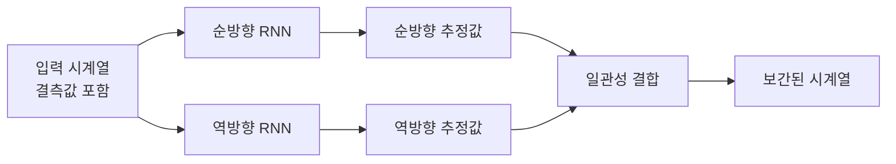
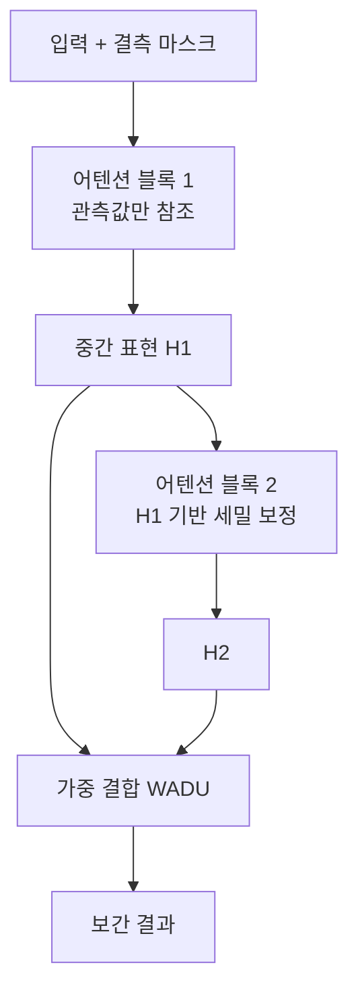

# 시계열 결측치 보간 (Time Series Imputation)

## 개념 요약

시계열 결측치 보간(Time Series Imputation)은 센서 오류, 네트워크 단절, 측정 누락 등으로 발생한 시계열 데이터의 결측값을 추정해 채우는 방법론이다. 단순한 선형 보간이나 평균값 대치와 달리, 딥러닝 기반 보간 모델은 시간적 의존성, 다변량 상관관계, 불규칙한 결측 패턴을 동시에 학습할 수 있다.

결측 처리의 질은 하위 분석(예측, 분류, 이상 탐지) 성능에 직접적인 영향을 미친다.

## 결측 메커니즘

통계학에서는 결측 메커니즘을 세 종류로 구분한다:

| 종류 | 설명 | 예시 |
|------|------|------|
| MCAR (완전 무작위 결측) | 결측이 데이터와 무관 | 랜덤 센서 오류 |
| MAR (무작위 결측) | 관측된 값에 의존 | 특정 시간대 유지보수 |
| MNAR (비무작위 결측) | 결측된 값 자체에 의존 | 극값에서만 센서 포화 |

딥러닝 모델은 이 구분과 무관하게 데이터에서 패턴을 학습하지만, MNAR 상황은 특히 어렵다.

## 주요 딥러닝 모델

### BRITS (Bidirectional Recurrent Imputation for Time Series)

Cao et al. (2018)이 제안한 양방향 RNN 기반 보간 모델. 두 가지 핵심 아이디어:

1. **양방향 추정**: 순방향(과거→미래)과 역방향(미래→과거) RNN으로 각각 추정값을 계산하고 일관성 손실로 통합
2. **함께 훈련**: 보간과 다운스트림 예측 태스크를 동시에 훈련

### SAITS (Self-Attention-based Imputation for Time Series)

Du et al. (2023)이 제안한 Transformer 기반 모델. MHSA(Multi-Head Self-Attention)의 장거리 의존성 포착 능력을 활용한다.

핵심 구성:
- **대각선 어텐션 마스킹**: 결측 위치가 스스로를 참조하지 못하도록 마스킹
- **WADU (Weighted Combination of Diagonal-Masked Attention)**: 두 어텐션 블록의 출력을 가중 결합

### 확산 기반 보간 (Diffusion-based Imputation)

[[autoencoders-vae]]에서 발전한 확산 모델(DDPM 계열)을 시계열 보간에 적용. 대표 모델: CSDI (Conditional Score-based Diffusion), SSSD.

결측값을 노이즈로 취급하고, 조건부 노이즈 제거(conditional denoising)를 통해 복원한다.

$$p_\theta(\mathbf{x}^0_{missing} | \mathbf{x}^{0:T}_{observed})$$

장점: 불확실성 표현, 다양한 보간 샘플 생성 가능. 단점: 느린 추론 속도.

## 평가 지표

| 지표 | 수식 | 특징 |
|------|------|------|
| MAE | $\frac{1}{n}\sum |y - \hat{y}|$ | 이상치 덜 민감 |
| RMSE | $\sqrt{\frac{1}{n}\sum (y-\hat{y})^2}$ | 큰 오차 강조 |
| MRE | $\frac{\sum |y-\hat{y}|}{\sum |y|}$ | 스케일 불변 |

평가 시 관측값을 인위적으로 마스킹하는 "인위적 결측(artificial missingness)" 설정을 사용한다.

## 결측 패턴 종류

실무 데이터에서 결측은 다양한 형태로 나타난다:

- **점 결측 (Point missing)**: 개별 시간 스텝 무작위 누락
- **블록 결측 (Block missing)**: 연속 구간 전체 누락 (센서 오프라인)
- **변수 결측 (Variable missing)**: 특정 센서 전체 데이터 없음

BRITS와 SAITS는 주로 점 결측에 강하고, 확산 모델은 블록 결측에 상대적으로 더 유연하다.

## 실무 고려사항

- **보간 후 예측 파이프라인**: 보간과 예측을 분리하면 오차 누적이 발생. 가능하면 엔드투엔드 훈련 고려
- **결측 마스크 정보 활용**: 어디가 결측인지 정보 자체가 신호. 마스크 벡터를 모델 입력에 포함
- **불확실성 전파**: 보간값의 불확실성을 [[probabilistic-forecasting]] 파이프라인에 전달

## 관련 문서

- [[time-series-forecasting-dl]] - 보간 이후 예측 태스크
- [[autoencoders-vae]] - 확산 기반 보간의 이론적 배경
- [[probabilistic-forecasting]] - 결측 불확실성의 예측 전파
- [[attention-mechanism-overview]] - SAITS의 셀프어텐션 메커니즘
