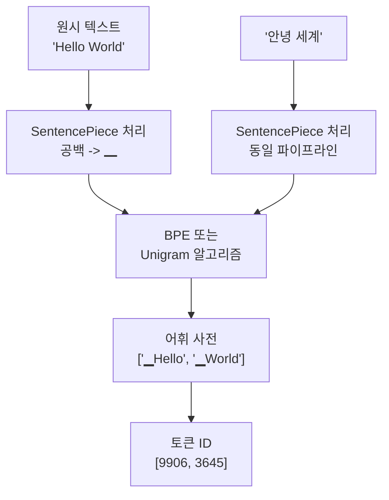

# 토크나이제이션과 BPE

## 개요

**토크나이제이션(tokenization)** 은 원시 텍스트를 모델이 처리할 수 있는 정수 ID 시퀀스로 변환하는 과정이다. 어떻게 텍스트를 분할하느냐는 모델의 어휘 효율성, 학습 난이도, 다국어 지원 능력에 근본적인 영향을 준다.

## 서브워드 토크나이제이션의 필요성

단어 수준(word-level) 토크나이저는 미등록 단어(out-of-vocabulary, OOV) 문제가 심각하다. "unimaginable"이라는 단어가 훈련 데이터에 없으면 `<UNK>` 처리된다. 반대로 문자 수준(character-level)은 OOV 없이 모든 텍스트 처리 가능하지만, 시퀀스가 너무 길어져 학습 효율이 떨어진다.

**서브워드(subword) 토크나이제이션**은 이 중간점을 찾는다. "unimaginable"을 "un", "imagine", "able"처럼 의미 있는 조각으로 분할해 어휘 크기와 시퀀스 길이를 모두 적절하게 유지한다.

## BPE (Byte-Pair Encoding)

Sennrich et al. (2016)이 신경망 기계 번역(NMT)에 도입. 원래 데이터 압축 알고리즘을 텍스트에 적용한 방식이다.

### 학습 알고리즘

```
1. 모든 단어를 문자 단위로 분할하고 빈도 집계
   예: ("l o w", 5), ("l o w e r", 2), ("n e w e s t", 6)

2. 가장 자주 등장하는 인접 쌍(bigram)을 찾아 병합
   - "e s" -> "es" (9회)

3. 어휘 크기 목표에 도달할 때까지 반복
```

병합 횟수 = 어휘 크기 목표 - 초기 문자 어휘 크기. GPT-2는 50,257개 어휘에 약 50,000회 병합을 수행했다.

### GPT 계열의 tiktoken

OpenAI는 바이트(byte) 수준 BPE를 사용하는 **tiktoken** 라이브러리를 공개했다. 모든 텍스트를 먼저 UTF-8 바이트로 변환하므로, 언어와 관계없이 OOV가 원천 차단된다. GPT-4의 `cl100k_base` 어휘는 100,277개다.

## WordPiece

Google이 BERT에 사용한 알고리즘. BPE와 유사하지만, 빈도 대신 **우도(likelihood)** 를 최대화하는 쌍을 병합한다:

$$\text{score}(AB) = \frac{\text{count}(AB)}{\text{count}(A) \times \text{count}(B)}$$

자주 등장하지만 각각도 자주 쓰이는 쌍보다, 합쳐야만 자주 등장하는 쌍을 선호한다. BERT의 어휘 크기는 30,522개.

서브워드 앞에 `##` 접두사를 붙여 단어 내부 토큰임을 표시한다. 예: "playing" -> "play", "##ing".

## Unigram 언어 모델

Kudo (2018) 제안. 어휘에서 토큰을 제거해 나가는 방식으로, 가장 확률 손실이 적은 토큰 집합을 찾는다.

주어진 어휘 집합 V에서 문장의 확률을 최대화하는 분할을 찾는다:

$$P(x) = \max_{s \in \text{seg}(x)} \prod_{i=1}^{|s|} p(s_i)$$

여러 분할 후보를 확률적으로 선택할 수 있어, 학습 시 **서브워드 정규화(subword regularization)** 에 활용할 수 있다는 장점이 있다.

## SentencePiece

Google의 **SentencePiece** (Kudo & Richardson 2018)는 BPE와 Unigram 모두를 지원하는 언어 독립적 프레임워크다. 주요 특징:

- 공백을 `▁` (U+2581)로 대체해 원시 텍스트를 그대로 처리
- 언어별 전처리(공백 분리, 정규화) 없이 작동
- LLaMA, T5, XLNet 등에서 채택
- 학습 데이터만 있으면 어떤 언어든 적용 가능



SentencePiece는 동일한 파이프라인으로 영어, 한국어, 일본어 등을 처리한다.

## 어휘 크기 트레이드오프

| 어휘 크기 | 장점 | 단점 |
|-----------|------|------|
| 작음 (8k-16k) | 임베딩 레이어 작음, 학습 데이터 적어도 됨 | 시퀀스 길이 증가, 희귀 단어 처리 불리 |
| 중간 (32k-50k) | 균형적 | - |
| 큼 (100k+) | 짧은 시퀀스, 언어/도메인 커버리지 높음 | 임베딩 파라미터 증가, OOV 처리 오히려 어려울 수 있음 |

LLaMA 2는 32k, LLaMA 3는 128k 어휘를 사용해 다국어 처리 능력이 대폭 향상됐다.

## 다국어 처리의 도전

영어 중심 토크나이저는 한국어, 아랍어, 중국어에서 심각한 효율 저하를 보인다. 같은 의미를 전달하는데 영어보다 3-5배 많은 토큰이 필요할 수 있다.

이는 세 가지 문제를 야기한다:
1. 같은 문장이 비영어권에서 더 많은 컨텍스트 창(context window)을 소모
2. 추론 비용 증가
3. 멀티링궐 학습 시 언어 불균형

GPT-4 대비 Qwen2, LLaMA 3 같은 최신 모델들은 어휘 크기 확대와 다국어 데이터 균형을 통해 이 문제를 크게 개선했다.

## BLT: 토크나이저 없는 미래

**Byte Latent Transformer (BLT)** (Pagnoni et al. 2024, Meta)는 토크나이저를 아예 제거하고 바이트를 직접 처리하는 아키텍처다. 엔트로피(entropy)가 높은 구간은 더 많은 처리를, 낮은 구간은 적은 처리를 할당하는 **동적 패치(dynamic patching)** 를 사용한다.

- 어휘 고정 문제 해결: 어떤 바이트 시퀀스도 처리 가능
- 다국어 불균형 해소
- 추론 효율: 같은 FLOP 예산에서 Llama 3과 경쟁적 성능
- 현재는 연구 단계, 프로덕션 채택은 제한적

## 관련 문서

- [[임베딩 레이어]] - 토큰 ID를 벡터로 변환하는 첫 번째 레이어
- [[Byte Latent Transformer]] - 토크나이저 없는 바이트 수준 처리
- [[어휘 크기와 모델 성능]] - 어휘 설계가 모델에 미치는 영향
- [[다국어 모델]] - 다국어 처리를 위한 모델 설계
