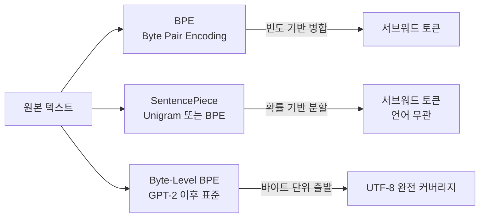

# 토크나이제이션 개념 (Tokenization Concepts)

## 토크나이저가 모델에 미치는 영향

토크나이저(tokenizer)는 텍스트를 모델이 처리하는 토큰 시퀀스로 변환한다. 단순한 전처리 도구처럼 보이지만, **토크나이저의 설계가 모델 성능, 효율, 적용 가능한 태스크에 직접적 영향**을 미친다.

주요 영향 지점:

- **어휘 크기(vocabulary size)**: 크면 시퀀스가 짧아지지만 임베딩 테이블이 커지고 학습 데이터 요구량 증가
- **압축률(compression rate)**: 같은 텍스트를 더 적은 토큰으로 표현할수록 컨텍스트 창을 효율적으로 사용
- **경계 효과**: 단어/의미 단위와 토큰 경계가 불일치하면 산술·코드 처리에서 오류 발생

## 주요 알고리즘 비교

### BPE (Byte Pair Encoding)

- 빈도 높은 문자 쌍을 반복 병합해 어휘를 구성
- GPT-1/GPT-2에서 사용, 이후 Byte-Level BPE로 발전
- 미등록어(OOV) 처리: 서브워드로 분해하므로 OOV 원칙적으로 없음
- 한계: 공백/대소문자 처리가 언어에 따라 불균등

### SentencePiece + Unigram

- 언어별 전처리(공백 처리 등) 없이 원시 텍스트로 학습 가능
- Unigram 방식: 확률 모델로 최적 분할 경로를 탐색
- LLaMA, Gemma 등에서 사용
- 다국어 모델에 적합한 언어 독립적(language-agnostic) 설계

### Byte-Level BPE

- 문자가 아닌 UTF-8 바이트를 출발점으로 삼아 BPE 병합 수행
- **모든 유니코드 문자를 표현 가능** - OOV 완전 제거
- GPT-2 이후 GPT-3, GPT-4, Claude 등 대형 모델의 사실상 표준
- 희귀 문자는 여러 바이트 토큰으로 분해되어 토큰 수 증가

## 다국어 토큰화 도전

한국어·일본어·중국어 등 CJK(Chinese-Japanese-Korean) 언어권과 아랍어는 영어 대비 **토큰 효율이 현저히 낮다**.

| 언어 | 예시 문장 | 대략적 토큰 수 | 비고 |
|------|----------|----------------|------|
| 영어 | "I want to eat dinner" | 5~6토큰 | 단어 단위 근접 |
| 한국어 | "저는 저녁을 먹고 싶어요" | 10~15토큰 | 형태소 분리 불충분 |
| 일본어 | "夕食を食べたいです" | 10~20토큰 | 한자-히라가나 혼용 |

동일 의미 전달에 한국어가 영어보다 2-3배 많은 토큰을 소비하면 컨텍스트 창 낭비 및 API 비용 증가로 이어진다.

개선 방향:
- 언어별 특화 어휘 추가(예: LLaMA-2-ko에서 한국어 토큰 확장)
- 다국어 균형 학습 데이터로 어휘 분포 개선

## 토큰 경계가 만드는 문제

### 산술 문제

"12345 + 67890"에서 숫자가 토큰 경계와 불일치하면 자릿수 계산이 틀릴 수 있다. 예: "123"이 하나의 토큰으로 처리되면 모델이 각 자릿수를 독립 처리하지 못함.

### 코드 문제

들여쓰기, 괄호 쌍, 연산자가 토큰 경계로 분리되면 구문 분석이 어렵다.

### 희귀 단어 문제

전문 용어나 신조어는 여러 서브워드 토큰으로 분해되어 시퀀스 길이 증가 및 의미 표현 저하.

## 어휘 크기 결정 원칙

| 어휘 크기 | 장점 | 단점 |
|-----------|------|------|
| 작음 (~10K) | 임베딩 테이블 경량 | 시퀀스 길어짐, 희귀어 처리 불리 |
| 중간 (~50K) | GPT-3 등 기존 모델 표준 | 다국어 커버리지 부족 |
| 큼 (~100K~150K) | 압축률 향상, 다국어 지원 | 임베딩 학습 데이터 더 필요 |

GPT-4, LLaMA-3는 100K 이상의 어휘를 사용하는 추세다.

## 관련 문서

- [[language-model-foundations]] - 토크나이저가 언어 모델 전체에서 차지하는 위치
- [[instruction-following]] - 언어별 토큰 효율 차이가 지시 이행에 미치는 영향
- [[emergent-abilities]] - 토큰 경계와 산술 창발 능력의 관계
