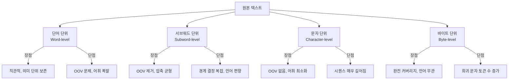
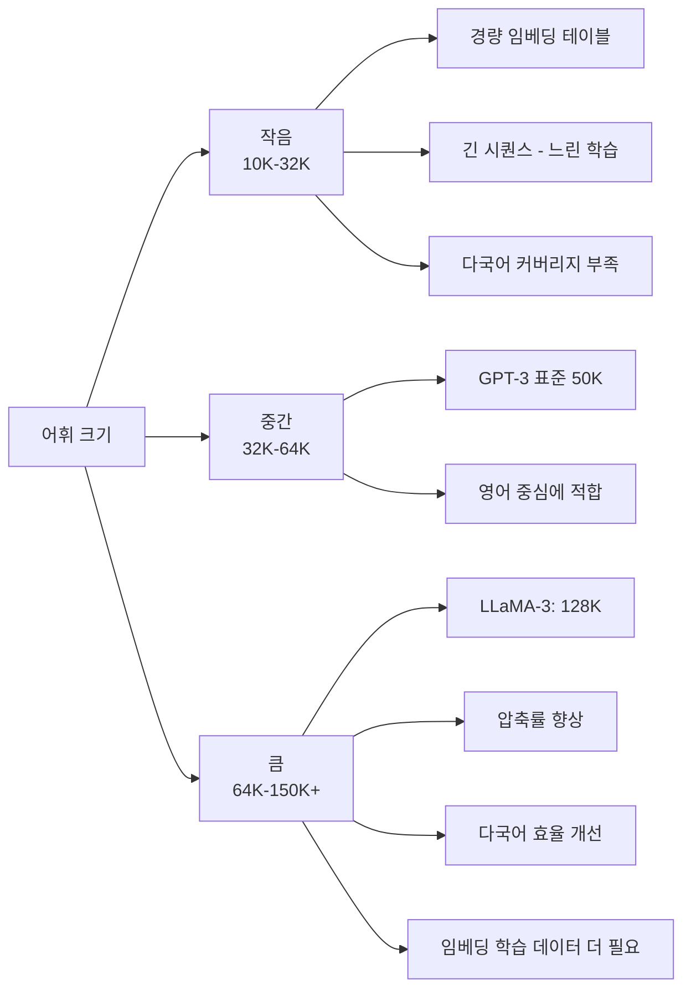

# 토큰화 (Tokenization)

## 개요

토큰화(tokenization)는 연속된 텍스트를 모델이 처리할 수 있는 이산 단위인 토큰(token)의 시퀀스로 분할하는 과정이다. 딥러닝 언어 모델은 실수 벡터를 연산하므로, 텍스트를 정수 ID로 변환하는 토큰화가 입력 파이프라인의 첫 번째 단계가 된다.

토큰화 방식의 선택은 단순한 전처리 결정이 아니다. 어휘 크기(vocabulary size), 시퀀스 길이, 미등록어(OOV, Out-of-Vocabulary) 처리 방식이 모두 토큰화에 달려 있으며, 이는 모델의 학습 효율, 언어 이해 능력, 다국어 처리 성능에 직접 영향을 미친다.

## 토큰화 단위의 분류



위 다이어그램은 4가지 토큰화 단위 각각의 장단점을 요약한다. 현대 LLM은 대부분 서브워드 계열을 사용한다.

### 단어 단위 (Word-level)

가장 직관적인 방식으로, 공백이나 구두점으로 텍스트를 분할한다.

- **장점**: 의미 단위가 잘 보존되어 해석이 용이
- **단점**: 학습 말뭉치에 없는 단어는 `<UNK>` 처리됨 (OOV 문제), 어휘 크기가 언어에 따라 폭발적으로 증가
- **예시**: "tokenization" → `["tokenization"]`

어형 변화가 많은 언어(한국어, 터키어, 핀란드어)에서는 단어 단위 어휘가 수백만 개로 늘어나 실용적이지 않다.

### 문자 단위 (Character-level)

텍스트를 개별 문자로 분할한다.

- **장점**: OOV가 발생하지 않음, 어휘 크기 최소화 (수백~수천)
- **단점**: 시퀀스가 매우 길어져 연산 비용 급증, 문자 간 관계를 모델이 스스로 학습해야 함
- **예시**: "hello" → `["h", "e", "l", "l", "o"]`

순수 문자 단위는 실용적인 LLM에서 거의 사용되지 않지만, 캐릭터 CNN 특성 추출기 등에서 보조적으로 활용된다.

### 서브워드 단위 (Subword-level)

단어 단위와 문자 단위의 절충점이다. 자주 등장하는 문자 조합은 하나의 토큰으로, 드문 단어는 더 작은 단위로 분할한다.

- **장점**: OOV 문제를 실질적으로 제거, 어휘 크기와 시퀀스 길이 균형
- **예시**: "tokenization" → `["token", "ization"]`

BPE, WordPiece, SentencePiece, Unigram 등이 모두 서브워드 방식이다.

### 바이트 단위 (Byte-level)

UTF-8 인코딩 바이트를 직접 토큰으로 사용하거나, 바이트를 출발점으로 BPE를 적용한다.

- **장점**: 어떤 언어, 기호, 이모지도 표현 가능 (완전 커버리지)
- **단점**: 희귀 문자는 여러 바이트로 분해되어 토큰 수 증가
- GPT-2 이후 Byte-Level BPE가 사실상 표준

## 주요 알고리즘 상세

### BPE (Byte Pair Encoding)

Sennrich et al. (2016)이 NMT(신경 기계 번역)에 도입한 알고리즘이다. 원래 데이터 압축 알고리즘이었으나 NLP에 성공적으로 적용되었다.

**핵심 아이디어**: 가장 자주 등장하는 문자(또는 서브워드) 쌍을 반복적으로 병합하여 어휘를 구성한다.

**학습 과정:**

```python
from collections import Counter

def get_vocab(corpus: list[str]) -> dict[str, int]:
    """말뭉치에서 단어별 빈도를 계산하고 문자 분리 형태로 반환"""
    vocab = Counter()
    for sentence in corpus:
        for word in sentence.split():
            # 단어를 문자 단위로 분리하고 끝 표시 추가
            chars = " ".join(list(word)) + " </w>"
            vocab[chars] += 1
    return vocab

def get_pair_freq(vocab: dict[str, int]) -> dict[tuple, int]:
    """현재 어휘에서 인접 쌍의 빈도를 계산"""
    pairs = Counter()
    for word, freq in vocab.items():
        symbols = word.split()
        for i in range(len(symbols) - 1):
            pairs[(symbols[i], symbols[i + 1])] += freq
    return pairs

def merge_vocab(best_pair: tuple, vocab: dict[str, int]) -> dict[str, int]:
    """가장 빈번한 쌍을 병합하여 어휘 갱신"""
    new_vocab = {}
    bigram = " ".join(best_pair)
    replacement = "".join(best_pair)
    for word, freq in vocab.items():
        new_word = word.replace(bigram, replacement)
        new_vocab[new_word] = freq
    return new_vocab

# BPE 학습 루프
def train_bpe(corpus: list[str], num_merges: int) -> list[tuple]:
    vocab = get_vocab(corpus)
    merges = []
    for _ in range(num_merges):
        pairs = get_pair_freq(vocab)
        if not pairs:
            break
        best = max(pairs, key=pairs.get)
        vocab = merge_vocab(best, vocab)
        merges.append(best)
    return merges
```

**특성:**
- 결정론적 학습 (같은 데이터로 항상 같은 결과)
- 병합 횟수(num_merges)가 어휘 크기를 결정
- GPT-1, GPT-2에서 사용; GPT-2 이후 Byte-Level BPE로 발전

### Byte-Level BPE

GPT-2(Radford et al., 2019)에서 도입한 변형으로, 문자 대신 UTF-8 바이트(256개)를 기본 어휘로 시작해 BPE 병합을 수행한다.

- **완전 커버리지**: 어떤 텍스트도 256개 기본 토큰으로 표현 가능, `<UNK>` 불필요
- **언어 무관**: 사전 언어 식별이나 전처리 없이도 작동
- GPT-3, GPT-4, Claude 등 현대 LLM의 사실상 표준

### WordPiece

Google이 BERT를 위해 개발한 서브워드 알고리즘이다.

**BPE와의 차이**: BPE는 빈도 기반으로 병합하지만, WordPiece는 **우도(likelihood) 최대화** 기준으로 병합을 결정한다.

$$\text{score}(A, B) = \frac{\text{freq}(AB)}{\text{freq}(A) \times \text{freq}(B)}$$

- 단독으로 등장 가능한 접두사는 그대로, 접미사 역할을 하는 조각에는 `##` 접두사 부여
- **예시**: "playing" → `["play", "##ing"]`
- BERT, DistilBERT, ELECTRA 등에서 사용

```python
# Hugging Face tokenizers를 이용한 WordPiece 예시
from transformers import BertTokenizer

tokenizer = BertTokenizer.from_pretrained("bert-base-uncased")
tokens = tokenizer.tokenize("tokenization is important")
# 결과: ['token', '##ization', 'is', 'important']
logger.info("WordPiece 토큰: %s", tokens)
```

### SentencePiece

Google의 Kudo & Richardson (2018)이 개발한 프레임워크로, **언어 무관 서브워드 토큰화**를 목표로 한다.

**핵심 특징:**
- 원시 텍스트를 입력으로 받아 사전 전처리 불필요 (공백 처리 포함)
- 공백을 특수 문자(`▁`)로 치환하여 텍스트를 문자열 스트림으로 처리
- BPE 또는 Unigram 알고리즘을 내장 지원
- **언어 독립적**: 한국어, 아랍어, 일본어 등 비라틴 언어에 강점

```python
import sentencepiece as spm

# 모델 학습
spm.SentencePieceTrainer.train(
    input="corpus.txt",
    model_prefix="my_tokenizer",
    vocab_size=32000,
    model_type="bpe",  # 또는 "unigram"
    character_coverage=0.9995,  # 다국어는 1.0에 가깝게
)

# 토큰화
sp = spm.SentencePieceProcessor()
sp.load("my_tokenizer.model")
tokens = sp.encode("안녕하세요, 토큰화입니다", out_type=str)
# 결과: ['▁안녕', '하세요', ',', '▁토큰', '화입니다']
```

LLaMA, Gemma, Mistral 등 오픈소스 LLM 대부분이 SentencePiece를 채택한다.

### Unigram Language Model

Kudo (2018)가 제안한 확률 기반 서브워드 분할 방식이다.

**핵심 아이디어**: 각 서브워드 조각에 확률을 부여하고, **주어진 텍스트의 우도를 최대화하는 분할**을 선택한다.

$$P(\text{text}) = \prod_{i=1}^{n} P(x_i)$$

- 가장 높은 우도의 분할이 정답
- 같은 단어에 대해 여러 분할 방식이 존재하며, 확률적으로 다양한 분할을 샘플링 가능 (학습 시 정규화 효과)
- 어휘 가지치기: 어휘 후보에서 우도를 가장 적게 낮추는 토큰을 반복 제거

## 알고리즘 비교표

| 알고리즘 | 학습 기준 | 공백 처리 | 주요 모델 | OOV |
|----------|----------|----------|----------|-----|
| BPE | 쌍 빈도 | 언어별 다름 | GPT-1/2 | 없음 |
| Byte-Level BPE | 쌍 빈도 (바이트) | 바이트로 처리 | GPT-2/3/4, Claude | 없음 |
| WordPiece | 우도 비율 | `##` 접미사 | BERT, DistilBERT | 없음 |
| SentencePiece | BPE 또는 Unigram | `▁` 치환 | LLaMA, Gemma, Mistral | 없음 |
| Unigram | 확률 우도 | SentencePiece 내장 | XLNet, mBART | 없음 |

## 어휘 크기(Vocabulary Size) 트레이드오프

어휘 크기는 토크나이저 설계에서 가장 중요한 하이퍼파라미터다.



| 어휘 크기 | 대표 모델 | 특성 |
|----------|----------|------|
| 30K~52K | GPT-2(50K), BERT(30K) | 영어 중심 초기 표준 |
| 32K | LLaMA-1, Mistral | 오픈소스 기본값 |
| 100K+ | GPT-4(100K 추정), LLaMA-3(128K) | 다국어 효율 향상 추세 |

**실무 선택 기준:**

- 단일 언어(영어) 모델: 32K~50K로 충분
- 다국어 모델: 64K~128K 권장 (CJK, 아랍어 등 포함 시)
- 도메인 특화 모델: 도메인 용어를 어휘에 추가 (의료, 법률 등)

## 다국어 토큰화 문제

영어 중심으로 학습된 토크나이저는 한국어, 일본어, 아랍어 등 비라틴 언어에서 **토큰 비효율** 문제를 일으킨다.

| 언어 | 동일 의미 | 대략 토큰 수 | 영어 대비 |
|------|----------|-------------|----------|
| 영어 | "I want to eat dinner" | 5~6개 | 기준 |
| 한국어 | "저는 저녁을 먹고 싶어요" | 10~15개 | 약 2~3배 |
| 일본어 | "夕食を食べたいです" | 8~15개 | 약 2배 |
| 아랍어 | "أريد تناول العشاء" | 10~20개 | 약 2~4배 |

**실무 영향:**
- API 비용 증가 (토큰 단위 과금)
- 컨텍스트 창 소비 증가
- 성능 저하: 더 많은 토큰으로 분할된 단어는 의미 표현이 불균등

**해결 방향:**
- 다국어 학습 데이터 비율 균형 조정
- 언어별 특화 토큰 추가 (LLaMA-2-ko, EEVE 등)
- 언어 무관 SentencePiece 활용

## 토큰 경계가 만드는 문제

### 산술 문제

"12345 + 67890"에서 숫자 "12345"가 단일 토큰으로 묶이면 모델이 자릿수를 독립적으로 처리하지 못할 수 있다. 최신 LLM들이 산술 계산에서 실수를 범하는 원인 중 하나다.

### 코드 처리

들여쓰기(indentation)가 공백 수에 따라 다르게 토큰화되면 파이썬 코드의 구조 파악이 어렵다. Codex, DeepSeek-Coder 등은 코드 특화 토크나이저로 이를 보완한다.

### 한국어 형태소

한국어는 조사, 어미가 붙어 단어가 변형되므로 BPE 기반 토크나이저가 형태소 경계를 잘못 학습하는 경우가 많다. 한국어 특화 모델에서는 형태소 분석기(MeCab, KoNLPy)를 전처리에 활용하기도 한다.

## 특수 토큰

현대 LLM은 다양한 특수 목적 토큰을 어휘에 포함한다:

| 토큰 | 의미 | 용도 |
|------|------|------|
| `<BOS>` / `<s>` | 시퀀스 시작 | 생성 시작 신호 |
| `<EOS>` / `</s>` | 시퀀스 종료 | 생성 중단 신호 |
| `<PAD>` | 패딩 | 배치 처리 시 길이 맞춤 |
| `<UNK>` | 미등록 토큰 | 서브워드 방식에서는 불필요 |
| `<MASK>` | 마스크 | BERT 계열 MLM 학습 |
| `<|system|>` 등 | 역할 태그 | 채팅/지시 튜닝 포맷 |

## Tiktoken - OpenAI 토크나이저

OpenAI는 Byte-Level BPE 기반의 `tiktoken` 라이브러리를 공개했다. cl100k_base(GPT-4 기본)는 100K+ 어휘를 가진다.

```python
import tiktoken

enc = tiktoken.get_encoding("cl100k_base")
tokens = enc.encode("안녕하세요, tokenization!")
logger.info("토큰 ID: %s", tokens)
logger.info("토큰 수: %d", len(tokens))

# 역변환
decoded = enc.decode(tokens)
logger.info("복원 텍스트: %s", decoded)
```

## BLT (Byte Latent Transformer) - 미래 방향

[[byte-latent-transformer-paper]]는 고정 어휘 없이 바이트 스트림을 직접 처리하는 접근을 탐구한다. 입력 복잡도에 따라 동적으로 패치(patch)를 형성하여 효율과 커버리지를 동시에 달성하려 한다.

## 실무 팁

**토크나이저 선택:**
- 사전 학습된 모델을 파인튜닝할 때는 해당 모델의 토크나이저를 그대로 사용
- 토크나이저를 변경하면 임베딩 레이어를 재초기화해야 하므로 사전 학습 효과 손실

**어휘 확장:**
- 도메인 특화 토큰 추가 시 임베딩 레이어를 초기화하고 파인튜닝으로 학습
- `tokenizer.add_tokens()` / `model.resize_token_embeddings()` 활용 (Hugging Face 기준)

**디버깅:**
```python
from transformers import AutoTokenizer

tokenizer = AutoTokenizer.from_pretrained("meta-llama/Meta-Llama-3-8B")
text = "LLM tokenization test"
tokens = tokenizer.tokenize(text)
ids = tokenizer.encode(text)
logger.info("토큰: %s", tokens)
logger.info("IDs: %s", ids)
logger.info("토큰 수: %d", len(ids))
```

## 관련 문서

- [[tokenization-bpe-sentencepiece]] - BPE와 SentencePiece 상세 비교
- [[byte-latent-transformer-paper]] - 고정 어휘 없는 바이트 기반 접근
- [[multilingual-tokenization]] - 다국어 토큰화 전략
- [[transformer-architecture]] - 토크나이저가 연결되는 임베딩 레이어
- [[language-model-foundations]] - 언어 모델 전체 맥락에서의 토큰화
- [[tokenization-concepts]] - 토큰화 개요 (기존 페이지)
