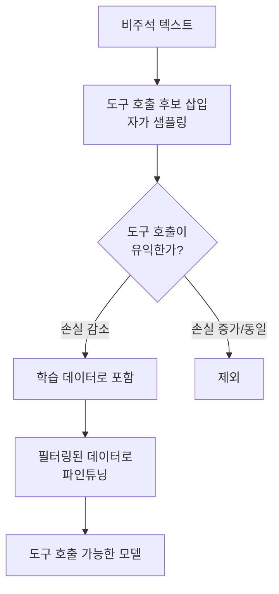
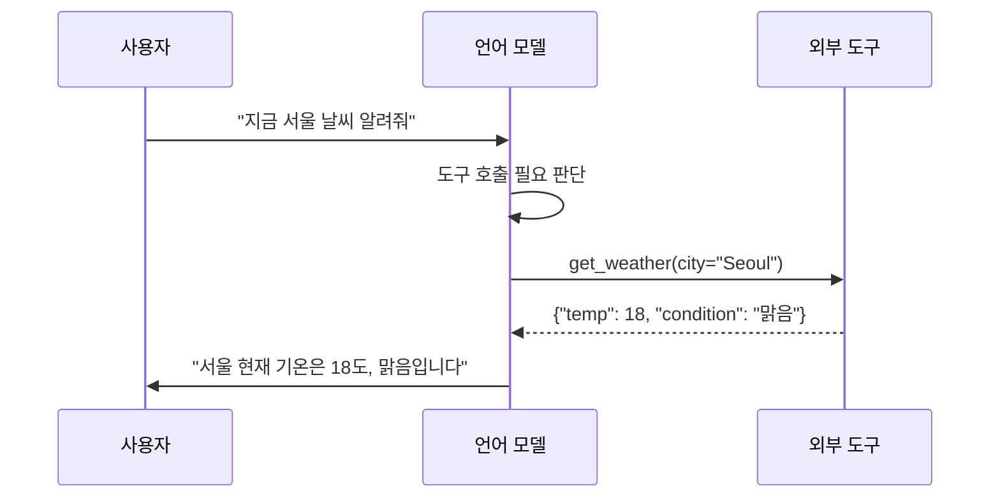

# 도구 증강 언어 모델 (Tool-Augmented Language Models)

## 개요

도구 증강 언어 모델(TALM)은 LLM이 외부 도구(API, 검색 엔진, 계산기, 코드 실행기 등)를 호출하여 자신의 능력을 확장하는 패러다임이다. LLM이 생성 기반 지식만으로 해결하기 어려운 실시간 정보 조회, 정확한 수치 계산, 코드 실행 등을 외부 시스템에 위임함으로써 신뢰성과 범용성을 높인다. [[tool-use-patterns]]의 이론적 토대를 제공하는 연구 계보이기도 하다.

## Toolformer: 자가 지도 도구 학습

Toolformer(Schick et al., 2023)는 LLM이 스스로 어떤 도구를 언제 호출할지를 학습하는 최초의 시도 중 하나다.

### 핵심 아이디어

1. 원본 텍스트에서 도구 호출이 유용할 위치를 샘플링
2. 실제로 도구를 호출해 결과를 얻음
3. 도구 호출 결과가 다음 토큰 예측 손실을 줄이는지 평가
4. 손실을 줄이는 호출만 학습 데이터에 포함

### 지원 도구 종류

- Wikipedia 검색
- 계산기
- 달력 (현재 날짜 조회)
- 번역기
- Q&A 시스템

### 한계

- API 문서 이해 능력이 제한적
- 도구 수가 늘어날수록 성능 저하
- 지시 따르기(instruction following) 능력과 도구 선택이 분리되어 있음

## Gorilla: API 호출 전문 모델

Gorilla(Patil et al., 2023)는 대규모 API 문서를 학습해 정확한 API 호출을 생성하는 데 특화된 모델이다.

### Toolformer와의 차이점

| 항목 | Toolformer | Gorilla |
|------|-----------|---------|
| 도구 수 | 소수(~5개) | 대규모(1,600+ API) |
| 학습 방식 | 자가 지도 | 지시 파인튜닝 |
| 강점 | 도구 삽입 타이밍 | API 파라미터 정확도 |
| Retrieval | 불사용 | RAG 연동 |

### AST 평가 방식

Gorilla는 생성된 API 호출을 AST(Abstract Syntax Tree)로 파싱해 정확도를 평가한다. 문자열 매칭이 아닌 구조적 동등성을 검사하므로 변수명 차이 등 표면적 차이를 무시하고 의미론적 정확도를 측정할 수 있다.

### Retrieval-Aware Training

문서가 변경될 수 있는 현실을 반영해, 검색된 API 문서를 프롬프트에 포함시키는 RAG 방식으로 훈련했다. 덕분에 모델이 업데이트된 API 문서를 런타임에 주입받아 최신 정보로 호출할 수 있다.

## 후속 발전: Function Calling

OpenAI의 Function Calling(2023)과 Anthropic의 Tool Use API는 도구 증강을 표준화된 API로 제공한다.

구조화된 JSON 스키마로 도구를 정의하면 모델이 파라미터를 올바르게 채워 호출한다. Hallucination 방지를 위해 호출 결과를 실제로 실행하고 반환값을 컨텍스트에 주입하는 것이 핵심이다.

## 공통 과제와 해결 방향

### 도구 선택 오류 (Tool Selection Error)

도구 수가 많아질수록 잘못된 도구를 선택하는 오류가 증가한다. [[toolformer-paper]]에서 이 문제가 처음 체계적으로 분석되었으며, 해결 방법으로:

- 도구 검색(tool retrieval): 관련 도구만 후보로 좁힌 후 선택
- 계층적 도구 구조: 도구를 그룹화해 단계적으로 선택
- 자기 수정(self-correction): 호출 실패 시 대안 시도

### 파라미터 환각 (Parameter Hallucination)

존재하지 않는 파라미터나 잘못된 값을 생성하는 문제. Gorilla의 AST 기반 평가가 이를 측정하고, 검색 증강으로 최신 API 스펙을 주입하는 것이 표준 대응책이다.

### 도구 남용 (Tool Overuse)

불필요한 도구 호출로 레이턴시가 증가하고 컨텍스트가 오염된다. 호출 비용을 학습 신호에 반영하거나(Toolformer 접근), 명시적인 "도구 필요성 판단" 단계를 추가하는 방법이 있다.

## 실무 관점

도구 증강 LLM은 현재 AI 에이전트 시스템의 핵심 구성 요소다. 특히:

- **코드 실행**: 수학 추론, 데이터 분석에서 정확도 획기적 향상
- **실시간 정보**: 사전학습 컷오프 한계 극복
- **외부 시스템 통합**: ERP, CRM 등 엔터프라이즈 시스템 연동

[[tool-use-patterns]]에서 실제 구현 패턴과 설계 원칙을 다루고, [[toolformer-paper]]에서 원 논문의 상세 내용을 확인할 수 있다.

## 관련 문서

- [[tool-use-patterns]] - 도구 사용의 실용적 설계 패턴
- [[toolformer-paper]] - Toolformer 논문 상세 요약
- [[function-calling-tool-use|function-calling]] - OpenAI/Anthropic의 표준화된 도구 호출 API
- [[agents]] - 도구 증강 LLM 기반의 에이전트 아키텍처
