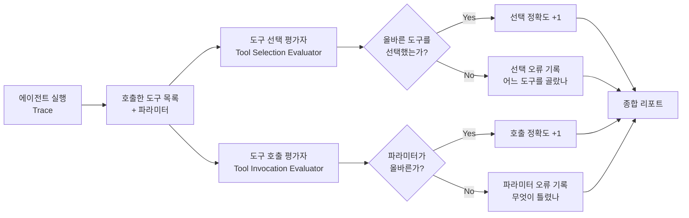

# Tool Selection & Tool Invocation Evaluators

에이전트의 도구 사용(tool calling)을 **도구 선택의 정확도**와 **도구 파라미터의 정확도**로 분리해 평가하는 전용 평가자.

## 왜 분리해야 하는가

함수 호출(function calling) 에이전트의 실패는 두 가지 다른 원인에서 발생한다:

1. **잘못된 도구 선택**: 올바른 파라미터를 넣었지만 완전히 틀린 도구를 선택
2. **잘못된 파라미터**: 올바른 도구를 선택했지만 인자(argument)가 틀림

이 두 실패를 하나의 지표로 뭉개면 진단이 불가능하다. 도구 선택은 완벽한데 파라미터 포맷 문제 때문에 실패하는 케이스를 "도구 사용 실패"로만 기록하면 잘못된 수정 방향으로 이어진다.

## 두 평가자의 구조



## 주요 메트릭

### 도구 선택 메트릭
- **도구 선택 정밀도(Tool Selection Precision)**: `올바른 도구 호출 수 / 전체 도구 호출 수`
- **도구 선택 재현율(Tool Selection Recall)**: `올바른 도구 호출 수 / 필요한 도구 호출 수`
- **불필요 호출률**: 목표와 무관한 도구를 호출한 비율

### 도구 호출(파라미터) 메트릭
- **정확 일치(Exact Match)**: 파라미터 값이 예상값과 완전히 일치
- **퍼지 일치(Fuzzy Match)**: 의미적으로 동등한 파라미터 (날짜 형식, 대소문자 등)
- **스키마 준수율**: 필수 파라미터 누락, 타입 오류 여부

## Arize Phoenix 구현

Arize AI는 2026년 1-2월에 두 개의 전용 평가자를 출시했다:

```python
# Phoenix 도구 선택 평가자 (개념적 예시)
from phoenix.evals import ToolSelectionEvaluator, ToolInvocationEvaluator

tool_selection_eval = ToolSelectionEvaluator(
    llm="claude-3-5-sonnet",
    tools=AVAILABLE_TOOLS,
    golden_tool_sequence=EXPECTED_CALLS
)

tool_invocation_eval = ToolInvocationEvaluator(
    llm="claude-3-5-sonnet",
    param_matching="fuzzy"
)

# 트레이스에 적용
selection_score = tool_selection_eval.evaluate(trace)
invocation_score = tool_invocation_eval.evaluate(trace)
```

## 실패 패턴 분류

| 실패 유형 | 도구 선택 | 파라미터 | 진단 방향 |
|---------|---------|---------|---------|
| 완전 실패 | 틀림 | N/A | 도구 설명 개선, 프롬프트 수정 |
| 파라미터 형식 오류 | 맞음 | 형식 틀림 | 도구 스키마 명확화 |
| 파라미터 값 오류 | 맞음 | 값 틀림 | 컨텍스트 추출 개선 |
| 불필요한 추가 호출 | 과잉 | N/A | 종료 조건 강화 |
| 필요한 도구 누락 | 누락 | N/A | 계획 능력 개선 |

## [[agent-trajectory-evaluation|궤적 평가]]와의 관계

도구 호출 평가자는 에이전트 궤적 평가의 핵심 하위 구성 요소다:
- 궤적 평가: 전체 경로의 효율성, 안전성, 목표 달성 여부
- 도구 호출 평가: 각 스텝의 도구 선택 + 파라미터 정확도

두 레벨을 함께 분석하면 "어느 스텝에서 어떤 종류의 실수가 났는가"를 정밀 진단할 수 있다.

## 실전 적용

- **디버깅**: 실패한 에이전트 실행을 두 메트릭으로 빠르게 분류
- **모델 비교**: 같은 태스크에서 두 모델의 도구 사용 정밀도 비교
- **도구 설명 최적화**: 선택 오류가 많은 도구는 description을 개선
- **스키마 설계**: 파라미터 오류가 많은 도구는 타입 힌트, 예시값 추가

## 대표 레퍼런스

- [Tool Selection and Tool Invocation Evaluators Release Notes (Phoenix, 2026-02-01)](https://arize.com/docs/phoenix/release-notes/02-2026/02-01-2026-tool-selection-and-tool-invocation-evaluators)
- [How to Evaluate Tool-Calling Agents (Arize Blog, 2026-03-02)](https://arize.com/blog/how-to-evaluate-tool-calling-agents/)
- [Tool Invocation Evaluator Docs (Phoenix)](https://arize.com/docs/phoenix/evaluation/pre-built-metrics/tool-invocation)
- [Agent Tool Selection (Arize AX Docs)](https://arize.com/docs/ax/evaluate/evaluation-concepts/agent-evaluation)
- [Phoenix GitHub Repository](https://github.com/Arize-ai/phoenix)

## 관련 문서

- [[multi-turn-agent-evaluation|Multi-Turn Agent Evaluation]]
- [[rubric-based-evals|Rubric-Based Evaluation Frameworks]]
- [[agent-trajectory-evaluation|Agent Trajectory Evaluation]]
