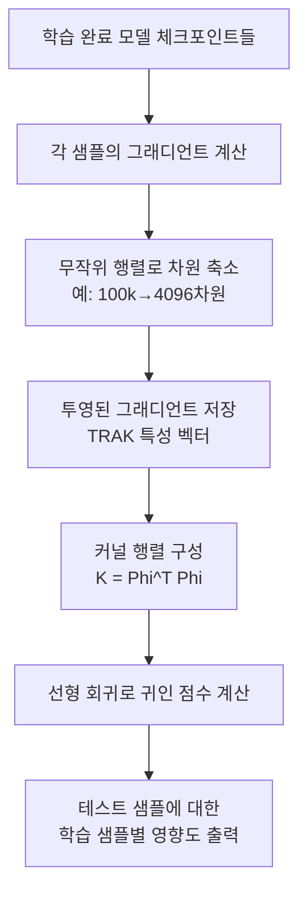

# TRAK 데이터 귀인

## 개요

TRAK(Tracing with the Randomly-projected After Kernel)은 학습 데이터의 각 샘플이 모델 예측에 얼마나 기여했는지를 측정하는 데이터 귀인(data attribution) 방법이다. [[influence-functions]]의 계산 비용 문제를 무작위 투영(random projection) 기반 근사로 해결하여, 대규모 딥러닝 모델에서도 실용적으로 적용 가능하도록 설계되었다.

"이 예측이 왜 나왔는가?"라는 질문에 "어떤 학습 샘플이 이 결과를 만들었는가?"로 답하는 접근 방식으로, 모델 디버깅과 데이터 품질 개선에 직접 활용된다.

## 핵심 아이디어

### 영향 함수의 한계

전통적인 [[influence-functions]] 접근법은 특정 학습 샘플을 제거했을 때 모델 예측이 어떻게 바뀌는지를 2차 근사로 추정한다. 그러나 이를 위해서는 헤시안 행렬(Hessian matrix)의 역행렬이 필요하며, 파라미터 수가 수억~수천억에 이르는 현대 모델에서는 계산이 사실상 불가능하다.

TRAK은 이 문제를 두 가지 방식으로 우회한다:

1. **무작위 투영(Random Projection)**: 고차원 그래디언트 벡터를 훨씬 낮은 차원으로 투영하여 계산 비용을 대폭 절감
2. **앙상블 기반 추정**: 독립적으로 학습된 여러 체크포인트에서 귀인 점수를 평균하여 분산을 줄임

### 귀인 점수 계산 흐름

핵심 수식으로 표현하면, 학습 샘플 $z_i$의 테스트 샘플 $z_{test}$에 대한 귀인 점수는:

$$\tau(z_i, z_{test}) = \phi(z_{test})^\top (K + \lambda I)^{-1} \phi(z_i)$$

여기서 $\phi(\cdot)$는 무작위 투영된 그래디언트 특성 벡터, $K$는 학습 샘플들의 커널 행렬이다.

## TRAK의 구조적 장점

| 항목 | 전통 영향 함수 | TRAK |
|------|-------------|------|
| 헤시안 역행렬 | 필요 (불가능) | 불필요 |
| 메모리 복잡도 | $O(d^2)$ | $O(n \cdot k)$, $k \ll d$ |
| 다중 체크포인트 활용 | 어려움 | 기본 설계에 포함 |
| 대규모 모델 적용 | 거의 불가 | CIFAR-10, ImageNet 규모 검증됨 |

$d$: 모델 파라미터 수, $n$: 학습 샘플 수, $k$: 투영 차원

## 주요 활용 분야

### 1. 유해 데이터 탐지

모델이 잘못된 예측을 내릴 때, 귀인 점수가 높은 학습 샘플을 추적하면 노이즈 레이블이나 분포 외(out-of-distribution) 샘플을 효율적으로 발견할 수 있다. [[data-selection-optimal]]과 결합하면 고품질 코어셋 구성에도 응용된다.

### 2. 모델 투명성과 법적 대응

특정 예측의 근거를 학습 데이터 수준까지 추적할 수 있으므로, 규제 환경에서 모델 결정의 출처를 설명해야 하는 경우에 유용하다.

### 3. 데이터 가치 평가

[[data-shapley]]와 유사한 관점에서, TRAK 귀인 점수는 각 학습 샘플이 모델 성능에 기여한 정도를 정량화한다. 데이터 마켓플레이스나 연합 학습 보상 체계 설계에 활용될 수 있다.

### 4. 표절 및 저작권 분석

생성 모델이 특정 출력을 만들 때 어떤 학습 데이터를 "기억"했는지 역추적하는 데 활용되며, 저작권 분쟁에서 증거 자료로 사용되는 사례가 늘고 있다.

## 실무 적용 시 고려사항

- **투영 차원 선택**: $k$가 너무 작으면 근사 오류가 커지고, 너무 크면 계산 비용이 올라간다. 통상 4096~8192 정도를 실험적으로 사용
- **체크포인트 수**: 앙상블 효과를 위해 최소 3~5개의 독립 체크포인트를 권장. 단일 체크포인트에서는 분산이 높음
- **분류 모델 특화**: 초기 TRAK 구현은 분류 태스크에 최적화되어 있으며, 생성 모델(텍스트, 이미지)에 대한 확장은 연구가 진행 중

## 한계

- 근사 기반이므로 이론적으로 정확한 영향 함수 값과 차이 발생 가능
- 그래디언트 특성 벡터 계산 자체가 샘플당 1회 역전파를 요구하므로, 수십억 개 학습 샘플에 대해서는 여전히 상당한 계산 필요
- 모델 수렴 가정(근사 조건) 위반 시 귀인 점수의 신뢰성이 저하

## 관련 문서

- [[influence-functions]] - TRAK이 근사하려는 원래 이론적 프레임워크
- [[data-shapley]] - 샘플 기여도를 게임 이론적으로 측정하는 대안 접근
- [[data-selection-optimal]] - 귀인 점수를 데이터 선택에 활용하는 파이프라인
