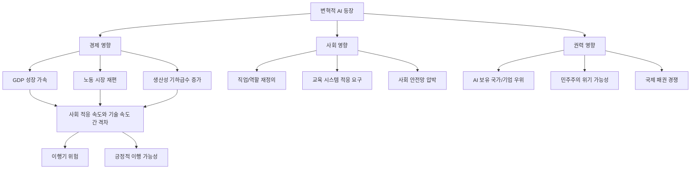
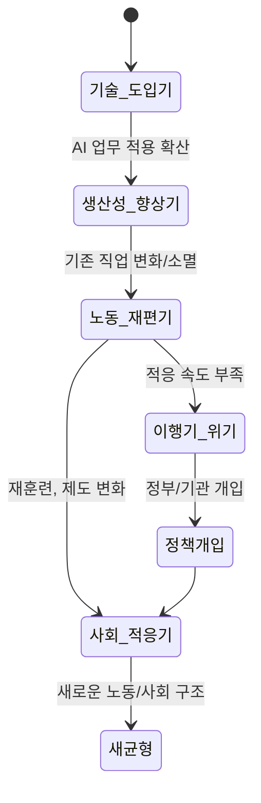

# 변혁적 AI 영향 (Transformative AI Impact)

## 정의 / 본질

변혁적 AI 영향(Transformative AI Impact)은 AI 기술이 산업혁명이나 농업혁명에 필적하는 수준으로 경제, 사회, 권력 구조 전반을 바꾸는 현상을 지칭한다. 단순한 생산성 향상을 넘어 **경제 성장의 속도, 노동의 성격, 사회 적응 속도** 자체가 역사적으로 전례 없는 수준으로 바뀌는 상태다.

변혁적 AI(TAI)라는 용어는 Open Philanthropy Project(OPP)가 체계화했다. OPP는 "산업혁명 이래 가장 크고 빠른 경제·사회 변화"를 일으키는 AI를 TAI로 정의하며, 이를 측정 가능한 기준으로 구체화하려 했다.

---

## 핵심 아이디어

---

## OPP의 변혁적 AI 정의

Open Philanthropy의 Holden Karnofsky는 변혁적 AI를 구체적 경제 지표로 정의했다:

> "AI가 전 세계 GDP를 배가시키는 데 걸리는 시간이 과거 산업혁명 때보다 빨라지는 시점"

역사적 맥락:
- 수렵채집 시대: GDP 2배 증가에 수천 년
- 농업혁명 이후: 수백 년
- 산업혁명 이후: 약 15-20년
- TAI 시나리오: 수년 이내

이 기준은 추상적 "강한 AI(AGI)" 정의보다 측정 가능하다는 장점이 있다. 그러나 GDP 자체가 인류 웰빙을 완전히 반영하지 못한다는 비판도 있다.

---

## 역사적 비교: 산업혁명과의 대조

| 항목 | 1차 산업혁명 (1760-1840) | TAI 예상 시나리오 |
|------|-------------------------|-------------------|
| 핵심 기술 | 증기기관, 방적기 | 범용 AI 추론/자동화 |
| 영향 범위 | 특정 산업 → 전 경제 (수십 년) | 거의 모든 인지 노동 (수년?) |
| 사회 적응 시간 | 2-3세대 (~50-80년) | 예측 불가 (수십 년 vs 수년) |
| 지리적 확산 | 영국 → 유럽 → 전 세계 (100년+) | 인터넷 기반, 즉시 글로벌 확산 가능 |
| 대체된 노동 유형 | 주로 육체 노동 | 주로 인지 노동 |
| 새로운 일자리 창출 속도 | 수십 년에 걸쳐 자연 발생 | 적응 지원 정책 필요 가능성 |

산업혁명은 생활 수준을 장기적으로 크게 향상시켰지만, 이행기 수십 년 동안 노동자 계층의 실질 생활 수준이 오히려 악화된 사례가 있었다. 변혁적 AI의 이행기도 유사한 패턴을 보일 수 있다.

---

## GDP 성장률 변화 예측

주요 기관과 연구자들의 GDP 성장 예측은 폭이 매우 넓다:

| 예측 주체 | 시나리오 | 전망 |
|-----------|----------|------|
| Goldman Sachs (2023) | 10년 내 | AI가 연간 글로벌 GDP를 7% 증가 가능 [교차검증 필요] |
| McKinsey Global Institute | 10-20년 | 생산성 향상으로 연 0.1-0.6%p 추가 성장 [교차검증 필요] |
| Dario Amodei (Anthropic CEO) | 5-10년 | 암, 정신 건강 등 압축된 과학 진보 |
| Tom Davidson (OPP) | 모델링 | 폭발적 성장 가능하나 불확실성 극히 높음 |
| 회의론 진영 | - | AI 생산성 향상 과대평가, 보완 인프라 필요 |

GDP 예측의 공통 전제는 **AI가 실질적 노동 시장 자동화에 성공한다는 것**인데, 현재 LLM 기반 시스템과 실제 자율적 업무 수행 사이에는 여전히 큰 간격이 있다는 반론이 존재한다.

---

## 사회 적응 시간 문제

변혁적 AI의 가장 심각한 위험 중 하나는 **기술 변화 속도와 사회 적응 속도 간 격차**다:

역사적으로 기술 변화에 대한 사회 적응은 다음 메커니즘으로 이루어졌다:

1. **자연적 직업 진화**: 새로운 기술이 새로운 역할을 창출
2. **교육 시스템 개혁**: 새로운 기술에 맞는 교육 커리큘럼
3. **사회 안전망**: 이행기 실업자 지원
4. **제도 변화**: 노동법, 복지 제도 재설계

변혁적 AI가 이 적응 주기보다 빠르게 진행될 경우, [[economic-displacement-ai|경제적 대체와 이동]]이 정책이 따라잡기 어려운 속도로 진행될 수 있다.

---

## OPP 평가 프레임워크

Open Philanthropy는 TAI 가능성을 평가하기 위해 다음 기준을 사용한다:

**핵심 질문**: "현재 시스템이 가진 한계를 극복하면 TAI가 가능한가?"

1. **물리적/인지적 범용성**: AI가 인간이 하는 대부분의 경제적으로 가치 있는 작업을 수행할 수 있는가?
2. **자율성**: 지속적 인간 감독 없이 장기 과제를 수행할 수 있는가?
3. **비용**: 인간 노동과 비교해 경제적으로 경쟁력 있는가?
4. **확장성**: 복사/배포가 인간 노동 대비 극히 저렴한가?

현재 최고 성능 AI 시스템은 이 중 일부를 충족하나, 특히 **자율성과 신뢰성** 측면에서 아직 갭이 있다는 평가가 일반적이다. [교차검증 필요: 최신 평가 결과 확인 권장]

---

## 변혁적 AI와 과학 가속

AI가 과학 연구 자체를 가속하는 경우 이차적 변혁이 발생한다:

- **단백질 구조 예측 (AlphaFold)**: 수십 년의 실험 결과를 AI가 예측으로 대체
- **신약 개발 가속**: 분자 설계, 임상 시험 예측에 AI 적용
- **기후 모델링**: 더 정밀한 기후 시뮬레이션
- **수학 증명**: AI가 새로운 수학적 발견을 지원

이 경로는 단순한 노동 자동화가 아닌 **인간 지식 생산 자체의 가속**이라는 점에서 훨씬 깊은 변혁을 의미한다. Dario Amodei(Anthropic CEO)는 이를 "압축된 과학 진보(compressed scientific progress)"라 표현했다.

---

## 비판과 한계

### 과대평가 논거

1. **잃어버린 10년 패턴**: 과거에도 AI 붐이 과도한 기대를 만들었다가 꺼진 패턴이 반복됨
2. **보완 인프라 필요**: AI가 생산성을 높이려면 전기, 네트워크, 데이터 인프라가 선행되어야 함
3. **조직 변화 지연**: 기업이 AI를 실질적으로 채택하는 데는 기술 준비 이상의 시간이 필요
4. **Solow 패러독스의 반복**: "AI를 어디서나 볼 수 있지만 생산성 통계에서는 보이지 않는다"

### 측정 문제

GDP는 인류 웰빙의 불완전한 측정치다. 변혁적 AI가 GDP를 높이면서도 불평등을 심화시키거나, 측정되지 않는 사회적 가치를 파괴할 수 있다.

---

## 관련 문서

- [[economic-displacement-ai]] - 변혁적 AI가 야기하는 노동 시장 대체와 경제 이동
- [[ai-takeoff-scenarios]] - TAI가 실현되는 경로와 속도 시나리오
- [[ai-existential-risk]] - 변혁적 AI가 통제되지 않을 때의 극단적 위험
- [[ai-governance-regulation]] - 변혁적 AI에 대한 정책/규제 대응
- [[ai-economic-impact]] - AI가 경제에 미치는 더 넓은 영향
- [[ai-fluency-literacy]] - 변혁적 AI 시대의 AI 리터러시
