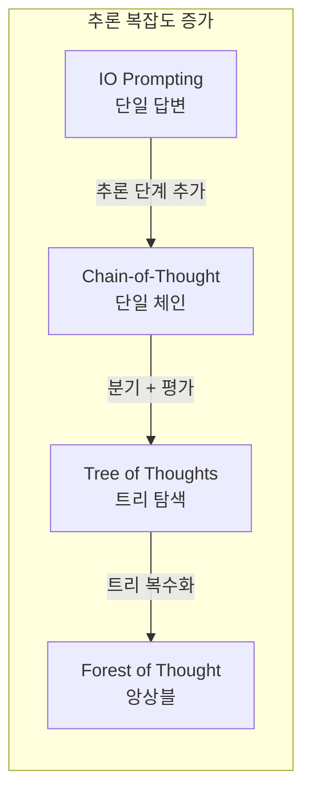
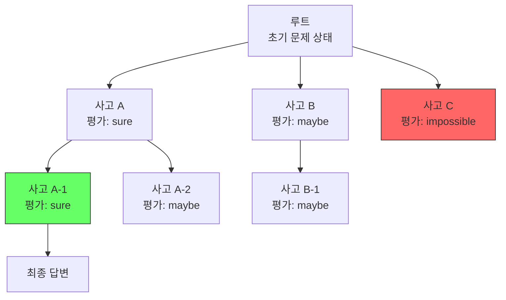

# Tree of Thoughts (ToT)

## 정의

**Tree of Thoughts (ToT)**는 Yao et al. (2023)이 "Tree of Thoughts: Deliberate Problem Solving with Large Language Models"에서 제안한 추론 프레임워크다. [[chain-of-thought|Chain-of-Thought (CoT)]]의 선형 추론 구조를 **트리 구조**로 확장하여, 여러 사고 경로를 탐색하고 유망하지 않은 경로는 백트래킹(backtracking)하는 방식이다.

인간의 의도적 사고(deliberate thinking)를 모방한 접근법으로, 단순히 "한 줄기로 생각하기"에서 "여러 가능성을 열어두고 최선을 고르기"로 전환한다.

## 왜 중요한가

- CoT는 한 번 잘못된 추론 단계에 진입하면 복구할 수 없다 -- ToT는 백트래킹으로 이 한계를 해소
- 수학, 창의적 글쓰기, 퍼즐 등 **탐색이 필요한 문제**에서 CoT 대비 큰 성능 향상
- [[test-time-compute|테스트 타임 컴퓨트]] 스케일링의 이론적 기반 중 하나
- [[forest-of-thought|Forest-of-Thought]]의 직접적인 전신이며, [[ai-reasoning-models|o1/o3 추론 모델]]의 내부 탐색 메커니즘과 맥을 같이 한다

## 추론 전략 계층

이 다이어그램은 추론 전략이 단순한 IO에서 ToT, 나아가 Forest-of-Thought로 확장되는 계층을 보여준다.

## 핵심 구조

ToT는 네 가지 구성 요소로 이루어진다.

### 1. 사고 분해 (Thought Decomposition)

문제를 해결하는 과정을 중간 "사고(thought)" 단위로 분해한다. 각 사고는 문제의 부분적 해결 상태를 나타낸다.

- **24 게임**: 각 사고 = 하나의 수식 연산 (예: "4 + 8 = 12")
- **창의적 글쓰기**: 각 사고 = 한 단락의 플랜
- **미니 크로스워드**: 각 사고 = 한 단어 배치

### 2. 사고 생성 (Thought Generation)

현재 상태에서 가능한 다음 사고 후보를 생성한다. 두 가지 방식이 있다:

| 방식 | 설명 | 적합한 경우 |
|------|------|------------|
| **Sample** | 같은 프롬프트로 i.i.d. 샘플링 (CoT 방식) | 사고 공간이 넓고 다양성이 필요할 때 |
| **Propose** | 하나의 프롬프트로 여러 후보를 한번에 제안 | 사고 공간이 제한적이고 구조화된 경우 |

### 3. 상태 평가 (State Evaluation)

각 사고 노드의 유망성을 평가한다. 이것이 ToT의 핵심 차별점이다.

- **Value**: "이 상태에서 정답에 도달할 가능성은?" -- 각 노드에 점수 부여 (sure/maybe/impossible)
- **Vote**: 여러 후보 중 "어떤 것이 가장 유망한가?" -- 상대 비교

LLM 자체가 평가자 역할을 수행한다. 별도의 보상 모델 없이 프롬프트만으로 self-evaluation이 가능하다.

### 4. 탐색 알고리즘 (Search Algorithm)

트리를 탐색하는 알고리즘을 선택한다.

이 다이어그램은 ToT의 트리 탐색 과정을 보여준다. 평가가 "impossible"인 노드(사고 C)는 가지치기되고, "sure"인 경로가 우선 탐색된다.

#### BFS (너비 우선 탐색)

각 레벨에서 가장 유망한 b개 상태만 유지하고 나머지는 가지치기한다.

- **장점**: 글로벌 최적에 가까운 탐색. 깊이가 얕은 문제에 효과적
- **적합**: 24 게임 (3단계), 창의적 글쓰기 (2-3단계)

#### DFS (깊이 우선 탐색)

하나의 경로를 끝까지 탐색한 뒤, 유망하지 않으면 백트래킹한다.

- **장점**: 메모리 효율적. 깊은 탐색이 필요한 문제에 적합
- **적합**: 미니 크로스워드 (5-10단계)

## 실험 결과

| 태스크 | IO | CoT | CoT-SC (Self-Consistency) | **ToT** |
|--------|-----|------|--------------------------|---------|
| 24 게임 (성공률) | 7.3% | 4.0% | 9.0% | **74.0%** |
| 창의적 글쓰기 (일관성 점수) | 6.19 | 6.93 | 7.56 | **7.56** |
| 미니 크로스워드 (단어 성공률) | 16% | 16% | - | **60%** |

24 게임에서의 성능 차이가 극적이다. CoT(4.0%)와 ToT(74.0%) 사이의 격차는 탐색과 백트래킹의 위력을 잘 보여준다.

## CoT Self-Consistency와의 차이

CoT Self-Consistency(CoT-SC, Wang et al. 2022)도 다수의 추론 경로를 생성하지만, ToT와는 근본적으로 다르다.

| 측면 | CoT-SC | ToT |
|------|--------|-----|
| 생성 방식 | 독립적인 완전한 체인 N개 | 단계별로 분기하는 트리 |
| 평가 시점 | 최종 답변에서만 다수결 | 매 중간 단계에서 평가 |
| 백트래킹 | 없음 | 있음 (유망하지 않은 경로 포기) |
| 컴퓨트 효율 | 중복 계산 많음 | 가지치기로 불필요한 탐색 절감 |

## 한계

1. **LLM 호출 비용**: 사고 생성 + 평가를 반복하므로 API 호출 횟수가 급증한다 (24 게임에서 ~100회 LLM 호출)
2. **평가 정확도 의존**: LLM의 자기 평가가 부정확하면 잘못된 가지치기가 발생한다
3. **사고 분해 설계 필요**: 문제 유형별로 적절한 사고 단위를 수동으로 설계해야 한다
4. **단순 문제에는 과잉**: 직관적으로 풀리는 문제에 ToT를 적용하면 비용 대비 효과가 없다

## 후속 연구와 영향

- **[[forest-of-thought]]**: ToT를 앙상블로 확장. 여러 독립 트리를 병렬 실행
- **MCTS + LLM**: Monte Carlo Tree Search를 ToT에 결합. AlphaGo 방식의 탐색을 언어 추론에 적용
- **[[test-time-compute|테스트 타임 컴퓨트]] 스케일링**: ToT의 "추론 시 더 많이 계산하면 성능이 향상" 원리가 o1/o3의 기반이 됨
- **Graph of Thoughts (GoT)**: 트리를 DAG로 확장하여 사고 노드 간 병합도 허용

## 실무 적용 가이드

1. **문제 유형 판별**: 탐색이 필요한 조합 문제, 계획 수립, 다단계 추론에 ToT를 적용
2. **깊이와 너비 조절**: beam width와 최대 깊이를 문제 복잡도에 맞게 설정
3. **평가 프롬프트 설계**: "이 중간 상태에서 정답에 도달할 수 있는가?"를 묻는 평가 프롬프트가 핵심
4. **비용 제어**: 총 LLM 호출 횟수에 상한을 두고, 가지치기 임계값을 조절

## 관련 문서

- [[chain-of-thought]] -- ToT의 기반이 되는 선형 추론 기법
- [[forest-of-thought]] -- ToT를 앙상블로 확장한 멀티트리 추론
- [[test-time-compute]] -- ToT가 실증한 추론 시간 스케일링 원리
- [[ai-reasoning-models]] -- ToT의 탐색 원리를 내재화한 o1/o3 추론 모델
- [[decoding-strategies]] -- ToT의 탐색 알고리즘(BFS/DFS)과 디코딩 전략의 관계
