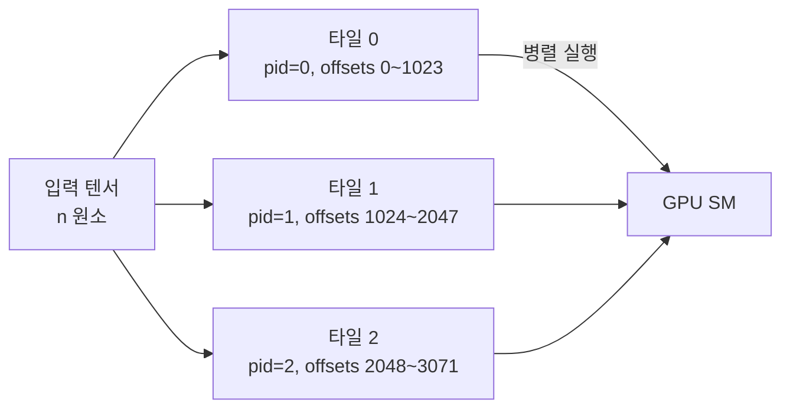

# Triton GPU 프로그래밍

Triton은 OpenAI가 개발한 GPU 커널 작성 언어 및 컴파일러다. CUDA C보다 훨씬 간결한 파이썬 문법으로 고성능 GPU 커널을 작성할 수 있으며, FlashAttention, torch.compile의 백엔드 등 주요 최적화에 실제로 사용된다. CUDA의 스레드 레벨(thread-level) 프로그래밍 대신 블록(tile) 레벨 추상화를 제공한다.

## Triton vs CUDA 추상화 비교

```mermaid
flowchart TD
    A[개발자 코드] --> B{추상화 레벨}
    B -->|CUDA C| C[스레드 단위 프로그래밍\nthreadIdx, blockIdx 직접 관리]
    B -->|Triton| D[블록(tile) 단위 프로그래밍\n포인터 배열 + 마스크 연산]
    C --> E[PTX / SASS]
    D --> F[Triton IR → LLVM → PTX]
    E --> G[GPU 실행]
    F --> G
```

CUDA는 개별 스레드의 동작을 기술하고 개발자가 공유 메모리(shared memory) 관리, warp 발산(divergence) 회피, bank conflict 방지 등을 직접 처리해야 한다. Triton은 이런 저수준 최적화를 컴파일러에 위임하고, 개발자는 타일(tile) 단위 연산만 기술한다.

## @triton.jit 커널 작성

Triton 커널은 `@triton.jit` 데코레이터를 붙인 파이썬 함수로 작성한다. 포인터와 오프셋 배열을 통해 메모리를 접근하며, 마스크(mask)로 범위를 초과하는 접근을 안전하게 처리한다.

```python
import triton
import triton.language as tl

@triton.jit
def add_kernel(
    x_ptr,      # 입력 텐서 포인터
    y_ptr,      # 입력 텐서 포인터
    out_ptr,    # 출력 텐서 포인터
    n_elements, # 원소 수
    BLOCK_SIZE: tl.constexpr,  # 컴파일 시 상수
):
    # 현재 프로그램(블록)의 ID
    pid = tl.program_id(axis=0)
    # 이 블록이 담당하는 원소 범위 계산
    offsets = pid * BLOCK_SIZE + tl.arange(0, BLOCK_SIZE)
    # 범위 초과 마스크
    mask = offsets < n_elements
    # 메모리 로드 (마스크 적용)
    x = tl.load(x_ptr + offsets, mask=mask)
    y = tl.load(y_ptr + offsets, mask=mask)
    # 연산
    out = x + y
    # 메모리 저장
    tl.store(out_ptr + offsets, out, mask=mask)
```

커널 호출은 CUDA의 그리드/블록 설정에 해당하는 `grid` 튜플을 지정한다:

```python
def add(x: torch.Tensor, y: torch.Tensor) -> torch.Tensor:
    out = torch.empty_like(x)
    n = x.numel()
    BLOCK_SIZE = 1024
    grid = (triton.cdiv(n, BLOCK_SIZE),)  # 필요한 블록(프로그램) 수
    add_kernel[grid](x, y, out, n, BLOCK_SIZE=BLOCK_SIZE)
    return out
```

## 타일 기반 병렬 처리 (Tile-based Parallelism)

Triton의 핵심 추상화는 `tl.program_id(axis=N)`로 식별되는 프로그램(program) 단위다. 각 프로그램은 데이터의 타일(tile) 하나를 독립적으로 처리한다.



2D 연산(행렬 곱 등)은 `axis=0`(행)과 `axis=1`(열)을 조합해 2D 타일 그리드를 구성한다.

## 행렬 곱 커널 예시 (tl.dot)

Triton에서 행렬 곱(GEMM)은 `tl.dot`을 사용하며, 컴파일러가 내부적으로 텐서 코어(Tensor Core) 연산으로 매핑한다.

```python
@triton.jit
def matmul_kernel(A, B, C, M, N, K,
                  stride_am, stride_ak,
                  stride_bk, stride_bn,
                  stride_cm, stride_cn,
                  BLOCK_M: tl.constexpr,
                  BLOCK_N: tl.constexpr,
                  BLOCK_K: tl.constexpr):
    pid_m = tl.program_id(0)
    pid_n = tl.program_id(1)
    # A, B의 타일 오프셋 계산 후 tl.dot 호출
    acc = tl.zeros((BLOCK_M, BLOCK_N), dtype=tl.float32)
    for k in range(0, K, BLOCK_K):
        a = tl.load(A + ...)
        b = tl.load(B + ...)
        acc += tl.dot(a, b)
    tl.store(C + ..., acc.to(tl.float16))
```

## Autotuning

Triton은 `@triton.autotune` 데코레이터로 하이퍼파라미터(BLOCK_SIZE, num_warps, num_stages 등) 조합을 자동으로 벤치마킹하여 최적 설정을 선택한다.

```python
@triton.autotune(
    configs=[
        triton.Config({"BLOCK_SIZE": 128}, num_warps=4),
        triton.Config({"BLOCK_SIZE": 256}, num_warps=8),
        triton.Config({"BLOCK_SIZE": 512}, num_warps=16),
    ],
    key=["n_elements"],
)
@triton.jit
def add_kernel_autotuned(x_ptr, y_ptr, out_ptr, n_elements,
                          BLOCK_SIZE: tl.constexpr):
    ...
```

## torch.compile과의 통합

PyTorch 2.x의 `torch.compile`은 내부적으로 Triton을 커널 생성 백엔드로 사용한다. `torch.compile(model)`을 호출하면 TorchDynamo가 파이썬 코드를 추적하고 TorchInductor가 Triton 커널을 자동 생성한다.

| 레이어 | 역할 |
|--------|------|
| TorchDynamo | 파이썬 바이트코드 추적 → FX 그래프 추출 |
| TorchInductor | FX 그래프 → Triton 커널 코드 생성 |
| Triton 컴파일러 | Triton 코드 → PTX/GPU 바이너리 |

## 실무 활용 사례

- **FlashAttention**: Triton으로 구현된 메모리 효율적 어텐션 커널
- **bitsandbytes 양자화**: 8bit/4bit 행렬 곱 Triton 커널
- **커스텀 활성화 함수**: SwiGLU, GeGLU 등 fused 커널
- `tl.atomic_add`: 희소 연산에서 원자적 누적

## 왜 중요한가

[[triton-openai]] 엔티티에서 설명하는 것처럼 Triton은 ML 시스템 엔지니어가 CUDA 없이도 [[gpu-architecture-ml]]의 하드웨어 성능에 근접하는 커스텀 연산을 작성할 수 있게 한다. torch.compile과의 통합으로 프레임워크 수준 최적화의 핵심 백엔드가 됐다.

## 관련 문서

- [[triton-openai]] - Triton 프로젝트 개요 및 역사
- [[gpu-architecture-ml]] - GPU SM, 텐서 코어, 공유 메모리 구조
- [[cuda-memory-management]] - GPU 메모리 계층과 접근 패턴
- [[pytorch-internals]] - torch.compile / TorchInductor 통합
