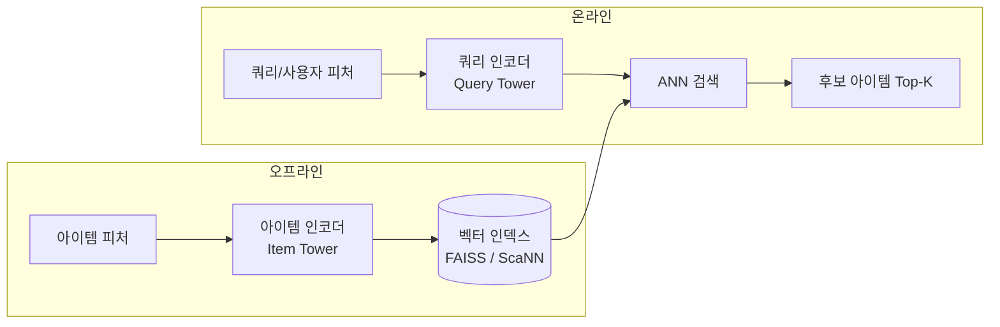
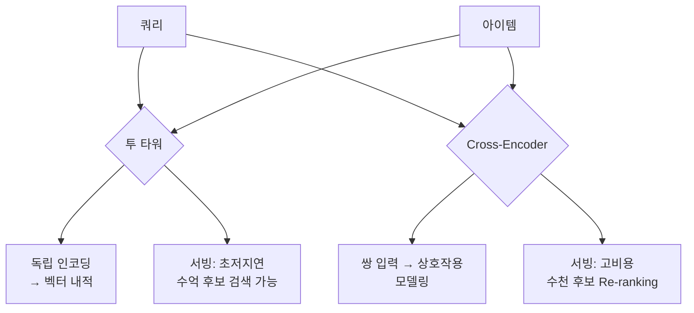

# 투 타워 검색 모델 (Two-Tower Retrieval)

투 타워 모델(Two-Tower Model)은 정보 검색(Information Retrieval)과 추천 시스템에서 널리 사용되는 아키텍처로, 쿼리(또는 사용자)와 아이템을 **각각 독립된 인코더**로 표현한 뒤 벡터 유사도를 통해 매칭하는 방식이다. 이름 그대로 두 개의 "탑(tower)"이 병렬로 존재한다.

## 핵심 아이디어

투 타워의 핵심 통찰은 단순하다: **검색 시점에 쿼리와 아이템을 동시에 인코딩하지 않아도 된다**. 아이템 벡터는 미리 계산해서 인덱스에 저장해두고, 쿼리 벡터만 실시간으로 계산한 뒤 ANN(Approximate Nearest Neighbor) 검색으로 빠르게 후보군을 뽑는다.

위 구조에서 아이템 타워는 오프라인에서 미리 실행되고, 쿼리 타워만 온라인 레이턴시에 영향을 준다.

## 아키텍처 상세

### 두 타워의 구성

**쿼리 타워 (Query Tower)**
- 입력: 사용자 ID, 사용자 히스토리, 컨텍스트(시간, 기기 등)
- 출력: $d$차원 쿼리 벡터 $\mathbf{q} \in \mathbb{R}^d$

**아이템 타워 (Item Tower)**
- 입력: 아이템 ID, 아이템 속성(제목, 카테고리, 태그 등)
- 출력: $d$차원 아이템 벡터 $\mathbf{p} \in \mathbb{R}^d$

### 유사도 계산

두 벡터의 유사도는 보통 내적(inner product) 또는 코사인 유사도를 사용한다:

$$s(q, p) = \mathbf{q}^\top \mathbf{p}$$

### 학습 목표

대표적인 학습 방식은 인-배치 네거티브(in-batch negative) 샘플링이다. 배치 내의 다른 아이템들을 네거티브로 활용하여 소프트맥스 손실을 최소화한다:

$$\mathcal{L} = -\log \frac{\exp(s(q_i, p_i)/\tau)}{\sum_j \exp(s(q_i, p_j)/\tau)}$$

$\tau$는 온도(temperature) 파라미터로, 분포의 날카로움을 조절한다.

## 독립 인코딩의 장단점

| 항목 | 장점 | 단점 |
|------|------|------|
| 서빙 속도 | 아이템 벡터 사전 계산으로 초저지연 | - |
| 확장성 | 수억 개 아이템에도 ANN으로 밀리초 검색 | - |
| 상호작용 | - | 쿼리-아이템 간 세밀한 교호작용 모델링 불가 |
| 정밀도 | - | Cross-encoder 대비 정확도 낮음 |

이 한계로 인해 실무에서는 **투 타워로 후보 수천 개를 추출 → Cross-encoder로 Re-ranking**하는 2단계 파이프라인을 사용한다. [[bi-encoder-cross-encoder]] 참조.

## ANN 서빙 인프라

후보 검색은 정확도보다 속도가 우선이므로 ANN 라이브러리를 활용한다:

- **FAISS** (Facebook): GPU 지원, 대규모 벡터 인덱스
- **ScaNN** (Google): 양자화 기반 고속 검색
- **HNSW** (Hierarchical NSW): 그래프 기반, 높은 Recall

인덱스 업데이트 주기는 서비스 특성에 따라 실시간에서 일 배치까지 다양하다.

## 실무 응용 패턴

### YouTube DNN (2016)

Google의 YouTube 추천 시스템이 투 타워의 대표 사례다. 사용자 히스토리와 컨텍스트로 사용자 벡터를 만들고, 동영상 메타데이터로 아이템 벡터를 만들어 수억 개의 동영상 중 후보를 추출한다.

### 하드 네거티브 마이닝

인-배치 네거티브만으로는 학습이 너무 쉬워 성능이 포화된다. 모델이 헷갈리는 어려운 네거티브를 별도로 마이닝하여 학습하면 정밀도가 크게 향상된다:

1. 현재 모델로 Top-K 후보를 추출
2. 정답이 아닌 상위 랭크 아이템을 하드 네거티브로 활용
3. 다음 학습 에포크에 포함

### 멀티-태스크 학습

클릭, 좋아요, 구매 등 다양한 신호를 동시에 학습하면 단일 신호 모델보다 표현력이 풍부해진다. 두 타워 위에 태스크별 헤드를 붙이는 방식으로 구현한다.

## 투 타워 vs. Cross-Encoder

## 관련 문서

- [[bi-encoder-cross-encoder]] - Bi-Encoder와 Cross-Encoder의 상세 비교 및 Re-ranking 파이프라인
- [[recommendation-systems-dl]] - 딥러닝 기반 추천 시스템 전반 개요
- [[sequential-recommendation]] - 사용자 히스토리 시퀀스를 활용한 순차 추천 모델
