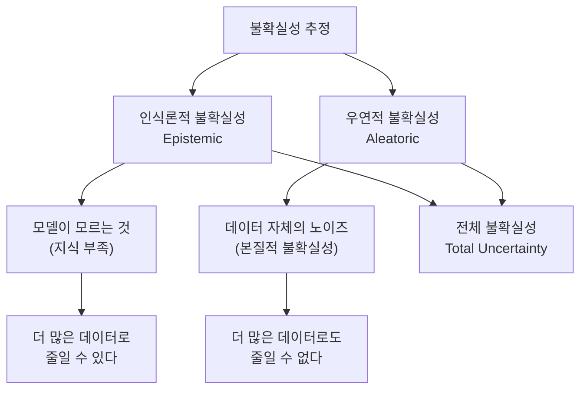
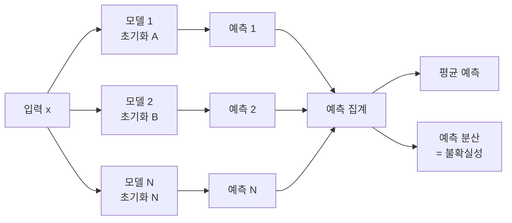
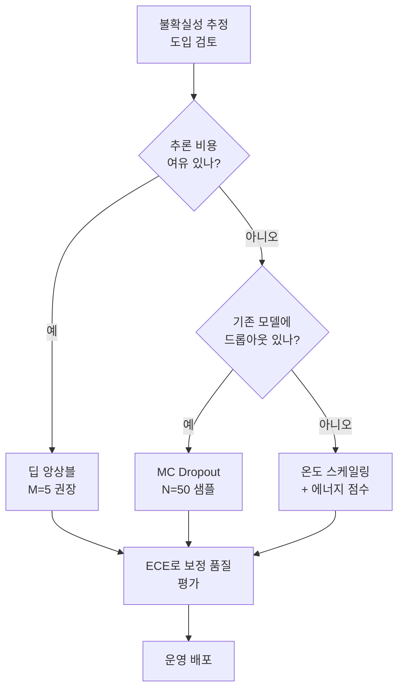

# 불확실성 추정 (Uncertainty Estimation)

불확실성 추정(Uncertainty Estimation)은 모델이 예측을 내릴 때 그 예측이 얼마나 신뢰할 수 있는지를 정량화하는 기술이다. 단순히 "정답이 무엇인가"를 넘어 "이 정답을 얼마나 믿을 수 있는가"를 함께 제공함으로써, AI 시스템이 안전하게 "모른다"고 말할 수 있게 한다.

## 왜 중요한가

전통적인 딥러닝 모델은 포인트 추정(point estimate)만을 출력한다 - 소프트맥스를 통해 나온 확률이 높더라도, 이것이 모델의 실제 신뢰도를 반영하지 않을 수 있다. 특히:

- 자율주행: 처음 보는 도로 상황에서 "모름" 신호를 내야 인간이 개입할 수 있다
- 의료 진단: 오진보다 "판단 불가"가 더 안전한 경우가 많다
- 금융 리스크: 불확실성이 높은 예측은 보수적으로 처리해야 한다
- RAG 시스템: 검색 결과에 대한 신뢰도를 알아야 환각을 줄일 수 있다



위 다이어그램은 불확실성을 두 가지 원천으로 분리하는 핵심 구분을 보여준다.

## 두 종류의 불확실성

### 인식론적 불확실성 (Epistemic Uncertainty)

**"모델이 모르는 것"**. 훈련 데이터가 부족하거나 모델 자체의 표현력이 제한되어 발생한다.

- **특성**: 더 많은 훈련 데이터를 추가하면 줄일 수 있다
- **관련 개념**: 모델 불확실성(model uncertainty), 매개변수 불확실성
- **OOD 연결**: 훈련 분포에서 멀리 떨어진 입력일수록 인식론적 불확실성이 높다

$$U_{epistemic} = \mathbb{V}_{p(\theta | \mathcal{D})}[\mathbb{E}_{p(y|x,\theta)}[y]]$$

### 우연적 불확실성 (Aleatoric Uncertainty)

**"데이터 자체의 노이즈"**. 관측 과정의 본질적 무작위성에서 발생한다.

- **특성**: 아무리 많은 데이터가 있어도 줄일 수 없다
- **예시**: 주사위 결과, 동전 뒤집기, 센서 노이즈
- **이종(heteroscedastic) vs 동종(homoscedastic)**: 입력에 따라 노이즈 크기가 달라지는지 여부

$$U_{aleatoric} = \mathbb{E}_{p(\theta | \mathcal{D})}[\mathbb{V}_{p(y|x,\theta)}[y]]$$

### 합산

$$U_{total} = U_{epistemic} + U_{aleatoric}$$

실무에서는 이 둘을 분리하는 것이 중요하다. 인식론적 불확실성은 데이터 수집이나 모델 개선으로 줄일 수 있지만, 우연적 불확실성은 설계 수준에서 수용해야 한다.

## 핵심 기법

### 1. 베이지안 신경망 (Bayesian Neural Networks)

파라미터 $\theta$에 대한 사전 분포 $p(\theta)$를 정의하고, 훈련 후 사후 분포 $p(\theta | \mathcal{D})$를 추론한다. 예측 시 파라미터 불확실성을 통합한다.

$$p(y | x, \mathcal{D}) = \int p(y | x, \theta) \cdot p(\theta | \mathcal{D}) d\theta$$

- **장점**: 이론적으로 가장 올바른 접근
- **단점**: 사후 분포를 정확히 추론하는 것이 대규모 신경망에서 계산적으로 불가능에 가깝다

**변분 추론(Variational Inference)**: 실제 사후 분포를 근사 분포 $q(\theta; \phi)$로 대체한다.

$$\mathcal{L}_{ELBO} = \mathbb{E}_{q(\theta;\phi)}[\log p(\mathcal{D}|\theta)] - \text{KL}[q(\theta;\phi) \| p(\theta)]$$

### 2. MC Dropout (Monte Carlo Dropout)

Gal & Ghahramani (2016)의 핵심 인사이트: **훈련과 추론 모두에서 드롭아웃을 적용하면 베이지안 근사가 된다.**

```python
import torch
import torch.nn as nn

class BayesianLinear(nn.Module):
    def __init__(self, in_features, out_features, dropout_p=0.1):
        super().__init__()
        self.linear = nn.Linear(in_features, out_features)
        self.dropout = nn.Dropout(p=dropout_p)

    def forward(self, x):
        # 훈련/추론 모두에서 드롭아웃 적용
        return self.dropout(self.linear(x))

def mc_predict(model, x, n_samples=50):
    """MC Dropout으로 예측 분포를 추정한다."""
    model.train()  # 드롭아웃 활성화 유지
    predictions = []
    with torch.no_grad():
        for _ in range(n_samples):
            pred = model(x)
            predictions.append(pred)

    predictions = torch.stack(predictions)
    mean = predictions.mean(dim=0)
    variance = predictions.var(dim=0)  # 인식론적 불확실성 근사
    return mean, variance
```

- **장점**: 기존 모델에 드롭아웃만 추가하면 되어 구현이 쉽다
- **단점**: N번 순전파 비용, 드롭아웃 위치/비율에 민감

### 3. 딥 앙상블 (Deep Ensembles)

Lakshminarayanan et al. (2017)의 기법. 무작위 초기화로 여러 독립적인 모델을 훈련하고, 예측을 집계한다.

```python
class DeepEnsemble:
    def __init__(self, models):
        self.models = models  # M개의 독립 모델

    def predict(self, x):
        preds = [model(x) for model in self.models]
        preds = torch.stack(preds)

        # 평균: 예측값
        mean = preds.mean(dim=0)
        # 분산: 인식론적 불확실성
        epistemic = preds.var(dim=0)

        return mean, epistemic
```



위 다이어그램은 딥 앙상블의 병렬 추론 구조를 보여준다.

딥 앙상블은 OOD 탐지와 불확실성 추정 모두에서 경험적으로 가장 강력한 성능을 보인다고 알려져 있다.

- **장점**: 간단, 다양성 높음, 실용적으로 가장 강력
- **단점**: M배의 훈련/추론 비용, 메모리 M배 필요

### 4. 확률적 깊이 (Stochastic Depth) / Batch Ensemble

앙상블 비용을 줄이기 위한 효율적 변형들:

- **Batch Ensemble**: 공유 기본 가중치 + 모델별 랭크-1 행렬로 다양성 확보
- **MIMO (Multi-Input Multi-Output)**: 하나의 네트워크로 여러 독립 예측을 동시에 생성

### 5. 예측 구간 (Conformal Prediction)

분포 가정 없이 보장된 커버리지를 가진 예측 구간을 제공하는 통계적 접근법.

$$P(y_{test} \in \hat{C}(x_{test})) \geq 1 - \alpha$$

- 훈련 분포 가정 없이 유효
- 계산이 가볍고 사후 적용 가능
- 분포 이동(distribution shift) 하에서는 보장이 약해진다

## 보정 (Calibration)

불확실성 추정의 품질을 측정하는 핵심 개념. 모델이 "90% 확신"이라고 할 때 실제로 90%의 빈도로 맞아야 한다.

**Expected Calibration Error (ECE):**

$$ECE = \sum_{m=1}^{M} \frac{|B_m|}{n} |acc(B_m) - conf(B_m)|$$

여기서 $B_m$은 $m$번째 신뢰도 구간(빈)이다.

**보정 방법:**
- **온도 스케일링**: 소프트맥스 로짓을 스칼라 온도 $T$로 나눔 (가장 단순하고 효과적)
- **Platt Scaling**: 출력 확률에 로지스틱 회귀 적용
- **Isotonic Regression**: 단조 함수로 보정

```python
def temperature_scaling(logits, T):
    """온도 스케일링으로 보정된 확률을 반환한다."""
    return torch.softmax(logits / T, dim=-1)
```

## LLM에서의 불확실성

언어 모델의 불확실성 추정은 분류 모델과 다른 고려사항이 있다.

**토큰 수준 불확실성**: 각 토큰의 생성 확률 $p(y_t | y_{<t}, x)$가 국소적 불확실성을 제공한다.

**시퀀스 수준 집계**: 개별 토큰 불확실성을 어떻게 시퀀스 전체의 불확실성으로 집계할지가 비자명하다.

**의미적 불확실성**: 다른 토큰 시퀀스가 같은 의미를 가질 수 있어, 토큰 수준 불확실성이 의미 수준 불확실성을 과대평가할 수 있다.

**주요 접근**:

| 방법 | 설명 |
|------|------|
| 엔트로피 기반 | 각 토큰의 엔트로피 평균 |
| 의미적 엔트로피 | 의미적으로 동등한 응답을 클러스터링 후 클러스터 확률의 엔트로피 |
| Verbalized Uncertainty | 모델에게 직접 "얼마나 확신하느냐"고 물어보는 방식 |
| 일관성 기반 | 동일 입력에 대한 여러 샘플 간 일관성으로 측정 |

## OOD 탐지와의 관계

불확실성 추정과 [[ood-detection]]은 밀접히 연결된다:

- 인식론적 불확실성이 높다는 것 = OOD 가능성이 높다는 신호
- 딥 앙상블과 MC Dropout은 OOD 탐지 스코어로도 사용된다
- 그러나 모든 OOD 샘플이 불확실성이 높지는 않다 (특히 adversarial example)

[[domain-adaptation]] 문맥에서는 타깃 도메인 샘플에 대한 불확실성을 모니터링해 분포 이동을 감지하는 데 활용한다.

## 실무 적용 가이드



**핵심 권장사항:**

1. **딥 앙상블(M=5)이 가장 강력**: 비용 감당 가능하면 첫 번째 선택
2. **MC Dropout**: 기존 드롭아웃 모델에 빠르게 추가 가능
3. **반드시 보정 평가**: ECE나 신뢰도-정확도 플롯으로 보정 품질 확인
4. **ID/OOD 분리 평가**: 불확실성이 실제로 OOD에서 높아지는지 검증
5. **배포 후 모니터링**: 운영 중 입력 분포 변화를 불확실성으로 감지

## 관련 문서

- [[bayesian-deep-learning]] -- 베이지안 딥러닝 기법 전반
- [[deep-ensembles]] -- 딥 앙상블 상세
- [[ood-detection]] -- 분포 외 탐지 기법
- [[domain-adaptation]] -- 분포 이동 적응
- [[ai-agent-security]] -- AI 안전성과 불확실성의 관계
