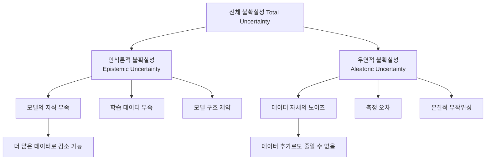
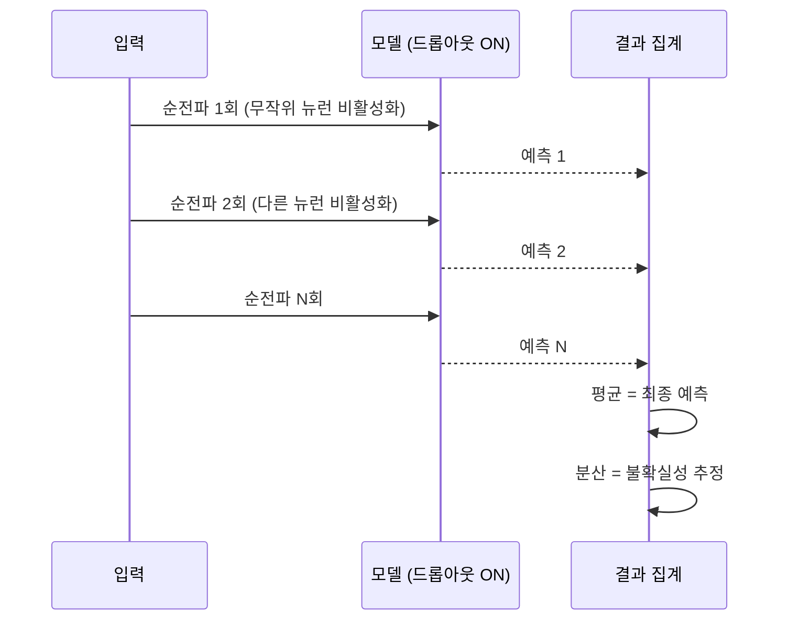

# 불확실성 정량화 (Uncertainty Quantification)

## 개요

불확실성 정량화(UQ, Uncertainty Quantification)는 예측에 내재된 불확실성을 측정하고 표현하는 방법론이다. 단순히 "얼마나 자신 있냐"를 넘어, 불확실성의 **종류와 원인**을 구분하고 각각을 적절히 다루는 것이 목표다. LLM 시대에는 [[llm-calibration]]과 함께 신뢰할 수 있는 AI 시스템 구축의 핵심 요소로 부상하고 있다.

## 불확실성의 두 가지 유형

불확실성은 근본적으로 두 가지 원천으로 분류된다:

### 인식론적 불확실성 (Epistemic Uncertainty)

"우리가 모르기 때문에" 발생하는 불확실성. 모델의 파라미터, 구조, 학습 데이터 부족 등에서 비롯된다. 원칙적으로 더 많은 데이터나 더 나은 모델로 줄일 수 있다.

- 학습 데이터에 없는 영역(out-of-distribution)에서 높게 나타남
- [[bayesian-inference]] 관점에서는 사후 분포의 분산으로 표현

### 우연적 불확실성 (Aleatoric Uncertainty)

"세계 자체가 불확실하기 때문에" 발생하는 불확실성. 데이터에 내재된 노이즈, 측정 오차, 자연적 무작위성이 원인이다. 아무리 좋은 모델을 써도 줄일 수 없는 하한이 존재한다.

- 레이블 노이즈(label noise)가 심한 데이터셋에서 높게 나타남
- 이미지의 모션 블러, 텍스트의 중의성 등이 대표적 예시

## 주요 UQ 방법론

### MC Dropout (Monte Carlo Dropout)

Gal & Ghahramani(2016)가 제안한 방법으로, 기존 드롭아웃을 추론 시에도 활성화해 여러 번 순전파하여 예측 분포를 추정한다. 드롭아웃을 [[bayesian-inference]]의 근사로 해석하는 이론적 근거가 있다.

장점: 기존 모델 수정 없이 적용 가능, 구현이 단순  
단점: N번 순전파 필요 (속도 저하), 드롭아웃이 없는 모델에 적용 불가

### Deep Ensembles

서로 다른 초기화로 학습한 여러 모델의 예측을 앙상블. MC Dropout보다 계산 비용이 높지만 일반적으로 캘리브레이션 품질이 더 좋다.

$$\bar{p}(y|x) = \frac{1}{M} \sum_{m=1}^{M} p_\theta^{(m)}(y|x)$$

### Conformal Prediction (등각 예측)

분포 가정 없이 통계적으로 보장된 예측 구간을 제공하는 방법. 보정 집합(calibration set)에서 비적합도 점수(nonconformity score)를 계산해, 원하는 커버리지(예: 90%)를 보장하는 예측 집합을 구성한다.

- 모델에 불가지론적(agnostic): 어떤 블랙박스 모델에도 적용 가능
- 유한 샘플에서도 통계적 보장이 성립

### Bayesian Neural Networks (BNN)

파라미터를 점 추정값이 아닌 분포로 모델링. [[bayesian-inference]]의 직접 적용이지만 계산 비용이 매우 높아 실용화가 어렵다. Variational Inference, Laplace Approximation 등으로 근사하는 연구가 활발하다.

## LLM에서의 UQ 적용

LLM에 UQ를 적용하는 것은 모델 크기와 자기회귀 생성이라는 특성 때문에 특히 어렵다:

| 방법 | 적용 가능성 | 한계 |
|------|------------|------|
| MC Dropout | 제한적 | 대형 모델에서 드롭아웃 비활성화가 일반적 |
| Deep Ensembles | 비용 과다 | 70B 모델 N개를 동시 운용 불가 |
| Conformal Prediction | 활발한 연구 | 생성 태스크에 적용하는 방법론 발전 중 |
| 언어 표현 기반 | 실용적 | 모델이 "잘 모르겠다"고 말하도록 유도 |
| SAR (Semantic Entropy) | 최신 연구 | 의미론적 동등 출력을 군집화해 엔트로피 추정 |

### Semantic Entropy

Farquhar et al.(2023)이 제안한 방법. LLM의 생성 출력에서 의미론적으로 동일한 응답들을 하나의 클러스터로 묶고, 클러스터 수준의 엔트로피를 계산해 불확실성을 측정한다. 표면적 다양성이 아닌 의미적 다양성을 측정하므로 더 의미 있는 불확실성 추정이 가능하다.

## 실무 적용 가이드

1. **태스크 분류**: 분류 문제는 softmax 기반 방법 적용이 용이, 생성 문제는 semantic entropy 또는 conformal prediction 고려
2. **불확실성 유형 파악**: OOD 감지는 인식론적 불확실성, 노이즈 데이터 처리는 우연적 불확실성에 집중
3. **[[llm-calibration]] 연계**: UQ와 캘리브레이션을 함께 평가해 신뢰성을 종합적으로 파악
4. **선택적 예측**: 불확실성이 임계값을 초과하면 인간에게 위임하는 Human-in-the-loop 설계

## 관련 문서

- [[bayesian-inference]] - 불확실성의 수학적 토대
- [[llm-calibration]] - 예측 확률과 실제 정확도의 일치도 측정
- [[hallucination]] - 과잉확신과 연결된 LLM의 허위 정보 생성
