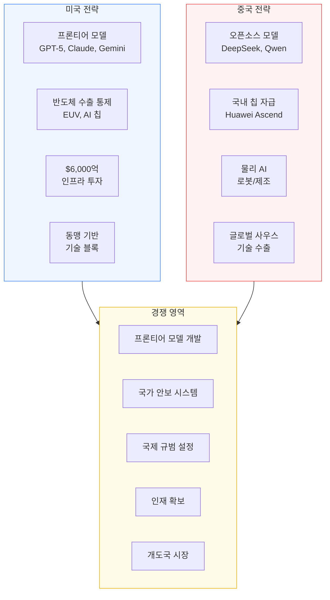

# 미-중 AI 지정학 경쟁

미국과 중국 간 AI 패권을 둘러싼 지정학적 경쟁. 미국은 반도체 수출 통제와 프론티어 모델 개발로 기술 우위를 유지하려 하고, 중국은 오픈소스 전략, 물리 AI, 국내 칩 자급으로 추격하고 있다. 2026년은 이 경쟁의 "결정적 분기점"으로 평가된다.

## 개요

미-중 AI 경쟁은 단순한 기술 경쟁을 넘어 경제 안보, 군사력, 글로벌 거버넌스의 미래를 결정하는 지정학적 갈등이다. 미국은 $6,000억 규모의 AI 인프라 투자(2024년 대비 2배)와 반도체 수출 통제로 선도적 위치를 유지하려 하고, 중국은 국가 주도 투자, 오픈소스 모델(DeepSeek, Qwen 등)의 글로벌 확산, 제조 AI 응용에서의 실용적 우위로 대응한다.

Atlantic Council은 "AI가 국가 간 경쟁, 협력, 글로벌 권력 역학을 형성하는 데 점점 더 중심적"이라고 평가했으며, CFR은 2026년을 "AI의 미래를 결정할 수 있는 해"로 규정했다.

## 경쟁 구도

### 미국의 강점

- **프론티어 모델 개발**: GPT-5, Claude, Gemini 등 최첨단 파운데이션 모델에서 약 7개월 리드
- **AI 인프라 투자**: 클라우드 기업들이 2026년 $6,000억 투자 계획 (2024년 대비 2배)
- **반도체 설계/제조 생태계**: NVIDIA, AMD, TSMC(미국 공장 확대) 기반 글로벌 칩 공급망 장악
- **벤처 자본 생태계**: Q1 2026 $3,000억 AI 투자의 상당 부분이 미국 기업으로 유입
- **인재 풀**: 세계 최고 AI 연구소와 대학 집중

### 중국의 추격 전략

- **오픈소스 확산**: DeepSeek, Qwen 등 오픈소스 모델로 글로벌 AI 인프라에 영향력 행사. 미국 주요 기업도 중국산 LLM 사용
- **논문/특허 양적 우위**: AI 출판물과 특허 수에서 글로벌 선두
- **물리 AI/제조 AI**: 산업용 로봇과 제조 AI 분야에서 세계 최고 수준의 실전 배포
- **국가 주도 투자**: 중앙 집권적 거버넌스로 신속한 배포와 스케일링
- **"충분히 좋은(good-enough)" 전략**: 최첨단 성능보다 통제 가능성과 공급 안정성 우선

## 반도체 수출 통제

### 정책 변화

반도체 수출 통제는 미국이 중국의 AI 발전 속도를 늦출 수 있는 "유일한 도구"로 평가된다. 그러나 2026년 정책 방향에 상당한 변화가 있었다.

| 시기 | 정책 | 영향 |
|------|------|------|
| 2022.10 | 미 상무부 초기 AI 칩 수출 제한 | SMIC EUV 장비 확보 차단 |
| 2023-2024 | 점진적 규제 강화 | NVIDIA 중국 맞춤 칩(H800 등) 제한 |
| 2025 | 상무부 주도 기술 공세 최고조 | 광범위한 수출 제한 |
| 2026.01 | H200/MI325X 수출 규칙 완화 | "거부 추정"에서 "사안별 허가"로 전환 |
| 2026.01 | AI OVERWATCH Act 추진 | 의회에 AI 칩 수출 허가 거부권 부여 시도 |

2026년 1월 13일, 상무부는 NVIDIA H200 및 AMD MI325X AI 칩의 중국 수출 규칙을 "거부 추정(presumption of denial)"에서 "사안별 허가(case-by-case licensing)"로 변경했다. 이는 트럼프 행정부가 베이징 방문을 앞두고 안정적 무역 관계를 우선시한 결과다.

비판론자들은 이 완화가 중국의 국내 AI 컴퓨팅 파워를 "2-3년치 단축"시킬 수 있다고 경고했고, 하원 외교위원장 Brian Mast는 AI OVERWATCH Act를 추진하여 의회가 AI 칩 수출 허가에 대한 거부권을 갖도록 시도했다.

### 중국의 우회 전략

수출 통제에도 불구하고 중국은 다양한 경로로 대응하고 있다:

- **우회 조달**: Huawei가 쉘 컴퍼니를 통해 2024년까지 TSMC에서 200만 개 이상의 칩을 불법 조달
- **합법 수입**: 2024년 중국 시장 맞춤형 NVIDIA 칩 약 100만 개 합법 수입
- **국내 생산**: Huawei Ascend 시리즈 생산이나, 2025년 기준 연 20만 개 수준으로 수요 대비 미미
- **효율 최적화**: DeepSeek 등이 제한된 하드웨어에서 경쟁력 있는 모델을 개발하는 "소프트웨어 우회" 시연
- **추론 칩 자급 목표**: 2028년까지 추론용 칩의 자급자족 달성 목표

AI Frontiers의 분석에 따르면, 수출 통제는 "중국의 칩 제조 역량을 제한하는 데는 성공했지만 AI 개발 자체에는 혼재된 결과"를 보이고 있다. 중국 기업들(Alibaba, DeepSeek)은 하드웨어 제약에도 불구하고 벤치마크에서 미국 모델과 "상당히 대등한" 성능을 달성했다.

## 경쟁의 3대 축

### 1. 프론티어 모델 개발

미국이 GPT-5, Claude 4, Gemini Ultra 등으로 약 7개월의 기술 리드를 유지하고 있으나, 이 격차는 빠르게 줄어들고 있다. 중국의 DeepSeek V4, Qwen3 등은 벤치마크에서 미국 모델에 근접하는 성능을 보이며, 특히 효율성(적은 컴퓨트로 유사 성능)에서 강점을 보인다.

### 2. 군사/안보 AI

양국 모두 AI를 군사 목적에 적극 활용:
- 취약점 식별 및 사이버 공격/방어
- 다단계 작전 계획 수립
- 물류 최적화
- 정보 분석 및 의사결정 지원

중국의 중앙 집권적 거버넌스는 군사 AI의 신속한 배포에 구조적 이점을 제공하는 반면, 미국은 국방부 관료제로 인한 지연에 직면한다.

### 3. 글로벌 규범 설정

| 접근 방식 | 미국 | 중국 | EU |
|----------|------|------|-----|
| 규제 철학 | 시장 중심, 자율 규제 | 국가 통제 중심 | 권리 기반 규제 |
| AI 거버넌스 | NIST AI RMF | 생성 AI 관리 방법 | AI Act |
| 글로벌 전략 | 기술 동맹(AUKUS 등) | 일대일로 + 디지털 실크로드 | 디지털 주권 |
| 개도국 접근 | 기술 수출 + 투자 | 인프라 + 기술 패키지 | 규범 수출 |

개발도상국은 양측 모두에게 핵심 전장이다. 중국은 인프라 투자와 기술 패키지를 제공하고, 미국은 기술 동맹과 투자를 통해 영향력을 확보하려 한다. EU는 권리 기반 규제 프레임워크로 제3의 길을 추구하나, 허용적 규제 환경이 투자를 끌어당길 수 있어 지정학적 균형에 영향을 줄 수 있다.

## 2026년 주요 변수

- **수출 통제 정책 방향**: 완화와 강화 사이의 정치적 줄다리기가 지속. 의회(강경) vs 행정부(유연) 갈등
- **중국 반도체 자급 속도**: Huawei Ascend의 양산 확대 여부가 장기 경쟁 구도 결정
- **오픈소스 역학**: 중국산 오픈소스 모델의 글로벌 채택이 미국의 기술적 영향력을 잠식할 가능성
- **희토류 및 원자재**: 중남미 등에서의 희토류 확보 경쟁이 AI 하드웨어 공급망에 영향
- **AI 안전 협력 가능성**: 양국 간 AI 안전 관련 최소한의 협력 채널 유지 여부

## 관련 문서

- [[sovereign-ai|Sovereign AI / National AI Strategies]]
- [[ai-venture-bubble-2026|AI Venture Bubble]]
- [[custom-ai-chips-asic|Custom AI Chips (ASIC)]]
- [[ai-regulation-us|AI Regulation (US)]]
- [[eu-ai-act-enforcement|EU AI Act Enforcement]]
- [[deepseek-v4|DeepSeek V4 / R2]]
