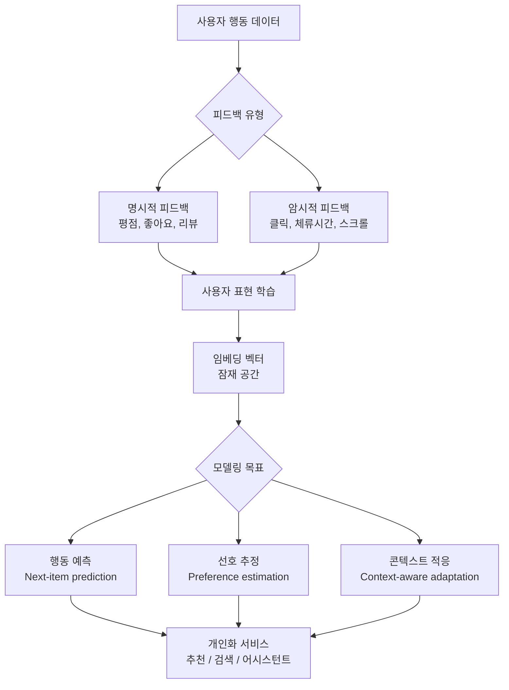
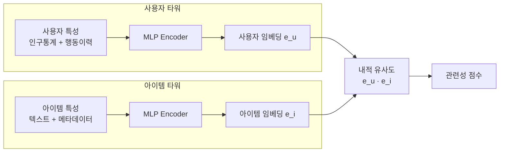
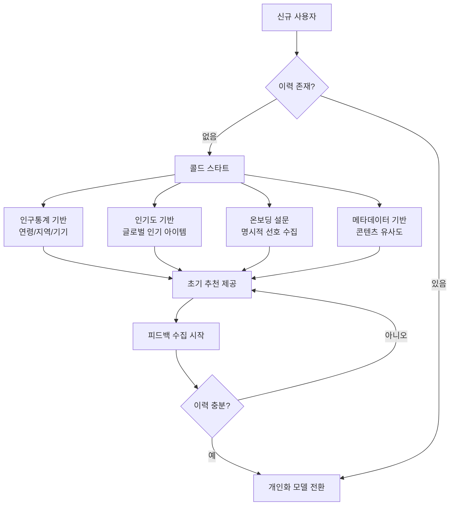
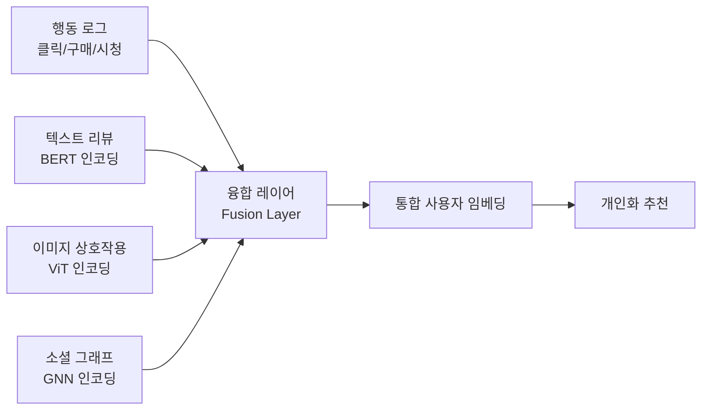
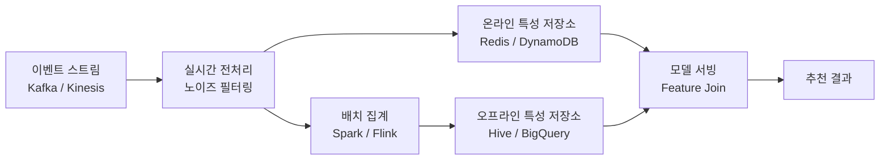

# 사용자 모델링 (User Modeling)

## 개념 정의

사용자 모델링(User Modeling)은 시스템이 개별 사용자의 선호, 행동, 지식, 목표를 수학적·구조적으로 표현하여 **개인화된 응답과 추천**을 제공하기 위한 방법론 전반을 뜻한다. AI 및 추천 시스템에서 사용자 모델은 단순한 인구통계 프로파일을 넘어, 실시간 행동 패턴과 잠재 선호를 동시에 포착하는 동적 표현(dynamic representation)으로 진화하고 있다.

핵심 질문: "이 사용자가 다음에 무엇을 원할 것인가?"



위 흐름은 원시 행동 데이터가 임베딩 공간으로 압축되고, 복수의 하위 목표를 통해 개인화 서비스로 이어지는 전체 파이프라인을 보여 준다.

---

## 피드백 유형: 명시적 vs 암시적

### 명시적 피드백 (Explicit Feedback)

사용자가 **의도적으로 제공**하는 선호 신호다.

| 종류 | 예시 | 장점 | 단점 |
|------|------|------|------|
| 별점 (Rating) | 1-5점 평가 | 정확한 선호 강도 | 수집량 적음, 편향 |
| 좋아요/싫어요 | 이진 선택 | 수집 용이 | 뉘앙스 부족 |
| 리뷰 텍스트 | 서술형 의견 | 풍부한 정보 | NLP 처리 필요 |
| 즐겨찾기 | 북마크, 위시리스트 | 장기 선호 반영 | 고빈도 아이템 편향 |

**수집 편향 문제**: 리뷰는 매우 만족하거나 불만족한 사용자가 주로 작성하므로 중간 선호층이 누락된다.

### 암시적 피드백 (Implicit Feedback)

사용자가 의식하지 않는 행동에서 **간접 추론**하는 선호 신호다.

| 종류 | 예시 | 추론 근거 |
|------|------|----------|
| 클릭 (Click) | 검색 결과 클릭 | 관심 표시 |
| 체류 시간 (Dwell time) | 페이지 열람 시간 | 참여도 proxy |
| 구매 완료 | e-commerce 전환 | 강한 선호 신호 |
| 스킵 (Skip) | 동영상 건너뜀 | 부정 신호 |
| 재방문 | 동일 아이템 재접근 | 관심 지속 |

**노이즈 문제**: 클릭은 제목 낚시(clickbait)에 반응할 수 있으며, 구매는 필요에 의한 것이지 선호가 아닐 수 있다. 따라서 암시적 피드백은 단일 신호보다 **복수 신호의 조합**으로 해석한다.

---

## 임베딩 기반 사용자 표현

현대 사용자 모델링의 핵심은 사용자를 **고차원 임베딩 벡터**로 표현하는 것이다.

### 협업 필터링(CF) 임베딩

행렬 분해(Matrix Factorization) 기반:

$$\hat{r}_{ui} = \mathbf{u}_u^\top \mathbf{v}_i + b_u + b_i$$

- $\mathbf{u}_u \in \mathbb{R}^k$: 사용자 $u$의 잠재 벡터
- $\mathbf{v}_i \in \mathbb{R}^k$: 아이템 $i$의 잠재 벡터
- $b_u, b_i$: 바이어스 항

**한계**: 새로운 사용자/아이템에 대한 콜드 스타트(cold start) 문제가 발생한다.

### Two-Tower 모델

사용자 타워와 아이템 타워를 독립적으로 인코딩하여 내적(dot product)으로 관련성을 계산한다. 자세한 내용은 [[two-tower-model]] 참조.



### 시퀀스 기반 사용자 모델

사용자의 행동 **순서(sequence)**를 모델링한다. Transformer 기반 순차 추천(sequential recommendation)이 대표적:

```python
import torch
import torch.nn as nn

class UserSequenceEncoder(nn.Module):
    """
    사용자 행동 시퀀스를 Transformer로 인코딩하는 모델.
    최근 N개 상호작용을 입력으로 받아 다음 아이템을 예측한다.
    """
    def __init__(self, num_items: int, embed_dim: int = 64, num_heads: int = 4, max_seq_len: int = 50):
        super().__init__()
        self.item_embed = nn.Embedding(num_items + 1, embed_dim, padding_idx=0)
        self.pos_embed = nn.Embedding(max_seq_len, embed_dim)
        encoder_layer = nn.TransformerEncoderLayer(
            d_model=embed_dim, nhead=num_heads, batch_first=True
        )
        self.transformer = nn.TransformerEncoder(encoder_layer, num_layers=2)
        self.output_proj = nn.Linear(embed_dim, num_items)

    def forward(self, item_seq: torch.Tensor) -> torch.Tensor:
        # item_seq: (batch, seq_len)
        positions = torch.arange(item_seq.size(1), device=item_seq.device).unsqueeze(0)
        x = self.item_embed(item_seq) + self.pos_embed(positions)
        padding_mask = (item_seq == 0)
        x = self.transformer(x, src_key_padding_mask=padding_mask)
        # 마지막 유효 토큰을 사용자 표현으로 사용
        last_hidden = x[:, -1, :]
        return self.output_proj(last_hidden)
```

---

## 사용자 프로파일 갱신 전략

### 정적 vs 동적 프로파일

| 전략 | 설명 | 장점 | 단점 |
|------|------|------|------|
| 정적 프로파일 | 일정 주기 배치 업데이트 | 안정적, 계산 효율 | 실시간 반응 부족 |
| 동적 프로파일 | 이벤트 발생 시 즉시 업데이트 | 컨텍스트 반영 | 노이즈 민감 |
| 하이브리드 | 장기 + 단기 관심의 조합 | 균형적 | 설계 복잡도 증가 |

### 망각(Forgetting) 메커니즘

오래된 선호는 현재 관심과 다를 수 있다. 시간 감쇠를 적용:

$$\tilde{\mathbf{u}}_t = \alpha \cdot \mathbf{u}_{recent} + (1 - \alpha) \cdot \mathbf{u}_{long-term}$$

또는 GRU/LSTM으로 게이트 기반 메모리 갱신을 학습한다.

---

## 콜드 스타트 (Cold Start) 문제

사용자 이력이 없거나 새로운 사용자에게 초기 추천을 제공하는 문제다.



---

## 행동 예측 (Behavior Prediction)

### Next-Item Prediction

사용자의 다음 상호작용 아이템을 예측하는 태스크:

$$P(\text{item}_{t+1} | \text{item}_{1:t}, \text{user features})$$

대표 모델: SASRec, BERT4Rec, GRU4Rec

### CTR 예측 (Click-Through Rate)

특정 아이템을 클릭할 확률을 예측:

$$\text{CTR} = P(\text{click} | u, i, \text{context})$$

특성 교차(feature crossing)가 핵심 — DeepFM, DCN(Deep & Cross Network)이 주로 활용된다.

### 세션 기반 추천 (Session-Based Recommendation)

사용자 ID 없이 **현재 세션의 행동만**으로 추천:

$$P(\text{item}_{t+1} | \text{session}_{1:t})$$

익명 방문자 대응, 단기 컨텍스트 활용이 핵심이다.

---

## 개인정보 보호와의 균형

사용자 모델링은 정확도를 높이려 할수록 더 많은 개인 데이터를 수집·보관해야 한다는 본질적 긴장을 갖는다.

### 주요 규제 및 원칙

| 원칙 | 내용 |
|------|------|
| 데이터 최소화 | 목적에 필요한 최소한의 데이터만 수집 |
| 목적 제한 | 수집 목적 외 사용 금지 |
| 투명성 | 사용자에게 모델링 사실과 사용 데이터 고지 |
| 잊혀질 권리 | 사용자 요청 시 프로파일 삭제 |
| 동의 (Consent) | 명시적 동의 후 수집 |

### 프라이버시 보존 기술

**연합 학습 (Federated Learning)**
- 사용자 데이터를 서버로 보내지 않고 기기에서 로컬 학습
- 모델 그레이디언트(또는 업데이트)만 중앙 집계

**차등 프라이버시 (Differential Privacy)**
- 학습 또는 집계 과정에 캘리브레이션된 노이즈 추가
- 개별 사용자 정보 역추적 방지

**데이터 익명화 (Anonymization)**
- k-익명성, l-다양성 등 통계적 보장
- 재식별 위험이 완전히 제거되지 않음 주의

```python
import numpy as np

def add_laplace_noise(value: float, sensitivity: float, epsilon: float) -> float:
    """
    차등 프라이버시 - 라플라스 메커니즘.
    sensitivity: 함수의 전역 민감도
    epsilon: 프라이버시 예산 (작을수록 강한 보호)
    """
    scale = sensitivity / epsilon
    noise = np.random.laplace(loc=0.0, scale=scale)
    return value + noise
```

---

## 공정성 (Fairness) 이슈

사용자 모델은 역사적 편향을 학습해 특정 집단에 불리한 추천을 제공할 수 있다.

### 편향 유형

- **노출 편향 (Exposure bias)**: 인기 아이템이 더 많이 노출 → 더 많은 상호작용 데이터 → 더 강한 추천의 자기강화 루프
- **위치 편향 (Position bias)**: 상위 노출 아이템이 클릭될 확률이 더 높음
- **인구통계 편향**: 특정 인구 집단에 체계적으로 다른 품질의 추천

### 디바이어싱 (Debiasing) 기법

- **역성향 가중치 (IPW, Inverse Propensity Weighting)**: 각 샘플의 클릭 확률(성향)의 역수로 가중치 부여
- **인과 추론 기반**: 관찰 데이터에서 노출 효과를 분리
- **공정성 제약 추가**: 학습 목적 함수에 공정성 정규화항 추가

---

## 멀티모달 사용자 모델링

텍스트, 이미지, 오디오, 행동 로그 등 이질적 신호를 통합하여 풍부한 사용자 표현을 구성한다.



---

## LLM 시대의 사용자 모델링

대형 언어 모델(LLM)은 기존 협업 필터링과 다른 방식으로 사용자를 이해한다.

**프롬프트 기반 프로파일**: 사용자 이력을 자연어 텍스트로 직렬화하여 LLM 컨텍스트로 제공

```python
def build_user_profile_prompt(user_history: list[dict]) -> str:
    """사용자 이력을 LLM 프롬프트용 자연어로 변환한다."""
    lines = ["사용자 최근 행동 이력:"]
    for item in user_history[-10:]:  # 최근 10개만
        lines.append(f"- {item['timestamp']}: {item['action']} - {item['item_title']}")
    lines.append("\n위 이력을 바탕으로 사용자 선호를 추론하시오.")
    return "\n".join(lines)
```

**한계**:
- 컨텍스트 길이 제한으로 장기 이력 표현이 어렵다
- 사용자별 추론 비용이 크다
- 수백만 사용자에게 실시간 적용 시 레이턴시 문제

---

## 평가 지표

| 지표 | 공식 | 의미 |
|------|------|------|
| Precision@K | $\frac{\text{관련 아이템 수}}{K}$ | 상위 K개 중 적중률 |
| Recall@K | $\frac{\text{관련 아이템 수}}{\text{전체 관련 수}}$ | 전체 관련 아이템 중 포착률 |
| NDCG@K | 위치 가중 누적 이득 | 순위 품질 종합 평가 |
| MRR | $\frac{1}{|\mathcal{U}|}\sum_u \frac{1}{\text{rank}_u}$ | 첫 번째 적중 순위의 역수 평균 |
| Hit Rate@K | 최소 1개 적중한 사용자 비율 | 커버리지 평가 |

---

## 실무 고려사항

### 데이터 파이프라인



### 서빙 아키텍처 선택

| 구성요소 | 역할 | 도구 예시 |
|----------|------|----------|
| 후보 생성 | ANN 검색으로 수백~수천 개 추출 | Faiss, ScaNN |
| 랭킹 | 정밀 점수 계산 | TensorFlow Serving |
| 재랭킹 | 다양성, 신선도 조정 | 비즈니스 규칙 |
| A/B 테스트 | 실험 관리 | Optimizely, LaunchDarkly |

---

## 관련 문서

- [[ai-personalization-engines]] - 개인화 엔진의 전체 아키텍처
- [[ai-content-recommendation]] - 콘텐츠 추천 시스템 구현 패턴
- [[two-tower-model]] - 사용자/아이템 이중 인코더 모델
- [[ai-recommendation-systems]] - 추천 시스템 전반 개요
- [[ai-personalization]] - 개인화의 핵심 개념과 기법
