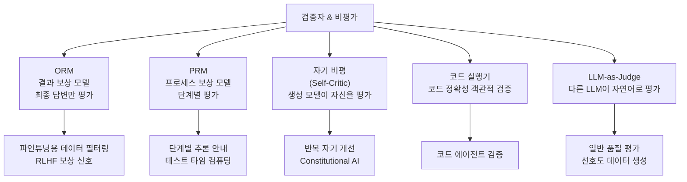
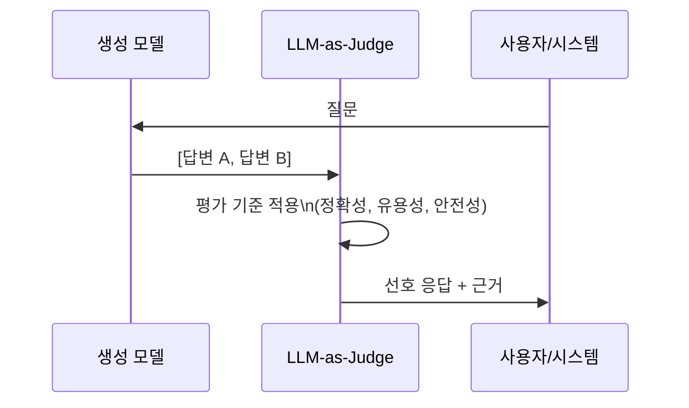

# 검증자/비평가 모델 (Verifier & Critic)

## 개요

**검증자(verifier)** 와 **비평가(critic)** 모델은 다른 LLM 또는 자신의 출력이 올바른지, 유용한지, 안전한지를 평가하는 보조 모델이다. 생성 모델(generator)과 분리되어 독립적인 판단을 제공하거나, 생성 모델 자신이 자기 출력을 비평하는 형태로도 구현된다.

이 범주의 모델들은 AI 시스템이 스스로 오류를 감지하고 교정하는 능력을 갖추는 데 핵심적인 역할을 한다.

## 검증자/비평가의 분류



## ORM (Outcome Reward Model)

**결과 보상 모델**은 생성된 전체 응답의 품질을 단일 스칼라 점수로 평가한다. RLHF(Reinforcement Learning from Human Feedback)에서 보상 모델로 가장 많이 사용된다.

인간 선호도 데이터(human preference data)로 학습: 같은 프롬프트에 대한 두 응답 중 어느 것이 더 나은지 비교 학습(Bradley-Terry 모델 등).

**강점**: 다목적 사용 가능, 상대적으로 학습이 쉬움
**약점**: 최종 결과만 보므로 어디서 틀렸는지 알 수 없음, 보상 해킹(reward hacking)에 취약

## PRM (Process Reward Model)

[[프로세스 보상 모델 (PRM)]] 참고. 수학적 추론에서 단계별 검증이 ORM보다 크게 우수함이 실증됐다 (Lightman et al. 2023).

## 자기 비평 (Self-Criticism / Self-Verification)

생성 모델이 자신의 출력을 직접 평가하는 패턴. 별도 검증 모델이 필요 없어 배포가 간단하다.

### 자기 일관성 (Self-Consistency)

동일 문제에 여러 답변을 생성하고 다수결로 최종 답 선택. 검증이라기보다 앙상블이지만 넓은 의미에서 자기 검증에 포함된다.

### 반복 자기 개선 (Iterative Self-Refinement)

Madaan et al. (2023) "Self-Refine". 모델이 자신의 출력에 대해 피드백을 생성하고, 그 피드백을 바탕으로 개선된 버전을 생성하는 과정을 반복한다.

```
생성: "프랑스의 수도는 리옹입니다."
비평: "오류 발견: 프랑스 수도는 파리입니다. 리옹은 제2의 도시."
개선: "프랑스의 수도는 파리입니다."
```

### 한계

자기 비평은 모델의 원래 오류를 그대로 반영할 수 있다. "잘못 알고 있는 것을 잘못 알고 있다고 모르는" 상황에서는 자기 비평이 무의미하다. 외부 검증자(예: 코드 실행, 검색)와 결합해야 실질적으로 강해진다.

## Constitutional AI (CAI)에서의 비평

Anthropic의 Constitutional AI (Bai et al. 2022)는 LLM 자체를 비평가로 활용하는 대표적 사례다.

**RLAIF (RL from AI Feedback)** 파이프라인:
1. 원칙(constitution) 목록 제공: "응답이 유해하거나 차별적인 내용을 포함하는가?"
2. 모델이 자신의 응답을 원칙에 비추어 비평
3. 비평 기반으로 수정된 응답 생성
4. 이 쌍을 선호도 데이터로 사용해 보상 모델 학습

인간 피드백 없이도 안전한 모델을 학습할 수 있는 확장 가능한 방법론이다.

## LLM-as-Judge

Zheng et al. (2023) "Judging LLM-as-a-Judge with MT-Bench and Chatbot Arena". GPT-4 같은 강력한 LLM을 다른 모델의 응답 품질 평가자로 사용.

**평가 방식**:
- **절대 점수**: 1-10점 척도로 직접 평가
- **쌍 비교(pairwise comparison)**: 두 응답 중 어느 것이 더 나은지

**장점**: 인간 평가와 높은 상관관계, 확장성, 비용 효율적
**단점**: 위치 편향(positional bias), 자기 선호(self-preference), 언어 패턴에 과도 의존



## 코드 실행기 (Code Executor)

코드 생성 에이전트에서 가장 신뢰도 높은 검증자. 단위 테스트(unit test)나 어설션(assertion)을 실행해 코드 정확성을 객관적으로 검증한다.

- **장점**: 완전히 객관적, 언어 모델의 오류에 영향받지 않음
- **단점**: 코드에만 적용 가능, 테스트가 불완전할 수 있음

AlphaCode, Codex, GPT-4의 코드 생성 파이프라인이 이 패턴을 핵심으로 사용한다.

## 테스트 타임 컴퓨팅에서의 스케일링

최근 연구에서 추론 시점에 검증자 계산을 늘리는 것이 성능을 크게 향상시킴이 확인됐다.

Snell et al. (2024) "Scaling LLM Test-Time Compute Optimally":
- PRM + 빔 서치 조합이 단순히 더 큰 모델을 사용하는 것보다 효율적
- 특정 난이도 문제에서는 테스트 타임 컴퓨팅 스케일링이 사전학습 스케일링보다 비용 효율적

이는 "더 큰 모델을 만드는 것"과 "기존 모델을 더 영리하게 사용하는 것"이 상호 보완적임을 보여준다.

## 행위자-비평가 프레임워크 (Actor-Critic)

강화학습의 **행위자-비평가(actor-critic)** 아키텍처에서 비평가 네트워크는 상태 가치(state value)를 추정해 행위자의 학습을 안내한다. LLM 학습에서:

- **행위자**: 텍스트를 생성하는 LLM
- **비평가**: 각 토큰/단계의 가치를 추정하는 별도 모델 (또는 행위자와 파라미터 공유)

PPO (Proximal Policy Optimization) 기반 RLHF에서 비평가 모델은 필수 구성 요소다.

## 관련 문서

- [[프로세스 보상 모델 (PRM)]] - 단계별 검증에 특화된 검증자
- [[자기 일관성]] - 자기 검증의 기본 패턴
- [[Constitutional AI]] - 비평을 통한 AI 안전 학습
- [[RLHF]] - 검증자/보상 모델이 핵심 역할
- [[보상 해킹]] - ORM 검증자의 주요 약점
