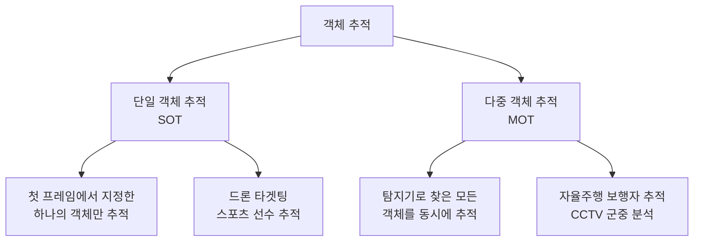
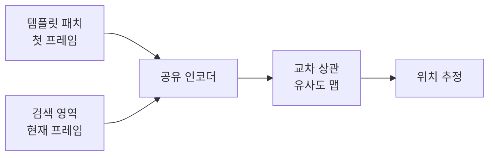
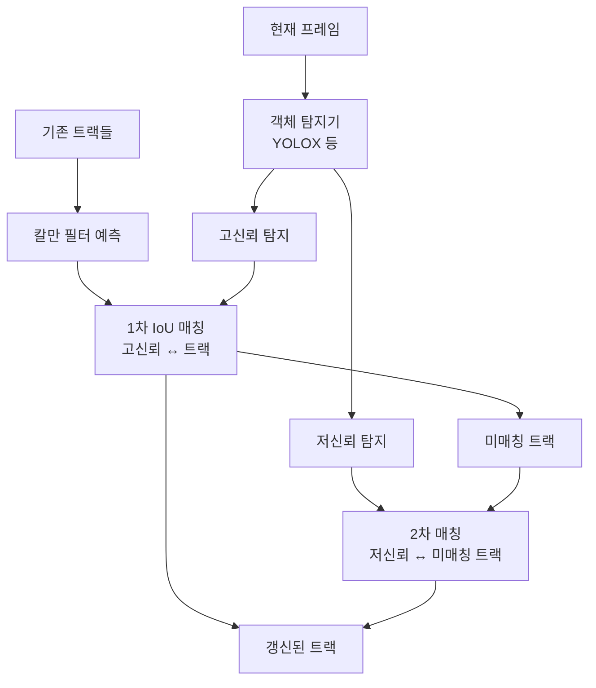

## 개요

비디오 객체 추적(Video Object Tracking)은 비디오의 연속 프레임에서 특정 객체의 위치를 지속적으로 추적하는 컴퓨터 비전 태스크다. 자율주행, 스포츠 분석, 감시 시스템, 로보틱스, 의료 영상 분석 등 다양한 분야의 핵심 기술이다.

크게 **단일 객체 추적(SOT)** 과 **다중 객체 추적(MOT)** 두 패러다임으로 나뉘며, 최근 SAM2([[sam2-video-segmentation]])의 등장으로 픽셀 수준 마스크 추적도 실용화되고 있다.

## SOT vs MOT

| 속성 | SOT | MOT |
|------|-----|-----|
| 추적 대상 수 | 1개 고정 | N개 가변 |
| 초기화 방법 | 첫 프레임 바운딩 박스 | 매 프레임 탐지기 연동 |
| 주요 도전 | 외관 변화, 가려짐(occlusion) | 동일 클래스 객체 간 ID 스위치 |
| 대표 모델 | SiamFC, OSTrack, DiDi | ByteTrack, OC-SORT, StrongSORT |

## SOT 방법론

### 상관 필터(Correlation Filter) 방식

FFT 기반 상관 연산으로 효율적 추적. MOSSE, CSRDCF, KCF 계열.

### 샴 네트워크(Siamese Network) 방식

첫 프레임 타겟 패치와 현재 프레임 검색 영역을 동일 인코더로 임베딩 후 유사도 맵 계산.

### Transformer 기반 추적

최근 주류. 타겟-검색 영역 관계를 어텐션으로 모델링.

- **TransT**: 타겟-검색 영역 간 크로스 어텐션
- **OSTrack**: One-Stream으로 타겟과 검색 영역을 단일 ViT에 입력
- **Stark, MixFormer**: 다양한 Transformer 통합 방식

## MOT 방법론

### Tracking-by-Detection 패러다임

탐지(Detection) → ID 연결(Association) 두 단계 분리.

**ByteTrack (2022)**이 대표적 최신 방법:

- **핵심 아이디어**: 신뢰도 낮은 탐지 결과(low-score detections)도 버리지 않고 2차 연결에 활용
- 고신뢰 탐지를 먼저 기존 트랙과 연결, 남은 트랙과 저신뢰 탐지를 2차 연결
- 가려진(occluded) 객체로 인한 ID 스위치를 줄이는 효과

**OC-SORT, StrongSORT**: 외관(ReID) 특징을 추가해 ID 스위치를 더욱 줄임.

### Joint Detection and Tracking

탐지와 추적을 단일 모델이 수행.

- **FairMOT**: 단일 네트워크에서 탐지 헤드 + ReID 임베딩 헤드 동시 학습
- **MOTR**: Transformer 쿼리가 프레임 간 지속 (트랙 쿼리 유지)

## SAM2와 마스크 기반 추적

[[sam2-video-segmentation]](Segment Anything Model 2)은 포인트/박스 프롬프트로 시작된 객체의 정밀한 **픽셀 마스크**를 비디오 전체에 걸쳐 전파한다.

기존 추적(바운딩 박스)과의 차이:

| 속성 | ByteTrack 등 | SAM2 |
|------|-------------|------|
| 출력 형식 | 바운딩 박스 | 픽셀 마스크 |
| 초기화 | 자동(탐지기) | 프롬프트 필요 |
| 속도 | 빠름 | 상대적으로 느림 |
| 형태 변화 | 박스로 근사 | 정확 추적 |

SAM2는 메모리 뱅크(memory bank)를 통해 이전 프레임들의 정보를 유지하고, 현재 프레임에서 마스크를 생성할 때 과거 컨텍스트를 참조한다.

## 평가 지표

### CLEAR MOT 지표

| 지표 | 의미 |
|------|------|
| MOTA (Multi-Object Tracking Accuracy) | 전체 추적 정확도, ID 스위치/미탐지/오탐지 통합 |
| MOTP (Multi-Object Tracking Precision) | 탐지 위치 정밀도(IoU 평균) |
| IDF1 | ID 유지 기반 F1 점수 |
| ID Switch (IDSW) | ID가 바뀐 횟수 (낮을수록 좋음) |

### 표준 벤치마크

- **MOTChallenge (MOT17, MOT20)**: 보행자 추적 표준 벤치마크
- **DanceTrack**: 춤추는 사람 추적, 외관 유사성이 높아 난이도 높음
- **SportsMOT**: 스포츠 영상, 빠른 움직임
- **LaSOT, TrackingNet**: SOT 벤치마크

## 핵심 도전 과제

1. **가려짐(Occlusion)**: 객체가 다른 물체에 가려지면 추적 소실 위험
2. **외관 변화**: 조명 변화, 자세 변화, 크기 변화
3. **고속 이동**: 프레임 간 이동량이 크면 예측 위치 오차 증가
4. **동일 외관 객체**: 같은 유니폼을 입은 선수들의 ID 구분

[[optical-flow-deep-learning]]은 고속 이동 객체 추적에서 모션 정보를 제공하는 보완 기술로 활용된다.

## 실무 적용 관점

- **자율주행**: 보행자, 차량, 자전거의 다중 추적으로 경로 예측
- **스포츠 분석**: 경기장 내 선수/공 위치 자동 추적, 전술 분석
- **소매업 분석**: 매장 내 고객 동선 분석, 체류 시간 측정
- **영상 편집**: 특정 인물에 자동으로 효과/모자이크 적용

## 관련 문서

- [[sam2-video-segmentation]] - 프롬프트 기반 비디오 마스크 추적
- [[optical-flow-deep-learning]] - 모션 추정 기반 추적 보완 기술
- [[temporal-action-detection]] - 추적 정보를 활용하는 행동 탐지 태스크
- [[spatiotemporal-representation]] - 추적 모델의 시공간 표현 기반
