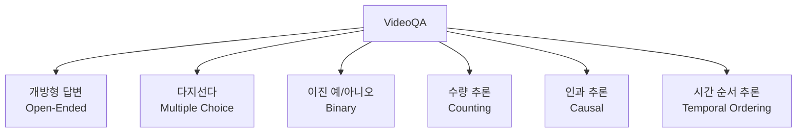
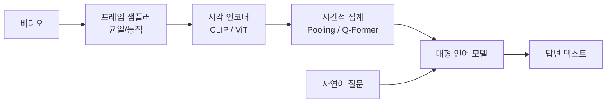
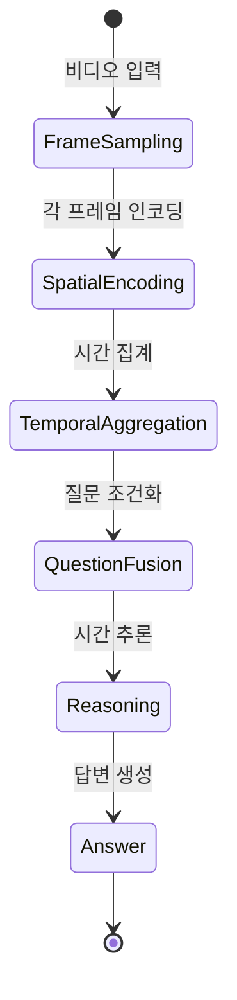

## 개요

비디오 질의응답(Video Question Answering, VideoQA)은 비디오 콘텐츠를 이해한 뒤 자연어 질문에 답변하는 멀티모달 태스크다. 단순 이미지 QA와 달리 **시간 축을 따라 전개되는 사건의 인과관계, 순서, 변화**를 추론해야 한다는 점이 핵심 난제다.

정적 장면 이해를 넘어 "왜 그 행동을 했는가?", "어떤 사건이 먼저 일어났는가?", "마지막에 무엇이 변했는가?" 같은 시간적 추론(temporal reasoning)을 요구한다.

## 태스크 유형

- **개방형(Open-Ended)**: 자유 형식 텍스트 생성. 평가가 어렵지만 가장 현실적
- **다지선다(MC-QA)**: 4-5개 보기 중 선택. 정확도로 직접 비교 가능
- **인과/시간 추론**: "왜", "언제", "그 다음에 무슨 일이" 등 고차원 추론 필요

## 주요 아키텍처

### 비디오 인코더 + LLM 방식

[[vision-language-model-architectures]]의 설계 패턴을 비디오로 확장.

**프레임 샘플링 전략**이 성능에 중요한 영향을 준다:
- **균일 샘플링(Uniform Sampling)**: 고정 간격으로 N개 프레임 추출
- **동적 샘플링**: 질문이나 장면 변화에 따라 중요한 순간을 집중 샘플링

### InternVideo2 계열

[[internvideo2-video-foundation]]는 대규모 사전학습을 통해 다양한 VideoQA 벤치마크에서 강력한 성능을 보인다. 비디오-텍스트 매칭, 비디오 캡셔닝, VideoQA를 통합 학습하는 방식으로 범용 비디오 표현을 획득한다.

### 메모리 기반 장기 비디오 이해

긴 비디오(1시간 이상)에 대한 QA는 모든 프레임을 LLM 컨텍스트에 넣을 수 없어, 관련 구간을 검색(retrieve)하는 메모리/검색 메커니즘이 필요하다.

## 벤치마크 데이터셋

| 데이터셋 | 특징 | 답변 형식 |
|----------|------|-----------|
| MSVD-QA | 짧은 클립, 5가지 질문 유형 | 개방형 |
| MSRVTT-QA | 다양한 도메인 비디오 | 개방형 |
| ActivityNet-QA | 긴 비디오, 인과 추론 | 개방형 |
| NExT-QA | 인과·시간 추론 특화 | 다지선다 |
| EgoSchema | 1인칭 시점, 3분 비디오 | 다지선다 |
| MVBench | 20개 비디오 이해 태스크 | 다지선다 |
| Video-MME | 긴 비디오(최장 1시간) | 다지선다 |

## 평가 지표

### 개방형 QA

- **정확 일치(Exact Match)**: 예측이 정답과 정확히 일치하는 비율
- **WUPS (Wu-Palmer Similarity)**: 단어 의미 유사도 기반 느슨한 일치
- **GPT 기반 평가**: 최근 추세로, GPT-4에게 예측과 정답을 비교하게 해 5점 척도로 평가

### 다지선다 QA

- **Accuracy**: 보기 중 올바른 항목을 선택한 비율

## 핵심 과제

### 1. 장기 시간 의존성 (Long-Range Temporal Dependency)

"처음에 언급된 물체가 마지막 장면에서 어디에 있는가?" 같은 질문은 비디오 전체에 걸친 기억이 필요하다. 수분~수십 분 비디오에서 이 관계를 유지하는 것이 현재 모델의 주요 한계다.

### 2. 계획/인과 추론 (Causal Reasoning)

행동의 원인과 결과를 이해해야 하는 질문. 단순 시각 패턴 매칭이 아닌 상식 추론과의 결합이 필요하다.

### 3. 미세 시간 이해 (Fine-Grained Temporal Understanding)

"몇 번 박수를 쳤는가?", "어느 손으로 먼저 움직였는가?" 같이 세밀한 시간 정보를 묻는 질문은 고해상도 시간 특징이 필요하다.

## 관련 태스크와의 비교

| 태스크 | 입력 | 출력 | 시간 추론 |
|--------|------|------|-----------|
| Image QA | 이미지 + 질문 | 텍스트 | 없음 |
| VideoQA | 비디오 + 질문 | 텍스트 | 핵심 요구 |
| Temporal Action Detection | 비디오 | 시간 구간 + 레이블 | 핵심 요구 |
| Video Captioning | 비디오 | 설명 텍스트 | 간접 요구 |

[[temporal-action-detection]]과의 차이: TAD는 행동 구간의 위치를 찾는 것이고, VideoQA는 임의의 자연어 질문에 답하는 더 넓은 태스크다. 단, "이 행동은 몇 초에 시작하는가?" 같은 질문은 두 태스크가 중첩된다.

## 실무 적용 관점

- **교육 플랫폼**: 강의 비디오에서 "선생님이 예제로 든 것은?" 같은 질문 자동 답변
- **보안 모니터링**: CCTV 영상에 "빨간 옷 입은 사람이 몇 시에 입장했는가?" 질의
- **스포츠 분석**: 경기 영상에서 "3쿼터에 누가 먼저 파울을 범했는가?" 분석
- **콘텐츠 접근성**: 시각 장애인을 위해 비디오 내용에 대한 자연어 질의 지원

## 관련 문서

- [[internvideo2-video-foundation]] - VideoQA에서 강력한 성능을 보이는 비디오 파운데이션 모델
- [[vision-language-model-architectures]] - VideoQA 아키텍처의 기반이 되는 VLM 설계 패턴
- [[temporal-action-detection]] - VideoQA와 상보 관계에 있는 시간 행동 탐지 태스크
- [[spatiotemporal-representation]] - VideoQA 성능의 기반이 되는 시공간 표현 방법론
