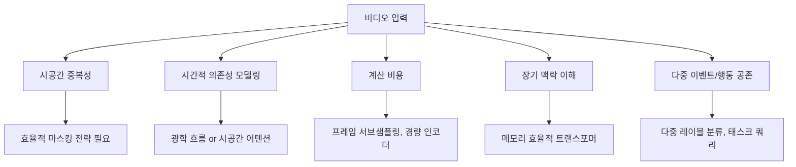
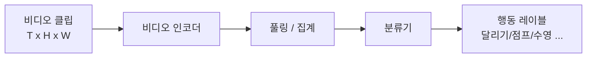
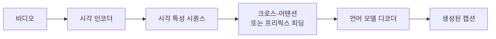
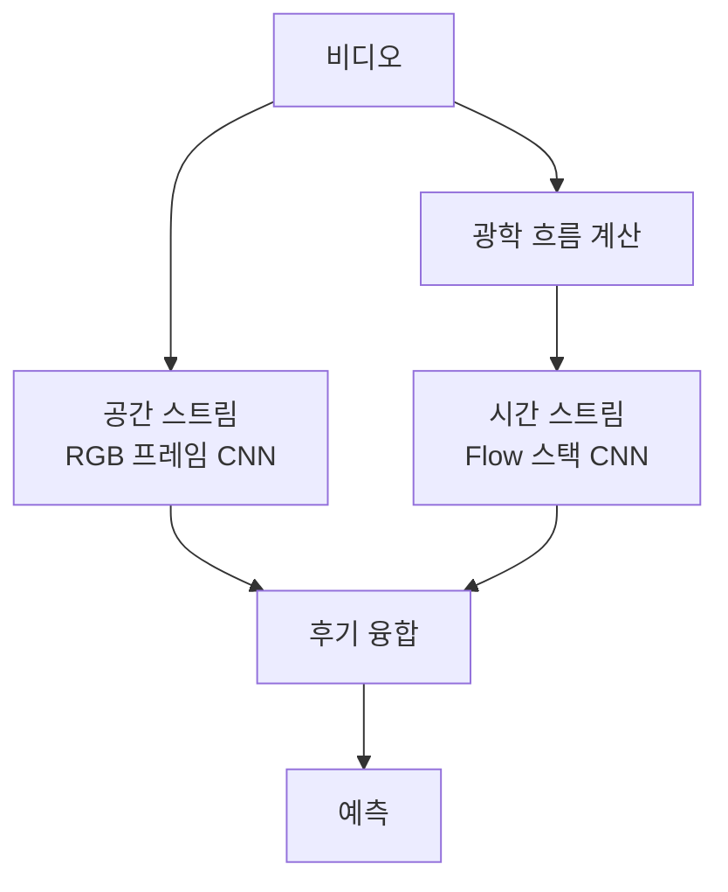
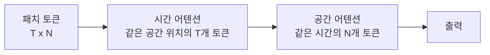
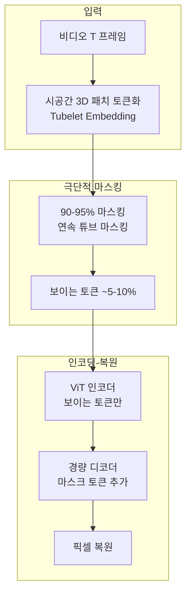
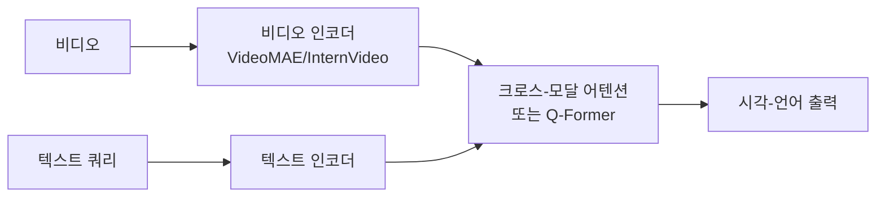

# 비디오 이해 (Video Understanding)

비디오 이해(Video Understanding)는 연속적인 프레임 시퀀스로 구성된 비디오에서 시각적 의미를 추출하고 해석하는 AI 기술 분야다. 정적 이미지 인식을 시간 축으로 확장하며, 행동 인식(action recognition), 시간적 위치 추정(temporal localization), 비디오 캡셔닝 등 다양한 세부 태스크를 포함한다.

## 비디오 이해의 고유한 도전 과제

이미지 이해에서 해결된 많은 문제가 비디오에서 다시 어려워지는 이유는 시간 축이 추가되기 때문이다.



**시공간 중복성**: 비디오의 인접 프레임은 픽셀 수준에서 95% 이상 유사한 경우가 많다. 이 중복성이 VideoMAE에서 90% 마스킹 비율을 가능하게 한다.

**시간적 의존성**: 특정 행동은 수 초의 맥락이 있어야 인식 가능하다 (예: 달리기 vs 앉기). 단순 프레임별 분류로는 불충분하다.

## 주요 태스크 분류

### 행동 인식 (Action Recognition)

비디오 클립에서 어떤 행동이 일어나는지 분류한다.



**주요 벤치마크:**
- Kinetics-400/600/700: YouTube 클립 기반, 400-700개 행동 클래스
- Something-Something v2: 세밀한 물체 조작 이해 요구
- UCF-101, HMDB-51: 초기 표준 벤치마크

### 시간적 행동 위치 추정 (Temporal Action Localization)

긴 비디오에서 행동이 발생하는 시간 구간(시작~끝)을 검출한다. 공간적 객체 검출의 시간 축 버전이다.

**방법론:**
- Anchor 기반: 고정된 시간 구간 후보 생성 후 분류
- Anchor-free: 시작/끝 시점을 직접 회귀

### 비디오 캡셔닝 (Video Captioning)

비디오 내용을 자연어로 설명하는 태스크.



**세부 태스크:**
- Dense Video Captioning: 여러 이벤트를 타임스탬프와 함께 설명
- Video QA: 비디오에 대한 자연어 질의응답
- Video-Text Retrieval: 비디오-텍스트 양방향 검색

### 비디오 분할 (Video Segmentation)

- **의미 분할**: 각 픽셀의 카테고리 레이블 (시간에 걸쳐 일관된 레이블 필요)
- **인스턴스 추적 분할**: 특정 객체를 시간에 걸쳐 추적하며 분할

## 아키텍처 발전 계보

### 초기: 2-stream Networks



Simonyan & Zisserman (2014)의 Two-Stream Network. RGB 프레임의 외관과 광학 흐름(optical flow)의 움직임을 별도 스트림으로 처리 후 융합.

**한계**: 광학 흐름 계산 비용이 크고, 두 스트림의 유기적 상호작용이 부족.

### 3D CNN 시대

2D 합성곱을 시간 축으로 확장한 3D CNN:

$$h_{t,i,j} = \sum_{\tau}\sum_{m}\sum_{n} w_{\tau,m,n} \cdot x_{t+\tau, i+m, j+n}$$

**C3D (Tran et al. 2014)**: 모든 레이어에 3x3x3 필터 적용  
**I3D (Carreira & Zisserman 2017)**: ImageNet 사전학습 2D InceptionNet의 가중치를 "인플레이션(inflation)"으로 3D로 변환. 데이터 효율적  
**SlowFast (Feichtenhofer et al. 2019)**: 느린 경로(고해상도 저프레임)와 빠른 경로(저해상도 고프레임)의 이중 스트림

### Transformer 시대

[[Transformer 아키텍처 (Transformer Architecture)]]의 어텐션 메커니즘이 장거리 시간 의존성 모델링에 적합하다.

**TimeSformer (Bertasius et al. 2021)**:
- 분리된 시공간 어텐션(divided space-time attention)
- 시간 어텐션과 공간 어텐션을 교대로 적용



**Video Swin Transformer**: Swin Transformer를 비디오로 확장. 3D 윈도우 어텐션으로 계산 효율화.

## VideoMAE: 자기지도 비디오 사전학습

VideoMAE (Tong et al. 2022)는 [[masked-image-modeling|마스킹 이미지 모델링 (Masked Image Modeling)]]의 MAE를 비디오로 확장한다.



### 튜브 마스킹 (Tube Masking)

단순 랜덤 마스킹 대신 **시간 방향으로 동일한 공간 위치를 일관되게 마스킹**한다:

$$\text{mask}(t, i, j) = \text{mask}(t', i, j) \quad \forall t, t'$$

이유: 이미지보다 훨씬 높은 시공간 중복성 때문에 랜덤 마스킹으로는 인접 프레임에서 쉽게 복원이 가능. 튜브 마스킹은 시간 정보를 완전히 차단해 진정한 시공간 이해를 요구.

### 90% 마스킹이 가능한 이유

비디오의 시공간 중복성:
- 공간적: 인접 픽셀 유사 (이미지와 동일)
- 시간적: 인접 프레임 유사 (비디오 특유)
- 두 가지 중복성이 결합되어 이미지(75%)보다 훨씬 높은 마스킹 비율 허용

### VideoMAE v2

더 큰 데이터셋(UnlabeledHybrid: 웹 비디오 + 큐레이션 비디오)으로 학습하고 ViT-g까지 스케일업. Kinetics-400에서 90.0% Top-1 달성.

## 주요 모델과 벤치마크 비교

| 모델 | 방법 | K-400 Top-1 | 파라미터 | 사전학습 데이터 |
|------|------|-------------|---------|----------------|
| I3D | 지도 (ImageNet 인플레이션) | 72.1% | 25M | ImageNet |
| SlowFast | 지도 | 79.8% | 60M | ImageNet |
| TimeSformer | 지도 | 80.7% | 121M | ImageNet |
| Video Swin-B | 지도 | 82.7% | 88M | ImageNet-22K |
| VideoMAE ViT-H | 자기지도 | 87.4% | 632M | Kinetics-400 |
| VideoMAE v2 ViT-g | 자기지도 | 90.0% | 1B | UnlabeledHybrid |

## 멀티모달 비디오 이해

비디오 이해의 발전 방향은 [[멀티모달 LLM (Multimodal LLM)]]과의 통합이다.

### 비디오-언어 정렬



**대표 모델들:**
- CLIP4Clip: CLIP을 비디오 검색에 적용
- InternVideo: 대규모 비디오-언어 사전학습
- Video-LLaMA, Video-ChatGPT: LLM과 비디오 인코더 결합
- Gemini 1.5 Pro: 긴 비디오 이해 (1시간+ 비디오에서 특정 순간 검색)

### 자동 비디오 캡셔닝 파이프라인

```mermaid
flowchart TD
    V[원본 비디오] --> S[프레임 샘플링<br/>1 fps 또는 키프레임]
    S --> VE[시각 인코더<br/>CLIP / VideoMAE]
    VE --> VT[시각 토큰 시퀀스]
    VT --> P[[[Perceiver Resampler]]<br/>또는 Q-Former]
    P --> LM[LLM 디코더<br/>GPT / LLaMA]
    LM --> C[비디오 캡션]
```

## [[AI 비디오 생성 (AI Video Generation)]]과의 구분

비디오 이해(Video Understanding)와 AI 비디오 생성(Video Generation)은 역방향 문제다:

| 비디오 이해 | AI 비디오 생성 |
|-------------|----------------|
| 비디오 -> 의미/텍스트 | 텍스트/이미지 -> 비디오 |
| 판별 모델 (discriminative) | 생성 모델 (generative) |
| 인식/분류/검색 | Sora, Wan, CogVideoX 등 |

일부 모델(예: VideoMAE로 사전학습 후 생성 모델 피인튜닝)은 두 방향을 모두 활용한다.

## 데이터셋

**행동 인식:**
- Kinetics-400/600/700: DeepMind, YouTube 클립
- Moments in Time v2: MIT, 100만 3초 클립
- ActivityNet: 200개 행동, 849시간

**비디오 QA / 캡셔닝:**
- MSVD, MSRVTT: 짧은 클립 캡셔닝
- ActivityNet Captions: Dense captioning
- NExT-QA: 인과적/시간적 추론 요구

**장기 비디오 이해:**
- EgoSchema: 3분 자아 중심 비디오, 5지선다
- COIN: 절차적 행동 이해

## 실무 관점

### 태스크별 아키텍처 선택

- **단일 클립 분류**: VideoMAE 파인튜닝 (최고 성능)
- **스트리밍 추론**: 경량 MobileNet 기반 3D CNN
- **비디오 캡셔닝**: Video-LLaMA 또는 Vid2Seq 스타일
- **긴 비디오 이해**: 계층적 집계 또는 스파스 어텐션

### 계산 비용 관리

1. **프레임 서브샘플링**: 8-16프레임/클립이 일반적
2. **해상도 축소**: 224x224 표준, 장면 이해는 더 낮아도 됨
3. **분산 추론**: 긴 비디오를 윈도우로 분할 후 집계

## 관련 문서

- [[videomae-paper]] -- VideoMAE 원 논문 (Tong et al. 2022)
- [[ai-video-generation]] -- AI 비디오 생성 (Sora, CogVideoX 등)
- [[multimodal-llm]] -- 멀티모달 LLM, 비디오-언어 정렬
- [[masked-image-modeling|마스킹 이미지 모델링 (Masked Image Modeling)]] -- VideoMAE의 기반 기법
- [[self-supervised-learning|자기지도 학습 (Self-Supervised Learning)]] -- VideoMAE의 사전학습 패러다임
