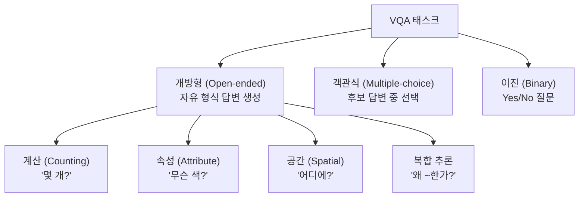
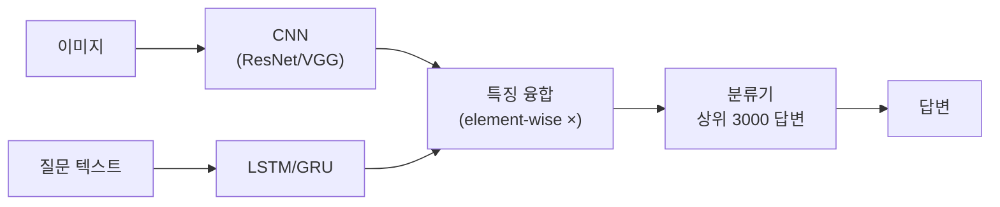
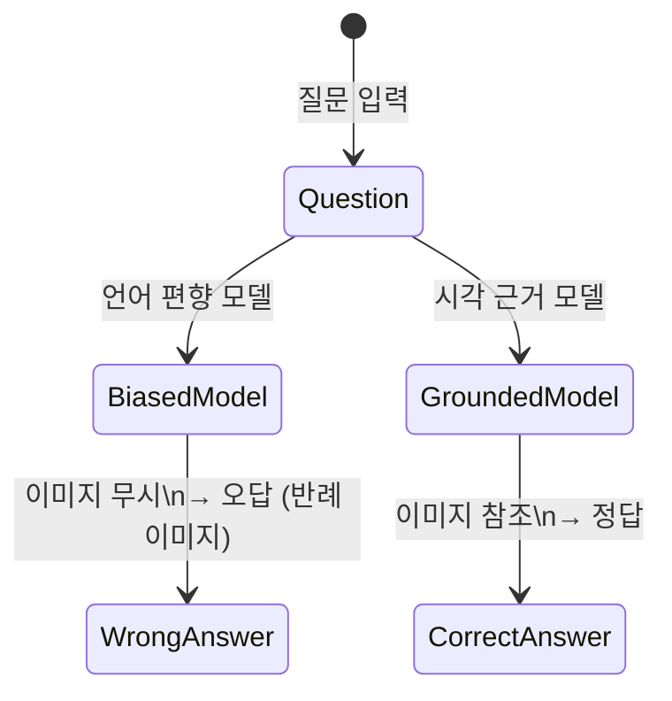

# VQA (Visual Question Answering)

## 개요

VQA(Visual Question Answering)는 이미지와 자연어 질문을 함께 입력받아 자연어 답변을 생성하는 멀티모달 태스크다. "이 이미지에서 빨간 물체가 몇 개인가?", "사진 속 사람의 감정은?" 같은 질문에 이미지를 보고 답해야 한다.

단순한 이미지 캡셔닝보다 높은 수준의 추론이 필요하다: 이미지 이해, 질문 파싱, 시각-언어 정렬(alignment), 그리고 경우에 따라 상식 추론까지 요구된다. [[vision-language-model-architectures]]의 핵심 평가 태스크이며, [[clip]] 계열 모델의 성능을 측정하는 중요한 벤치마크다.

## VQA의 유형 분류

VQA v2 데이터셋 기준으로 Yes/No(38%), 숫자(12%), 기타 개방형(50%)으로 구성된다.

## 아키텍처 진화

### 1세대: 간단한 특징 융합 (2015-2018)

VQA v1 시대의 기본 접근법이다. 이미지 특징(CNN)과 질문 특징(RNN/LSTM)을 element-wise 곱 또는 concatenation으로 융합한다.

$$f_{fused} = f_{image} \odot f_{question}$$

이후 분류기(FC layer)로 후보 답변 중 하나를 선택한다.

### 2세대: 어텐션 기반 융합 (2018-2021)

Bottom-Up & Top-Down Attention을 VQA에 적용한다. Faster R-CNN으로 추출한 객체 특징들에 질문 특징을 쿼리로 어텐션을 적용해 질문과 관련된 시각 영역에 집중한다.

$$\alpha_i = \text{softmax}(f_{att}(v_i, q))$$
$$\hat{v} = \sum_i \alpha_i v_i$$

질문 "빨간 모자를 쓴 사람은 어디에 있나요?"에 대해 빨간 모자 영역에 높은 어텐션이 할당된다.

### 3세대: 대규모 사전학습 모델 (2021-현재)

[[clip]], ALIGN, BLIP 등 대규모 이미지-텍스트 사전학습 모델을 파인튜닝하거나 프롬프팅으로 VQA를 수행한다. 특히 LLaVA, GPT-4V, Claude 3 Vision 등 멀티모달 LLM은 별도 훈련 없이 프롬프팅만으로 강력한 VQA 성능을 보인다.

## 주요 데이터셋

| 데이터셋 | 규모 | 특징 |
|----------|------|------|
| VQA v1 (2015) | 26만 질문 | 언어 편향 문제 존재 |
| VQA v2 (2017) | 110만 질문 | 보완적 쌍으로 편향 감소 |
| GQA (2019) | 113만 질문 | 장면 그래프 기반, 합성적 |
| TextVQA (2019) | 45만 질문 | 이미지 속 텍스트 읽기 필요 |
| OK-VQA (2019) | 14만 질문 | 외부 지식 필요 |
| VQA-X (2018) | - | 설명 가능한 VQA |

VQA v2가 현재 표준 벤치마크다.

## 언어 편향 문제

VQA v1의 심각한 문제: 모델이 이미지를 보지 않고 질문만으로도 높은 정확도를 달성한다.

- "테니스 라켓을 들고 있나요?" → 항상 "Yes" 답변하면 80% 정확도
- "바나나는 무슨 색인가요?" → 항상 "노란색" 답변하면 80% 정확도

VQA v2는 동일한 질문에 대해 다른 답변이 나오는 이미지 쌍을 구성해 편향을 줄였다.

## 평가 지표

**VQA Accuracy**: 인간 주석자 10명 중 몇 명이 동일한 답변을 했는지 기반

$$\text{Acc}(ans) = \min\left(\frac{\text{해당 답변을 쓴 주석자 수}}{3}, 1\right)$$

3명 이상의 주석자가 동의하면 만점(1.0)이다. 주관적 답변의 다양성을 고려한 설계다.

## 실무 적용 관점

**왜 중요한가**: VQA는 멀티모달 AI가 단순히 이미지를 설명하는 것을 넘어, 시각 정보를 바탕으로 추론하는 능력을 측정한다. 이는 의료 진단, 로봇 내비게이션, 교육용 AI 튜터 등 고차원 응용의 핵심 역량이다.

**실무에서 어떻게 쓰이나**:
- 의료 영상 질의응답: "이 X-ray에서 폐결절이 보이나요?"
- 접근성: 시각 장애인이 카메라로 찍어 질문
- 문서 이해: 차트·그래프·표에 대한 자연어 질의
- 제조업 품질 검사: "이 부품에 균열이 있나요?"

## 관련 문서

- [[vision-language-model-architectures]] - 멀티모달 모델 아키텍처 패턴
- [[clip]] - 이미지-텍스트 대조 학습 기반 모델
- [[image-captioning-architecture]] - 이미지 설명 생성 관련 태스크
- [[multimodal-benchmark]] - VQA를 포함한 멀티모달 평가 체계
