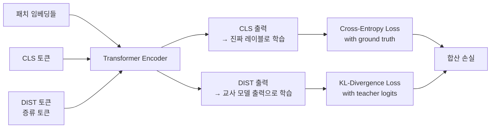
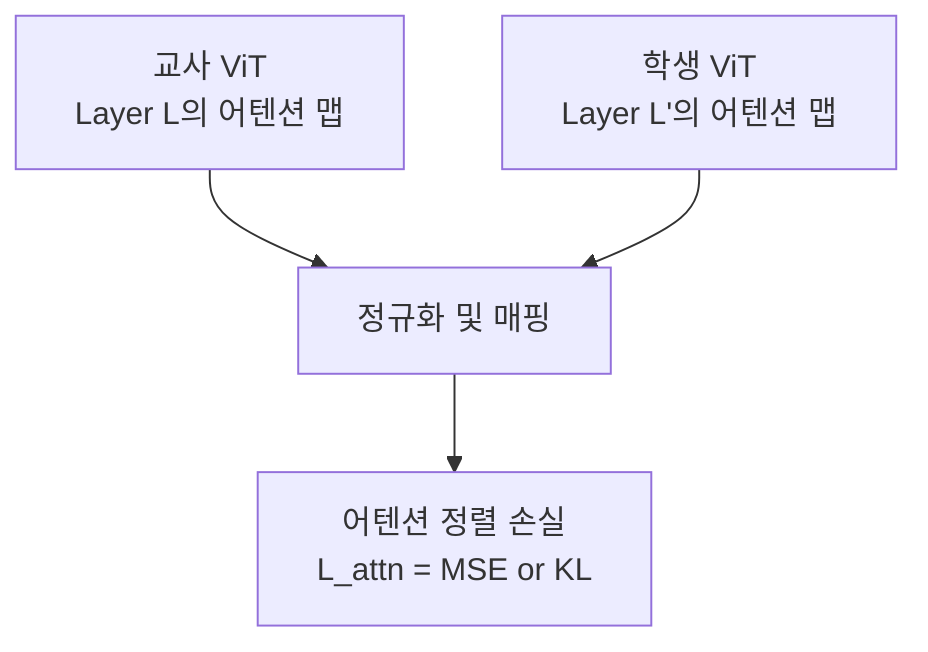
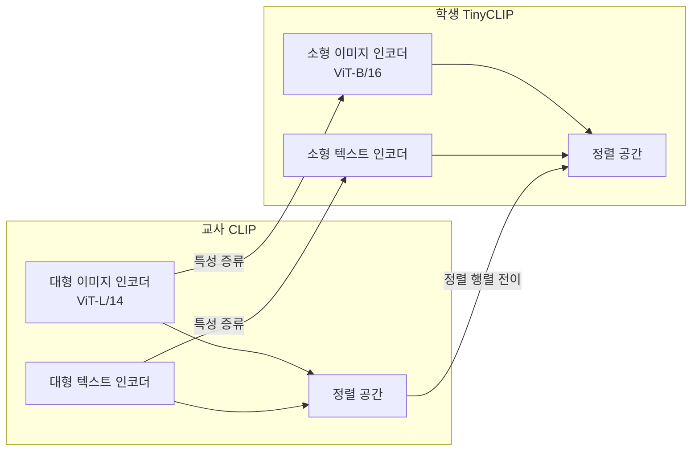

# ViT 지식 증류 기법

## 개요

지식 증류(Knowledge Distillation)는 크고 강력한 교사 모델(teacher)의 지식을 작고 효율적인 학생 모델(student)로 전달하는 학습 패러다임이다. ViT([[vision-transformer]]) 계열에서는 [[deit-data-efficient-image-transformer]](Data-efficient Image Transformer)가 이 기법을 ViT에 적극 도입하여 소규모 데이터에서도 강력한 성능을 달성할 수 있게 했다.

[[knowledge-distillation-theory]]의 일반 원리를 ViT의 구조적 특성에 맞게 적용한 다양한 방법들을 다룬다.

## DeiT의 증류 토큰 (Distillation Token)

### 핵심 아이디어

DeiT는 표준 ViT의 [CLS] 토큰 외에 **[DIST] 토큰(Distillation Token)** 을 추가한다. 이 토큰은 학습 중에 교사 모델의 출력과 정렬되도록 학습된다.

**두 종류의 교사:**
1. **CNN 교사 (e.g., RegNet, EfficientNet)**: 소프트 레이블(soft labels, 확률 분포) 전달. 귀납적 편향(inductive bias)이 다른 교사로부터 새로운 관점 흡수
2. **Transformer 교사 (e.g., 대형 ViT)**: 동종 구조 간 증류. 구조적 특성이 더 잘 전이됨

### 하드 레이블 증류 vs. 소프트 레이블 증류

| 방식 | 교사 출력 | 손실 함수 | 특징 |
|------|---------|----------|------|
| 하드 레이블 | argmax(logits) = 클래스 인덱스 | Cross-Entropy | 구현 단순, 정보 손실 |
| 소프트 레이블 | 전체 확률 분포 | KL-Divergence | 교사의 불확실성 전달, 일반화 우수 |

DeiT 논문에서는 **하드 레이블 증류**가 오히려 소프트 레이블보다 높은 성능을 보였는데, 이는 증류 토큰이 교사 모델의 결정 경계를 효과적으로 학습하기 때문으로 분석된다.

## 중간 레이어 증류 (Feature Distillation)

로짓(logits) 레벨뿐 아니라 중간 레이어의 특성(feature)을 정렬하는 방식이다.

### 어텐션 맵 증류

DeiT III 등에서 활용. 교사가 "어디를 주목하는지"를 학생이 모방하도록 강제한다.

### CKA (Centered Kernel Alignment) 기반 증류

레이어 간 표현 유사도를 CKA 점수로 측정하고 최대화한다. 레이어 크기가 달라도 적용 가능하여 구조가 다른 교사-학생 쌍에 유연하게 적용된다.

## TinyCLIP - 멀티모달 경량 증류

TinyCLIP은 CLIP 계열 모델에 지식 증류를 적용한 대표 사례다. 이미지 인코더와 텍스트 인코더를 동시에 경량화하면서 두 인코더 간의 정렬(alignment)도 보존해야 하는 복합 과제를 다룬다.

**핵심 기여 - 친화성 마이그레이션 (Affinity Migration):**
교사 모델의 이미지-텍스트 유사도 행렬(affinity matrix)을 학생 모델이 재현하도록 학습한다. 이를 통해 단순 특성 복사가 아닌, 두 모달리티 간 관계 구조 자체를 전이한다.

## ViT 특화 증류 기법 비교

| 기법 | 증류 대상 | 장점 | 단점 |
|------|---------|------|------|
| DeiT 증류 토큰 | 최종 로짓 | 단순, 효과적 | 중간 표현 미활용 |
| PKD (Patient KD) | 복수 레이어 특성 | 풍부한 정보 전달 | 레이어 매핑 필요 |
| MINILM | 어텐션 행렬 | 어텐션 패턴 전이 | 헤드 수 맞춰야 함 |
| TinyCLIP 친화성 | 쌍 유사도 행렬 | 멀티모달 정렬 보존 | 멀티모달 전용 |
| DeiT III | 로짓 + 어텐션 | 균형 잡힌 전이 | 복잡한 학습 설정 |

## 증류 학습 시 실용 팁

- **교사-학생 성능 격차**: 교사가 너무 크면 학생이 따라가기 어려움. 교사를 단계적으로 줄이는 "증류 체인" 구성 고려
- **온도(Temperature) 파라미터**: 소프트 레이블 증류 시 온도 $T$를 3~10 범위로 높이면 분포가 완만해져 학습이 더 풍부함. 추론 시에는 $T=1$ 사용
- **데이터 증강**: DeiT는 강한 데이터 증강(Mixup, CutMix, RandAugment)을 사용. 교사가 정규화 역할도 하므로 증강과 증류가 시너지
- **배치 크기**: 소프트 레이블 증류는 배치 크기에 비교적 둔감. 더 큰 배치로 학습 가속 가능

## 한계와 연구 방향

- 교사 모델 추론 비용: 학습 중 매 배치마다 교사 모델을 실행해야 하므로 학습 비용 증가. 교사 로짓을 오프라인으로 미리 캐싱하는 "Offline Distillation"으로 해결 가능
- 멀티모달 증류의 복잡성: TinyCLIP처럼 두 모달리티 정렬을 동시에 유지하는 증류는 하이퍼파라미터 튜닝이 민감

## 관련 문서

- [[deit-data-efficient-image-transformer]] - 증류 토큰을 도입한 원조 DeiT 논문 요약
- [[knowledge-distillation-theory]] - 지식 증류의 일반 이론적 배경
- [[vision-transformer]] - 증류 대상 학생 모델의 기반 아키텍처
- [[efficientformer-v2]] - 증류와 함께 활용 가능한 경량 ViT 구조
- [[vit-patch-embedding]] - 경량 학생 ViT 설계 시 고려할 패치 임베딩 선택
