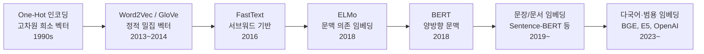
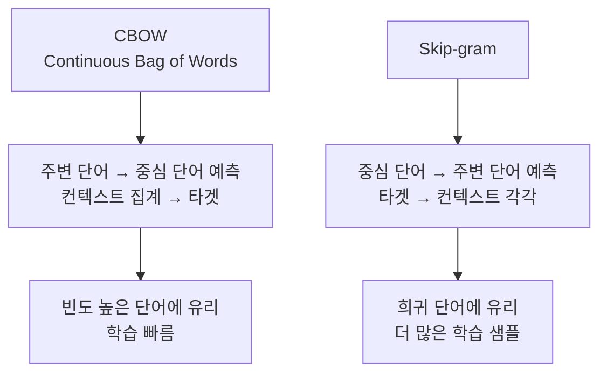
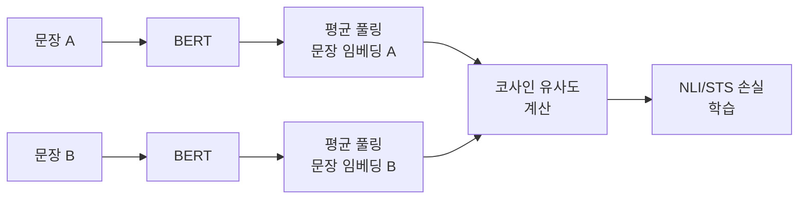
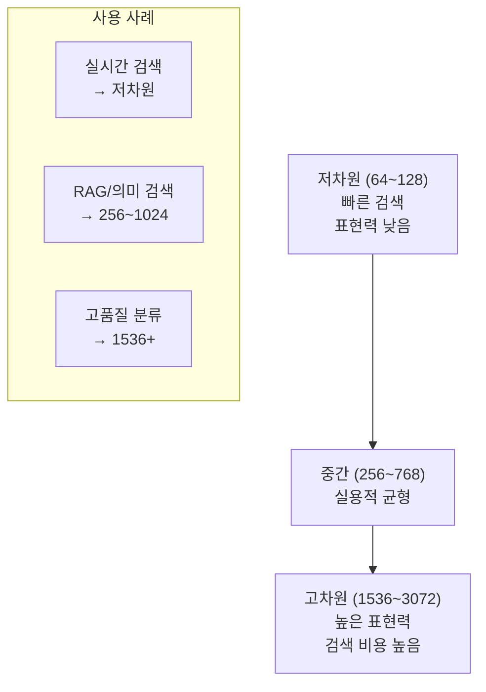
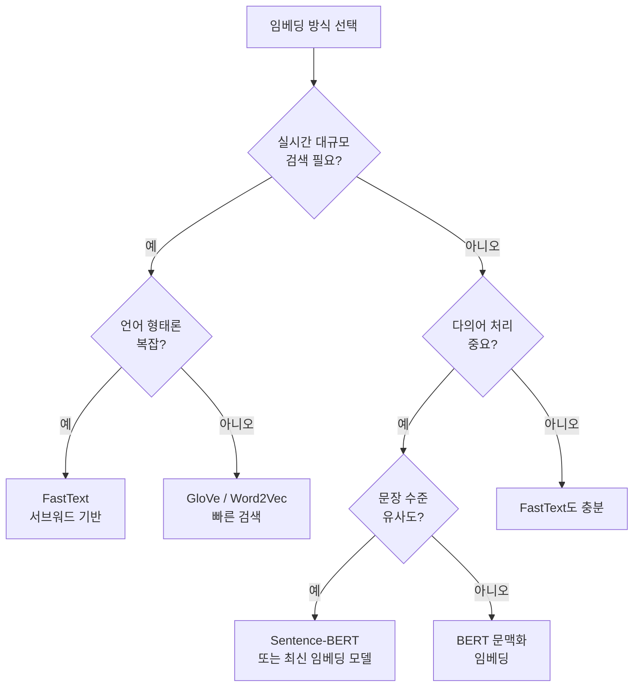
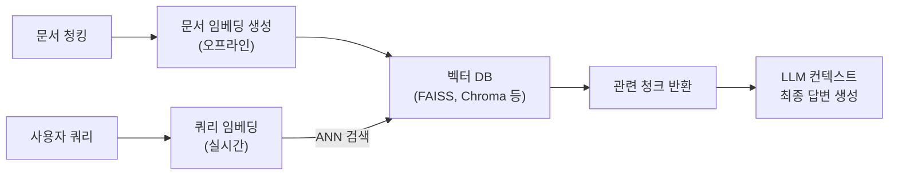

# 단어 임베딩 (Word Embeddings)

단어 임베딩(word embeddings)은 단어(또는 더 큰 텍스트 단위)를 연속적인 밀집 벡터(dense vector)로 표현하는 기술이다. one-hot 인코딩의 한계를 극복하고 의미적 유사성을 벡터 공간의 거리로 표현할 수 있게 해준다. 현대 NLP 파이프라인에서 가장 근본적인 표현 기법이다.

## 임베딩 기술 진화



각 단계는 표현력과 맥락 이해 수준을 높이는 방향으로 발전해왔다.

---

## 1단계: One-Hot 인코딩의 한계

어휘 크기 $V$의 사전이 있을 때, 단어 $w_i$를 $i$번째 위치만 1인 $V$차원 벡터로 표현한다.

$$\text{one-hot}(\text{"왕"}) = [0, 0, ..., 1, ..., 0] \in \{0, 1\}^V$$

**문제점**:
- **차원의 저주**: 어휘 100K 기준 100K차원 희소 벡터
- **의미 없는 거리**: 모든 단어 쌍의 코사인 유사도가 0 (직교)
- **유사어 관계 없음**: "왕"과 "여왕"이 "왕"과 "자동차"만큼 다름

---

## 2단계: Word2Vec - 분포 가설 기반 정적 임베딩

Mikolov et al. (2013)이 제안한 [[word2vec-original-paper]] 논문. 핵심 아이디어는 **분포 가설(distributional hypothesis)**: "같은 맥락에 나타나는 단어는 비슷한 의미를 가진다."

### 두 가지 학습 목표



**Skip-gram 목표 함수**:

$$\mathcal{L} = -\frac{1}{T} \sum_{t=1}^T \sum_{-c \leq j \leq c, j \neq 0} \log P(w_{t+j} | w_t)$$

**유명한 특성 - 벡터 연산으로 유추**:

$$\text{vec}(\text{"왕"}) - \text{vec}(\text{"남성"}) + \text{vec}(\text{"여성"}) \approx \text{vec}(\text{"여왕"})$$

### GloVe (Global Vectors)

Pennington et al. (2014). 전체 말뭉치의 전역 공기(co-occurrence) 통계를 직접 분해한다. Word2Vec의 국소 윈도우 방식과 달리 행렬 분해(matrix factorization) 기반.

$$J = \sum_{i,j=1}^V f(X_{ij})(w_i^\top \tilde{w}_j + b_i + \tilde{b}_j - \log X_{ij})^2$$

$X_{ij}$: 단어 $i$와 $j$가 같은 윈도우에 등장한 횟수.

| 항목 | Word2Vec | GloVe |
|------|---------|-------|
| 학습 방식 | 국소 윈도우, SGD | 전역 통계, 가중 최소제곱 |
| 추론 가능성 | 낮음 (뉴럴 블랙박스) | 더 해석 가능 |
| 성능 | 유추 태스크 강함 | 유추+유사도 균형 |

---

## 3단계: FastText - 서브워드 임베딩

Facebook이 개발. 단어를 서브워드(subword) n-gram의 합으로 표현한다.

"where" → `<wh`, `whe`, `her`, `ere`, `re>`, `<where>` (각 3-gram + 전체 단어)

$$\text{vec}(w) = \sum_{g \in \mathcal{G}(w)} \mathbf{z}_g$$

**장점**:
- **OOV(Out-of-Vocabulary) 처리**: 사전에 없는 단어도 서브워드로 표현 가능
- **형태론 반영**: 한국어/독일어 등 형태론적으로 풍부한 언어에 효과적
- **오타 강건성**: "wrold"가 "world"와 공유하는 n-gram 덕분에 유사 임베딩

---

## 4단계: 문맥화 임베딩 (Contextualized Embeddings)

정적 임베딩의 근본 한계: 단어 하나에 하나의 벡터. "bank"(은행 vs 강둑)처럼 다의어(polysemy)를 표현할 수 없다.

### ELMo (Embeddings from Language Models)

Peters et al. (2018). 양방향 LSTM 언어 모델의 **모든 레이어 출력을 가중 합산**해 문맥화 임베딩 생성.

$$\text{ELMo}(w_t) = \gamma \sum_{j=0}^{L} s_j \mathbf{h}_{t,j}^{LM}$$

- 태스크마다 레이어 가중치 $s_j$를 학습
- 사전학습 언어 모델 + 태스크별 파인튜닝 패러다임의 전신

### BERT와 이후 Transformer 임베딩

Devlin et al. (2018). 양방향 Transformer로 더 풍부한 문맥화 임베딩. 각 토큰의 임베딩이 전체 문장 맥락을 반영한다.

- 마스크드 언어 모델(MLM) 사전학습
- 분류, QA, NER 등 다양한 태스크에 파인튜닝
- **주의**: BERT [CLS] 토큰 임베딩이 좋은 문장 임베딩이 되지는 않음

---

## 5단계: 문장·문서 임베딩

단어 임베딩에서 더 나아가 전체 문장이나 문서를 단일 벡터로 표현하는 방법들이 발전했다.

### Sentence-BERT (SBERT)

[[sentence-transformer]] 참조. BERT 위에 시암(Siamese) 네트워크 구조를 추가해 문장 유사도 학습에 최적화.



BERT 직접 평균보다 의미론적 유사도에서 훨씬 높은 성능.

### 풀링 전략

문맥화 임베딩에서 문장 임베딩을 추출하는 주요 방법:

| 전략 | 방법 | 특성 |
|------|------|------|
| [CLS] 토큰 | BERT의 첫 토큰 | 분류 태스크용, 유사도에는 부적합 |
| 평균 풀링(Mean) | 모든 토큰 평균 | 가장 일반적, 균형 잡힌 표현 |
| 최대 풀링(Max) | 차원별 최댓값 | 두드러진 특징 강조 |
| 가중 평균 | IDF 등 가중치 적용 | 중요 단어 강조 |
| 마지막 레이어 앞뒤 평균 | 상위 2~4개 레이어 평균 | 실용적 개선 |

[[token-pooling-strategies]] 에서 더 상세히 다룬다.

### 최신 임베딩 모델

| 모델 | 제공사 | 특징 |
|------|--------|------|
| text-embedding-3-large | OpenAI | 3072차원, 상업 서비스 |
| [[bge-m3-embedding]] | BAAI | 다국어, 100+ 언어, 8K 길이 |
| E5 시리즈 | Microsoft | instruction-tuned |
| GTE | Alibaba DAMO | 균형 잡힌 성능 |
| NV-Embed | NVIDIA | 복잡한 검색 태스크 |
| Cohere Embed v3 | Cohere | 다국어, 검색 특화 |

---

## 임베딩 차원 수

차원 수가 클수록 표현력이 높지만 계산 비용이 증가한다.



**Matryoshka 표현 학습(MRL)**: 하나의 임베딩 모델로 여러 차원을 지원. 필요에 따라 앞부분 N차원만 잘라서 사용 가능. OpenAI text-embedding-3 모델이 이 기법을 채택.

---

## 임베딩 평가 벤치마크

### MTEB (Massive Text Embedding Benchmark)

56개 데이터셋, 8가지 태스크로 임베딩 모델 종합 평가.

| 태스크 | 예시 | 측정 |
|--------|------|------|
| 의미 텍스트 유사도(STS) | STS-Benchmark | 스피어만 상관 |
| 검색(Retrieval) | MSMARCO, NQ | nDCG@10 |
| 분류(Classification) | AmazonReview | 정확도 |
| 클러스터링(Clustering) | ArXiv | V-measure |
| 재순위(Reranking) | AskUbuntu | MAP |
| 쌍 분류(PairClassification) | QQP | AP |

### 한국어 임베딩 평가

KLUE-STS, KorNLI 등 한국어 전용 벤치마크가 있지만, 영어 대비 커버리지가 좁다. [[bge-m3-embedding]]은 한국어 포함 100+ 언어를 지원하며 다국어 벤치마크에서 강세를 보인다.

---

## 실무 코드 예시

### Word2Vec 학습

```python
from gensim.models import Word2Vec
from pathlib import Path

def train_word2vec(sentences: list[list[str]], save_path: Path) -> Word2Vec:
    """
    Word2Vec 모델 학습.

    Args:
        sentences: 토큰화된 문장 리스트
        save_path: 모델 저장 경로
    Returns:
        학습된 Word2Vec 모델
    """
    model = Word2Vec(
        sentences=sentences,
        vector_size=300,     # 임베딩 차원
        window=5,            # 컨텍스트 윈도우 크기
        min_count=5,         # 최소 등장 횟수
        workers=4,           # 병렬 처리
        sg=1,                # 0=CBOW, 1=Skip-gram
        epochs=10,
        negative=10,         # 네거티브 샘플링
    )
    model.save(str(save_path))
    return model

# 사용 예시
model = train_word2vec(sentences=[["왕", "남성", "여왕", ...]], save_path=Path("word2vec.model"))

# 유사 단어 검색
similar = model.wv.most_similar("왕", topn=5)

# 유추 테스트
result = model.wv.most_similar(
    positive=["여왕", "남성"],
    negative=["왕"],
)
```

### Sentence Transformer로 문장 임베딩

```python
from sentence_transformers import SentenceTransformer
import numpy as np

def build_embedding_index(sentences: list[str], model_name: str = "BAAI/bge-m3") -> tuple:
    """
    문장 임베딩 인덱스 구축.

    Args:
        sentences: 임베딩할 문장 목록
        model_name: 사용할 모델
    Returns:
        (임베딩 행렬, 모델)
    """
    model = SentenceTransformer(model_name)
    embeddings = model.encode(
        sentences,
        batch_size=64,
        show_progress_bar=True,
        normalize_embeddings=True,  # 코사인 유사도용 정규화
    )
    return embeddings, model

def semantic_search(
    query: str,
    embeddings: np.ndarray,
    sentences: list[str],
    model: SentenceTransformer,
    top_k: int = 5,
) -> list[tuple[str, float]]:
    """
    의미 검색.

    Returns:
        [(문장, 코사인유사도)] 상위 top_k개
    """
    query_emb = model.encode([query], normalize_embeddings=True)
    # 코사인 유사도 = 정규화된 벡터의 내적
    scores = (embeddings @ query_emb.T).flatten()
    top_indices = scores.argsort()[::-1][:top_k]
    return [(sentences[i], float(scores[i])) for i in top_indices]
```

### 임베딩 시각화 (t-SNE)

```python
import numpy as np
from sklearn.manifold import TSNE
import matplotlib.pyplot as plt

def visualize_embeddings(
    embeddings: np.ndarray,
    labels: list[str],
    title: str = "단어 임베딩 시각화",
) -> None:
    """
    t-SNE로 고차원 임베딩을 2D로 시각화.

    Args:
        embeddings: (n, d) 임베딩 행렬
        labels: 각 임베딩의 레이블
    """
    # 2D로 차원 축소
    tsne = TSNE(n_components=2, random_state=42, perplexity=min(30, len(labels)-1))
    reduced = tsne.fit_transform(embeddings)

    plt.figure(figsize=(12, 8))
    plt.scatter(reduced[:, 0], reduced[:, 1], alpha=0.6)

    for idx, label in enumerate(labels):
        plt.annotate(
            label,
            xy=(reduced[idx, 0], reduced[idx, 1]),
            fontsize=9,
        )

    plt.title(title)
    plt.tight_layout()
    plt.savefig("embeddings_tsne.png", dpi=150)
```

---

## 정적 vs 문맥화 임베딩 선택 기준



| 시나리오 | 추천 방식 |
|---------|---------|
| 벡터 DB 검색 / RAG | Sentence-BERT, BGE, E5 |
| 대규모 키워드 분류 | FastText |
| 형태론 풍부 언어 (한국어) | FastText 또는 다국어 SBERT |
| 실시간 추천 | Word2Vec + ANN 인덱스 |
| 제로샷 분류 | 최신 대형 임베딩 모델 |

---

## 임베딩과 RAG 파이프라인

현대 RAG 시스템에서 임베딩은 핵심 컴포넌트다.



임베딩 모델 선택이 RAG 전체 품질에 직접 영향을 준다. 특히 도메인 특화 데이터는 파인튜닝이 효과적이다.

---

## 왜 중요한가

단어 임베딩은 "언어를 수치로 표현한다"는 근본 문제를 해결한 기술이다. Word2Vec의 등장은 NLP를 신경망 기반 딥러닝으로 전환시킨 핵심 계기 중 하나였다. 오늘날 ChatGPT, Claude 같은 대형 언어 모델도 내부적으로 임베딩 레이어에서 입력을 벡터로 변환하고, 출력도 벡터에서 단어로 복원하는 구조를 따른다.

RAG, 의미 검색, 추천 시스템 등 실용적 AI 애플리케이션 대부분이 임베딩 위에서 동작한다. 어떤 임베딩 모델을 선택하고, 어떤 풀링 전략을 쓰고, 어떻게 파인튜닝할지가 시스템 성능을 좌우한다.

---

## 관련 문서

- [[word2vec-original-paper]] - Word2Vec 원논문 요약
- [[sentence-transformer]] - Sentence-BERT 상세
- [[bge-m3-embedding]] - BGE-M3 다국어 임베딩
- [[token-pooling-strategies]] - 풀링 전략 상세
- [[advanced-rag-patterns]] - RAG에서 임베딩 활용
- [[attention-mechanism-overview]] - Transformer 임베딩 구조
- [[semantic-search]] - 의미 검색 구현
