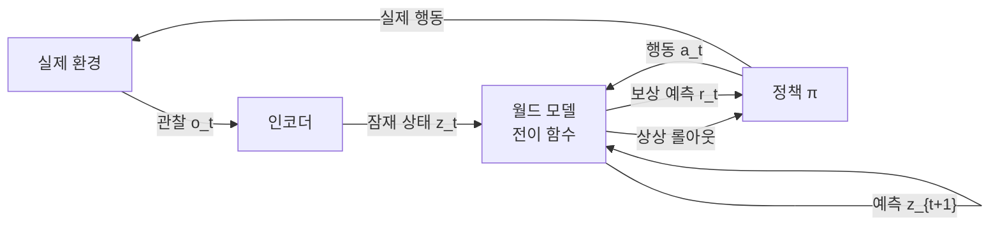
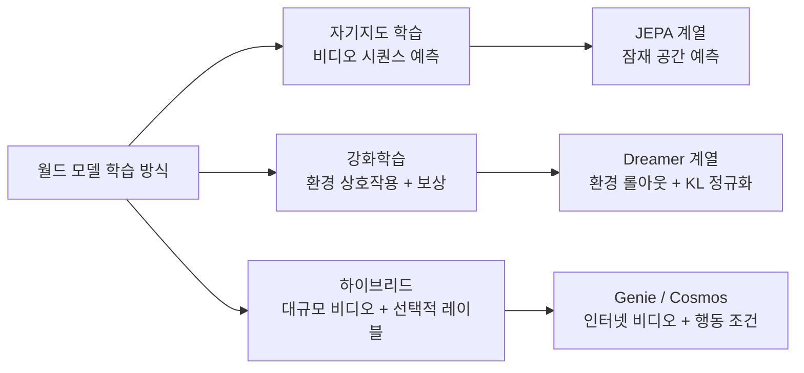

# World Model (월드 모델)

## 개요

월드 모델(World Model)은 **에이전트가 환경의 dynamics(역학)와 구조를 내부적으로 학습한 생성/예측 모델**이다. 주어진 상태와 행동을 입력받아 다음 상태를 예측하거나, 가능한 미래 상태를 샘플링함으로써 에이전트가 실제 환경과의 상호작용 없이 계획을 수립하고 정책을 최적화할 수 있도록 한다.

월드 모델 개념의 중심 질문은 다음과 같다: **에이전트가 세계를 충분히 이해하고 있다면, 머릿속에서 결과를 미리 시뮬레이션할 수 있어야 하지 않는가?**

## 왜 중요한가

실제 환경에서의 상호작용은 비용이 높고 위험하며 느리다. 월드 모델이 있으면:

- 가상 환경(imagination) 내에서 수천 번의 롤아웃(rollout)을 수행해 정책을 학습
- 현실에서는 불가능한 희귀 시나리오(사고, 극단적 환경)를 합성
- 단순 반응형(model-free) 에이전트보다 훨씬 높은 샘플 효율성 달성
- 언어 추상화만으로는 표현할 수 없는 물리적 세계 표현을 확보

이런 이유로 월드 모델은 강화학습, 로보틱스, 자율주행, 게임 AI에서 공통적으로 등장하는 핵심 개념이다.

## 에이전트-월드 모델 상호작용 구조

에이전트는 실제 환경에서 관찰을 수집하고, 월드 모델 내부에서 상상(imagination)을 통해 행동을 최적화한다. 상상 롤아웃과 실제 행동이 교대로 진행된다.

## 핵심 구성 요소

월드 모델은 기본적으로 세 함수를 학습한다:

| 구성 요소 | 역할 | 수식 |
|----------|------|------|
| 인코더 (Encoder) | 고차원 관찰 -> 압축 잠재 표현 | $z_t = f_{\text{enc}}(o_t)$ |
| 전이 모델 (Transition Model) | 상태 + 행동 -> 다음 상태 예측 | $z_{t+1} = f_{\text{trans}}(z_t, a_t)$ |
| 디코더 (Decoder, 선택적) | 잠재 상태 -> 관찰 재구성 | $\hat{o}_t = f_{\text{dec}}(z_t)$ |

디코더는 픽셀 재구성 품질을 평가하거나 디버깅에 활용하지만, 내부 계획 루프에는 반드시 필요하지 않다. 잠재 공간에서만 전이를 수행하면 연산 비용을 크게 절감할 수 있다.

## 주요 연구 계통 (2018-2026)

### 1. Ha & Schmidhuber "World Models" (2018)

VAE(Variational Autoencoder) + MDN-RNN(Mixture Density Network-RNN) + 선형 Controller로 구성된 초기 분리형 구조다. VAE가 관찰을 압축하고, MDN-RNN이 미래 상태 분포를 예측하며, 컨트롤러는 잠재 공간에서만 동작한다. 에이전트가 "꿈속에서(in a dream)" 경주 게임을 학습한 첫 대규모 시연이었다.

### 2. Dreamer 시리즈 (2019-2023)

RSSM(Recurrent State Space Model)을 핵심으로 하는 DreamerV1/V2/V3 시리즈다. 결정론적 은닉 상태 $h_t$와 확률론적 잠재 상태 $z_t$를 결합해 환경 불확실성을 모델링한다. DreamerV3는 단일 하이퍼파라미터 세트로 Atari부터 Minecraft까지 다양한 태스크를 해결하며 범용 모델 기반 RL의 기준을 높였다. 자세한 내용은 [[dreamer-world-model]] 참조.

### 3. LeCun JEPA / Joint Embedding 계열 (2022-)

Yann LeCun의 AMI(Advanced Machine Intelligence) 프레임워크에서 제안한 JEPA(Joint Embedding Predictive Architecture)는 픽셀 공간이 아닌 **추상적 표현 공간에서 예측**한다. I-JEPA(이미지), V-JEPA(비디오)로 구체화됐으며, 불필요한 세부 디테일을 재구성하지 않아 효율적이다. [[jepa-world-models]] 참조.

### 4. 비디오 생성 기반 월드 모델 (2023-)

대규모 비디오 생성 모델(Genie, Genie 3, Sora 등)을 월드 모델로 활용하는 흐름이다. Photorealistic 시뮬레이션을 제약 없이 생성할 수 있어 전통적 physics simulator의 한계(rigid body 중심, 수작업 접촉 모델)를 극복한다. 로보틱스에서의 활용은 [[video-gen-robotics-survey-paper]] 서베이에서 상세히 분석된다.

### 5. Physics-grounded 월드 모델 (2024-)

물리 법칙 위반을 내장 모듈로 감지하거나 물리 시뮬레이터와 결합하는 방향이다. NVIDIA Cosmos 같은 Physical AI foundation model이 이 방향의 대표 사례다. 대규모 비디오 데이터 사전학습 후 로보틱스 도메인에 파인튜닝하는 패턴을 취한다.

## 활용 영역

### 모델 기반 강화학습 (Model-Based RL)

가장 전통적인 활용이다. 에이전트는 실제 환경에서 소량의 경험을 수집하고, 월드 모델 내부에서 수많은 가상 롤아웃으로 정책을 최적화한다. 실제 환경 상호작용을 최소화하므로 샘플 효율이 높다.

### Embodied AI / 로보틱스

물리 세계와 상호작용하는 로봇에게 월드 모델은 sim-to-real 격차를 완화하는 핵심 도구다. 위험한 행동을 실제 로봇 파손 없이 시뮬레이션에서 탐색하고, 합성 데이터로 모방 학습 데이터를 보완한다. [[sim2real-transfer]] 참조.

### 자율주행

희귀 사고 시나리오, 악천후, 극단적 환경을 합성해 학습 데이터를 확장한다. GAIA-1(Wayve) 등이 이 방향의 대표 구현체다.

### 게임 AI 및 시뮬레이션

AlphaGo 이후 MCTS(Monte Carlo Tree Search)와 월드 모델의 결합이 주목받고 있다. 게임 환경 자체를 조건부 비디오로 생성해 인터랙티브 환경을 합성하는 연구도 있다.

## 학습 방식 비교

## 열린 질문

월드 모델 연구의 현재 미해결 과제들이다:

- **물리 법칙 위반(hallucination)**: 생성 모델은 물리적으로 불가능한 전이를 생성할 수 있다. Safety-critical 적용에서 심각한 위험이다.
- **장기 예측 안정성**: 다단계 롤아웃에서 오류가 누적되어 분포 이동이 발생한다. 더 긴 시간 수평선(horizon)에서의 신뢰도 확보가 과제다.
- **추론 비용**: 고품질 비디오 기반 월드 모델은 단일 스텝 예측도 수백 ms 이상 소요한다. 실시간 제어에 적용하기 어렵다.
- **데이터 큐레이션**: 로보틱스 특화 고품질 데이터셋이 인터넷 규모 비디오 데이터에 비해 절대적으로 부족하다.
- **검증 프레임워크 미비**: Safety-critical 영역에서 비디오 월드 모델의 신뢰도를 수학적으로 인증하는 방법론이 없다.

## model-free vs model-based 비교

| 측면 | Model-Free RL | Model-Based RL (월드 모델 활용) |
|------|--------------|-------------------------------|
| 샘플 효율 | 낮음 | 높음 |
| 계획 가능성 | 없음 | 있음 (가상 롤아웃) |
| 월드 모델 오차의 영향 | 없음 | 직접적 (model bias) |
| 구현 복잡도 | 낮음 | 높음 |
| 대표 알고리즘 | PPO, SAC, DQN | Dreamer, DynaQ, MBPO |

## 관련 문서

- [[world-model-architectures]] - Genie 3, Cosmos, LeCun AMI 아키텍처 상세
- [[dreamer-world-model]] - RSSM 기반 Dreamer V1/V2/V3 시리즈
- [[jepa-world-models]] - LeCun의 JEPA, 잠재 표현 공간 예측 접근
- [[video-gen-robotics-survey-paper]] - 비디오 생성 모델을 로봇 월드 모델로 활용하는 연구 서베이
- [[sim2real-transfer]] - Sim-to-Real 격차 극복 기법 (월드 모델 주요 활용 영역)
- [[robot-learning-sim2real]] - 로봇 학습에서의 Sim2Real 전략
- [[diffusion-policy-robot]] - 확산 모델 기반 로봇 조작 정책 (월드 모델과 결합 연구 존재)
