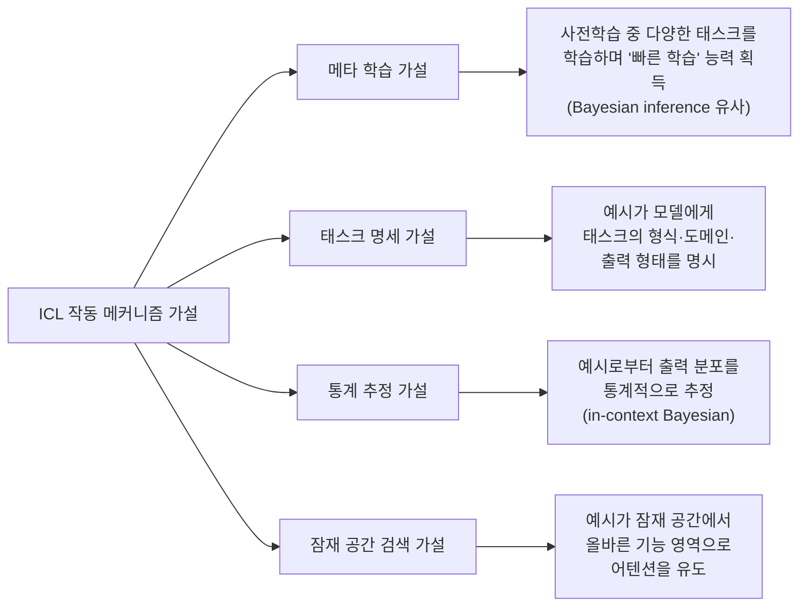
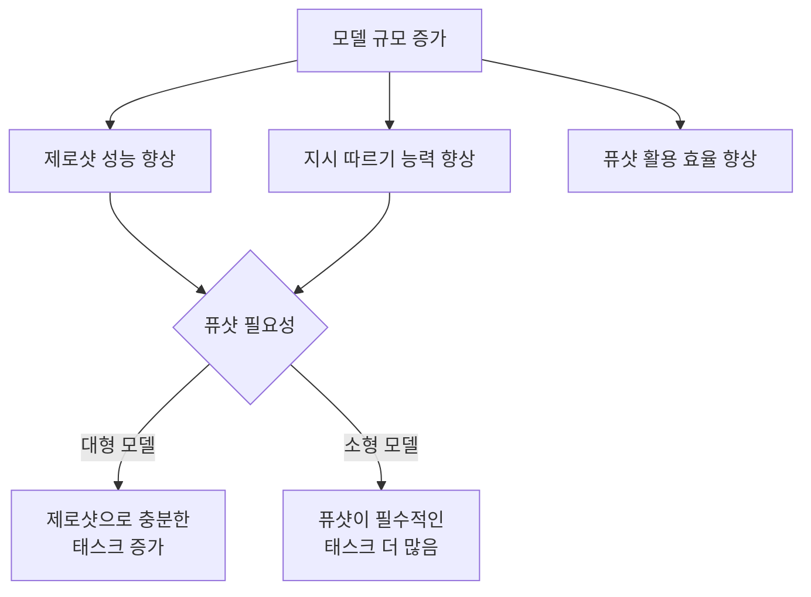
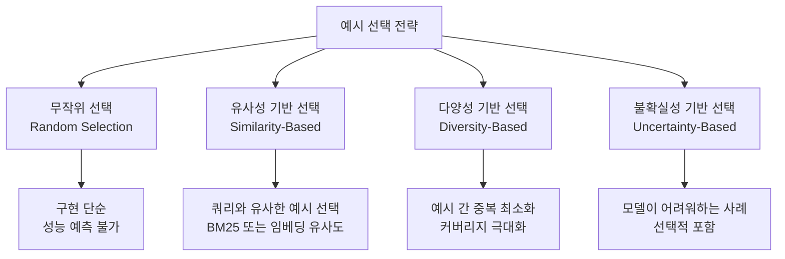
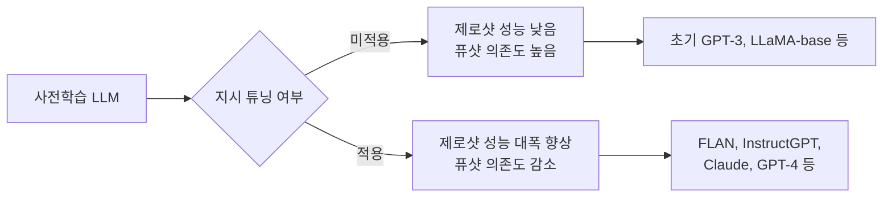

# 제로샷 vs 퓨샷 학습 비교 (Zero-Shot vs Few-Shot Learning)

## 정의와 본질

**제로샷 학습(Zero-Shot Learning, ZSL)**은 모델이 예시 없이 태스크 설명(또는 지시문)만으로 문제를 처리하는 방식이다. 모델은 사전학습(pre-training)에서 얻은 지식과 지시 따르기(instruction following) 능력에만 의존한다.

**퓨샷 학습(Few-Shot Learning, FSL)**은 추론 시점(inference time)에 소수의 입출력 예시(demonstrations)를 컨텍스트(context)에 포함시켜 모델이 패턴을 참조하도록 하는 방식이다. 가중치 업데이트(fine-tuning) 없이 컨텍스트 창 안에서 예시를 제공하는 방식은 특히 **인-컨텍스트 학습(In-Context Learning, ICL)**이라 부른다.

### 관련 용어 정리

| 용어 | 예시 수 | 설명 |
|------|---------|------|
| 제로샷 (Zero-Shot) | 0 | 지시문만. 예시 없음 |
| 원샷 (One-Shot) | 1 | 예시 1개 |
| 퓨샷 (Few-Shot) | 2-32+ | 소수 예시. 상한은 컨텍스트 길이에 따라 다름 |
| 매니샷 (Many-Shot) | 수십-수백 | 긴 컨텍스트를 활용한 다수 예시 |

"퓨샷"과 "인-컨텍스트 학습"은 자주 혼용되지만, ICL은 **메커니즘**을 강조하는 용어이고 Few-Shot은 **예시 수**를 강조하는 용어다.

---

## 핵심 아이디어

### 제로샷 vs 퓨샷의 작동 원리 비교

제로샷은 모델의 내재된 일반화 능력에 의존하고, 퓨샷은 컨텍스트 내 패턴 추출 능력(ICL)을 활용한다.

### 왜 퓨샷이 성능을 향상시키는가 — ICL 메커니즘 가설

ICL이 작동하는 이유에 대해 여러 가설이 경쟁 중이다:

현재 가장 많은 지지를 받는 시각은 **태스크 명세 가설**과 **통계 추정 가설**의 혼합이다. 예시가 "정답 레이블 자체"보다는 "입출력 형식 · 태스크 구조"를 전달하는 역할을 한다는 것이다 (Min et al., 2022).

---

## 모델 크기와 태스크별 트레이드오프

### 규모와 제로샷 성능의 관계

GPT-3 논문(Brown et al., 2020)의 핵심 발견 중 하나는, 모델 규모가 커질수록 제로샷과 퓨샷의 성능 차이가 줄어들고, 특히 지시 튜닝(instruction tuning) 이후의 대형 모델은 많은 태스크에서 제로샷으로 퓨샷에 준하는 성능을 보인다는 것이다.

### 태스크 유형별 권장 전략

| 태스크 유형 | 제로샷 | 퓨샷 | 권장 |
|-------------|--------|------|------|
| 분류 (명확한 라벨) | 보통 | 좋음 | 퓨샷 우선 |
| 감성 분석 | 좋음 | 약간 향상 | 제로샷 (단순할 때) |
| 번역 | 좋음 (대형 모델) | 도메인 특화 시 향상 | 태스크 복잡도 따라 |
| 코드 생성 | 보통 | 스타일 맞출 때 유효 | 퓨샷 (형식 지정 시) |
| 수학 추론 | 낮음 | [[chain-of-thought\|CoT 퓨샷]]으로 큰 향상 | CoT 퓨샷 |
| 정보 추출 | 보통 | 스키마 예시 포함 시 향상 | 퓨샷 (출력 형식 정의) |
| 창의적 작문 | 좋음 | 스타일 예시 유효 | 태스크 요구 따라 |
| 새로운 도메인 | 낮음 | 도메인 예시 포함 시 향상 | 퓨샷 필수 |

---

## 합성 예시(Synthetic Demonstrations) 효과

실제 사람이 작성한 예시(human-written) 대신 모델이 생성한 합성 예시(synthetic demonstrations)를 활용하는 방법이 주목받고 있다:

### 합성 예시의 장단점

| 측면 | 실제 예시 | 합성 예시 |
|------|-----------|-----------|
| 품질 | 자연스럽고 다양함 | 일관되지만 단조로울 수 있음 |
| 비용 | 인간 노동 필요 | 자동 생성 가능 |
| 확장성 | 제한적 | 무제한 생성 가능 |
| 편향 | 인간 편향 포함 | 모델 편향 증폭 위험 |
| 정확성 | 오류 가능 | 환각 예시 포함 위험 |

**Self-ICL** 또는 **Zero-Shot Chain-of-Thought** 등의 기법은 모델이 스스로 예시를 생성해 활용하는 방식으로, 인간 레이블링 없이 퓨샷 효과를 얻는다.

---

## 예시 선택 전략 (Demonstration Selection)

퓨샷의 성능은 예시를 어떻게 선택하느냐에 크게 좌우된다:

**KATE (kNN-Augmented in-context Tuning)**, **EPR (Efficient Prompt Retrieval)** 등의 연구는 쿼리와 유사한 예시를 동적으로 검색해 퓨샷 성능을 체계적으로 향상시킨다. 이는 [[rag|RAG(Retrieval-Augmented Generation)]]의 퓨샷 버전으로 볼 수 있다.

### 예시 순서의 영향

예시 순서가 결과에 영향을 미친다는 연구들이 있다 (Zhao et al., 2021):
- **최근성 편향(Recency Bias)**: 마지막에 배치된 예시가 더 큰 영향을 미치는 경향
- **다수결 편향(Majority Bias)**: 라벨이 불균형하면 다수 라벨 쪽으로 편향

이를 완화하기 위해 **보정(calibration)** 기법(예: 컨텍스트 없이 베이스라인 확률을 측정해 보정)을 적용하기도 한다.

---

## 지시 튜닝(Instruction Tuning)과의 관계

현대 LLM은 대부분 **지시 튜닝(Instruction Tuning)** 또는 **RLHF (Reinforcement Learning from Human Feedback)** 과정을 거쳐 제로샷 성능을 강화한다.

지시 튜닝 이후의 모델은 다양한 태스크에서 예시 없이도 높은 성능을 보여, 퓨샷의 필요성이 줄어든다. 단, 새로운 형식 정의나 도메인 적응에서는 여전히 퓨샷이 유효하다.

---

## 매니샷 학습 (Many-Shot Learning)

긴 컨텍스트 창(128K, 1M 토큰)을 가진 모델이 등장하면서, 수백-수천 개의 예시를 한 번에 제공하는 **매니샷(Many-Shot)** 방식도 가능해졌다:

- **장점**: 소수 예시로는 전달 어려운 복잡한 패턴도 학습 가능. 분포가 넓은 태스크에서 강력함.
- **단점**: 입력 비용 증가, 컨텍스트 창 한계(긴 컨텍스트에서 중간 정보 망각 현상), 예시 선별 비용 증가.
- **중간 잊음 현상(Lost in the Middle)**: Liu et al.(2023)의 연구에 따르면 컨텍스트가 길어질수록 모델이 중간에 위치한 정보를 잘 활용하지 못하는 경향이 있다. 많은 예시가 항상 도움이 되지는 않는다.

---

## 실무 적용 가이드

### 언제 제로샷을 쓰는가

- 쿼리 다양성이 높아 사전에 적절한 예시를 정하기 어려울 때
- 대형 모델(GPT-4, Claude 3 이상)에서 간단한 분류/생성 태스크
- 응답 속도 최적화가 필요한 프로덕션 환경 (긴 프롬프트 = 추가 비용)
- 지시 튜닝이 잘 된 모델 + 명확한 지시문이 있는 경우

### 언제 퓨샷을 쓰는가

- 출력 형식을 정밀하게 제어해야 할 때 (JSON 스키마, 특정 표현 방식)
- 도메인 특화 태스크에서 모델이 해당 도메인 패턴을 모를 때
- 소형 모델을 사용해야 할 때
- 수학 추론, 논리 추론 등 CoT 예시가 유효한 태스크
- A/B 테스트에서 제로샷 대비 명확한 성능 개선이 확인될 때

---

## 한계와 비판

1. **예시 품질 의존성**: 잘못된 예시는 성능을 오히려 악화시킨다. 예시 선별이 새로운 엔지니어링 부담이 된다.
2. **비용 증가**: 예시가 추가될수록 토큰 비용이 선형으로 증가한다.
3. **일관성 부재**: 같은 예시라도 순서, 표현 방식에 따라 결과가 크게 달라진다 — 프롬프트 취약성 문제.
4. **파인튜닝 대체 불가**: 많은 예시가 있다면 실제 파인튜닝이 ICL보다 효율적이고 일관된 경우가 많다.

---

## 관련 문서

- [[in-context-learning]] - ICL의 메커니즘 심층 분석 및 이론적 배경.
- [[prompt-engineering]] - 제로샷/퓨샷 프롬프트 설계 실천 기법.
- [[chain-of-thought]] - 퓨샷 CoT를 통한 추론 성능 향상.
- [[rag]] - 동적 예시 검색을 통한 퓨샷 강화 방식.
