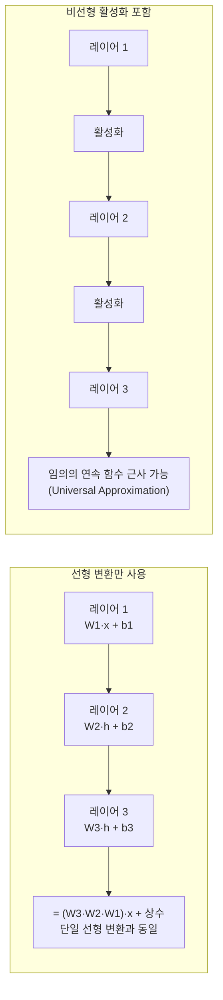
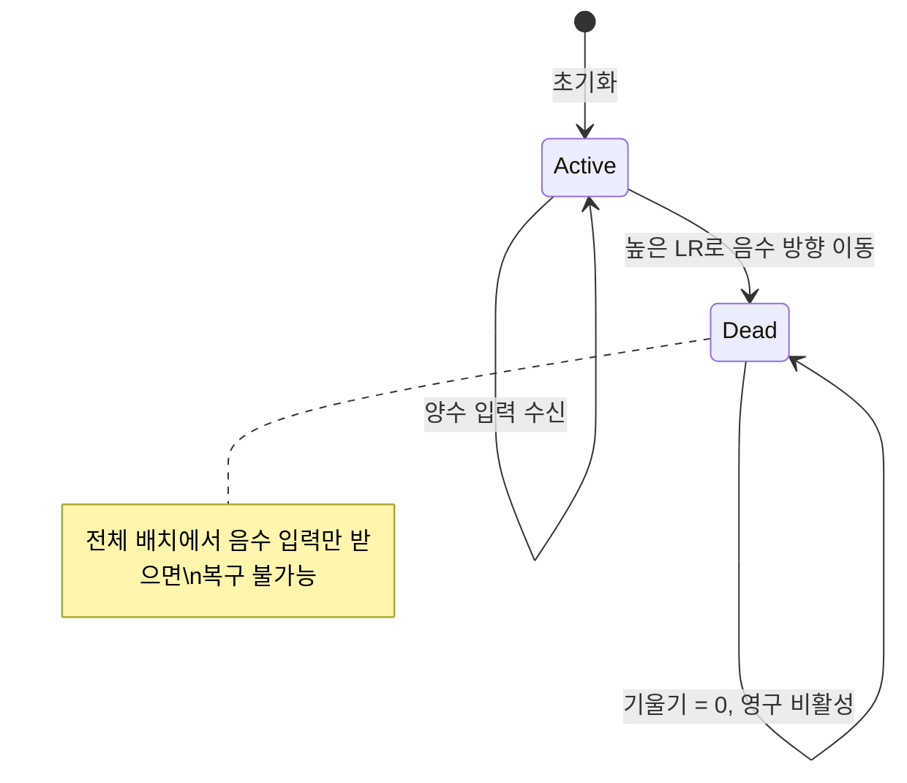
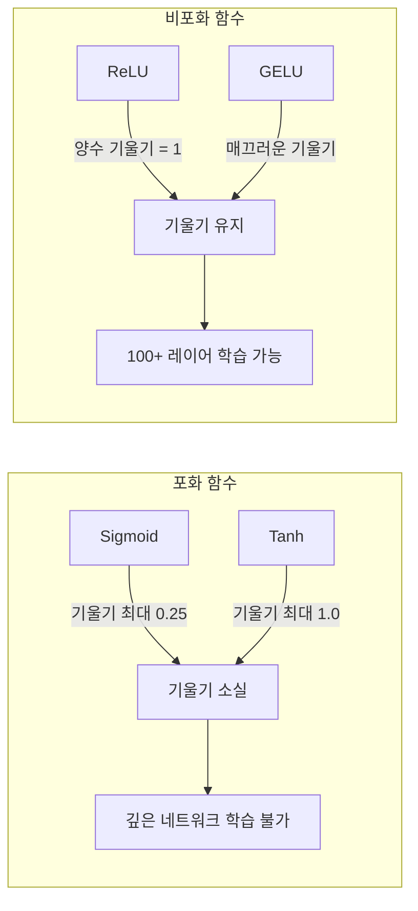
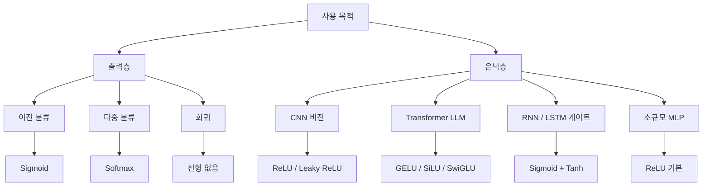

# 활성화 함수 (Activation Functions)

## 개요

활성화 함수(activation function)는 신경망에서 각 뉴런이 입력의 가중합(weighted sum)을 받아 **비선형 출력을 생성하는 함수**다. 활성화 함수가 없으면 아무리 많은 레이어를 쌓아도 전체 네트워크는 하나의 선형 변환과 동일해진다. 비선형성은 신경망이 복잡한 함수를 근사하는 핵심 조건이다.

신경망 학습의 역사는 어떤 활성화 함수를 선택하느냐의 역사이기도 하다. Sigmoid에서 ReLU로의 전환은 딥러닝 혁명을 가능하게 했고, GELU/SiLU/SwiGLU는 Transformer 시대를 열었다.

## 왜 비선형성이 필요한가



선형 레이어 여러 개를 쌓아도 결국 하나의 선형 변환이다. 비선형 활성화 함수가 있어야 각 레이어가 독립적인 표현을 학습할 수 있으며, 전체 네트워크가 임의의 복잡한 함수를 근사할 수 있다 (만능 근사 정리, Universal Approximation Theorem).

## Sigmoid (로지스틱 함수)

$$\sigma(x) = \frac{1}{1 + e^{-x}}$$

출력 범위: $(0, 1)$

```python
import torch
import torch.nn.functional as F
import numpy as np

x = torch.linspace(-6, 6, 100)
y = torch.sigmoid(x)

# 미분: sigma'(x) = sigma(x) * (1 - sigma(x))
# 최댓값 0.25 (x=0에서)
```

**특성:**
- 출력을 확률로 해석 가능 → 이진 분류 출력층에 적합
- 출력이 0-중심이 아님 (모든 출력 > 0) → 가중치 갱신이 한 방향으로만 발생, 수렴 느림
- 포화 영역(saturation): $|x|$가 클 때 기울기 $\approx 0$ → **기울기 소실(vanishing gradient)**

**현재 사용처:**
- 이진 분류 출력층
- LSTM/GRU 게이트
- 어텐션 소프트맥스 전 정규화

## Tanh (쌍곡 탄젠트)

$$\tanh(x) = \frac{e^x - e^{-x}}{e^x + e^{-x}} = 2\sigma(2x) - 1$$

출력 범위: $(-1, 1)$

**Sigmoid 대비 장점:**
- 0-중심 출력 → 가중치 갱신 방향 문제 완화
- Sigmoid보다 가파른 기울기 (최댓값 1.0 at $x=0$)

**공통 단점:** 포화 영역에서 기울기 소실. RNN 계열에서 주로 사용되었으나 현대 아키텍처에서는 거의 사용 안 됨.

## ReLU (Rectified Linear Unit)

$$\text{ReLU}(x) = \max(0, x)$$

출력 범위: $[0, \infty)$

```python
# PyTorch 기본 제공
x = torch.randn(batch_size, hidden_size)
out = F.relu(x)
# 또는
relu = torch.nn.ReLU()
out = relu(x)
```

**혁신적 특성:**
- 양수 영역에서 기울기 = 1 → **기울기 소실 없음**
- 계산 매우 단순 (if 문 하나)
- 희소 활성화(sparse activation): 평균적으로 50% 뉴런 비활성 → 효율적 표현
- He 초기화와 조합 시 깊은 네트워크 학습 안정

**죽은 ReLU 문제 (Dying ReLU):**

음수 입력 뉴런이 항상 0을 출력하면 기울기도 0이 되어 해당 뉴런이 영구적으로 비활성화된다.

원인:
- 너무 높은 학습률로 가중치가 크게 이동
- 초기화 문제 (모든 출력이 음수인 경우)



## Leaky ReLU / PReLU

죽은 ReLU 문제 해결을 위해 음수 영역에 작은 기울기를 허용한다.

$$\text{LeakyReLU}(x) = \begin{cases} x & x > 0 \\ \alpha x & x \leq 0 \end{cases}$$

- **Leaky ReLU**: $\alpha = 0.01$ (고정)
- **PReLU (Parametric ReLU)**: $\alpha$가 학습 가능한 파라미터

```python
leaky_relu = torch.nn.LeakyReLU(negative_slope=0.01)
prelu = torch.nn.PReLU()  # alpha 학습됨
```

## ELU (Exponential Linear Unit)

$$\text{ELU}(x) = \begin{cases} x & x > 0 \\ \alpha(e^x - 1) & x \leq 0 \end{cases}$$

- 음수 영역에서 매끄러운 전환 (지수 함수)
- 출력 평균이 0에 가까워져 배치 정규화 없이도 효과적
- 노이즈 강건성: 음수 입력에도 포화하지 않음

## GELU (Gaussian Error Linear Unit)

$$\text{GELU}(x) = x \cdot \Phi(x)$$

여기서 $\Phi(x)$는 표준정규분포의 누적분포함수(CDF)다.

근사 공식:
$$\text{GELU}(x) \approx 0.5 \cdot x \cdot \left(1 + \tanh\left[\sqrt{2/\pi}(x + 0.044715 x^3)\right]\right)$$

```python
# PyTorch 구현
gelu = torch.nn.GELU()
out = F.gelu(x)

# 수동 구현 (개념 이해용)
import math

def gelu_manual(x: torch.Tensor) -> torch.Tensor:
    return 0.5 * x * (1 + torch.tanh(
        math.sqrt(2 / math.pi) * (x + 0.044715 * x ** 3)
    ))
```

**왜 GELU가 효과적인가?**

입력값에 정규분포를 통한 자연스러운 게이팅 효과를 부여한다. 큰 양수 입력은 높은 확률로 통과, 큰 음수 입력은 거의 차단, 0 근방은 부드러운 전환. 확률적 정규화로 dropout과 유사한 규제 효과가 있다는 해석도 있다.

**사용처:** BERT, GPT-2/3, DistilBERT 등 대부분의 Transformer 기반 언어 모델

## SiLU / Swish

$$\text{SiLU}(x) = x \cdot \sigma(x) = \frac{x}{1 + e^{-x}}$$

Ramachandran et al. (2017)이 신경 구조 탐색(NAS)으로 발견했다.

```python
silu = torch.nn.SiLU()
out = F.silu(x)
```

**특성:**
- 비단조(non-monotonic): $x \approx -1.28$에서 최솟값 약 $-0.28$
- 하한이 없음 (ReLU처럼 완전히 차단하지 않음)
- 일부 태스크에서 GELU보다 우수
- LLaMA, Mistral, Qwen 등 최신 오픈소스 LLM의 FFN에서 표준

## SwiGLU

$$\text{SwiGLU}(x, W, V, b, c) = \text{SiLU}(xW + b) \odot (xV + c)$$

Noam Shazeer (2020)가 제안한 GLU(Gated Linear Unit) 변형이다. 두 선형 투영의 곱으로 게이팅을 구현한다.

```python
import torch.nn as nn

class SwiGLUFFN(nn.Module):
    """SwiGLU 활성화를 사용하는 FFN 레이어"""

    def __init__(self, d_model: int, d_ff: int) -> None:
        super().__init__()
        self.w1 = nn.Linear(d_model, d_ff, bias=False)
        self.w2 = nn.Linear(d_ff, d_model, bias=False)
        self.w3 = nn.Linear(d_model, d_ff, bias=False)  # 게이트 레이어

    def forward(self, x: torch.Tensor) -> torch.Tensor:
        # SiLU(W1·x) ⊙ (W3·x) → W2
        return self.w2(F.silu(self.w1(x)) * self.w3(x))
```

LLaMA, PaLM 등 최신 LLM의 FFN에서 널리 사용된다. SwiGLU는 FFN 파라미터가 표준 GELU FFN보다 약 1.5배 많지만 성능이 우수하다.

## Softmax

$$\text{softmax}(x_i) = \frac{e^{x_i}}{\sum_j e^{x_j}}$$

출력의 합이 1이 되어 확률 분포를 생성한다.

```python
# 수치 안정성을 위해 최댓값 제거
def stable_softmax(x: torch.Tensor, dim: int = -1) -> torch.Tensor:
    x = x - x.max(dim=dim, keepdim=True).values
    exp_x = torch.exp(x)
    return exp_x / exp_x.sum(dim=dim, keepdim=True)

# PyTorch 기본 제공
out = F.softmax(logits, dim=-1)
```

**사용처:**
- 다중 클래스 분류 출력층
- [[transformer-architecture]]의 어텐션 스코어 정규화
- 언어 모델의 다음 토큰 확률 분포

## 기울기 소실 문제 비교



| 함수 | 최대 기울기 | 기울기 소실 | 죽은 뉴런 |
|------|-----------|-----------|---------|
| Sigmoid | 0.25 | 심함 | 없음 |
| Tanh | 1.0 | 있음 | 없음 |
| ReLU | 1.0 | 없음 | 있음 |
| Leaky ReLU | 1.0 | 없음 | 없음 |
| GELU | ~1.0 | 거의 없음 | 없음 |
| SiLU | ~1.1 | 거의 없음 | 없음 |

## 활성화 함수 선택 가이드



| 사용 맥락 | 권장 함수 | 이유 |
|----------|---------|------|
| CNN 은닉층 | ReLU, Leaky ReLU | 단순, 효율적 |
| Transformer FFN | GELU, SiLU, SwiGLU | 표준, 성능 우수 |
| LSTM/GRU 게이트 | Sigmoid, Tanh | 설계 의도 |
| 이진 분류 출력 | Sigmoid | 확률 해석 |
| 다중 분류 출력 | Softmax | 확률 분포 |
| 회귀 출력 | 없음 (선형) | 범위 제한 불필요 |

## 초기화와의 관계

활성화 함수 선택은 가중치 초기화 전략과 짝을 이룬다.

| 활성화 함수 | 권장 초기화 | 공식 |
|-----------|-----------|------|
| Sigmoid/Tanh | Xavier(Glorot) | $W \sim U\left(-\sqrt{\frac{6}{n_{in}+n_{out}}}, \sqrt{\frac{6}{n_{in}+n_{out}}}\right)$ |
| ReLU/Leaky ReLU | He | $W \sim \mathcal{N}(0, \sqrt{\frac{2}{n_{in}}})$ |
| GELU/SiLU | He (근사) | ReLU와 유사 |

[[neural-network]] 참조.

## 현대 트렌드: 게이팅 메커니즘

최신 LLM의 FFN은 단순 활성화 함수를 넘어 **게이팅(gating) 구조**를 채택한다.

$$\text{GLU 계열}(x) = \text{활성화}(x W_1) \odot (x W_2)$$

- **SwiGLU**: SiLU + 게이트 (LLaMA, PaLM)
- **GeGLU**: GELU + 게이트 (T5, mT5)
- **ReGLU**: ReLU + 게이트

게이팅은 입력의 한 부분이 다른 부분의 흐름을 제어하므로 선택적 활성화 효과가 있다. 파라미터 수가 증가하지만 표현력 향상이 더 크다.

## 코드: 활성화 함수 시각화

```python
import torch
import matplotlib
matplotlib.use("Agg")
import matplotlib.pyplot as plt
import torch.nn.functional as F

x = torch.linspace(-4, 4, 200)

activations = {
    "Sigmoid": torch.sigmoid(x),
    "Tanh": torch.tanh(x),
    "ReLU": F.relu(x),
    "GELU": F.gelu(x),
    "SiLU": F.silu(x),
    "Leaky ReLU (0.1)": F.leaky_relu(x, 0.1),
}

fig, axes = plt.subplots(2, 3, figsize=(12, 8))
for ax, (name, y) in zip(axes.flatten(), activations.items()):
    ax.plot(x.numpy(), y.detach().numpy())
    ax.axhline(0, color="gray", lw=0.5)
    ax.axvline(0, color="gray", lw=0.5)
    ax.set_title(name)
    ax.set_ylim(-2, 2)

plt.tight_layout()
plt.savefig("activation_functions.png", dpi=150)
```

## 관련 문서

- [[neural-network]] - 활성화 함수가 적용되는 신경망 구조
- [[transformer-architecture]] - GELU/SiLU/SwiGLU가 표준인 아키텍처
- [[backpropagation]] - 기울기 계산과 활성화 함수의 미분
- [[gradient-descent-backpropagation]] - 기울기 소실 문제의 전체 맥락
- [[batch-norm-layer-norm]] - 활성화 출력의 정규화 기법
- [[weight-initialization]] - 활성화 함수별 초기화 전략
- [[loss-functions]] - 출력층 활성화 함수와 손실 함수의 조합
