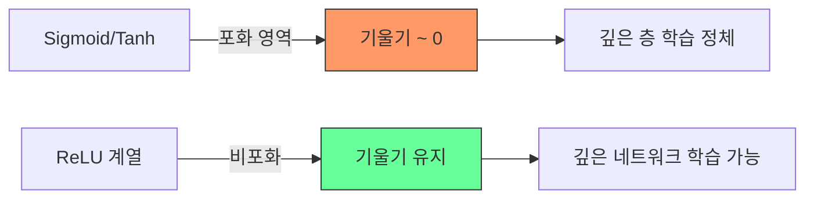

## 개요

활성화 함수(Activation Function)는 신경망의 각 뉴런이 입력 신호의 가중합을 비선형 출력으로 변환하는 함수다. 활성화 함수가 없으면 아무리 깊은 네트워크도 단일 선형 변환과 동등해지므로, [[perceptron-mlp]]가 복잡한 패턴을 학습하려면 비선형 활성화 함수가 필수적이다. 현대 딥러닝에서는 ReLU 계열이 기본이며, [[transformer-architecture]] 기반 모델에서는 GELU와 SiLU/Swish가 널리 쓰인다.

## 주요 활성화 함수

### Sigmoid (로지스틱)

입력을 (0, 1) 범위로 압축한다. [[logistic-regression]]의 핵심이며, 출력을 확률로 해석할 수 있다.

```
sigmoid(x) = 1 / (1 + e^(-x))
```

- 장점: 확률적 해석 가능, 미분이 매끄러움
- 단점: 기울기 소실(vanishing gradient) 문제, 출력이 0-중심이 아님, 지수 연산 비용

Hinton 등(2012)의 음성 인식 모델에서 사용되었으나, 현대 은닉층에서는 거의 쓰이지 않는다.

### Tanh (쌍곡 탄젠트)

출력 범위가 (-1, 1)로 0-중심이어서 Sigmoid보다 최적화에 유리하다.

```
tanh(x) = (e^x - e^(-x)) / (e^x + e^(-x))
```

- 장점: 0-중심 출력, Sigmoid보다 가파른 기울기
- 단점: 여전히 기울기 소실 발생, 포화 영역 존재

RNN 계열 초기 아키텍처에서 주로 사용되었다.

### ReLU (Rectified Linear Unit)

2012년 AlexNet에서 사용되며 딥러닝 혁명을 이끈 활성화 함수다. 양수는 그대로, 음수는 0으로 출력한다.

```
ReLU(x) = max(0, x)
```

- 장점: 계산 효율이 높음, 양수 영역에서 기울기 소실 없음, 희소 활성화(sparsity)
- 단점: 죽은 ReLU(dying ReLU) 문제 -- 음수 입력을 받는 뉴런이 영구적으로 비활성화

ResNet(2015) 등 100층 이상의 깊은 네트워크 학습을 가능하게 한 핵심 요소다.

### Leaky ReLU / PReLU

음수 영역에 작은 기울기(보통 0.01)를 허용하여 죽은 ReLU 문제를 완화한다.

```
LeakyReLU(x) = x  (x > 0)
             = 0.01x  (x <= 0)
```

PReLU(Parametric ReLU)는 음수 기울기를 학습 가능한 파라미터로 만든 변형이다.

### ELU (Exponential Linear Unit)

음수 영역에 지수 함수를 적용하여 ReLU보다 매끄러운 전환을 제공한다.

```
ELU(x) = x  (x > 0)
       = alpha * (e^x - 1)  (x <= 0)
```

출력 평균이 0에 가까워져 [[batch-norm-layer-norm]] 없이도 내부 공변량 이동을 줄인다.

### GELU (Gaussian Error Linear Unit)

2018년 BERT 모델에서 채택되며 Transformer 시대의 표준이 된 활성화 함수다. 입력값에 표준정규분포의 누적분포함수(CDF)를 곱한다.

```
GELU(x) = x * PHI(x)  (PHI: 표준정규 CDF)
```

- 확률적 정규화 효과: 입력이 클수록 통과 확률이 높아지는 자연스러운 게이팅
- GPT, BERT 등 주요 LLM의 [[transformer-ffn]]에서 사용

### SiLU / Swish

Sigmoid와 항등 함수의 곱으로 정의되는 자기 게이팅(self-gated) 활성화 함수다.

```
SiLU(x) = x * sigmoid(x)
```

- 비단조(non-monotonic) 특성: 음수 근처에서 약간의 음수 출력을 허용
- 일부 벤치마크에서 ReLU를 능가하는 성능

### Softmax

출력 벡터를 확률 분포로 변환한다. 다중 클래스 분류의 출력층과 [[self-attention-mechanism]]에서 핵심적으로 사용된다.

```
softmax(x_i) = e^(x_i) / SUM_j(e^(x_j))
```

## 기울기 소실 문제 (Vanishing Gradient)



Sigmoid와 Tanh는 입력이 크거나 작을 때 기울기가 0에 수렴하는 포화(saturation) 영역이 존재한다. 역전파 시 이 작은 기울기가 층마다 곱해져 깊은 층의 가중치가 거의 갱신되지 않는다. ReLU는 양수 영역에서 기울기가 항상 1이므로 이 문제를 크게 완화하며, 이것이 현대 딥러닝에서 100층 이상의 네트워크를 학습할 수 있게 된 핵심 요인이다.

## 선택 가이드

| 위치/용도 | 권장 활성화 함수 |
|-----------|-----------------|
| CNN 은닉층 | ReLU, Leaky ReLU |
| Transformer FFN | GELU, SiLU/Swish |
| RNN/LSTM 게이트 | Sigmoid, Tanh |
| 이진 분류 출력 | Sigmoid |
| 다중 분류 출력 | Softmax |
| 회귀 출력 | 선형 (활성화 없음) |

활성화 함수 선택은 [[weight-initialization]] 전략과도 밀접하다. He 초기화는 ReLU에, Xavier 초기화는 Sigmoid/Tanh에 맞추어 설계되었다.

## 관련 문서
- [[kolmogorov-arnold-networks]] -- 콜모고로프-아놀드 네트워크 (KAN)
- [[activation-function-theory]] -- 활성화 함수 이론

- [[perceptron-mlp]] - 활성화 함수가 적용되는 신경망 구조
- [[batch-norm-layer-norm]] - 활성화 출력의 정규화
- [[weight-initialization]] - 활성화 함수에 맞는 초기화 전략
- [[gradient-descent-backpropagation]] - 기울기 기반 학습과 소실 문제
- [[transformer-architecture]] - GELU/SiLU가 표준인 아키텍처
- [[logistic-regression]] - Sigmoid 기반 분류 모델
