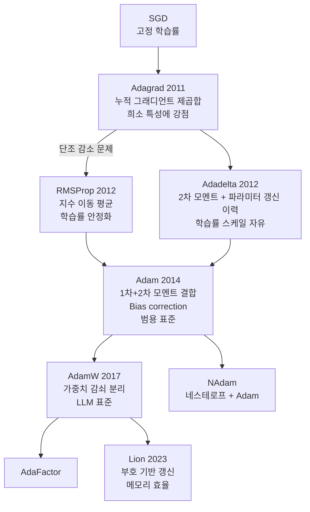

# Adagrad/RMSProp 옵티마이저 계보

## 배경: 고정 학습률의 한계

SGD (Stochastic Gradient Descent)는 모든 파라미터에 동일한 학습률을 적용한다. 그러나 실제 신경망에서는:

- 자주 갱신되는 파라미터(빈번한 특성)와 드물게 갱신되는 파라미터(희소 특성)가 공존
- 최적의 학습률이 파라미터마다, 학습 단계마다 다름
- 고정 학습률은 빠른 수렴과 안정성을 동시에 달성하기 어려움

적응적 학습률(adaptive learning rate) 옵티마이저들은 이 문제를 해결하기 위해 개발되었으며, Adagrad → RMSProp → Adam으로 이어지는 계보를 형성한다.

---

## Adagrad (2011)

Adagrad (Adaptive Gradient Algorithm, Duchi et al., 2011)는 최초의 주요 적응적 학습률 옵티마이저다.

### 핵심 아이디어

각 파라미터마다 지금까지 누적된 그래디언트 제곱합을 추적하고, 이를 학습률 분모에 적용한다.

$$G_t = G_{t-1} + g_t^2$$
$$\theta_{t+1} = \theta_t - \frac{\eta}{\sqrt{G_t + \epsilon}} \cdot g_t$$

여기서 $G_t$는 누적 그래디언트 제곱합, $g_t$는 현재 그래디언트, $\epsilon$은 수치 안정성을 위한 작은 상수다.

### 강점: 희소 그래디언트

- 자주 등장하는 특성 → $G_t$ 빠르게 증가 → 학습률 감소 (과학습 방지)
- 드물게 등장하는 특성 → $G_t$ 느리게 증가 → 학습률 유지 (충분한 갱신)

이 특성이 NLP의 단어 임베딩, 추천 시스템처럼 입력이 희소한 분야에서 특히 효과적이다.

### 약점: 학습률 단조 감소

$G_t$는 항상 증가만 하므로 학습률이 단조 감소한다. 깊은 신경망 학습에서는 학습 중반 이후 그래디언트가 소실되어 학습이 조기 종료되는 문제가 발생한다.

```python
class Adagrad:
    def __init__(self, lr=0.01, eps=1e-8):
        self.lr = lr
        self.eps = eps
        self.G = None

    def step(self, params, grads):
        if self.G is None:
            self.G = [torch.zeros_like(p) for p in params]
        for p, g, G in zip(params, grads, self.G):
            G.add_(g ** 2)
            p.data.addcdiv_(g, G.sqrt().add_(self.eps), value=-self.lr)
```

---

## RMSProp (2012)

RMSProp (Root Mean Square Propagation)은 Geoffrey Hinton이 Coursera 강의에서 발표한 비공식 제안이다. 정식 논문이 없음에도 딥러닝 역사에서 중요한 전환점이 되었다.

### 핵심 개선: 지수 이동 평균

Adagrad의 "누적 제곱합" 대신 **지수 이동 평균(exponential moving average)**을 사용해 과거 그래디언트의 영향을 지수적으로 감쇠시킨다.

$$E[g^2]_t = \rho \cdot E[g^2]_{t-1} + (1-\rho) \cdot g_t^2$$
$$\theta_{t+1} = \theta_t - \frac{\eta}{\sqrt{E[g^2]_t + \epsilon}} \cdot g_t$$

$\rho$ (decay rate)는 보통 0.9로 설정한다.

### 효과

- 최근 그래디언트에 더 높은 가중치 → 학습률이 무한히 감소하지 않음
- 비정상(non-stationary) 목적 함수에도 효과적
- RNN 학습에서 특히 유용 (Hinton이 RNN 컨텍스트에서 제안)

```python
class RMSProp:
    def __init__(self, lr=0.001, rho=0.9, eps=1e-8):
        self.lr = lr
        self.rho = rho
        self.eps = eps
        self.E_g2 = None

    def step(self, params, grads):
        if self.E_g2 is None:
            self.E_g2 = [torch.zeros_like(p) for p in params]
        for p, g, E in zip(params, grads, self.E_g2):
            E.mul_(self.rho).addcmul_(g, g, value=1 - self.rho)
            p.data.addcdiv_(g, E.sqrt().add_(self.eps), value=-self.lr)
```

---

## 계보도: Adagrad에서 Adam까지



이 계보도는 각 옵티마이저가 이전 방법의 한계를 어떻게 해결하며 발전했는지를 보여준다.

---

## 방법별 비교

| 항목 | Adagrad | RMSProp | Adam |
|------|---------|---------|------|
| 발표 연도 | 2011 | 2012 | 2014 |
| 학습률 적응 | 누적 제곱합 | 지수 이동 평균 | 지수 이동 평균 |
| 모멘텀 | 없음 | 없음 | 있음 (1차 모멘트) |
| 학습률 감소 | 단조 감소 | 안정적 | 안정적 + bias correction |
| 희소 데이터 | 매우 우수 | 보통 | 보통 |
| 범용성 | 낮음 | 보통 | 높음 |
| RNN/LSTM | 약함 | 강함 | 강함 |

---

## 실무 선택 기준

### Adagrad 사용 시

- 입력 특성이 매우 희소한 경우 (NLP 초기 임베딩, 추천 시스템)
- 학습 횟수가 비교적 적고 수렴이 중요한 경우
- 컨벡스(convex) 최적화 문제

### RMSProp 사용 시

- RNN, LSTM 학습 (Hinton의 원래 권장 용도)
- 비정상 목적 함수 (강화 학습 등)
- Adam과 유사하지만 모멘텀 없이 단순하게 쓰고 싶을 때

### 현대적 권장

대부분의 딥러닝 태스크에서는 Adam 또는 AdamW가 기본값이다. Adagrad와 RMSProp은 특정 용도에서 여전히 유효하지만, 실무에서는 Adam 계열을 먼저 시도하는 것이 일반적이다.

---

## 관련 문서

- [[nesterov-momentum]] - 모멘텀 기반 가속화의 이론적 배경
- [[sgd-convergence-theory]] - SGD 수렴 이론
- [[optimization-theory]] - 최적화 이론 전반
- [[sharpness-aware-minimization]] - 평탄 최솟값 탐색 최적화
- [[adamw-optimizer]] - AdamW와 가중치 감쇠 분리
