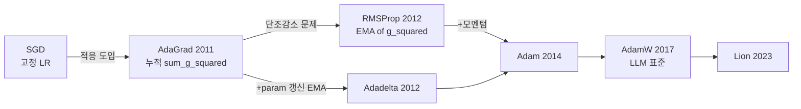

# AdaGrad와 RMSProp

AdaGrad와 RMSProp은 **Adam 이전 시대의 대표적인 적응형 학습률 옵티마이저**다. 두 알고리즘 모두 파라미터마다 학습률을 다르게 조정한다는 같은 동기에서 출발하지만, 학습률을 정규화하는 방식이 다르다. 현대 딥러닝에서는 대부분 [[adamw]] / [[adam-original-paper]] / Lion 등으로 대체되었으나, 이 두 알고리즘은 적응형 옵티마이저 계보의 핵심 분기점이며 Adam의 직계 조상이다.

이 페이지는 두 알고리즘의 수식, 동기, 비교, 그리고 현대적 위치를 정리한다. 더 폭넓은 옵티마이저 진화 계보와 구현 코드는 [[adagrad-rmsprop-history]]에서 다루며, 본 페이지는 **두 알고리즘 자체에 집중**한다.

## 동기: 왜 적응형 학습률이 필요한가

표준 SGD ([[stochastic-gradient-descent]])는 모든 파라미터에 같은 학습률 $\eta$를 사용한다.

$$
\theta_{t+1} = \theta_t - \eta \, g_t
$$

문제점:

- **희소(sparse) 특성**: 자주 등장하지 않는 피처는 그래디언트가 드물게 발생 — 같은 $\eta$로는 학습이 너무 느림
- **빈번한 특성**: 자주 갱신되는 피처는 $\eta$가 너무 크면 진동
- 손실 표면의 곡률이 차원마다 다르면 단일 $\eta$로 모든 방향을 잘 처리할 수 없음

**적응형 학습률(adaptive learning rate)** 옵티마이저는 파라미터별 학습률을 데이터에서 추정해 이 문제를 해결한다.

## AdaGrad (Duchi et al. 2011)

Duchi, Hazan, Singer "Adaptive Subgradient Methods for Online Learning and Stochastic Optimization" (JMLR 2011)이 정식 제안.

### 수식

각 파라미터 $i$에 대해 그래디언트 제곱의 **누적합**을 추적:

$$
G_{t,i} = G_{t-1,i} + g_{t,i}^2
$$

$$
\theta_{t+1,i} = \theta_{t,i} - \frac{\eta}{\sqrt{G_{t,i} + \epsilon}} \, g_{t,i}
$$

여기서 $\epsilon \approx 10^{-8}$은 0 나눗셈 방지용 안정화 상수.

### 직관

- 자주 갱신되는 파라미터 → $G_t$가 커짐 → 분모가 커짐 → 실효 학습률 작아짐
- 드물게 갱신되는 파라미터 → $G_t$가 작음 → 분모가 작음 → 실효 학습률 유지

> "find needles in haystacks in the form of very predictive but rarely seen features"
> — Duchi et al. 2011 Abstract

### 강점과 약점

| 측면 | 내용 |
|------|------|
| 강점 | 희소 그래디언트(NLP 임베딩, 추천 시스템)에 매우 효과적 |
| 강점 | 컨벡스(convex) 최적화에서 $O(1/\sqrt{T})$ regret 보장 |
| 약점 | $G_t$가 **단조 증가**하므로 학습률이 무한히 감소 → 깊은 신경망에서 학습 조기 정지 |
| 약점 | 비정상(non-stationary) 목적 함수에 부적합 |

이 단조 감소 문제가 RMSProp 등 후속 알고리즘의 동기가 된다.

## RMSProp (Hinton 2012, 비공식)

Geoffrey Hinton이 Coursera 강의 ("Neural Networks for Machine Learning", Lecture 6e)에서 제안한 비공식 알고리즘. 정식 논문 없이 강의록만으로 표준이 된 드문 사례. AdaGrad의 단조 감소 문제를 **지수 이동 평균(exponential moving average, EMA)** 으로 해결한다.

### 수식

$$
E[g^2]_t = \rho \, E[g^2]_{t-1} + (1 - \rho) \, g_t^2
$$

$$
\theta_{t+1} = \theta_t - \frac{\eta}{\sqrt{E[g^2]_t + \epsilon}} \, g_t
$$

기본 하이퍼파라미터: $\rho = 0.9$, $\eta = 0.001$, $\epsilon = 10^{-8}$.

### 직관

EMA는 과거 그래디언트의 영향을 지수적으로 감쇠시킨다. AdaGrad의 누적합과 달리 $E[g^2]$는 **무한히 커지지 않으므로** 학습률이 0으로 수렴하지 않는다.

비정상 목적 함수(예: RNN 학습, 강화학습 가치함수)에서 특히 강하다. Hinton 자신도 RNN 학습 맥락에서 이 알고리즘을 제안했다 [교차검증 필요: 정확한 동기는 강의록 기준].

## 두 알고리즘 비교



이 다이어그램은 AdaGrad와 RMSProp이 SGD에서 출발해 Adam 계보로 이어지는 역사적 흐름을 보여준다. RMSProp + 1차 모멘트(모멘텀)이 곧 Adam이다.

| 항목 | AdaGrad | RMSProp |
|------|---------|---------|
| 발표 | 2011 (JMLR 논문) | 2012 (Hinton 강의록) |
| 통계 | 누적 제곱합 | 지수 이동 평균 |
| 학습률 추세 | 단조 감소 | 안정 |
| 모멘텀 | 없음 | 없음 |
| 희소 그래디언트 | 매우 우수 | 보통 |
| 비정상 목적 | 약함 | 강함 |
| RNN 학습 | 부적합 | 적합 |
| 컨벡스 보장 | $O(1/\sqrt{T})$ regret | 약함 (실증적) |

## 구현 (PyTorch)

PyTorch는 두 옵티마이저를 표준 제공한다.

```python
import torch

# AdaGrad
opt = torch.optim.Adagrad(model.parameters(), lr=0.01, eps=1e-10)

# RMSProp
opt = torch.optim.RMSprop(
    model.parameters(),
    lr=0.001,
    alpha=0.99,   # EMA decay (논문/Hinton의 rho)
    eps=1e-8,
    momentum=0,   # 옵션: 모멘텀 추가 가능
)
```

PyTorch RMSprop은 추가로 momentum과 centered RMSProp 옵션을 제공한다 (centered: 그래디언트 평균도 EMA로 추정해 분산 추정에 사용).

## 현대적 위치

LLM/Transformer 학습이 표준이 된 2020년대에 AdaGrad와 RMSProp은 **거의 사용되지 않는다**. 사실상 [[adamw]]가 대형 모델 훈련의 사실상 표준이며, AdamW = RMSProp + 1차 모멘텀 + bias correction + weight decay 분리.

여전히 유효한 사용처:

- **AdaGrad**: 희소 입력 + 컨벡스 문제 (전통적인 추천 시스템, embedding-only 모델, 일부 ranking 모델)
- **RMSProp**: 강화학습 (DQN의 원조 옵티마이저), 일부 RNN 베이스라인
- **교육**: Adam 동작 원리를 이해하기 위한 디딤돌

새 프로젝트에서는 AdamW를 첫 시도로 권장 ([[adamw]] 참고). 그래도 적응형 옵티마이저의 동작 원리와 한계를 이해하려면 두 알고리즘을 반드시 거쳐야 한다.

## 한계와 주의

- **AdaGrad 비컨벡스**: 비컨벡스 문제(딥러닝)에서 학습률 단조감소가 치명적. 학습률 warmup으로 보완 시도가 있었으나 근본 해결은 RMSProp/Adam.
- **RMSProp의 비공식성**: 정식 논문이 없어 인용 시 강의록(Coursera Lecture 6e) 또는 Hinton's slides 인용. Tieleman & Hinton 2012로도 표기 [교차검증 필요: 표준 인용 형식 확인 권장].
- **Adam과의 동등성**: RMSProp + 1차 모멘트가 곧 Adam의 핵심 — Adam을 쓸 수 있다면 RMSProp 위에 쌓는 것보다 직접 Adam 사용이 일반적.
- **하이퍼파라미터 민감도**: $\rho$나 $\eta$ 조정이 결과에 큰 영향. 기본값(0.9, 0.001)이 절대적 표준은 아니다.

## 관련 문서

- [[adagrad-rmsprop-history]] - 옵티마이저 진화 계보 (Adadelta/NAdam/Lion 포함)
- [[adam-original-paper]] - Adam 원 논문 요약
- [[adamw]] - AdamW와 weight decay 분리
- [[learning-rate-scheduling]] - 학습률 스케줄링 전략
- [[stochastic-gradient-descent]] - SGD 기초
- [[sgd-convergence-theory]] - SGD 수렴 이론
- [[gradient-descent]] - 경사하강법 전반
- [[backpropagation]] - 역전파 기초
