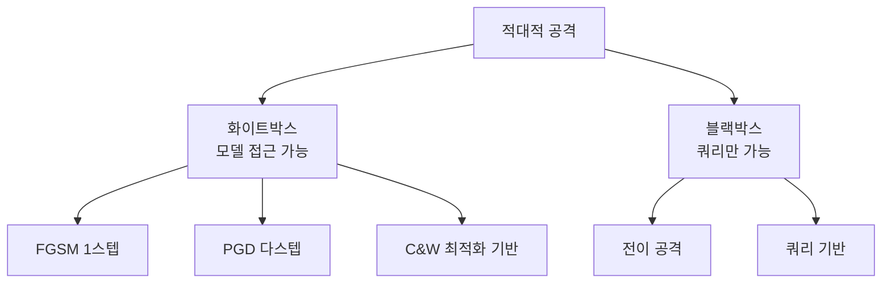

# 적대적 공격과 모델 강건성

신경망에 **인간이 감지할 수 없는 미세한 섭동**을 가해 오분류를 유도하는 적대적 공격(adversarial attack)과, 이에 저항하는 모델 강건성(robustness) 연구.

## 공격 분류

## 주요 공격 기법

| 기법 | 원리 | 특성 |
|------|------|------|
| **FGSM** (Goodfellow 2014) | $x' = x + \epsilon \cdot \text{sign}(\nabla_x L)$ | 빠르지만 약함 |
| **PGD** (Madry 2017) | FGSM 반복 + $\epsilon$-볼 내 투영 | 가장 강력한 1차 공격 |
| **C&W** | 최적화 문제로 정식화 | 탐지 우회에 강함 |
| **AutoAttack** | PGD + APGD + FAB + Square 앙상블 | 표준 벤치마크 |

## 방어: 적대적 학습

가장 효과적인 방어는 **적대적 학습(Adversarial Training)**:

$$\min_\theta \mathbb{E}_{(x,y)} \left[ \max_{\|\delta\| \leq \epsilon} L(f_\theta(x + \delta), y) \right]$$

학습 중 PGD로 적대적 예시를 생성하고 이에 대해 학습. 정확도-강건성 트레이드오프가 존재한다.

## LLM에서의 적대적 공격

LLM에서는 [[indirect-prompt-injection|프롬프트 인젝션]]이 텍스트 도메인의 적대적 공격에 해당. 이산 토큰 공간에서의 GCG(Greedy Coordinate Gradient) 공격이 대표적.

## 관련 문서

- [[indirect-prompt-injection]] -- 간접 프롬프트 인젝션
- [[agent-prompt-injection-defense]] -- 에이전트 인젝션 방어
- [[differential-privacy]] -- 차등 프라이버시
- [[sharpness-aware-minimization]] -- SAM (평탄 최솟값과 강건성 연결)
