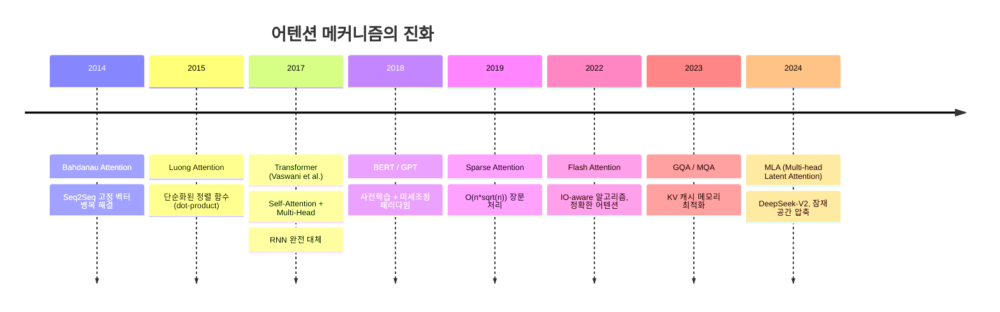

# Attention Mechanism Overview (어텐션 메커니즘 개요)

## 정의

**어텐션 메커니즘(Attention Mechanism)**은 시퀀스의 모든 위치에서 관련성이 높은 다른 위치에 선택적으로 집중하는 신경망 구조다. 2014년 기계번역에서 시작하여 2017년 Transformer의 핵심으로 자리잡았고, 현대 LLM을 비롯한 거의 모든 시퀀스 모델의 기반이 되었다.

어텐션의 핵심 통찰: 시퀀스를 고정 길이 벡터 하나로 압축하는 대신, **매 출력 단계마다 입력의 어디를 볼지 동적으로 결정**한다.

## 역사적 진화



## 1단계: Bahdanau Attention (2014)

### 문제: 고정 길이 병목

기존 Seq2Seq 모델은 인코더가 입력 시퀀스 전체를 **하나의 고정 길이 벡터**로 압축했다. 문장이 길어질수록 이 벡터에 정보를 충분히 담을 수 없어 성능이 급격히 저하되었다.

### 해결: 동적 정렬(Alignment)

Bahdanau 등은 디코더가 매 출력 단계마다 인코더의 모든 은닉 상태를 참조하되, **관련성에 비례하여 가중합**을 계산하도록 했다:

```
정렬 점수:  e_ij = align(s_{i-1}, h_j)     -- 학습 가능한 정렬 함수
어텐션 가중치: a_ij = softmax(e_ij)
컨텍스트 벡터: c_i = sum_j(a_ij * h_j)      -- 가중합
```

여기서 `s_{i-1}`은 디코더의 이전 은닉 상태, `h_j`는 인코더의 j번째 은닉 상태다.

**결과**: 영-불 번역에서 기존 구문 기반 시스템과 동등한 성능을 달성했고, 어텐션 가중치가 언어학적 정렬과 일치함을 시각적으로 확인할 수 있었다.

## 2단계: Luong Attention (2015)

Luong 등은 정렬 함수를 단순화하여 세 가지 변형을 제시했다:

| 이름 | 수식 | 특징 |
|------|------|------|
| Dot | `s^T * h` | 가장 단순, 추가 파라미터 없음 |
| General | `s^T * W * h` | 학습 가능한 가중치 행렬 |
| Concat | `v^T * tanh(W[s;h])` | Bahdanau 방식과 유사 |

Dot-product 방식이 계산 효율이 높으면서도 충분한 성능을 보여, 이후 Transformer의 기반이 되었다.

## 3단계: Self-Attention과 Transformer (2017)

### 혁신: "Attention Is All You Need"

Vaswani 등은 RNN과 CNN을 완전히 제거하고 **어텐션만으로** 시퀀스를 처리하는 Transformer 아키텍처를 제안했다. 핵심 차이:

- **Bahdanau**: 인코더-디코더 간 어텐션 (교차 어텐션)
- **Transformer**: 시퀀스 내부에서 자기 자신에 대한 어텐션 (**Self-Attention**)

### Scaled Dot-Product Attention

```
Attention(Q, K, V) = softmax(Q * K^T / sqrt(d_k)) * V
```

- **Q(Query)**: "무엇을 찾고 있는가" -- 현재 위치의 질의
- **K(Key)**: "나는 무엇을 가지고 있는가" -- 각 위치의 키
- **V(Value)**: "실제 전달할 내용" -- 각 위치의 값
- **sqrt(d_k)**: 스케일링 팩터. 차원이 커지면 dot product 값이 커져서 softmax가 극단적 분포를 만드는 것을 방지

Q, K, V는 입력 벡터 X에 각각의 가중치 행렬(W_Q, W_K, W_V)을 곱하여 생성한다.

### Multi-Head Attention

단일 어텐션 대신 **여러 개의 독립적인 어텐션 헤드**를 병렬로 실행한다:

```
MultiHead(Q, K, V) = Concat(head_1, ..., head_h) * W_O
    여기서 head_i = Attention(Q * W_Q^i, K * W_K^i, V * W_V^i)
```

각 헤드는 서로 다른 관계 패턴을 학습한다. 예를 들어:
- 헤드 1: 구문적 의존 관계 (주어-동사)
- 헤드 2: 상호참조 (대명사-선행사)
- 헤드 3: 위치 근접성

### 왜 RNN을 대체했는가

| 특성 | RNN | Self-Attention |
|------|-----|---------------|
| 병렬화 | 불가 (순차적) | 완전 병렬 |
| 장거리 의존성 | O(n) 단계 필요 | O(1) 직접 연결 |
| 학습 속도 | 느림 | 빠름 (GPU 활용) |
| 연산 복잡도 | O(n) | O(n^2) -- 길이의 제곱 |

O(n^2) 복잡도는 장문 처리에서 병목이 되며, 이를 해결하는 다양한 효율적 어텐션 기법이 등장했다.

## 4단계: 효율적 어텐션의 진화

### Sparse Attention (2019)

전체 위치가 아닌 선택된 위치에만 어텐션을 적용한다:
- **Longformer**: 로컬 윈도우 + 전역 토큰
- **BigBird**: 랜덤 + 윈도우 + 전역 조합

### Flash Attention (2022)

정확한(exact) 어텐션을 유지하면서 GPU 메모리 계층(SRAM/HBM)을 최적화한 IO-aware 알고리즘이다. 근사가 아니라 동일한 수학적 결과를 더 빠르게 계산한다.

### GQA / MQA (2023)

**Multi-Query Attention(MQA)**: 모든 헤드가 K, V를 공유한다. KV 캐시 메모리가 헤드 수만큼 절약된다.

**Grouped Query Attention(GQA)**: 헤드를 그룹으로 묶어 그룹 내에서 K, V를 공유한다. MHA와 MQA의 중간 지점으로, LLaMA 2/3, Mistral 등 대부분의 현대 모델이 채택했다.

### MLA (2024)

DeepSeek-V2의 **Multi-head Latent Attention**은 KV를 잠재 공간으로 압축하여 KV 캐시를 대폭 줄인다. GQA와 다른 접근이지만 목표는 동일하다.

## 어텐션의 해석 가능성

어텐션 가중치는 모델이 "어디를 보고 있는가"를 시각화할 수 있어 해석 가능성 도구로 활용된다. 다만 어텐션 가중치가 반드시 인과적 설명을 제공하지는 않는다는 점(Jain & Wallace, 2019)은 주의가 필요하다. 최근의 [[circuit-tracing|회로 추적]] 연구는 어텐션 패턴을 넘어 모델 내부 메커니즘을 더 정밀하게 분석한다.

## 다음에 읽을 페이지

- [[transfer-learning]] -- 어텐션 기반 모델의 사전학습-미세조정 패러다임
- [[scaling-laws]] -- 어텐션 모델의 스케일링과 성능 관계
- [[quantization-model-compression]] -- 어텐션 레이어의 양자화와 압축

## 출처

- Bahdanau et al., "Neural Machine Translation by Jointly Learning to Align and Translate" (2014) - https://arxiv.org/abs/1409.0473
- Vaswani et al., "Attention Is All You Need" (2017) - https://arxiv.org/abs/1706.03762
- Dao et al., "FlashAttention: Fast and Memory-Efficient Exact Attention with IO-Awareness" (2022) - https://arxiv.org/abs/2205.14135
