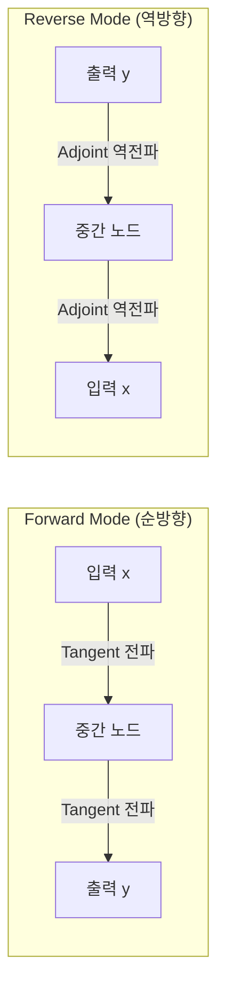
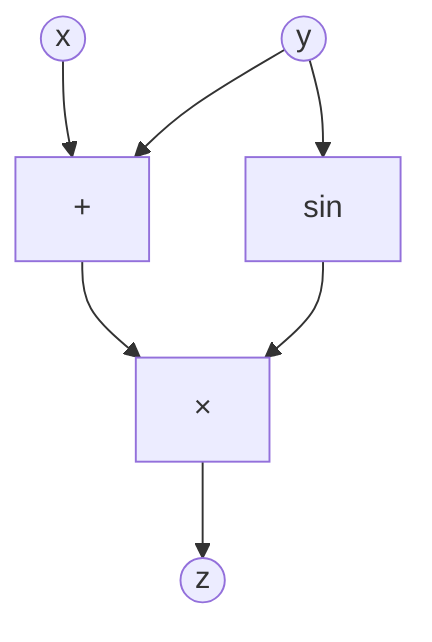

# 자동 미분 심화 (Automatic Differentiation)

함수의 미분값을 컴퓨터가 수치 오류 없이 정확하게 계산하는 기법. 딥러닝의 역전파(backpropagation)는 자동 미분의 특수 사례다.

## 세 가지 미분 방식 비교

| 방식 | 원리 | 정확도 | 계산 비용 | 용도 |
|------|------|--------|-----------|------|
| 수치 미분 (Numerical) | 유한 차분 $[f(x+h)-f(x)]/h$ | 낮음 (부동소수점 오차) | 파라미터당 O(1) 순전파 | 기울기 검증용 |
| 기호 미분 (Symbolic) | 미분 규칙을 수식으로 전개 | 정확 | 수식 폭발(expression swell) | 소규모 해석적 계산 |
| 자동 미분 (Autodiff) | 연산을 그래프로 추적, 체인 룰 자동 적용 | 기계 정밀도 | 효율적 | 딥러닝 전반 |

수치 미분은 $h$가 너무 작으면 cancellation error, 너무 크면 truncation error가 발생하여 항상 근사에 그친다. 자동 미분은 이 두 문제를 모두 회피한다.

## Forward Mode vs Reverse Mode

**Forward Mode**: 입력 하나에 대한 모든 출력의 편미분을 한 번의 순전파로 계산. 입력 차원 $n$이 작고 출력 차원 $m$이 클 때 유리 ($n < m$).

**Reverse Mode**: 출력 하나에 대한 모든 입력의 편미분을 한 번의 역전파로 계산. 딥러닝의 역전파가 바로 이 방식. 스칼라 손실(scalar loss) 하나에 대해 수백만 파라미터의 기울기를 한 번에 계산 ($n \gg m = 1$).

## Computational Graph (계산 그래프)

Wengert tape(렌거트 테이프)이라 불리는 연산 기록부. 모든 연산과 중간값을 노드로 표현한다.

예시: $z = (x + y) \cdot \sin(y)$

역전파 시 각 노드는 자신의 로컬 기울기를 상위 노드로부터 받아 하위 노드로 전파한다. 이 "기울기 흐르기(gradient flow)"가 체인 룰(chain rule)의 구현이다.

## PyTorch Autograd vs JAX

| 항목 | PyTorch Autograd | JAX |
|------|-----------------|-----|
| 그래프 방식 | Dynamic (eager mode), 실행마다 재생성 | Functional + JIT 컴파일 (`jit`) |
| 미분 API | `loss.backward()` → `.grad` | `jax.grad()`, `jax.jacobian()` |
| 고차 미분 | 가능 (중첩 autograd) | `jax.grad(jax.grad(f))` 조합 |
| 벡터-야코비안 곱 (VJP) | `torch.autograd.functional.vjp` | `jax.vjp()` |
| 야코비안-벡터 곱 (JVP) | `torch.autograd.functional.jvp` | `jax.jvp()` |
| 순수성 제약 | 부작용 허용 | 함수형 순수성 필요 (side-effect 금지) |

JAX는 `vmap`(벡터화), `pmap`(병렬화)과 자동 미분을 함수 변환으로 조합할 수 있어 연구용으로 강력하다. PyTorch는 디버깅과 유연성에서 우위다.

## 기울기 검사 (Gradient Check)

구현된 자동 미분이 올바른지 수치 미분으로 검증한다:

$$\text{relative error} = \frac{|f'_{auto} - f'_{numerical}|}{|f'_{auto}| + |f'_{numerical}|} < 10^{-5}$$

PyTorch: `torch.autograd.gradcheck(func, inputs, eps=1e-6)`

## 관련 문서

- [[learning-rate-scheduling]]
- [[gradient-descent-backpropagation]]
