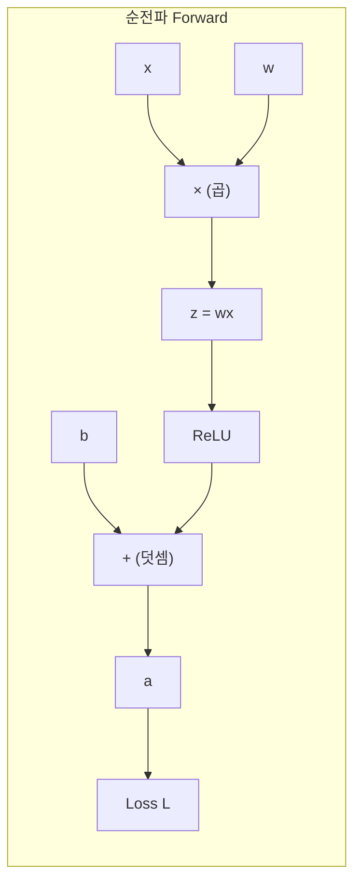
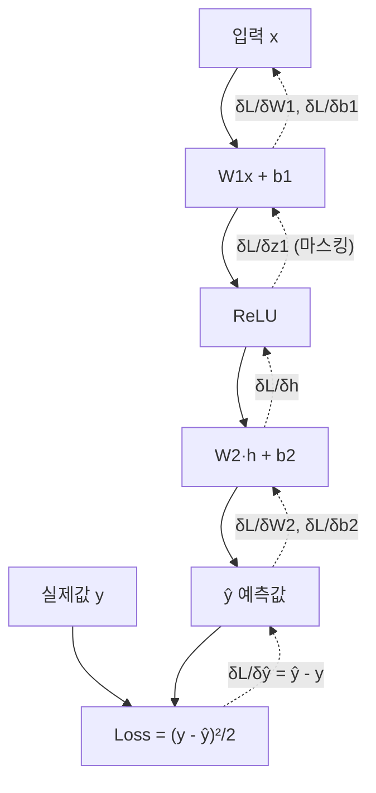
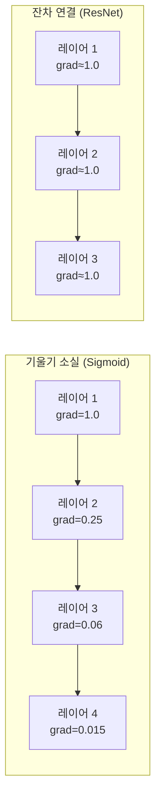

# 역전파 (Backpropagation)

역전파(Backpropagation, 오류 역전파)는 신경망의 파라미터에 대한 손실 함수의 기울기를 효율적으로 계산하는 알고리즘이다. 연쇄 법칙(chain rule)을 계산 그래프(computational graph) 위에 반복 적용하여, 출력에서 입력 방향으로 기울기를 전파한다. [[gradient-descent|경사하강법]]은 역전파가 계산한 기울기를 이용해 파라미터를 업데이트한다.

Rumelhart, Hinton, Williams가 1986년 이를 신경망에 효과적으로 적용하는 방법을 발표하면서 딥러닝 학습이 가능해졌다.

## 왜 역전파인가

파라미터 수가 $N$개인 신경망에서 수치 미분으로 기울기를 구하면 파라미터당 순전파를 1회씩, 총 $O(N)$번의 순전파가 필요하다. GPT-3의 1750억 파라미터라면 현실적으로 불가능하다.

역전파는 **단 1번의 순전파 + 1번의 역전파**로 모든 파라미터의 기울기를 동시에 계산한다. 시간복잡도는 순전파와 동일한 $O(N)$.

## 연쇄 법칙 (Chain Rule)

미적분의 연쇄 법칙이 역전파의 수학적 기반이다.

합성 함수 $z = f(g(x))$에서:
$$\frac{dz}{dx} = \frac{dz}{dy} \cdot \frac{dy}{dx} \quad \text{(y = g(x))}$$

신경망은 여러 함수의 합성이므로, 손실 $L$에 대한 초기 파라미터 $\theta$의 기울기는 중간 결과들의 기울기를 연쇄적으로 곱한 것과 같다.

## 계산 그래프 (Computational Graph)

역전파를 이해하는 핵심은 계산 그래프다. 모든 연산을 노드로, 데이터 흐름을 엣지로 표현한다.



역전파는 이 그래프를 오른쪽에서 왼쪽으로 역방향 탐색하며 각 노드에서 국소 기울기(local gradient)를 계산하고 전달한다.

**주요 연산의 국소 기울기:**

| 연산 | 순전파 | 역전파 (업스트림 기울기 $\delta$ 수신 시) |
|------|--------|------------------------------------------|
| 덧셈 $z = x + y$ | $z$ 계산 | $\frac{\partial z}{\partial x} = 1$, $\frac{\partial z}{\partial y} = 1$ → 상류 기울기를 그대로 통과 |
| 곱셈 $z = xy$ | $z$ 계산 | $\frac{\partial z}{\partial x} = y$, $\frac{\partial z}{\partial y} = x$ → 입력을 서로 교환해 곱함 |
| ReLU $z = \max(0, x)$ | $z$ 계산 | $x > 0$이면 $\delta$, $x \le 0$이면 0 |
| Sigmoid $z = \sigma(x)$ | $z$ 계산 | $\delta \cdot z(1-z)$ |
| Softmax + CE Loss | $\hat{y}, L$ | $\hat{y} - y$ (원-핫 레이블 기준) |

## 단계별 예시: 단순 2층 신경망

**네트워크:** $L = \frac{1}{2}(y - \hat{y})^2$, $\hat{y} = W_2 \cdot \text{ReLU}(W_1 x + b_1) + b_2$



**역전파 단계:**

1. $\frac{\partial L}{\partial \hat{y}} = \hat{y} - y$
2. $\frac{\partial L}{\partial W_2} = \frac{\partial L}{\partial \hat{y}} \cdot h^T$
3. $\frac{\partial L}{\partial h} = W_2^T \cdot \frac{\partial L}{\partial \hat{y}}$
4. $\frac{\partial L}{\partial z_1} = \frac{\partial L}{\partial h} \odot \mathbb{1}[z_1 > 0]$ (ReLU 마스크)
5. $\frac{\partial L}{\partial W_1} = \frac{\partial L}{\partial z_1} \cdot x^T$

## 자동 미분 (Automatic Differentiation)

현대 딥러닝 프레임워크(PyTorch, JAX, TensorFlow)는 역전파를 수동으로 구현하지 않아도 된다. **자동 미분(autograd)**이 순전파 중 계산 그래프를 자동으로 기록하고, `.backward()` 호출 시 역방향으로 기울기를 계산한다.

```python
import torch

# 순전파 중 계산 그래프 자동 기록 (requires_grad=True)
x = torch.tensor([2.0], requires_grad=True)
w = torch.tensor([3.0], requires_grad=True)

z = w * x        # z = 6
a = torch.relu(z)  # a = 6
L = a.mean()     # L = 6

# 역전파: L에 대한 모든 leaf 텐서의 기울기 계산
L.backward()

print(w.grad)  # dL/dw = x = 2.0
print(x.grad)  # dL/dx = w = 3.0
```

**두 가지 자동 미분 방식:**

| 방식 | 설명 | 특성 |
|------|------|------|
| **Eager Mode (동적 그래프)** | 연산 즉시 실행, 그래프 동적 구성 | 디버깅 쉬움, 제어 흐름 유연 (PyTorch 기본) |
| **Symbolic / Static Graph** | 그래프 먼저 정의, 후 실행 | 컴파일 최적화 가능 (TF 1.x, JAX의 jit) |

## 기울기 소실 (Vanishing Gradient)

깊은 네트워크에서 역전파 시 기울기가 역방향으로 전파되면서 점점 작아져 초기 레이어 파라미터 업데이트가 거의 불가능해지는 현상.

**원인:** Sigmoid/Tanh 활성화의 도함수가 0~0.25 사이로 레이어가 쌓일수록 곱이 0에 수렴.

$$\frac{\partial L}{\partial W_1} = \frac{\partial L}{\partial a_n} \cdot \prod_{i=2}^{n} \sigma'(z_i) \cdot W_i$$

$\sigma'(z)_{\max} = 0.25$이므로 100층이면 $0.25^{100} \approx 0$

**해결책:**
1. **ReLU 활성화**: 양수 영역에서 도함수 = 1, 기울기 그대로 전파
2. **잔차 연결(Residual Connection)**: $y = F(x) + x$로 기울기 하이웨이 제공 ([[transformer|ResNet/Transformer]])
3. **배치 정규화(Batch Normalization)**: 활성화를 정규화하여 포화 방지
4. **Xavier/Kaiming 초기화**: 레이어 수에 무관하게 기울기 분산 유지
5. **LSTM/GRU**: 게이트로 기울기 흐름 제어



## 기울기 폭발 (Exploding Gradient)

반대로 기울기가 기하급수적으로 커지는 현상. 주로 RNN/LSTM에서 시퀀스가 길 때 발생.

**해결책:**
- **기울기 클리핑(Gradient Clipping)**: 기울기 노름이 임계값 초과 시 정규화

```python
# 기울기 폭발 방지
loss.backward()
torch.nn.utils.clip_grad_norm_(model.parameters(), max_norm=1.0)
optimizer.step()
```

## 메모리 효율 기법

역전파 시 순전파에서 계산한 중간 활성화(intermediate activation)를 모두 저장해야 한다. 이는 모델이 깊어질수록 큰 메모리 부담이 된다.

### 그래디언트 체크포인팅 - [[gradient-checkpointing]]

중간 활성화를 저장하지 않고 역전파 시 재계산한다. 메모리를 $O(\sqrt{n})$으로 줄이는 대신 계산량을 약 1.33배 증가시킨다.

```python
from torch.utils.checkpoint import checkpoint

# 체크포인팅 적용
def forward(self, x):
    x = checkpoint(self.layer1, x)  # 활성화 저장 없이 순전파
    x = checkpoint(self.layer2, x)
    return x
```

### 혼합 정밀도 학습 - [[mixed-precision-training]]

FP16으로 순전파/역전파를 수행하고, 파라미터 업데이트는 FP32로. 메모리 절반, 속도 2~3배 향상.

```python
from torch.cuda.amp import autocast, GradScaler

scaler = GradScaler()

with autocast():  # FP16 컨텍스트
    output = model(inputs)
    loss = criterion(output, labels)

scaler.scale(loss).backward()   # 스케일된 역전파
scaler.step(optimizer)
scaler.update()
```

**왜 스케일러가 필요한가:** FP16의 언더플로우(underflow) 방지. 손실에 큰 상수를 곱해 기울기가 표현 범위에 들어오게 한다.

## 수치 기울기 검증 (Gradient Check)

직접 구현한 레이어의 역전파 correctness를 검증하는 방법. 수치 미분과 비교.

```python
import torch

def numerical_gradient(func, x, eps=1e-5):
    grad = torch.zeros_like(x)
    for i in range(x.numel()):
        x_plus = x.clone()
        x_plus.view(-1)[i] += eps
        x_minus = x.clone()
        x_minus.view(-1)[i] -= eps
        grad.view(-1)[i] = (func(x_plus) - func(x_minus)) / (2 * eps)
    return grad

# 자동 미분 vs 수치 미분 비교
x = torch.randn(3, requires_grad=True)
auto_grad = torch.autograd.grad(some_func(x).sum(), x)[0]
num_grad = numerical_gradient(lambda t: some_func(t).sum(), x.detach())

# 상대 오차 확인
rel_error = (auto_grad - num_grad).norm() / (auto_grad.norm() + num_grad.norm())
assert rel_error < 1e-5, f"기울기 불일치: {rel_error}"
```

## 고급 주제: Second-Order 방법

역전파는 1차 기울기(first-order gradient)만 계산한다. 2차 미분(헤시안)을 활용하는 방법들:

- **Newton's Method**: $\theta \leftarrow \theta - H^{-1} \nabla L$. 헤시안 역행렬 계산이 $O(N^3)$으로 비현실적
- **L-BFGS**: 헤시안을 근사. 소규모 문제에 유용
- **K-FAC**: 레이어별로 헤시안을 크로네커 인수 분해로 근사. 대형 모델에 연구 중

현재 대부분의 딥러닝은 1차 방법(Adam/AdamW)으로 충분히 좋은 결과를 얻고 있다.

## 관련 문서

- [[gradient-descent]] - 역전파로 계산한 기울기를 사용하는 최적화
- [[neural-network]] - 역전파가 동작하는 신경망 구조
- [[gradient-checkpointing]] - 메모리 효율 역전파
- [[mixed-precision-training]] - FP16 역전파 최적화
