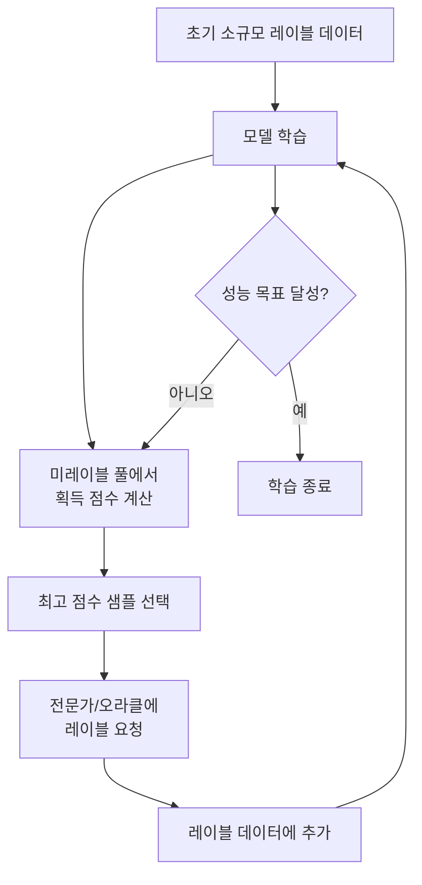

# BALD/BatchBALD 베이지안 능동학습

## 정의와 배경

능동학습(Active Learning)은 레이블링 비용이 큰 상황에서 모델이 스스로 가장 유익한 샘플을 선택해 레이블 요청하는 기계학습 패러다임이다.

BALD (Bayesian Active Learning by Disagreement)와 BatchBALD는 베이지안 딥러닝의 불확실성 추정을 능동학습 샘플 선택에 활용하는 대표적 방법이다.

### 왜 중요한가

- **레이블 효율**: 무작위 선택 대비 수배 적은 레이블로 동등한 성능 달성
- **이론적 근거**: 정보 이론(information theory)에 기반한 획득 함수(acquisition function)
- **실용성**: 의료 영상, 지질 탐사처럼 전문가 레이블이 매우 비싼 분야에서 핵심 도구

---

## 능동학습 루프



핵심은 "획득 함수(acquisition function)" - 어떤 샘플을 선택할지 결정하는 기준이다.

---

## 기존 획득 함수들

BALD를 이해하기 위해 간단한 기존 방법들을 먼저 살펴본다:

| 방법 | 기준 | 한계 |
|------|------|------|
| 최대 엔트로피 (Max Entropy) | 예측 분포의 불확실성 최대화 | 우연/인식 불확실성 미구분 |
| 최소 신뢰도 (Least Confidence) | 최고 확률 클래스의 신뢰도 최소 | 다중 클래스에서 약함 |
| 주변 샘플링 (Margin Sampling) | 상위 두 클래스 확률 차이 최소 | 배치 다양성 무시 |
| 코어셋 (Coreset) | 특성 공간의 대표성 | 불확실성 무시 |

---

## BALD: 정보 획득 기반 선택

Houlsby et al. (2011)이 제안한 BALD의 획득 함수:

$$\text{BALD}(x) = I(y; \theta | x, \mathcal{D}_{train}) = H[y|x, \mathcal{D}] - \mathbb{E}_{p(\theta|\mathcal{D})}[H[y|x, \theta]]$$

### 두 항의 의미

- **$H[y|x, \mathcal{D}]$**: 예측의 총 불확실성 (예측 엔트로피)
- **$\mathbb{E}[H[y|x, \theta]]$**: 파라미터 $\theta$가 주어졌을 때의 평균 불확실성 (우연 불확실성)
- **차이**: 상호 정보량(mutual information) = **인식 불확실성(epistemic uncertainty)**

BALD는 **파라미터에 대한 정보를 가장 많이 제공하는 샘플**을 선택한다. 우연 불확실성이 높은 노이즈 샘플은 제외하고 진짜 모델이 모르는 샘플에 집중한다.

### MC Dropout을 이용한 근사 계산

딥러닝에서는 정확한 베이지안 추론 대신 MC Dropout으로 근사한다:

```python
import numpy as np

def bald_score(model, x, n_samples=10):
    """MC Dropout으로 BALD 점수 계산"""
    model.train()  # dropout 활성화
    
    # T번 샘플링
    probs = np.stack([
        model(x).softmax(dim=-1).cpu().numpy()
        for _ in range(n_samples)
    ])  # shape: (T, N, C)
    
    # 평균 예측 엔트로피 (총 불확실성)
    mean_probs = probs.mean(axis=0)  # (N, C)
    predictive_entropy = -np.sum(
        mean_probs * np.log(mean_probs + 1e-8), axis=-1
    )
    
    # 평균 알레아토릭 엔트로피
    aleatoric = -np.mean(
        np.sum(probs * np.log(probs + 1e-8), axis=-1),
        axis=0
    )
    
    # BALD = 인식 불확실성
    bald = predictive_entropy - aleatoric
    return bald
```

---

## BatchBALD: 배치 단위 다양성 보장

### BALD의 한계

BALD로 상위 $B$개 샘플을 독립적으로 선택하면 **중복 정보**가 많은 유사한 샘플들이 선택될 수 있다. 예: 비슷한 강아지 사진 100장 중 BALD 점수 상위 10장을 선택하면 모두 비슷한 샘플이 된다.

### BatchBALD (Kirsch et al., 2019)

배치 전체의 결합 정보량(joint mutual information)을 최대화한다:

$$\text{BatchBALD}(\mathcal{B}) = I(y_\mathcal{B}; \theta | x_\mathcal{B}, \mathcal{D})$$

즉, 배치 $\mathcal{B}$에 포함된 샘플들이 **결합적으로** 파라미터에 대해 제공하는 정보를 최대화한다.

### 탐욕적 근사 (Greedy Approximation)

결합 정보량의 정확한 최대화는 조합적으로 어렵다. 탐욕적 방법으로 근사:

```
1. B = {} (빈 배치)
2. While |B| < batch_size:
   a. 각 미선택 샘플 x의 B ∪ {x}에서의 결합 정보량 계산
   b. 가장 높은 결합 정보량의 x를 B에 추가
3. 최종 배치 B 반환
```

### BALD vs BatchBALD 비교

| 항목 | BALD | BatchBALD |
|------|------|-----------|
| 배치 다양성 | 보장 안 됨 | 결합 정보량으로 보장 |
| 계산 비용 | 낮음 ($O(B \cdot N)$) | 높음 ($O(B \cdot N \cdot T^2)$) |
| 중복 선택 | 가능 | 억제됨 |
| 소규모 배치 | 충분함 | 이점 뚜렷 |

---

## 실무 적용

### 의료 영상 진단

- MRI/CT 슬라이스 중 모델이 불확실한 샘플만 방사선 전문의 레이블링
- 전체 데이터셋 레이블링 대비 10-20% 비용으로 유사 성능 달성 사례

### 지질 탐사

- 시추 위치 결정에 BALD 적용
- 불확실성이 높은 지점 우선 탐사로 채굴 효율 향상

### NLP 텍스트 분류

- 대량 미레이블 텍스트에서 모델이 확신하지 못하는 샘플 우선 레이블링
- 희귀 클래스 발견에 특히 효과적

### 구현 시 고려사항

```python
# 능동학습 루프 구현 스켈레톤
class ActiveLearner:
    def __init__(self, model, pool, labeled_set, acquisition_fn):
        self.model = model
        self.pool = pool  # 미레이블 풀
        self.labeled = labeled_set
        self.acq_fn = acquisition_fn

    def query(self, batch_size=10):
        scores = self.acq_fn(self.model, self.pool)
        # 상위 batch_size개 선택
        indices = np.argsort(scores)[-batch_size:]
        return indices

    def update(self, indices, labels):
        selected = [self.pool[i] for i in indices]
        self.labeled.extend(list(zip(selected, labels)))
        self.pool = [x for i, x in enumerate(self.pool)
                     if i not in indices]
```

---

## 관련 문서

- [[bayesian-inference]] - 베이지안 불확실성 정량화 기초
- [[deep-ensembles]] - 앙상블 기반 불확실성 추정
- [[variational-inference-deep]] - ELBO와 변분 근사
- [[swag-stochastic-weight-averaging]] - SWAG 기반 불확실성 정량화
