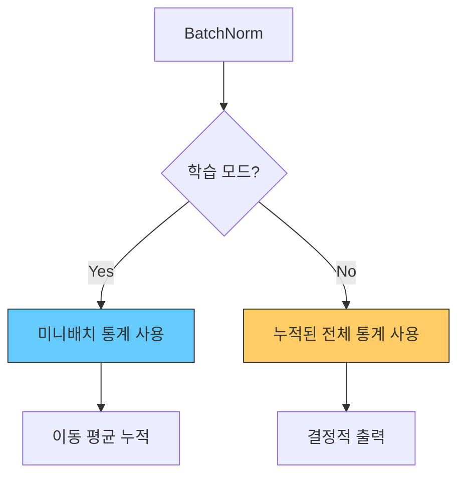
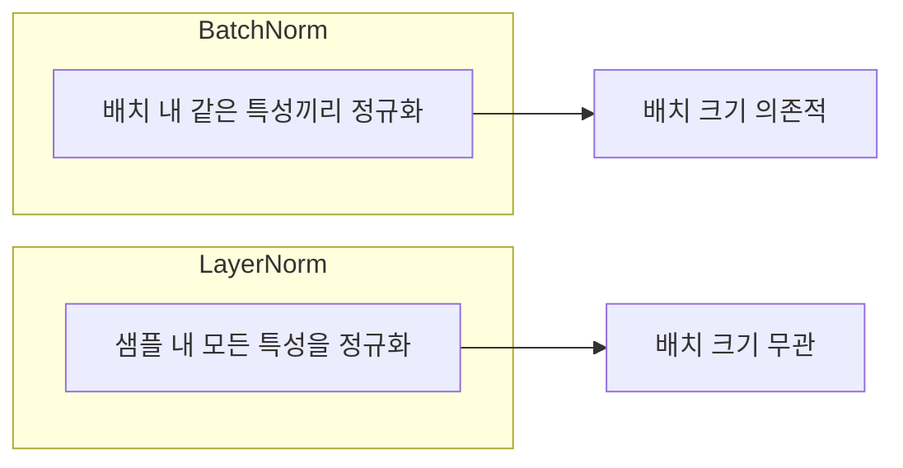

## 개요

정규화(Normalization) 기법은 신경망 학습에서 각 층의 입력 분포를 안정화하여 학습 속도를 높이고 깊은 네트워크의 훈련을 가능하게 한다. Ioffe & Szegedy(2015)가 제안한 배치 정규화(Batch Normalization)가 시초이며, 이후 레이어 정규화(Layer Normalization), RMSNorm 등이 등장했다. 현대 [[transformer-architecture]]에서는 LayerNorm과 RMSNorm이 표준이며, CNN에서는 BatchNorm이 여전히 지배적이다.

## 배치 정규화 (Batch Normalization)

### 핵심 아이디어

Ioffe & Szegedy는 "Batch Normalization: Accelerating Deep Network Training by Reducing Internal Covariate Shift"(2015) 논문에서, 학습 중 각 층의 입력 분포가 이전 층 파라미터 변화에 따라 계속 바뀌는 현상을 **내부 공변량 이동(Internal Covariate Shift)**이라 명명했다. 이 이동은 깊은 네트워크에서 증폭되어 학습을 불안정하게 만든다.

### 알고리즘

미니배치 B = {x1, ..., xm} 에 대해:

1. **평균 계산**: mu_B = (1/m) * SUM(xi)
2. **분산 계산**: sigma_B^2 = (1/m) * SUM((xi - mu_B)^2)
3. **정규화**: x_hat = (xi - mu_B) / sqrt(sigma_B^2 + eps)
4. **스케일 & 시프트**: yi = gamma * x_hat + beta

gamma(스케일)와 beta(시프트)는 학습 가능한 파라미터로, 정규화가 네트워크의 표현력을 손상시키지 않도록 복원 역할을 한다.

### 학습 vs 추론



- **학습**: 현재 미니배치의 평균/분산을 사용하고, 전체 통계량을 이동 평균(running mean/var)으로 누적
- **추론**: 누적된 전체 통계량을 사용하여 입력과 무관한 결정적(deterministic) 출력 보장

### 효과와 재해석

원래 내부 공변량 이동 감소가 핵심 메커니즘으로 제시되었지만, Santurkar 등(2018)의 후속 연구는 BatchNorm이 실제로는 **손실 표면을 매끄럽게**(smoother loss landscape) 만들어 기울기 예측 가능성을 높이는 것이 핵심이라고 밝혔다. 더 높은 학습률 사용이 가능해지고, 초기화 민감도가 줄어드는 이유도 이 평활화 효과로 설명된다.

ImageNet에서 14배 적은 학습 스텝으로 기존 모델과 동등한 성능을 달성하며, [[dropout]]을 대체하는 정규화 효과도 확인되었다.

## 레이어 정규화 (Layer Normalization)

### BatchNorm의 한계

BatchNorm은 배치 차원으로 정규화하므로 배치 크기에 의존적이다. 배치 크기가 작으면 통계량 추정이 불안정해지고, 시퀀스 길이가 가변적인 RNN이나 Transformer에는 적용이 어렵다.

### LayerNorm의 접근

Ba, Kiros, Hinton(2016)이 제안한 LayerNorm은 배치가 아닌 **단일 샘플의 특성(feature) 차원**을 따라 정규화한다.



| 비교 항목 | BatchNorm | LayerNorm |
|-----------|-----------|-----------|
| 정규화 축 | 배치 차원 (같은 특성의 서로 다른 샘플) | 특성 차원 (같은 샘플의 서로 다른 특성) |
| 배치 크기 의존 | 의존적 (작은 배치에서 불안정) | 무관 |
| 학습/추론 차이 | 이동 평균 필요 | 차이 없음 |
| 주 사용처 | CNN, 컴퓨터 비전 | Transformer, NLP, 시퀀스 모델 |

LayerNorm은 [[transformer-architecture]]의 표준 정규화 기법으로 자리잡았다. Pre-LN(층 앞에 배치)과 Post-LN(층 뒤에 배치) 위치에 따라 학습 안정성이 달라지며, 최근 LLM은 대부분 Pre-LN을 채택한다.

## RMSNorm

Zhang & Sennrich(2019)가 제안한 RMSNorm은 LayerNorm에서 평균 이동(re-centering)을 제거하고 RMS(Root Mean Square)로만 정규화한다.

```
RMSNorm(x) = x / RMS(x) * gamma
RMS(x) = sqrt((1/n) * SUM(xi^2))
```

- 평균 계산을 생략하여 계산 비용 절감 (약 10-15% 속도 향상)
- LLaMA, Gemma 등 최신 LLM에서 LayerNorm 대신 채택

## 어디에 무엇을 쓸까

| 아키텍처 | 권장 정규화 |
|----------|------------|
| CNN (ResNet 등) | BatchNorm |
| Transformer / LLM | LayerNorm 또는 RMSNorm |
| RNN / LSTM | LayerNorm |
| GAN 생성자 | BatchNorm 또는 InstanceNorm |
| 소규모 배치 학습 | LayerNorm, GroupNorm |

정규화 기법은 [[activation-functions]] 선택, [[weight-initialization]] 전략과 함께 딥러닝 학습 안정성의 세 기둥을 이룬다. [[overfitting-regularization]]의 관점에서 BatchNorm은 암묵적 정규화 효과도 제공한다.

## 관련 문서
- [[group-normalization]] -- 그룹 정규화 (GroupNorm / InstanceNorm / AdaLayerNorm)

- [[perceptron-mlp]] - 정규화가 적용되는 신경망 구조
- [[activation-functions]] - 정규화 후 적용되는 비선형 변환
- [[weight-initialization]] - 정규화와 함께 학습 안정성을 결정
- [[dropout]] - 또 다른 정규화 기법, BatchNorm과 상호 대체 가능
- [[transformer-architecture]] - LayerNorm/RMSNorm이 표준인 아키텍처
- [[rmsnorm]] - RMSNorm 상세: re-centering 제거 원리, 현대 LLM 채택 현황
- [[pre-ln-vs-post-ln]] - 정규화 배치 위치에 따른 학습 안정성
- [[overfitting-regularization]] - 정규화 기법의 상위 범주
