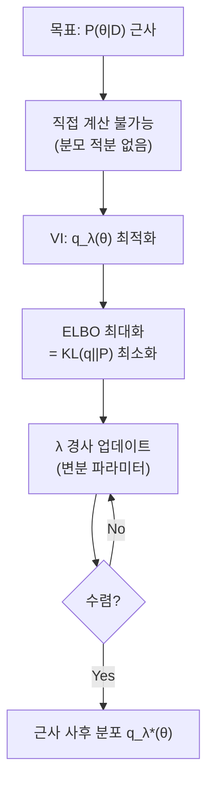

# 베이즈 추론 심화 (Bayesian Inference)

## 베이즈 정리와 사후 분포

베이즈 정리(Bayes' theorem)는 관측 데이터 $\mathcal{D}$를 이용해 파라미터 $\theta$에 대한 믿음을 갱신하는 원리다.

$$P(\theta \mid \mathcal{D}) = \frac{P(\mathcal{D} \mid \theta) \cdot P(\theta)}{P(\mathcal{D})}$$

- $P(\theta)$: 사전 분포(prior) - 데이터 관측 전 믿음
- $P(\mathcal{D} \mid \theta)$: 우도(likelihood) - 주어진 $\theta$에서 데이터가 나올 확률
- $P(\theta \mid \mathcal{D})$: 사후 분포(posterior) - 데이터 관측 후 갱신된 믿음
- $P(\mathcal{D})$: 증거(evidence) - 정규화 상수, 보통 계산 불가

## 사후 분포 계산의 어려움

$$P(\mathcal{D}) = \int P(\mathcal{D} \mid \theta) P(\theta) d\theta$$

이 적분은 대부분 해석적(analytical) 해가 없다. 켤레 사전 분포(conjugate prior)를 사용하면 사후 분포를 닫힌 형태로 구할 수 있지만, 실제 모델에는 적용이 제한적이다.

## MCMC (Markov Chain Monte Carlo)

MCMC는 사후 분포 $P(\theta \mid \mathcal{D})$에서 샘플을 직접 추출해 기댓값을 근사하는 방법이다.

**Metropolis-Hastings 알고리즘**:
1. 현재 상태 $\theta^{(t)}$에서 제안 분포 $q(\theta' \mid \theta^{(t)})$로 후보 $\theta'$ 샘플링
2. 수용 확률 $\alpha = \min\left(1, \frac{P(\mathcal{D}|\theta') P(\theta') q(\theta^{(t)}|\theta')}{P(\mathcal{D}|\theta^{(t)}) P(\theta^{(t)}) q(\theta'|\theta^{(t)})}\right)$ 계산
3. 확률 $\alpha$로 $\theta'$ 수용, 그렇지 않으면 $\theta^{(t)}$ 유지

**Gibbs Sampling**: 각 변수를 다른 변수들의 조건부 분포에서 순차적으로 샘플링. 조건부 분포가 쉽게 계산될 때 효율적.

MCMC의 단점: 대규모 신경망에 적용하기엔 계산 비용이 매우 높고, 수렴(convergence) 진단이 어렵다.

## Variational Inference (VI)

VI는 사후 분포 $P(\theta \mid \mathcal{D})$를 직접 계산하는 대신, 다루기 쉬운 분포 패밀리 $q_\lambda(\theta)$ 중에서 가장 가까운 것을 최적화로 찾는다.



**ELBO(Evidence Lower Bound)**:

$$\mathcal{L}(\lambda) = \mathbb{E}_{q_\lambda}[\log P(\mathcal{D} \mid \theta)] - D_{KL}(q_\lambda(\theta) \| P(\theta))$$

ELBO를 최대화 = KL 발산 최소화. 평균장 근사(mean-field approximation)에서는 $q_\lambda(\theta) = \prod_i q_i(\theta_i)$로 독립 분해한다.

## MC Dropout: 실용적 불확실성 추정

Gal & Ghahramani (2016)은 드롭아웃(dropout)을 추론 시에도 켜두고 여러 번 포워드 패스(forward pass)를 수행하면 베이즈 근사와 동등하다는 것을 보였다.

```python
# 추론 시 드롭아웃 활성화 (예시 pseudocode)
model.train()  # dropout ON
predictions = [model(x) for _ in range(T)]
mean = torch.stack(predictions).mean(0)
uncertainty = torch.stack(predictions).var(0)
```

모델 불확실성(model uncertainty)은 예측의 분산으로 추정한다. Out-of-distribution 탐지, 능동 학습(active learning)에 활용된다.

## Bayesian Neural Networks (BNNs) 개요

BNN은 가중치 $w$를 점 추정(point estimate) 대신 분포로 표현한다.

$$P(y \mid x, \mathcal{D}) = \int P(y \mid x, w) P(w \mid \mathcal{D}) dw$$

실용적으로는 MCMC나 VI로 근사하며, MC Dropout이 가장 간단한 실용적 대안이다. BNN은 의료·자율주행 등 안전이 중요한 도메인에서 예측 불확실성 정량화(uncertainty quantification)에 활용된다.

## 관련 문서

- [[probability-statistics-for-ml]]
- [[EM 알고리즘과 GMM]]
- [[kl-divergence]]
- [[autoencoders-vae]]
