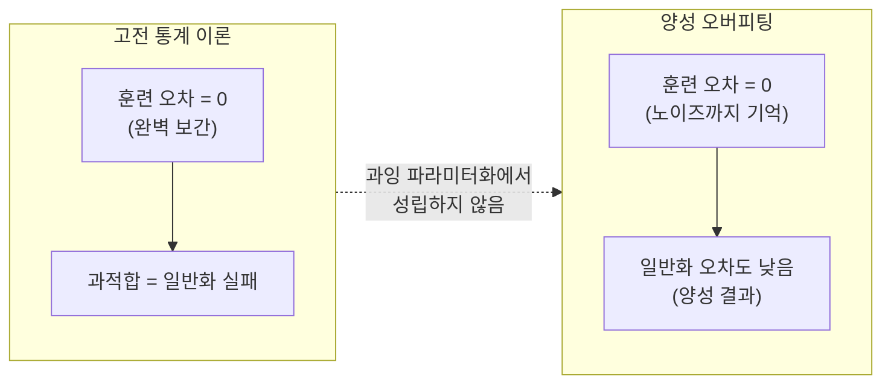
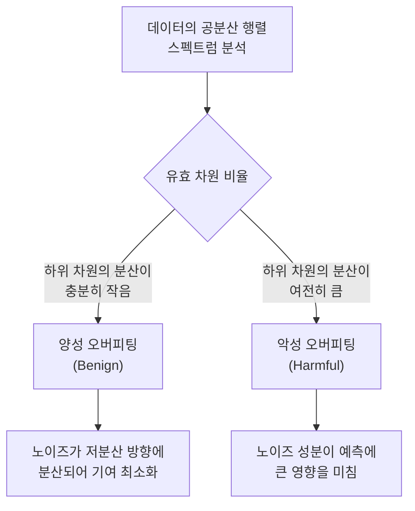

# 양성 오버피팅 (Benign Overfitting)

## 개요

양성 오버피팅(Benign Overfitting)은 과잉 파라미터화(overparameterized) 모델이 훈련 데이터(노이즈 포함)를 완벽히 보간(interpolate)하면서도 새로운 데이터에 우수한 일반화 성능을 보이는 현상이다. Bartlett et al.(2020)이 선형 회귀에서 이를 수학적으로 분석하며 명명했다.

고전 통계 이론에서 오버피팅은 항상 일반화를 해친다고 가르쳐왔지만, 양성 오버피팅은 이 직관을 정면으로 반박한다. [[double-descent]] 현상의 과잉 파라미터화 영역에서 발생하며, 현대 딥러닝의 "왜 거대 모델이 잘 되는가"를 설명하는 핵심 이론 중 하나다.

## 고전 이론과의 충돌

핵심 조건: 파라미터 수 $p$가 샘플 수 $n$보다 훨씬 클 때($p \gg n$), 즉 훈련 데이터를 완벽히 기억할 수 있는 자유도가 있을 때만 발생한다.

## 최소 노름 보간 (Minimum-Norm Interpolation)

양성 오버피팅이 가능한 핵심 메커니즘은 최소 노름 보간이다. $p > n$ 선형 시스템 $X\theta = y$는 해가 무한히 많다. 이 중 경사 하강은 $\ell_2$ 노름이 최소인 해를 찾는다:

$$\hat{\theta} = X^T(XX^T)^{-1}y = \arg\min_\theta \|\theta\|_2 \text{ s.t. } X\theta = y$$

최소 노름 해의 일반화 오차는 다음 조건에서 낮아진다:

1. **신호 방향**: 참 신호 $\theta^*$가 주성분 방향(high-variance 특성 공간)에 놓여 있을 때
2. **노이즈 분산**: 노이즈가 저분산 방향에 분산되어 최소 노름 해에서 작은 영향만 미칠 때
3. **유효 차원**: 데이터의 유효 차원(effective rank)이 노이즈 수준에 비해 클 때

## [[bias-variance-tradeoff]] 재해석

양성 오버피팅은 편향-분산 트레이드오프의 확장된 이해를 요구한다:

| 체제 | 편향 | 분산 | 테스트 오차 |
|------|------|------|------------|
| 과소 파라미터화 | 높음 | 낮음 | 높음 (고편향) |
| 보간 임계점 | 낮음 | 매우 높음 | 매우 높음 (피크) |
| 과잉 파라미터화 (양성) | 낮음 | 낮음~중간 | 낮음 (역설) |

보간 임계점($p = n$ 근처)에서는 유일한 보간 해가 존재하고 이것이 불안정하다. 과잉 파라미터화 영역에서는 수많은 보간 해 중 최소 노름 해가 선택되며, 이 해가 충분히 "부드러워" 분산이 다시 감소한다.

## 언제 양성, 언제 악성 오버피팅인가

Bartlett et al.(2020)은 스펙트럼 붕괴(spectral decay) 조건으로 구분했다:

- **양성 오버피팅 조건**: 데이터의 공분산 스펙트럼이 빠르게 감소(polynomial/exponential decay)하고, 노이즈는 저분산 방향에 고르게 분산
- **악성 오버피팅 조건**: 스펙트럼이 천천히 감소하여 노이즈가 고분산 방향을 오염

## 신경망에서의 증거

이론은 선형 모델에서 가장 깔끔하게 증명되지만, 신경망에서도 유사 현상이 관찰된다:

- **OpenAI grokking 연구**: 충분히 오래 훈련하면 완벽 보간 후에도 일반화가 향상
- **SGD의 암묵적 정규화**: SGD는 최소 노름 해 방향으로 수렴하는 경향 (NTK 이론 지지)
- **LLM 스케일링**: 파라미터 수가 데이터 수를 크게 초과해도 일반화 성능 향상

[[double-descent]]의 과잉 파라미터화 영역은 양성 오버피팅 체제에 해당한다.

## 암묵적 정규화와의 관계

양성 오버피팅이 동작하려면 알고리즘이 "좋은" 보간 해를 선택해야 한다. SGD 기반 훈련에서:

- **경사 흐름(gradient flow)**: 최소 노름 해로 수렴하는 연속 버전의 GD
- **배치 크기 효과**: 작은 배치 SGD는 더 강한 암묵적 정규화 효과
- **초기화**: 0에 가까운 초기화에서 최소 노름 해로의 수렴이 촉진

## 실무 함의

- **조기 종료 재검토**: 훈련 오차가 0이 된 이후에도 계속 훈련하면 일반화가 개선될 수 있다
- **모델 크기**: 보간 임계점 근처의 중간 크기 모델이 최악일 수 있다 (더 크거나 더 작게)
- **정규화의 역할 변화**: 과잉 파라미터화 체제에서 명시적 정규화는 덜 결정적

## 관련 문서

- [[double-descent]] - 양성 오버피팅이 나타나는 과잉 파라미터화 체제의 현상
- [[bias-variance-tradeoff]] - 양성 오버피팅이 재해석하는 고전 편향-분산 프레임워크
- [[neural-tangent-kernel]] - 최소 노름 보간의 이론적 기반을 제공하는 무한 폭 한계 이론
- [[grokking]] - 완벽 보간 후 일반화가 지연되어 나타나는 관련 현상
- [[implicit-regularization]] - SGD가 특정 해 구조를 선호하는 암묵적 효과
