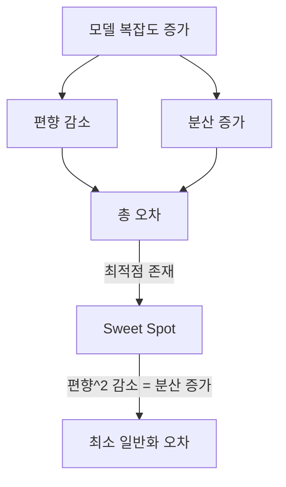

# 편향-분산 트레이드오프 (Bias-Variance Tradeoff)

모델의 예측 오차는 편향(bias), 분산(variance), 줄일 수 없는 노이즈의 세 가지로 분해된다. 편향과 분산은 서로 반비례 관계에 있어, 하나를 줄이면 다른 하나가 증가하는 경향이 있다. 이 균형을 이해하는 것이 일반화 성능의 핵심이다.

## 오차의 분해

기대 예측 오차(MSE 기준)는 다음과 같이 분해된다:

```
E[(y - f_hat(x))^2] = Bias^2 + Variance + Irreducible Noise
```

- **편향 (Bias)**: 모델의 가정이 단순하여 실제 패턴을 놓치는 오차. 학습 알고리즘의 잘못된 가정에서 발생
- **분산 (Variance)**: 학습 데이터의 변동에 대한 모델 예측의 민감도. 데이터가 바뀌면 예측도 크게 바뀐다
- **불가축 노이즈**: 데이터 자체에 내재된 무작위성. 어떤 모델도 줄일 수 없다

## 과소적합과 과대적합


### 과소적합 (Underfitting) - 높은 편향

- 모델이 데이터의 패턴을 충분히 포착하지 못한다
- 학습 데이터에서도 오차가 크다
- 예: 비선형 데이터에 선형 모델을 적용

### 과대적합 (Overfitting) - 높은 분산

- 모델이 학습 데이터의 노이즈까지 학습한다
- 학습 데이터에서는 오차가 작지만, 새 데이터에서는 크다
- 예: 10개 데이터에 9차 다항식을 적용
- [[overfitting-regularization|정규화]]로 완화한다

## 시각적 이해

과녁 비유로 편향과 분산을 이해할 수 있다:

| | 낮은 분산 | 높은 분산 |
|---|----------|----------|
| **낮은 편향** | 정중앙에 밀집 (이상적) | 흩어져 있지만 평균은 정중앙 |
| **높은 편향** | 한쪽으로 치우쳐 밀집 | 한쪽으로 치우치고 흩어짐 (최악) |

## 모델 복잡도와의 관계



모델 복잡도를 높이면:
1. 편향은 단조 감소한다 (더 복잡한 패턴 포착 가능)
2. 분산은 단조 증가한다 (데이터에 더 민감)
3. 총 오차는 U자 곡선을 그린다
4. U자 곡선의 최저점이 최적 복잡도

## 편향-분산 트레이드오프 관리 전략

### 높은 편향 해결 (과소적합)

- 모델 복잡도를 높인다 (더 깊은 네트워크, 더 많은 특성)
- 더 나은 특성을 만든다 ([[feature-engineering|특성 공학]])
- 정규화를 줄인다

### 높은 분산 해결 (과대적합)

- 학습 데이터를 늘린다
- [[overfitting-regularization|정규화]]를 적용한다 (L1, L2, 드롭아웃)
- 모델 복잡도를 줄인다
- 앙상블 방법 사용 (배깅, 랜덤 포레스트)
- [[cross-validation-model-evaluation|교차 검증]]으로 모니터링

### 실용적 진단

| 증상 | 진단 | 대응 |
|------|------|------|
| 학습 오차 높음, 검증 오차 높음 | 높은 편향 | 모델 키우기 |
| 학습 오차 낮음, 검증 오차 높음 | 높은 분산 | 정규화, 데이터 추가 |
| 학습 오차 낮음, 검증 오차 낮음 | 적정 | 유지 |

## 딥러닝에서의 재해석

전통적 편향-분산 트레이드오프와 달리, 딥러닝에서는 "이중 하강(double descent)" 현상이 관찰된다:

- 모델 크기가 보간(interpolation) 임계점을 넘으면 테스트 오차가 다시 감소한다
- 매우 큰 모델이 오히려 더 잘 일반화할 수 있다
- 이는 전통적 편향-분산 프레임워크의 확장을 요구한다

현대 LLM의 스케일링 법칙도 이와 관련된다: 모델과 데이터를 함께 충분히 키우면, 편향과 분산을 동시에 줄일 수 있다.

## 관련 문서

- [[overfitting-regularization]] -- 분산을 줄이는 구체적 기법
- [[cross-validation-model-evaluation]] -- 편향/분산을 진단하는 평가 방법
- [[loss-functions]] -- 오차 분해의 기반이 되는 손실 함수
- [[supervised-unsupervised-reinforcement]] -- 지도 학습에서의 트레이드오프
- [[feature-engineering]] -- 편향을 줄이기 위한 특성 개선

## 참고 자료

- [Bias-Variance Tradeoff - Wikipedia](https://en.wikipedia.org/wiki/Bias%E2%80%93variance_tradeoff)
- [What is Bias-Variance Tradeoff? - IBM](https://www.ibm.com/think/topics/bias-variance-tradeoff)
- [Bias-Variance Tradeoff: How Models Fail in Production - DataCamp](https://www.datacamp.com/tutorial/bias-variance-tradeoff)
