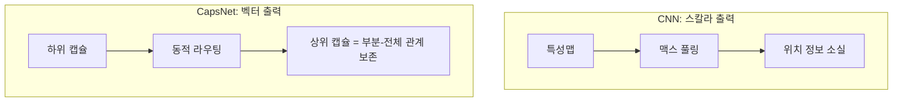

# 캡슐 네트워크

Hinton et al. (2017)이 제안한 아키텍처로, 뉴런 대신 **캡슐(capsule)**--벡터 출력을 가진 뉴런 그룹--을 기본 단위로 사용한다. 벡터의 방향은 엔티티의 속성(위치, 크기, 방향)을, 크기는 존재 확률을 인코딩한다.

## CNN의 한계와 캡슐의 동기

[[cnn|CNN]]은 맥스 풀링으로 위치 불변성을 얻지만, 부분-전체 관계(spatial hierarchy)를 버린다. "얼굴" = 눈 + 코 + 입이라는 구조적 관계를 인코딩하지 못해, 눈과 코의 위치가 뒤바뀌어도 "얼굴"로 인식할 수 있다.

캡슐 네트워크는 **등변성(equivariance)**을 추구한다: 입력의 변환이 출력에도 반영되어야 한다.

## 동적 라우팅 (Dynamic Routing)

하위 캡슐 $i$가 상위 캡슐 $j$에 "투표"하는 반복적 합의 과정:

1. 하위 캡슐 $i$의 출력 $u_i$에 변환 행렬 $W_{ij}$를 곱해 예측 벡터 $\hat{u}_{j|i} = W_{ij} u_i$ 생성
2. 결합 계수 $c_{ij}$를 softmax로 초기화
3. 상위 캡슐 $s_j = \sum_i c_{ij} \hat{u}_{j|i}$를 squash 함수로 정규화
4. 예측과 실제 출력의 일치도에 따라 $c_{ij}$ 갱신 (3-5회 반복)

## Squash 함수

벡터의 방향은 유지하면서 크기를 0-1 범위로 압축:

$$\text{squash}(s_j) = \frac{||s_j||^2}{1 + ||s_j||^2} \frac{s_j}{||s_j||}$$

## 한계와 현재 위치

- **계산 비용**: 동적 라우팅의 반복 연산으로 CNN 대비 느림
- **스케일링 어려움**: 대규모 이미지에서 캡슐 수가 폭발적으로 증가
- **주류 대비 뒤처짐**: [[transformer-architecture|Transformer]]/ViT 계열이 비전 SOTA를 장악하면서 캡슐넷 연구는 상대적으로 축소

그러나 부분-전체 관계 모델링이라는 핵심 아이디어는 [[graph-neural-networks|GNN]]의 메시지 패싱, [[slot-attention|Slot Attention]] 등에 영향을 줬다.

## 관련 문서

- [[cnn]] -- 합성곱 신경망
- [[graph-neural-networks]] -- 그래프 신경망 (메시지 패싱 유사성)
- [[attention-mechanism-overview]] -- 어텐션 메커니즘 (라우팅과의 연결)
