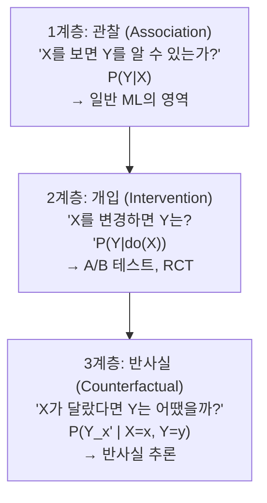
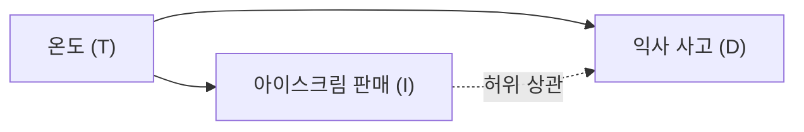

# 인과 추론과 머신러닝 (Causal Inference & ML)

전통적 머신러닝은 **상관관계(correlation)**를 학습한다. 하지만 실세계 의사결정에서는 "X를 변경하면 Y가 어떻게 될까?"라는 **인과적 질문(causal question)**이 필요하다. 인과 추론은 이 간극을 메우는 방법론으로, Judea Pearl의 do-calculus와 구조적 인과 모델(SCM)이 핵심 수학적 틀을 제공한다.

## 인과성의 세 계층 (Pearl's Ladder of Causation)

대부분의 ML 모델은 1계층(관찰)에 머물러 있다. 분포 이동(distribution shift)에 취약한 이유 중 하나가 여기에 있다.

## 구조적 인과 모델 (SCM)

SCM은 변수 집합 $\{X_1, ..., X_n\}$과 각 변수의 생성 메커니즘(structural equation)으로 구성된다:

$$X_i = f_i(PA_i, U_i)$$

여기서 $PA_i$는 $X_i$의 직접 원인(parents), $U_i$는 외생 노이즈 변수다. SCM은 **방향성 비순환 그래프(DAG)**로 시각화된다.

**예시: 온도 → 아이스크림 판매 ← 익사 사고**

아이스크림 판매와 익사 사고는 양의 상관관계를 보이지만, 온도라는 공통 원인(confouder)이 있을 뿐 인과 관계가 없다. 관찰 데이터만으로는 이 사실을 알 수 없다.

## do-calculus와 개입 분포

Pearl의 **do-calculus**는 관찰 분포 $P(Y|X)$에서 개입 분포 $P(Y|do(X=x))$를 계산하는 규칙 체계다.

$do(X=x)$는 외부에서 강제로 $X$를 $x$로 고정하는 연산이다. 이때 $X$의 원인 변수들로부터의 모든 화살표가 DAG에서 제거된다(graph surgery).

### 백도어 기준 (Backdoor Criterion)

관찰 변수 집합 $Z$가 $X \to Y$ 경로에서 모든 백도어 경로를 차단하면:

$$P(Y|do(X)) = \sum_z P(Y|X, Z=z) P(Z=z)$$

이를 **조정 공식(adjustment formula)**이라 한다. 혼란 변수를 조건부로 취하면 인과 효과를 관찰 데이터만으로 추정할 수 있다.

## 반사실 추론 (Counterfactual Reasoning)

반사실 질문의 예: "이 환자에게 약을 투여하지 않았다면 회복했을까?"

SCM에서 반사실 추론은 세 단계로 이루어진다:

1. **역산(Abduction)**: 관찰 사실 $(X=x, Y=y)$에서 외생 노이즈 $U$의 사후 분포 추론
2. **개입(Action)**: 반사실 조건 $do(X=x')$ 적용
3. **예측(Prediction)**: 수정된 모델에서 $Y$의 값 계산

## ML과의 연결점

### 분포 이동 강건성

인과 표현을 학습하면 분포 이동에 강건해진다. 원인 특징(causal feature)은 도메인이 바뀌어도 $Y$와의 관계가 유지되지만, 상관 특징(spurious feature)은 바뀐다.

### 인과 표현 학습

- **Invariant Risk Minimization (IRM)**: 여러 환경에서 불변인 예측자를 학습
- **DRIT/iCaRL**: 잠재 공간에서 인과 구조 발견
- **CausalVAE**: VAE([[autoencoders-vae]])에 인과 그래프를 내재화

### 베이지안 추론과의 관계

[[bayesian-inference]]는 관찰을 통한 믿음 갱신(1계층)에 속한다. 베이지안 네트워크와 SCM은 모두 DAG를 사용하지만, 베이지안 네트워크는 개입 연산 $do(\cdot)$을 직접 지원하지 않는다. SCM은 베이지안 네트워크보다 더 강한 인과 가정을 인코딩한다.

## 주요 추정 방법

| 방법 | 아이디어 | 가정 |
|------|---------|------|
| 무작위 대조 실험 (RCT) | $X$를 무작위 배정 | 없음 (황금 기준) |
| 도구 변수 (IV) | $Z$가 $X$에만 영향 | IV 외생성 |
| 이중 차이 (DiD) | 처치/통제 집단 비교 | 병렬 추세 |
| 회귀 불연속 (RD) | 임계값 주변 불연속성 | 임계값 연속성 |
| 성향 점수 매칭 (PSM) | 처치 확률로 매칭 | 무시 가능성 (ignorability) |

## 실무 적용

- **추천 시스템 탈편향**: 노출 편향(exposure bias)을 인과적으로 제거
- **의료 AI**: 처치 효과 추정(CATE, Conditional Average Treatment Effect)
- **강화학습**: 오프-폴리시 평가에서 반사실 추정 활용
- **ML 공정성**: 민감 속성의 직접적 인과 경로 차단 ([[probability-statistics-for-ml]] 연결)

## 한계와 주의사항

1. **비식별성**: 일부 인과 효과는 관찰 데이터만으로 식별 불가
2. **DAG 명세 오류**: 잘못된 그래프 구조가 치명적 오류 유발
3. **측정되지 않은 혼란 변수**: 잠재적 혼란 변수를 완전히 제어하기 어려움
4. **고차원 문제**: 변수 수가 많으면 DAG 구조 학습 자체가 NP-hard

## 관련 문서

- [[bayesian-inference]] - 확률론적 추론의 기초 (1계층 관찰)
- [[probability-statistics-for-ml]] - 통계적 추론과 인과 추론의 경계
- [[autoencoders-vae]] - 인과 표현 학습에 활용되는 잠재 변수 모델
