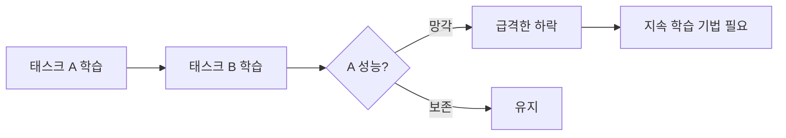

# 지속 학습 이론

순차적으로 새로운 태스크를 학습할 때 이전 태스크의 지식이 급격히 소멸하는 **치명적 망각(Catastrophic Forgetting)** 문제와 이를 해결하기 위한 지속 학습(Continual Learning) 전략을 다룬다.

## 문제 정의

신경망이 태스크 A를 학습한 후 태스크 B를 학습하면, A에 대한 성능이 급격히 하락한다. 이는 태스크 B의 경사 업데이트가 A의 중요 파라미터를 덮어쓰기 때문이다.

## 3대 접근법

### 1. 정규화 기반 (Regularization-Based)

중요 파라미터의 변화를 제한하는 페널티 항을 추가한다.

- **EWC (Elastic Weight Consolidation)**: Fisher 정보 행렬로 파라미터 중요도를 측정하고, 중요한 파라미터의 변화에 큰 페널티 부과. $L_{EWC} = L_B + \frac{\lambda}{2} \sum_i F_i (\theta_i - \theta_{A,i}^*)^2$
- **SI (Synaptic Intelligence)**: 온라인으로 파라미터 중요도를 누적 추적
- **MAS (Memory Aware Synapses)**: 출력 민감도 기반 중요도 측정

### 2. 리플레이 기반 (Replay-Based)

이전 태스크의 데이터(또는 생성된 유사 데이터)를 새 학습에 혼합한다.

- **Experience Replay**: 이전 데이터의 소규모 버퍼를 유지하며 새 데이터와 함께 학습
- **Generative Replay**: 생성 모델(VAE/GAN)로 이전 데이터를 합성해 리플레이
- **Dark Experience Replay**: 출력 로짓을 저장해 [[knowledge-distillation|지식 증류]] 방식으로 리플레이

### 3. 아키텍처 기반 (Architecture-Based)

네트워크 구조 자체를 태스크별로 분리한다.

- **PackNet**: 프루닝 후 남는 용량에 새 태스크 할당
- **Progressive Networks**: 태스크마다 새 컬럼 추가, 이전 컬럼은 동결
- **HAT (Hard Attention to the Task)**: 태스크별 어텐션 마스크로 파라미터 보호

## LLM에서의 지속 학습

[[continual-learning-llm|LLM 지속 학습]]에서는 추가적인 고려사항이 있다:

- **LR 재가열(Re-warming)**: 새 도메인 데이터 투입 시 학습률을 일시적으로 올렸다가 다시 감쇠
- **데이터 리플레이 비율**: 일반 코퍼스를 10-20% 혼합해 일반 능력 유지
- **LoRA 기반 분리**: 태스크별 [[lora-qlora-finetuning|LoRA]] 어댑터로 베이스 모델은 동결

## 평가 지표

| 지표 | 의미 |
|------|------|
| Average Accuracy | 모든 태스크의 평균 정확도 |
| Backward Transfer (BWT) | 이전 태스크 성능 변화량 (음수=망각) |
| Forward Transfer (FWT) | 이전 학습이 새 태스크에 미치는 긍정적 전이 |

## 관련 문서

- [[continual-learning-llm]] -- LLM 지속 학습 실전
- [[transfer-learning]] -- 전이 학습
- [[knowledge-distillation]] -- 지식 증류
- [[domain-adaptive-continual-pretraining]] -- 도메인 적응형 지속 사전학습
- [[catastrophic-forgetting]] -- 치명적 망각 상세
