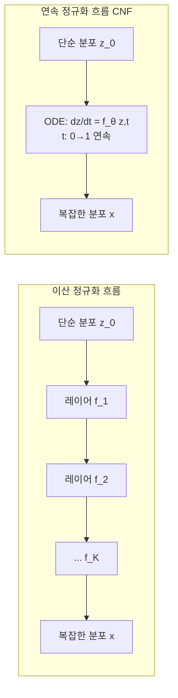

# 연속 정규화 흐름 (CNF)

## 정의와 배경

연속 정규화 흐름(Continuous Normalizing Flows, CNF)은 이산 단계의 가역 변환(discrete normalizing flows) 대신 **연속 시간의 미분방정식(ODE)**으로 밀도 변환을 정의하는 생성 모델 프레임워크다. Neural ODE의 확률론적 응용이다.

표준 정규화 흐름(normalizing flows)이 $K$개의 이산 가역 레이어를 쌓는다면, CNF는 연속 시간 $t \in [0, 1]$에 걸쳐 흐름 벡터 필드(flow vector field)를 따라 변환이 연속으로 이루어진다.

---

## 정규화 흐름 복습

### 이산 정규화 흐름

단순 분포 $z_0$에서 복잡한 분포 $x$로의 변환:

$$z_K = f_K \circ f_{K-1} \circ \cdots \circ f_1(z_0)$$

로그 가능도는 야코비안 행렬식(Jacobian determinant)으로 계산:

$$\log p(x) = \log p(z_0) - \sum_{k=1}^K \log \left|\det \frac{\partial f_k}{\partial z_{k-1}}\right|$$

**한계**: 야코비안 행렬식 계산을 효율적으로 하려면 $f$의 구조에 제약 필요 (coupling layers 등).

---

## CNF: 연속 시간 ODE로의 확장

### 핵심 정의

CNF는 시간 $t$에 따른 상태 $z(t)$의 변화를 벡터 필드 $f_\theta$로 정의한다:

$$\frac{dz(t)}{dt} = f_\theta(z(t), t)$$

초기 조건 $z(0) \sim p_0$ (단순 분포, 보통 가우시안)에서 ODE를 $t=1$까지 풀면 복잡한 분포 $p_1$의 샘플을 얻는다.

### 순간 변화 공식 (Instantaneous Change of Variables)

연속 시간에서 로그 밀도의 변화율:

$$\frac{d \log p(z(t))}{dt} = -\text{tr}\left(\frac{\partial f_\theta}{\partial z(t)}\right)$$

즉 로그 밀도 변화가 야코비안의 **행렬식(determinant)** 대신 **대각합(trace)**으로 계산된다.

전체 로그 가능도:

$$\log p_1(z(1)) = \log p_0(z(0)) - \int_0^1 \text{tr}\left(\frac{\partial f_\theta}{\partial z}\right) dt$$

---

## FFJORD: 효율적 CNF

Chen et al. (2018)의 FFJORD (Free-Form Jacobian of Reversible Dynamics)는 CNF의 실용적 구현이다.

### 핵심 개선: 허친슨 추정량 (Hutchinson Estimator)

대각합 계산도 $O(d^2)$ 비용이 든다. FFJORD는 확률론적 추정으로 $O(d)$로 낮춘다:

$$\text{tr}(A) = \mathbb{E}_{\epsilon \sim p(\epsilon)}\left[\epsilon^T A \epsilon\right]$$

여기서 $\epsilon$은 표준정규 또는 Rademacher 분포에서 샘플링한다.

```python
def hutchinson_trace_estimate(f, z, n_estimates=1):
    """
    tr(∂f/∂z)의 확률론적 추정
    f: 벡터 필드, z: 현재 상태
    """
    eps = torch.randn_like(z)  # 또는 Rademacher 샘플
    # JVP (Jacobian-Vector Product) 계산
    _, jvp = torch.autograd.functional.jvp(f, z, eps)
    trace_estimate = (eps * jvp).sum(-1)
    return trace_estimate
```

### CNF 학습 파이프라인

```python
from torchdiffeq import odeint

class CNF(nn.Module):
    def __init__(self, dynamics_net):
        super().__init__()
        self.dynamics = dynamics_net

    def forward(self, z0, integration_times):
        # ODE 풀기: z0 -> z1
        def odefunc(t, state):
            z, logpz = state
            dz = self.dynamics(t, z)
            # 대각합 추정
            dtrace = -hutchinson_trace_estimate(
                lambda x: self.dynamics(t, x), z
            )
            return dz, dtrace

        z1, delta_logp = odeint(
            odefunc,
            (z0, torch.zeros(z0.shape[0])),
            integration_times,
            method='dopri5'  # Dormand-Prince RK45
        )
        return z1, delta_logp
```

---

## 이산 흐름 vs 연속 흐름 비교



| 항목 | 이산 흐름 | 연속 흐름 (CNF) |
|------|-----------|----------------|
| 변환 구조 | K개 이산 레이어 | ODE 1개 (연속) |
| 야코비안 비용 | 행렬식 $O(d^3)$ or 구조 제약 | 대각합 $O(d)$ (FFJORD) |
| 아키텍처 자유도 | 가역 구조 강제 | 임의 신경망 가능 |
| 역변환 | 레이어 역순 적용 | ODE 역방향 적분 |
| 추론 속도 | 빠름 | 느림 (ODE solver 호출) |

---

## 흐름 매칭 (Flow Matching)의 이론적 배경

FFJORD의 느린 추론 속도 문제를 해결하기 위해 Lipman et al. (2022)의 **흐름 매칭(Flow Matching)**이 제안되었다.

### 핵심 아이디어

CNF의 벡터 필드 $f_\theta$를 ODE 경로를 시뮬레이션하지 않고 **회귀로 직접 학습**:

$$\mathcal{L}_{FM} = \mathbb{E}_{t, x_0, x_1}\left[\|f_\theta(z_t, t) - u_t(z_t | x_0, x_1)\|^2\right]$$

여기서 $u_t$는 목표 벡터 필드, $z_t = (1-t)x_0 + t \cdot x_1$는 선형 보간이다.

흐름 매칭은 CNF의 이론적 기반을 유지하면서 FFJORD보다 훨씬 빠른 학습과 추론을 달성한다. Stable Diffusion 3, FLUX 등 최신 이미지 생성 모델의 이론 배경이다.

---

## 실무 활용

### 주요 응용

- **분자 구조 생성**: 원자 좌표의 연속 흐름 모델링 (e3-equivariant CNF)
- **음성 생성(TTS)**: Grad-TTS, 멜 스펙트로그램의 CNF 기반 생성
- **이미지 생성**: 흐름 매칭 기반 DiT 모델 (SD3, FLUX)
- **베이지안 VI**: 복잡한 $q(z)$ 표현 (normalizing flows for VI)

### 한계와 실용 고려사항

- **추론 속도**: ODE solver가 매 샘플 생성 시 다단계 함수 평가 필요, 확산 모델 대비 느릴 수 있음
- **메모리**: 역방향 ODE 적분 시 모든 중간 상태 저장 필요 (adjoint method로 완화)
- **하이퍼파라미터**: ODE solver 허용 오차(tolerance), 적분 방법 선택이 속도-정확도 트레이드오프

---

## 관련 문서

- [[normalizing-flows]] - 이산 정규화 흐름 기초
- [[neural-ode]] - Neural ODE와 연속 시간 모델
- [[variational-inference-deep]] - 변분 추론에서 흐름의 활용
- [[energy-based-models]] - 에너지 기반 생성 모델
