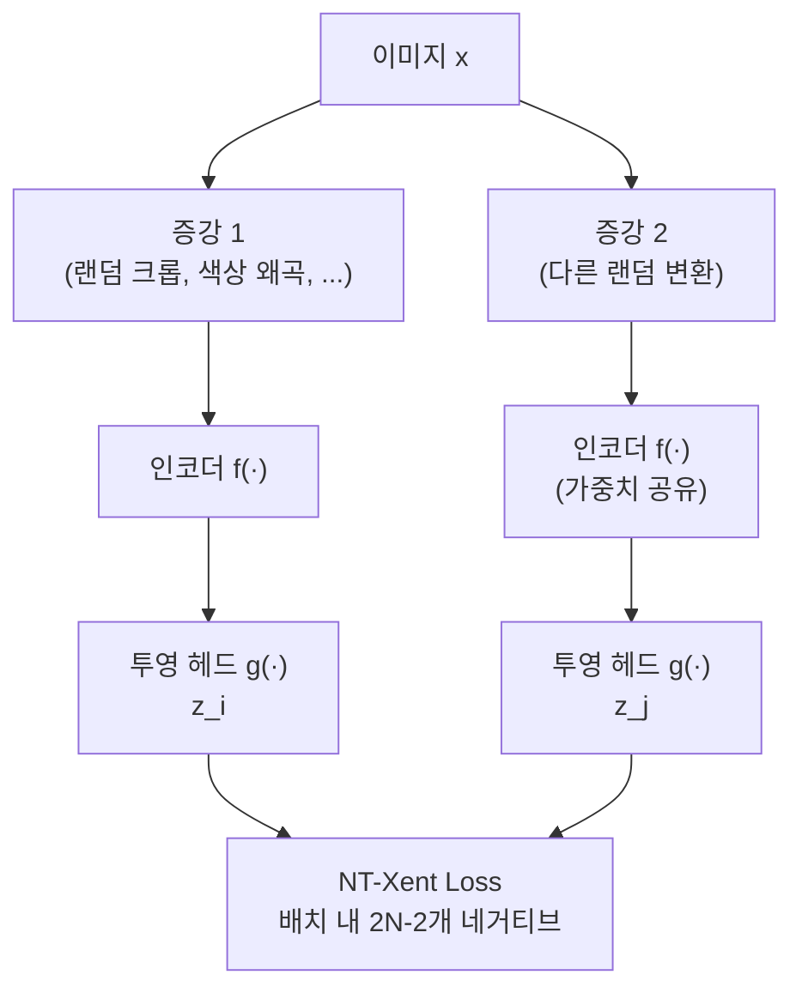

# 대조 학습과 메트릭 러닝 (Contrastive & Metric Learning)

## 핵심 아이디어

대조 학습(contrastive learning)은 "유사한 샘플은 임베딩 공간에서 가깝게, 다른 샘플은 멀리 배치"하는 원리로 표현(representation)을 학습한다. 레이블 없이 데이터 구조 자체로부터 학습하는 자기지도 학습(self-supervised learning)의 핵심 기법이다.

## Contrastive Loss (대조 손실)

Hadsell et al. (2006)이 제안한 초기 대조 손실. 포지티브 쌍(positive pair, 유사)과 네거티브 쌍(negative pair, 비유사)을 직접 비교한다.

$$\mathcal{L} = (1 - y) \cdot \frac{1}{2} d^2 + y \cdot \frac{1}{2} \max(0, m - d)^2$$

- $d = \|f(x_1) - f(x_2)\|_2$: 임베딩 간 유클리드 거리
- $y = 0$: 포지티브 쌍 (가깝게 당김)
- $y = 1$: 네거티브 쌍 (마진 $m$보다 멀게 밀어냄)

## Triplet Loss (트리플렛 손실)

앵커(anchor) $a$, 포지티브 $p$, 네거티브 $n$을 삼중(triplet)으로 비교한다.

$$\mathcal{L} = \max\left(0, \; d(a, p) - d(a, n) + \text{margin}\right)$$

앵커-포지티브 거리가 앵커-네거티브 거리보다 margin만큼 작아야 손실이 0이 된다. FaceNet(Google, 2015)에서 얼굴 인식에 사용되어 유명해졌다.

**Hard Negative Mining**: 학습 초기에는 대부분의 네거티브가 이미 충분히 멀어 손실 기여가 없다(trivial negatives). 현재 모델이 가장 어려워하는 네거티브(semi-hard / hard negative)를 적극적으로 선택하면 학습 효율이 크게 향상된다.

## SimCLR의 NT-Xent Loss

Chen et al. (2020)의 SimCLR은 동일 이미지에서 두 가지 다른 데이터 증강(augmentation)을 적용해 포지티브 쌍을 만들고, 배치 내 나머지 샘플들을 모두 네거티브로 사용한다.

**NT-Xent Loss (Normalized Temperature-scaled Cross Entropy)**:

$$\mathcal{L}_{i,j} = -\log \frac{\exp(\text{sim}(z_i, z_j) / \tau)}{\sum_{k=1}^{2N} \mathbf{1}_{[k \neq i]} \exp(\text{sim}(z_i, z_k) / \tau)}$$

- $\text{sim}(u, v) = \frac{u^T v}{\|u\| \|v\|}$: 코사인 유사도(cosine similarity)
- $\tau$: 온도 파라미터(temperature parameter)

## Temperature 파라미터의 역할

온도 $\tau$는 분포의 날카로움(sharpness)을 조절한다.

| $\tau$ 값 | 분포 특성 | 학습 영향 |
|-----------|-----------|-----------|
| 작을수록 ($\tau \to 0$) | 날카로운 분포 (확실한 선택) | 하드 네거티브에 집중, 기울기 폭발 위험 |
| 클수록 ($\tau \to \infty$) | 균등 분포 (불확실) | 모든 네거티브를 동등 취급, 학습 약화 |
| 최적값 | 보통 0.07 ~ 0.2 | 어려운 네거티브에 적절히 집중 |

## CLIP의 이미지-텍스트 대조 학습

OpenAI CLIP(Contrastive Language-Image Pretraining, Radford et al. 2021)은 SimCLR의 원리를 이미지-텍스트 쌍에 적용한다.

$$\mathcal{L}_{CLIP} = \frac{1}{2}\mathcal{L}_{\text{image}\to\text{text}} + \frac{1}{2}\mathcal{L}_{\text{text}\to\text{image}}$$

배치 내 $N$개 이미지-텍스트 쌍에서 매칭 쌍이 포지티브, 나머지 $N^2 - N$개 조합이 네거티브가 된다. 4억 개 이미지-텍스트 쌍으로 학습하여 zero-shot 이미지 분류에서 강력한 성능을 달성했다.

## 대조 학습의 응용 범위

- **언어 임베딩**: SimCSE(문장 임베딩), DPR(밀집 검색)
- **검색 증강 생성(RAG)**: 질의-문서 대조 학습으로 검색 인코더 학습
- **멀티모달**: CLIP, ALIGN, 음성-텍스트 매핑
- **추천 시스템**: 유저-아이템 상호작용 대조 학습

## 관련 문서

- [[self-supervised-learning]]
- [[embedding-layers]]
- [[CLIP과 멀티모달 임베딩]]
- [[cross-entropy-loss]]
- [[RAG와 밀집 검색]]
