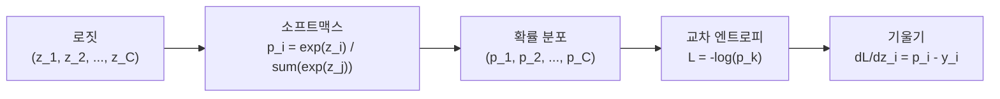
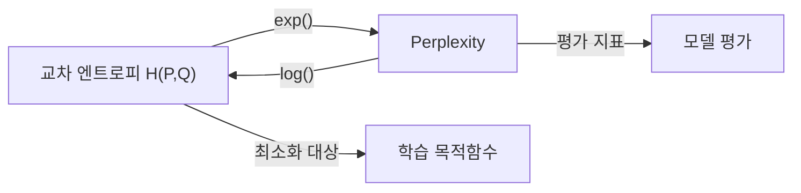

# 교차 엔트로피 손실 (Cross-Entropy Loss)

교차 엔트로피 손실은 두 확률 분포 사이의 차이를 측정하는 [[loss-functions|손실 함수]]로, 정보 이론(information theory)에서 유래했다. 분류 문제의 표준 손실 함수이며, LLM 사전학습에서 next-token prediction의 기본 목적함수로 사용된다. "log loss"라는 이름으로도 불리며, 모델이 출력하는 확률 분포가 실제 정답 분포와 얼마나 다른지를 수치화한다.

## 정보 이론적 배경

교차 엔트로피를 이해하려면 먼저 엔트로피(entropy)와 KL 발산(Kullback-Leibler divergence)을 알아야 한다.

**엔트로피 H(P)**: 확률 분포 P의 불확실성을 측정한다.

```
H(P) = -sum(p_i * log(p_i))
```

**교차 엔트로피 H(P, Q)**: 실제 분포 P를 기준으로, 모델 분포 Q를 사용할 때의 평균 정보량이다.

```
H(P, Q) = -sum(p_i * log(q_i))
```

**KL 발산과의 관계**: 교차 엔트로피는 엔트로피와 KL 발산의 합으로 분해된다.

```
H(P, Q) = H(P) + D_KL(P || Q)
```

H(P)는 데이터 자체의 고유한 불확실성으로 학습 과정에서 변하지 않는다. 따라서 교차 엔트로피를 최소화하는 것은 KL 발산을 최소화하는 것과 동치이며, 결국 모델 분포 Q를 실제 분포 P에 가깝게 만드는 것이다.

## 수식 정의

### 범주형 교차 엔트로피 (Categorical Cross-Entropy)

C개 클래스에 대한 분류 문제에서:

```
L = -sum_{i=1}^{C} y_i * log(p_i)
```

- y_i: 실제 레이블의 원-핫 인코딩 (정답 클래스만 1, 나머지 0)
- p_i: 모델이 클래스 i에 부여한 확률
- 원-핫 레이블에서는 정답 클래스 k에 대해 L = -log(p_k)로 단순화

### 이진 교차 엔트로피 (Binary Cross-Entropy)

2-클래스 분류에서:

```
L = -(y * log(p) + (1 - y) * log(1 - p))
```

## 소프트맥스와의 관계



소프트맥스와 교차 엔트로피의 조합은 수학적으로 매우 깔끔한 기울기를 만든다. 로짓 z_i에 대한 기울기가 단순히 `p_i - y_i`(예측 확률 - 실제 레이블)가 되어, 오차에 정비례하는 업데이트가 자연스럽게 발생한다. 이것이 [[activation-functions|소프트맥스]]가 분류 출력층의 표준이 된 이유 중 하나다.

또한 이 조합은 수치 안정성(numerical stability) 면에서도 유리하다. 실무에서는 소프트맥스와 교차 엔트로피를 별도로 계산하지 않고, `log_softmax`를 거친 뒤 NLL(Negative Log-Likelihood)을 적용하는 융합 구현을 사용한다. PyTorch의 `nn.CrossEntropyLoss`가 이 방식이다.

## LLM 사전학습에서의 역할

[[causal-language-modeling|인과적 언어 모델링]]에서 교차 엔트로피는 next-token prediction의 목적함수다. 시퀀스의 각 위치에서 모델이 다음 토큰에 부여하는 확률의 음의 로그값을 평균한다.

```
L = -(1/T) * sum_{t=1}^{T} log p(x_t | x_{<t})
```

여기서 T는 시퀀스 길이, p(x_t | x_{<t})는 이전 토큰들이 주어졌을 때 t번째 토큰의 예측 확률이다. 어휘(vocabulary) 크기가 수만에 달하므로, 각 위치에서 수만 개 클래스에 대한 분류 문제를 푸는 셈이다.

## Perplexity와의 관계

[[perplexity]]는 교차 엔트로피의 지수로 정의된다.

```
PPL = exp(H(P, Q)) = exp(-(1/T) * sum log p(x_t | x_{<t}))
```

교차 엔트로피 손실이 3.0이면 perplexity는 exp(3.0) = 20.09, 즉 모델이 매 토큰마다 약 20개의 선택지 사이에서 고민하는 것과 같다. 교차 엔트로피가 낮아지면 perplexity도 지수적으로 감소하므로, 학습 초반의 손실 감소가 perplexity에 더 큰 영향을 미친다.



## 주요 변형

### Label Smoothing

Szegedy et al.(2016)이 Inception v2에서 제안한 정규화 기법이다. 원-핫 레이블의 정답 확률을 1에서 (1 - epsilon)으로 낮추고, 나머지 확률을 나머지 클래스에 균등 배분한다.

```
y_smooth = (1 - epsilon) * y_one_hot + epsilon / C
```

- epsilon은 보통 0.1을 사용
- 모델의 과도한 확신(overconfidence)을 억제
- [[gradient-descent-backpropagation|기울기]] 포화를 방지하여 학습 안정성 향상
- Transformer 원 논문(Vaswani et al., 2017)에서도 기계 번역에 적용

### Focal Loss

Lin et al.(2017)이 제안한 클래스 불균형 대응 손실이다. 쉬운 샘플의 가중치를 줄이고 어려운 샘플에 집중한다.

```
FL = -alpha * (1 - p_t)^gamma * log(p_t)
```

- gamma = 0이면 표준 교차 엔트로피
- gamma > 0(보통 2)이면 잘 분류된 샘플의 손실 기여가 급격히 감소
- 객체 탐지(RetinaNet) 등 배경 클래스가 압도적인 상황에서 효과적

### Symmetric Cross-Entropy

라벨 노이즈가 있는 환경에서, 정방향 CE와 역방향 CE(모델 예측을 기준으로 라벨에 대한 CE)를 결합한 변형이다. 노이즈에 대한 강건성을 높인다.

## 실전 고려사항

**수치 안정성**: log(0)은 음의 무한대이므로, 실무에서는 log(p + epsilon) 또는 log-softmax 융합 구현으로 처리한다.

**클래스 불균형**: 클래스별 가중치(class weights)를 곱하거나 focal loss를 사용한다.

**시퀀스 패딩**: LLM 학습에서 패딩 토큰은 손실 계산에서 마스킹하여 제외한다. 마스킹 누락은 학습 품질 저하의 흔한 원인이다.

**온도 스케일링**: 로짓을 온도 T로 나눈 후 소프트맥스를 적용하면 분포의 날카로움을 조절할 수 있다. T > 1이면 분포가 부드러워지고(knowledge distillation), T < 1이면 날카로워진다.

## 관련 문서

- [[loss-functions]] -- 회귀, 분류, 특수 목적 손실 함수 전체 개관
- [[activation-functions]] -- 소프트맥스 등 출력층 활성화 함수
- [[perplexity]] -- PPL = exp(cross-entropy), 언어 모델 평가의 핵심 지표
- [[causal-language-modeling]] -- next-token prediction에서 교차 엔트로피 사용
- [[gradient-descent-backpropagation]] -- 교차 엔트로피 기울기의 역전파
- [[pretraining-pipeline-e2e]] -- 사전학습 파이프라인에서의 목적함수 역할
- [[probability-statistics-for-ml]] -- 정보 이론, 엔트로피, KL 발산의 확률론적 기반

## 참고 자료

- [Cross-entropy - Wikipedia](https://en.wikipedia.org/wiki/Cross-entropy)
- [Cross-Entropy Loss Functions: Theoretical Analysis and Applications (2023)](https://arxiv.org/abs/2304.07288)
- [When Does Label Smoothing Help? (Muller et al., 2019)](https://arxiv.org/abs/1906.02629)
- [Focal Loss for Dense Object Detection (Lin et al., 2017)](https://arxiv.org/abs/1708.02002)
