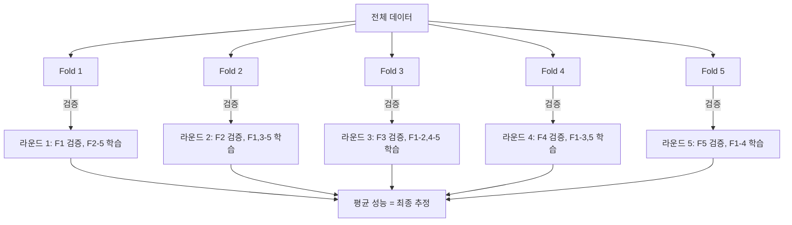
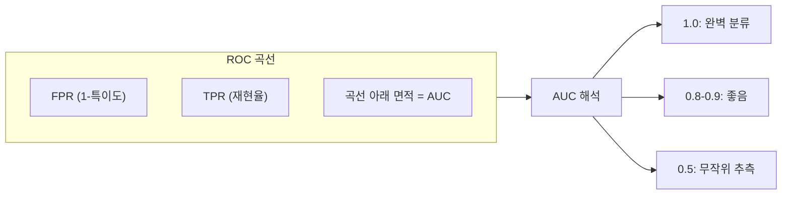
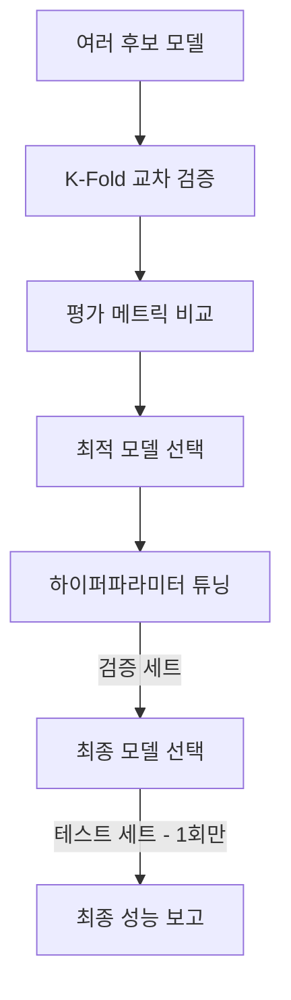

# 교차 검증과 모델 평가 (Cross-Validation & Model Evaluation)

모델을 학습한 후 "이 모델이 실제로 잘 작동하는가?"를 답하려면 체계적인 평가 방법이 필요하다. 교차 검증은 데이터를 효율적으로 활용하여 모델의 일반화 성능을 추정하고, 평가 메트릭은 성능을 정량화하는 도구다.

## 데이터 분할 전략

### 홀드아웃 (Hold-out)

가장 단순한 방법: 데이터를 학습/검증/테스트로 나눈다.

```
전체 데이터
|--- 학습 세트 (60-80%) -- 모델 학습
|--- 검증 세트 (10-20%) -- 하이퍼파라미터 튜닝
|--- 테스트 세트 (10-20%) -- 최종 성능 평가 (1회만 사용)
```

- 구현이 간단하지만 데이터가 적으면 불안정
- 분할 방법에 따라 결과가 크게 달라질 수 있다

### K-Fold 교차 검증

데이터를 K개의 폴드로 나눠, 각 폴드를 한 번씩 검증 세트로 사용한다:



**장점:**
- 모든 데이터가 학습과 검증에 모두 사용된다
- 홀드아웃보다 안정적인 성능 추정
- K=5 또는 K=10이 일반적

**변형:**
- **Stratified K-Fold**: 각 폴드에 클래스 비율을 동일하게 유지. 불균형 데이터에 필수
- **Leave-One-Out (LOO)**: K=N (데이터 수). 편향은 낮지만 분산이 높고 비용이 큼
- **Repeated K-Fold**: K-fold를 여러 번 반복하여 더 안정적인 추정

## 분류 평가 메트릭

### 혼동 행렬 (Confusion Matrix)

모든 분류 메트릭의 기반이 되는 표:

|  | 예측: 양성 | 예측: 음성 |
|--|-----------|-----------|
| **실제: 양성** | TP (True Positive) | FN (False Negative) |
| **실제: 음성** | FP (False Positive) | TN (True Negative) |

### 정밀도 (Precision)

```
Precision = TP / (TP + FP)
```

"양성이라고 예측한 것 중 실제 양성의 비율"
- 높으면: 거짓 양성(FP)이 적다
- 중요한 상황: 스팸 필터 (정상 메일을 스팸으로 분류하면 안 됨)

### 재현율 (Recall)

```
Recall = TP / (TP + FN)
```

"실제 양성 중 모델이 찾아낸 비율"
- 높으면: 놓치는 양성(FN)이 적다
- 중요한 상황: 질병 진단 (환자를 놓치면 안 됨)

### F1 점수

정밀도와 재현율의 조화 평균:

```
F1 = 2 * (Precision * Recall) / (Precision + Recall)
```

- 정밀도와 재현율의 균형을 하나의 숫자로 표현
- 불균형 데이터에서 정확도(accuracy)보다 유용한 경우가 많다

### 정확도 (Accuracy)

```
Accuracy = (TP + TN) / (TP + TN + FP + FN)
```

- 직관적이지만 클래스 불균형에서 오해를 줄 수 있다
- 예: 99% 정상인 데이터에서 "모두 정상"이라 예측하면 정확도 99%

### AUC-ROC



- ROC 곡선: 분류 임계값에 따른 TPR vs FPR을 그린다
- AUC: ROC 곡선 아래 면적. 임계값에 무관한 전체적 성능 지표
- 0.5 (무작위)에서 1.0 (완벽) 사이의 값
- 클래스 불균형이 심하면 PR-AUC (Precision-Recall AUC)가 더 적절

## 회귀 평가 메트릭

| 메트릭 | 수식 | 특성 |
|--------|------|------|
| MSE | 오차 제곱 평균 | 큰 오차에 민감 |
| RMSE | MSE의 제곱근 | 원래 단위와 같음 |
| MAE | 절대 오차 평균 | 이상치에 강건 |
| R-squared | 1 - (잔차분산/총분산) | 설명력 비율 (0-1) |
| MAPE | 백분율 절대 오차 평균 | 스케일 무관 비교 |

## 모델 선택 워크플로



주의사항:
- 테스트 세트는 최종 1회 평가에만 사용한다. 반복 사용하면 테스트 세트에 과적합된다
- 하이퍼파라미터 튜닝에는 검증 세트를 사용한다
- [[bias-variance-tradeoff|편향-분산]] 진단: 학습/검증 성능 격차를 확인

## 실무 주의사항

- **데이터 누출 (Data Leakage)**: 테스트 데이터의 정보가 학습에 유입되면 성능이 과대평가된다. 스케일링, 특성 선택 등 전처리도 교차 검증 루프 안에서 수행해야 한다
- **시계열 데이터**: 시간 순서를 깨뜨리면 미래 정보가 학습에 사용된다. Time Series Split을 사용해야 한다
- **클래스 불균형**: Stratified K-Fold 사용, F1이나 AUC-ROC로 평가

## 관련 문서

- [[bias-variance-tradeoff]] -- 학습/검증 성능 격차로 편향/분산 진단
- [[overfitting-regularization]] -- 과적합 여부를 교차 검증으로 확인
- [[supervised-unsupervised-reinforcement]] -- 지도 학습 모델의 평가
- [[loss-functions]] -- 평가 메트릭과 학습 손실의 관계
- [[feature-engineering]] -- 전처리의 교차 검증 루프 내 배치

## 참고 자료

- [Cross-validation: Evaluating Estimator Performance - scikit-learn](https://scikit-learn.org/stable/modules/cross_validation.html)
- [Classification: ROC and AUC - Google for Developers](https://developers.google.com/machine-learning/crash-course/classification/roc-and-auc)
- [Model Evaluation Metrics - ML4Devs](https://www.ml4devs.com/what-is/model-evaluation-metrics/)
