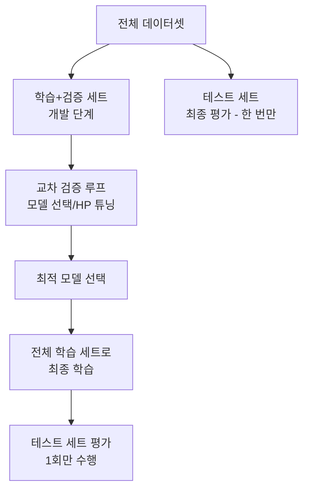
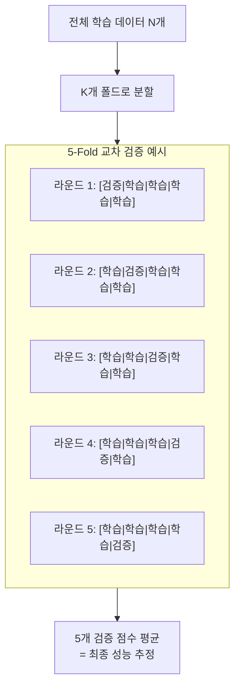
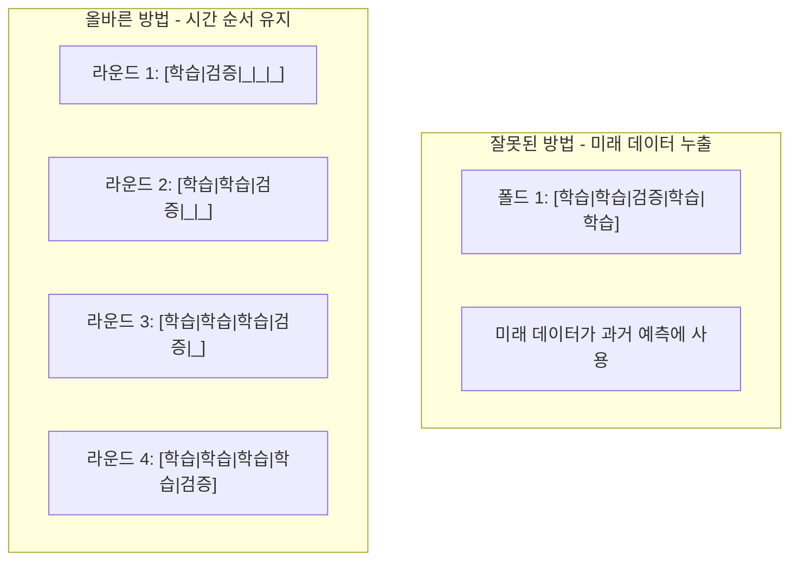
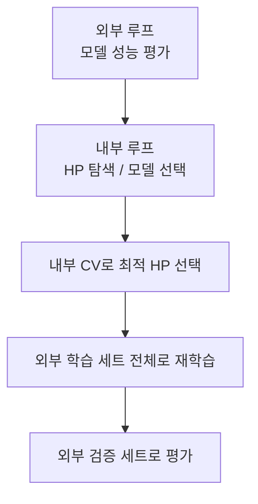

# 교차 검증 (Cross-Validation)

## 개요

교차 검증(cross-validation, CV)은 **한정된 데이터를 최대한 효율적으로 활용하여 모델의 일반화(generalization) 성능을 추정**하는 방법이다. 단순 홀드아웃(hold-out) 분할은 분할 방식에 따라 성능 추정이 불안정하지만, 교차 검증은 여러 번 다르게 분할하여 평균을 내므로 더 신뢰할 수 있는 추정값을 제공한다.

머신러닝 파이프라인에서 교차 검증은 두 가지 핵심 용도로 사용된다:

1. **모델 평가**: 특정 모델의 실제 성능을 추정
2. **모델 선택 / 하이퍼파라미터 튜닝**: 여러 설정 중 최적을 고름

## 데이터 분할의 원칙



**핵심 규칙:**
- 테스트 세트는 모든 설계 결정이 완료된 후 **최종 1회만** 평가에 사용
- 테스트 세트를 여러 번 사용하면 사실상 해당 데이터에 과적합됨 (선택 편향)
- 하이퍼파라미터 탐색과 모델 선택은 검증 세트 또는 교차 검증으로만

## K-Fold 교차 검증

가장 기본적인 교차 검증 방법이다. 데이터를 K개의 폴드(fold)로 나누고, 각 폴드를 한 번씩 검증 세트로 사용한다.



```python
from sklearn.model_selection import KFold, cross_val_score
from sklearn.ensemble import RandomForestClassifier
import numpy as np

X, y = load_data()

kf = KFold(n_splits=5, shuffle=True, random_state=42)
model = RandomForestClassifier(n_estimators=100, random_state=42)

# 간단한 방법
scores = cross_val_score(model, X, y, cv=kf, scoring="f1_macro", n_jobs=-1)
logger.info("각 폴드 F1: %s", scores)
logger.info("평균: %.4f ± %.4f", scores.mean(), scores.std())

# 상세 제어가 필요한 경우
fold_results = []
for fold_idx, (train_idx, val_idx) in enumerate(kf.split(X)):
    X_train, X_val = X[train_idx], X[val_idx]
    y_train, y_val = y[train_idx], y[val_idx]

    model.fit(X_train, y_train)
    val_score = model.score(X_val, y_val)
    fold_results.append(val_score)
    logger.info("폴드 %d: %.4f", fold_idx + 1, val_score)

logger.info("최종 CV 점수: %.4f ± %.4f",
            np.mean(fold_results), np.std(fold_results))
```

**K 값 선택:**
- K=5 또는 K=10이 가장 일반적 (학계 표준)
- K 클수록: 편향 감소, 분산 증가, 계산 비용 증가
- K 작을수록: 계산 빠름, 편향 증가

| K 값 | 학습 세트 비율 | 계산 비용 | 추정 분산 | 권장 상황 |
|------|-------------|---------|---------|---------|
| 3 | 67% | 낮음 | 높음 | 매우 큰 데이터셋 |
| 5 | 80% | 중간 | 중간 | 기본 선택 |
| 10 | 90% | 높음 | 낮음 | 소규모 데이터 |
| N (LOO) | (N-1)/N | 매우 높음 | 높음 | 매우 소규모 |

## Stratified K-Fold (계층적 K-Fold)

불균형 분류 문제에서 각 폴드의 클래스 비율을 원본 데이터와 동일하게 유지한다.

```python
from sklearn.model_selection import StratifiedKFold

skf = StratifiedKFold(n_splits=5, shuffle=True, random_state=42)

for fold_idx, (train_idx, val_idx) in enumerate(skf.split(X, y)):
    # y를 기준으로 층화 분할
    X_train, X_val = X[train_idx], X[val_idx]
    y_train, y_val = y[train_idx], y[val_idx]

    # 각 폴드의 클래스 분포 확인
    from collections import Counter
    logger.info("폴드 %d - 학습 분포: %s", fold_idx + 1, Counter(y_train))
    logger.info("폴드 %d - 검증 분포: %s", fold_idx + 1, Counter(y_val))
```

**언제 필수인가?**
- 클래스 비율이 불균형 (예: 90% 정상, 10% 비정상)
- 소규모 데이터셋 (무작위 분할에서 폴드별 불균형 가능)
- 다중 레이블 분류 (각 레이블의 분포 유지)

## Leave-One-Out CV (LOO-CV)

K=N인 극단적 교차 검증이다. 각 샘플을 한 번씩 검증 세트로 사용한다.

```python
from sklearn.model_selection import LeaveOneOut, cross_val_score

loo = LeaveOneOut()

# 샘플 수 = CV 반복 횟수
scores = cross_val_score(model, X, y, cv=loo, scoring="accuracy", n_jobs=-1)
logger.info("LOO CV 평균 정확도: %.4f", scores.mean())
```

**특성:**
- 거의 모든 데이터로 학습 → 편향이 가장 낮음
- N번 학습 필요 → 계산 비용 매우 높음
- 추정 분산이 높음 (극단적 상관 관계 때문)
- 데이터가 50개 미만일 때 고려

## Leave-P-Out CV

P개 샘플을 검증으로 남기는 일반화된 형태. P>1이면 조합 수가 $\binom{N}{P}$로 폭발적으로 증가해 실용적이지 않다.

## Repeated K-Fold

K-Fold를 여러 번 다른 랜덤 시드로 반복하여 추정 안정성을 높인다.

```python
from sklearn.model_selection import RepeatedKFold, RepeatedStratifiedKFold

rkf = RepeatedKFold(n_splits=5, n_repeats=10, random_state=42)
# 총 50회 학습/평가

rskf = RepeatedStratifiedKFold(n_splits=5, n_repeats=10, random_state=42)

scores = cross_val_score(model, X, y, cv=rkf, scoring="roc_auc", n_jobs=-1)
logger.info("Repeated 5x10-Fold CV: %.4f ± %.4f",
            scores.mean(), scores.std())
```

총 K*n_repeats 번 학습하므로 계산 비용이 크지만 분산이 낮은 안정적인 추정값을 제공한다.

## 시계열 교차 검증 (Time Series CV)



```python
from sklearn.model_selection import TimeSeriesSplit

tscv = TimeSeriesSplit(n_splits=5, gap=0)  # gap: 학습-검증 사이 건너뜀

for fold_idx, (train_idx, val_idx) in enumerate(tscv.split(X)):
    logger.info("폴드 %d: 학습 %d~%d, 검증 %d~%d",
                fold_idx + 1,
                train_idx[0], train_idx[-1],
                val_idx[0], val_idx[-1])
```

**시계열 CV 변형:**

1. **Expanding Window**: 학습 세트가 점점 커짐 (표준 TimeSeriesSplit)
2. **Sliding Window**: 학습 세트 크기 고정, 시간 축으로 슬라이드
3. **Gap 포함**: 학습 세트와 검증 세트 사이에 갭을 두어 데이터 누출 방지

```python
# Gap을 포함한 시계열 CV
tscv_gap = TimeSeriesSplit(n_splits=5, gap=10, test_size=30)
# gap=10: 학습 마지막 10개 이후부터 검증 시작
```

**왜 시간 순서가 중요한가?**

미래 정보가 과거 예측에 사용되면 (future leakage) 검증 성능이 비현실적으로 높게 나온다. 실제 배포 환경에서는 미래 데이터가 없으므로 크게 과대 평가된다.

## 데이터 누출 방지 (Data Leakage Prevention)

교차 검증에서 가장 흔히 저지르는 실수다.


```python
from sklearn.pipeline import Pipeline
from sklearn.preprocessing import StandardScaler
from sklearn.linear_model import LogisticRegression

# 잘못된 방법 - 전체 데이터로 스케일링 후 CV
scaler = StandardScaler()
X_scaled = scaler.fit_transform(X)  # 테스트 정보 누출!
scores = cross_val_score(LogisticRegression(), X_scaled, y, cv=5)

# 올바른 방법 - Pipeline으로 CV 루프 안에서 전처리
pipeline = Pipeline([
    ("scaler", StandardScaler()),
    ("clf", LogisticRegression()),
])
scores = cross_val_score(pipeline, X, y, cv=StratifiedKFold(5), scoring="f1_macro")
```

**누출 발생 원인:**
- CV 루프 밖에서 정규화/스케일링
- CV 루프 밖에서 특성 선택 (Feature Selection)
- 타겟 인코딩(Target Encoding) 잘못 적용
- 시계열 데이터에서 순서 무시

## Nested Cross-Validation (중첩 교차 검증)

하이퍼파라미터 튜닝과 모델 평가를 동시에 바이어스 없이 수행하는 방법이다.



```python
from sklearn.model_selection import GridSearchCV

# 외부 CV: 모델의 실제 성능 추정
outer_cv = StratifiedKFold(n_splits=5, shuffle=True, random_state=42)
# 내부 CV: HP 탐색
inner_cv = StratifiedKFold(n_splits=3, shuffle=True, random_state=42)

param_grid = {"C": [0.01, 0.1, 1, 10], "gamma": ["scale", "auto"]}

from sklearn.svm import SVC

nested_scores = []

for outer_fold, (train_idx, test_idx) in enumerate(outer_cv.split(X, y)):
    X_train_outer, X_test_outer = X[train_idx], X[test_idx]
    y_train_outer, y_test_outer = y[train_idx], y[test_idx]

    # 내부 CV로 HP 탐색
    grid_search = GridSearchCV(
        SVC(), param_grid, cv=inner_cv, scoring="f1_macro", n_jobs=-1
    )
    grid_search.fit(X_train_outer, y_train_outer)

    # 최적 HP로 외부 검증 세트 평가
    best_model = grid_search.best_estimator_
    test_score = best_model.score(X_test_outer, y_test_outer)
    nested_scores.append(test_score)
    logger.info("외부 폴드 %d: %.4f (최적 HP: %s)",
                outer_fold + 1, test_score, grid_search.best_params_)

logger.info("중첩 CV 점수: %.4f ± %.4f",
            np.mean(nested_scores), np.std(nested_scores))
```

**중첩 CV가 필요한 이유:**

일반 CV에서 HP 탐색을 하면, 검증 세트 성능을 최대화하는 HP를 선택하는 과정 자체가 해당 검증 세트에 과적합된다. 중첩 CV는 HP 선택 과정을 별도 내부 루프로 격리하여 이 편향을 제거한다.

## CV 결과 해석

### 분산 해석

```python
import scipy.stats as stats

scores = np.array([0.82, 0.79, 0.85, 0.81, 0.83])
mean = scores.mean()
std = scores.std()

# 95% 신뢰구간
ci = stats.t.interval(0.95, df=len(scores)-1, loc=mean,
                      scale=stats.sem(scores))
logger.info("평균 성능: %.4f ± %.4f", mean, std)
logger.info("95%% 신뢰구간: (%.4f, %.4f)", ci[0], ci[1])
```

**분산이 크면:**
- 데이터가 매우 이질적 (폴드마다 다른 패턴)
- K가 너무 작거나 데이터가 부족
- 모델이 데이터 특정 부분에 과적합

**두 모델 비교 시:**

Wilcoxon 부호 순위 검정으로 통계적 유의성 확인:

```python
from scipy.stats import wilcoxon

scores_model_a = np.array([0.82, 0.79, 0.85, 0.81, 0.83])
scores_model_b = np.array([0.80, 0.78, 0.82, 0.79, 0.81])

stat, p_value = wilcoxon(scores_model_a, scores_model_b)
logger.info("Wilcoxon 검정 p-value: %.4f", p_value)
if p_value < 0.05:
    logger.info("통계적으로 유의미한 차이 (p < 0.05)")
```

## 딥러닝에서의 교차 검증

딥러닝에서는 계산 비용 때문에 K-Fold CV를 완전히 적용하기 어렵지만 다음 방법이 활용된다:

```python
# 방법 1: 단순 홀드아웃 + 여러 랜덤 시드
from torch.utils.data import random_split

results = []
for seed in range(5):
    torch.manual_seed(seed)
    train_size = int(0.8 * len(dataset))
    val_size = len(dataset) - train_size
    train_ds, val_ds = random_split(dataset, [train_size, val_size])
    # 학습 및 평가
    val_acc = train_and_eval(train_ds, val_ds)
    results.append(val_acc)

logger.info("5-seed 평균: %.4f ± %.4f", np.mean(results), np.std(results))
```

Hugging Face Trainer와 CV:

```python
from sklearn.model_selection import StratifiedKFold
from datasets import Dataset
import numpy as np

skf = StratifiedKFold(n_splits=5)
fold_metrics = []

for fold_idx, (train_idx, val_idx) in enumerate(skf.split(texts, labels)):
    train_dataset = Dataset.from_dict({
        "text": [texts[i] for i in train_idx],
        "label": [labels[i] for i in train_idx],
    })
    val_dataset = Dataset.from_dict({
        "text": [texts[i] for i in val_idx],
        "label": [labels[i] for i in val_idx],
    })
    # Trainer로 학습 및 평가
    metrics = run_training(train_dataset, val_dataset)
    fold_metrics.append(metrics["eval_f1"])

logger.info("5-Fold F1: %.4f ± %.4f",
            np.mean(fold_metrics), np.std(fold_metrics))
```

## 교차 검증과 하이퍼파라미터 튜닝의 결합

[[hyperparameter-tuning]]과 교차 검증을 함께 사용하는 표준 패턴:

```python
import optuna
from sklearn.model_selection import StratifiedKFold, cross_val_score

def optuna_cv_objective(trial: optuna.Trial) -> float:
    """Optuna + 교차 검증 통합 목적 함수"""
    params = {
        "n_estimators": trial.suggest_int("n_estimators", 100, 1000),
        "max_depth": trial.suggest_int("max_depth", 3, 15),
        "learning_rate": trial.suggest_float("lr", 1e-3, 0.3, log=True),
        "subsample": trial.suggest_float("subsample", 0.5, 1.0),
    }

    from xgboost import XGBClassifier
    model = XGBClassifier(**params, random_state=42, n_jobs=1)

    cv = StratifiedKFold(n_splits=5, shuffle=True, random_state=42)
    scores = cross_val_score(
        model, X, y, cv=cv, scoring="roc_auc", n_jobs=-1
    )
    return scores.mean()

study = optuna.create_study(direction="maximize")
study.optimize(optuna_cv_objective, n_trials=100)
logger.info("최적 파라미터: %s", study.best_params)
```

## 관련 문서

- [[hyperparameter-tuning]] - HP 탐색에 교차 검증 활용
- [[ai-evaluation]] - 모델 평가 메트릭과 교차 검증
- [[regularization]] - 과적합 진단에서 CV의 역할
- [[bias-variance-tradeoff]] - CV 결과로 편향/분산 진단
- [[loss-functions]] - 교차 검증에서 사용하는 평가 지표
- [[cross-validation-model-evaluation]] - 기존 교차 검증 + 모델 평가 통합 페이지
