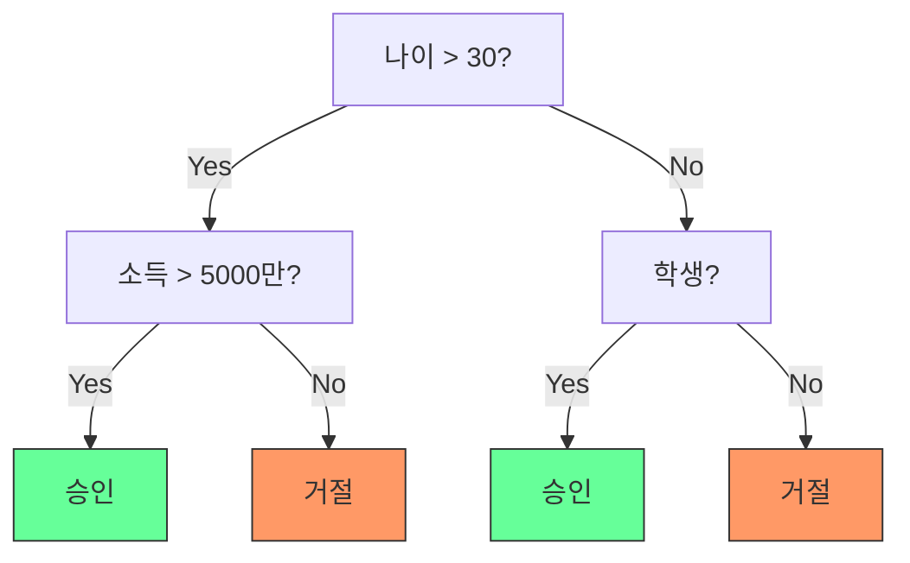
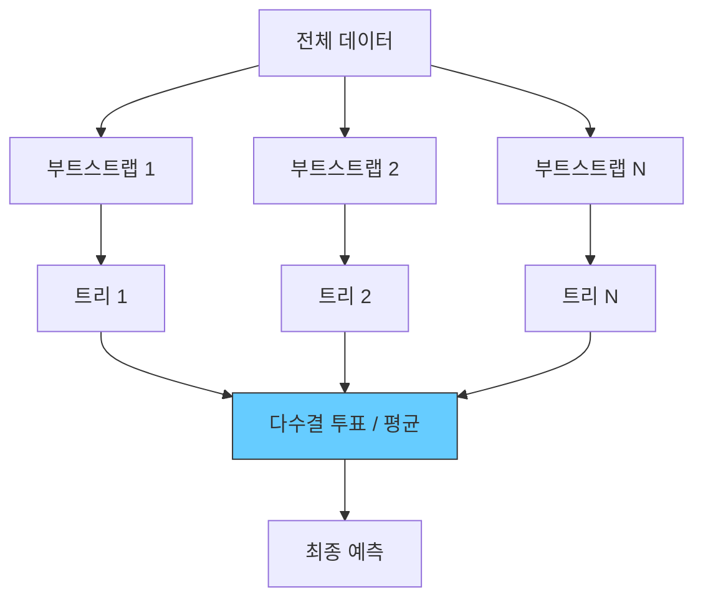

## 개요

결정 트리(Decision Tree)는 데이터를 조건에 따라 반복적으로 분할하여 예측하는 트리 구조의 학습 모델이다. 직관적이고 해석 가능하지만 과적합에 취약하다. 랜덤 포레스트(Random Forest)는 Leo Breiman(2001)이 제안한 앙상블 방법으로, 다수의 결정 트리를 배깅(bagging)과 특성 무작위 선택으로 결합하여 분산을 줄이고 일반화 성능을 높인다. 이 계열의 알고리즘은 정형 데이터(tabular data)에서 여전히 강력한 성능을 보이며, XGBoost, LightGBM 등 그래디언트 부스팅 변형으로 발전했다.

## 결정 트리

### 구조



- **루트 노드**: 가장 유익한 분할 조건으로 시작
- **내부 노드**: 특성에 대한 조건 테스트
- **리프 노드**: 최종 예측값 (분류: 클래스, 회귀: 연속값)

### 분할 기준

트리가 각 노드에서 최적 분할을 선택하는 기준:

**지니 불순도 (Gini Impurity)**
```
Gini(S) = 1 - SUM(pi^2)
```
각 클래스 비율 pi의 제곱합이 1에 가까울수록(한 클래스가 지배적) 순수하다. CART 알고리즘의 기본 기준.

**정보 이득 (Information Gain)**
```
IG(S, A) = Entropy(S) - SUM((|Sv|/|S|) * Entropy(Sv))
```
분할 전후 엔트로피 감소량. ID3, C4.5 알고리즘이 사용.

### 장단점

- **장점**: 해석 가능성이 뛰어남, 특성 스케일링 불필요, 범주형/연속형 모두 처리, [[feature-engineering]] 부담이 적음
- **단점**: 과적합 경향이 강함, 작은 데이터 변화에 민감(높은 분산), 축 정렬 분할만 가능

## 랜덤 포레스트

### 핵심 아이디어

Breiman(2001)의 랜덤 포레스트는 두 가지 무작위성을 도입한다:

1. **배깅(Bootstrap Aggregating)**: 훈련 데이터에서 복원 추출로 N개의 부트스트랩 샘플을 생성하여 각각 독립적인 트리 학습
2. **특성 무작위 선택**: 각 분할 시 전체 특성 중 무작위 부분집합만 고려



- 분류: 기본 특성 부분집합 크기 = sqrt(p) (p = 전체 특성 수)
- 회귀: 기본 특성 부분집합 크기 = p/3
- 트리 간 상관관계를 줄여(de-correlating) 앙상블의 분산 감소 효과를 극대화

### 변수 중요도

랜덤 포레스트는 각 특성의 중요도를 자연스럽게 측정한다:

- **불순도 감소 기반**: 각 특성이 트리 분할에서 감소시킨 불순도의 누적값
- **순열 중요도(Permutation Importance)**: 특성값을 무작위 섞었을 때 성능 하락 정도

이 특성 중요도는 [[feature-engineering]]에서 특성 선택(feature selection)에 활용된다.

### 한계

- 개별 트리의 해석 가능성을 잃음 (블랙박스 모델)
- 특성과 타겟이 선형 관계일 때 비효율적
- 매우 고차원 희소 데이터에서는 [[support-vector-machines]] 대비 불리할 수 있음

## 그래디언트 부스팅

랜덤 포레스트가 독립적인 트리의 병렬 앙상블이라면, 그래디언트 부스팅은 이전 트리의 잔차(residual)를 순차적으로 학습하는 직렬 앙상블이다.

| 비교 항목 | 랜덤 포레스트 | 그래디언트 부스팅 |
|-----------|-------------|-----------------|
| 학습 방식 | 병렬 (독립적 트리) | 순차적 (잔차 학습) |
| 줄이는 오차 유형 | 분산 (variance) | 편향 (bias) |
| 과적합 위험 | 낮음 | 높음 (학습률, 트리 수 조절 필요) |
| 하이퍼파라미터 민감도 | 낮음 | 높음 |

**XGBoost** (2016): 정규화, 열 샘플링, 효율적 결측치 처리, 병렬 연산을 추가한 그래디언트 부스팅 구현. Kaggle 경진대회를 지배하며 정형 데이터 분석의 표준으로 자리잡았다.

**LightGBM**: Microsoft가 개발한 경량 그래디언트 부스팅으로, leaf-wise 성장과 히스토그램 기반 분할로 대규모 데이터에서 XGBoost보다 빠른 학습 속도를 달성한다.

## 신경망과의 비교

정형(tabular) 데이터에서는 트리 기반 방법이 [[perceptron-mlp]]를 포함한 신경망과 대등하거나 우수한 성능을 보이는 경우가 많다. 반면 이미지, 텍스트 등 비정형 데이터에서는 신경망이 압도적이다. 최근 TabNet, FT-Transformer 등 정형 데이터 전용 딥러닝 모델이 연구되고 있으나, XGBoost/LightGBM의 실용적 우위는 여전하다.

## 관련 문서
- [[lightgbm-internals]] -- LightGBM 내부 구조

- [[feature-engineering]] - 트리 모델의 입력 특성 구성
- [[bias-variance-tradeoff]] - 배깅의 분산 감소 원리
- [[cross-validation-model-evaluation]] - 모델 성능 평가와 하이퍼파라미터 튜닝
- [[overfitting-regularization]] - 트리 깊이 제한, 가지치기 등 과적합 방지
- [[support-vector-machines]] - 고차원 분류의 대안 모델
- [[logistic-regression]] - 선형 분류 기준선 모델과의 비교
