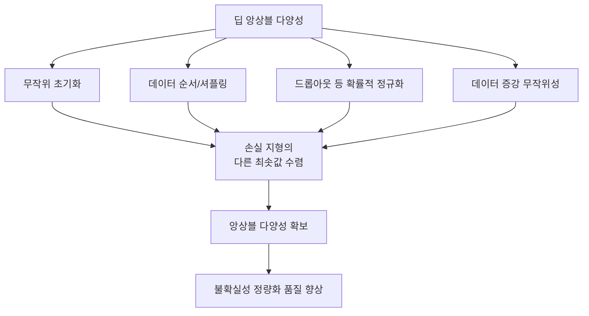

# 딥 앙상블

## 정의와 배경

딥 앙상블(Deep Ensembles)은 동일한 아키텍처로 서로 다른 무작위 초기화(random initialization)로 학습한 다수의 신경망 모델을 결합해 예측 불확실성을 정량화하고 성능을 향상시키는 기법이다.

Lakshminarayanan et al.이 2017년 NeurIPS에 발표한 "Simple and Scalable Predictive Uncertainty Estimation using Deep Ensembles" 논문에서 공식화되었으며, 이후 불확실성 정량화 분야의 강력한 기준선(baseline)으로 자리잡았다.

### 왜 중요한가

- **강력한 기준선**: 복잡한 베이지안 방법들이 딥 앙상블을 꾸준히 능가하기 어렵다.
- **구현 단순성**: 학습 알고리즘 변경 없이 모델만 여러 개 학습하면 된다.
- **불확실성 분리**: 우연 불확실성(aleatoric)과 인식 불확실성(epistemic)을 구분 가능하다.

---

## 핵심 메커니즘

### 앙상블 구성

1. 동일한 아키텍처 $M$개를 서로 다른 랜덤 시드로 초기화
2. 각 모델을 독립적으로 학습 (데이터셋은 동일)
3. 예측 시 각 모델의 출력을 평균하거나 합산

```python
import torch
import torch.nn as nn

class DeepEnsemble:
    def __init__(self, model_class, num_models=5, **model_kwargs):
        self.models = [
            model_class(**model_kwargs) for _ in range(num_models)
        ]

    def predict(self, x):
        """앙상블 예측: 각 모델의 확률 분포를 평균"""
        outputs = torch.stack([
            torch.softmax(model(x), dim=-1)
            for model in self.models
        ])
        mean = outputs.mean(dim=0)
        variance = outputs.var(dim=0)
        return mean, variance
```

### 불확실성 정량화

앙상블 예측의 분산이 곧 불확실성 추정이다:

**분류 태스크**:
- 예측 엔트로피: $H[\bar{p}] = -\sum_c \bar{p}_c \log \bar{p}_c$
- 상호 정보량(mutual information): $I = H[\bar{p}] - \frac{1}{M}\sum_m H[p_m]$

**회귀 태스크** (각 모델이 평균 $\mu_m$과 분산 $\sigma^2_m$을 출력):
$$\bar{\mu} = \frac{1}{M}\sum_m \mu_m$$
$$\bar{\sigma}^2 = \frac{1}{M}\sum_m (\sigma^2_m + \mu_m^2) - \bar{\mu}^2$$

### 두 종류의 불확실성 구분

| 불확실성 유형 | 의미 | 딥 앙상블에서의 출처 |
|--------------|------|-------------------|
| 우연 불확실성 (aleatoric) | 데이터 자체의 노이즈 | 각 모델의 출력 분산 평균 |
| 인식 불확실성 (epistemic) | 모델 지식의 한계 | 앙상블 모델 간 불일치 |

---

## 다양성의 원천



딥 앙상블의 핵심 통찰은 서로 다른 초기화가 손실 지형(loss landscape)의 서로 다른 최솟값으로 수렴한다는 것이다. 이 다양성이 앙상블의 품질을 결정한다.

---

## 베이지안 신경망(BNN)과의 비교

| 항목 | 딥 앙상블 | 베이지안 신경망 |
|------|-----------|----------------|
| 이론적 근거 | 함수 공간 다양성 | 가중치 사후 분포 |
| 구현 난이도 | 낮음 | 높음 (변분 추론/MCMC) |
| 계산 비용 | M배 학습/추론 비용 | 단일 모델 근사 가능 |
| 불확실성 품질 | 실용적으로 우수 | 이론적으로 더 엄밀 |
| OOD 탐지 | 우수 | 방법에 따라 다름 |
| 확장성 | 병렬화 용이 | 제한적 |

실험적으로 딥 앙상블은 많은 베이지안 근사 방법(MC Dropout, SWAG 등)보다 캘리브레이션(calibration)과 OOD 탐지에서 우수한 성능을 보이는 경우가 많다.

---

## 캘리브레이션

캘리브레이션(calibration)은 모델의 예측 신뢰도가 실제 정확도와 일치하는 정도다. 딥 앙상블은 단일 모델보다 현저히 잘 캘리브레이션된다.

캘리브레이션 측정 지표:
- **ECE (Expected Calibration Error)**: 신뢰도 구간별 정확도 오차의 기댓값
- **신뢰도-정확도 다이어그램**: 이상적으로는 y=x 직선을 따라야 함

단일 신경망은 보통 과신(overconfident)하는 경향이 있으며, 앙상블은 이를 완화한다.

---

## 분포 이탈(OOD) 탐지

앙상블 모델들이 OOD 샘플에서 서로 다른 예측을 내놓으면(높은 분산 = 높은 인식 불확실성), 이를 OOD 신호로 활용한다.

```python
def is_ood(ensemble_model, x, threshold=0.5):
    mean, variance = ensemble_model.predict(x)
    # 분산이 높으면 OOD로 판단
    epistemic_uncertainty = variance.mean().item()
    return epistemic_uncertainty > threshold
```

---

## 실무 활용

### 앙상블 크기 선택

- **M=5**: 대부분의 상황에서 충분한 다양성 확보, 일반적 권장값
- **M=3**: 계산 자원이 제한적일 때의 타협안
- **M > 10**: 수익 체감(diminishing returns)이 뚜렷해짐

### 비용 절감 전략

딥 앙상블의 주요 단점은 M배의 학습/추론 비용이다. 이를 완화하는 방법들:

- **Loss-of-plasticity 방지 체크포인트**: 단일 학습에서 중간 체크포인트를 앙상블로 사용
- **BatchEnsemble (Wen et al., 2020)**: 단일 모델에 랭크-1 행렬을 더해 가상 앙상블 구성, 추가 파라미터 수 최소화
- **Packed Ensembles (Laurent et al., 2023)**: 그룹 합성곱으로 단일 순전파에 앙상블 통합

### 주요 적용 분야

- **의료 AI**: 진단 예측의 신뢰도 구간 제공
- **자율 주행**: 인식 불확실성이 높은 상황 식별
- **능동 학습(active learning)**: 불확실성 높은 샘플 우선 레이블링
- **금융 리스크 관리**: 예측 신뢰 구간 기반 의사결정

---

## 관련 문서

- [[bayesian-inference]] - 베이지안 불확실성 이론 기초
- [[swag-stochastic-weight-averaging]] - SWA/SWAG 기반 베이지안 근사
- [[bald-batchbald-active-learning]] - 불확실성 기반 능동 학습
- [[variational-inference-deep]] - 변분 추론 기반 BNN 근사
