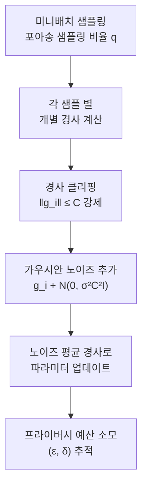
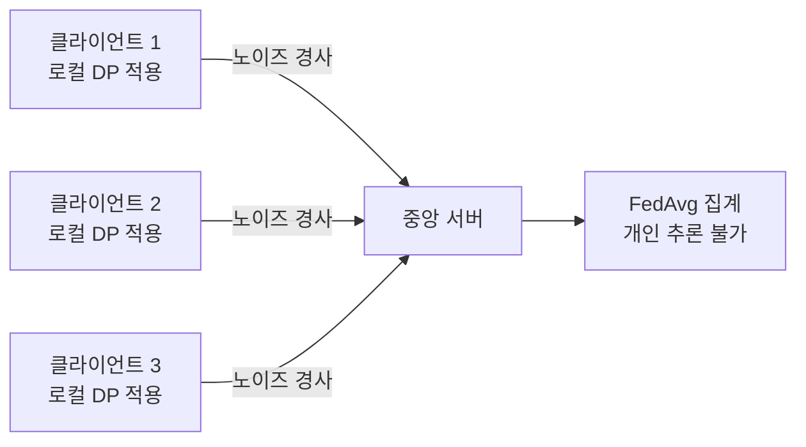

# 차등 프라이버시 (Differential Privacy)

## 개요

차등 프라이버시(Differential Privacy, DP)는 Dwork et al.(2006)이 제안한 프라이버시 보호의 수학적 프레임워크다. 데이터셋에서 특정 개인의 정보가 **포함되든 제외되든 분석 결과가 거의 달라지지 않도록** 노이즈를 추가하여 개인 정보를 보호한다.

머신러닝 맥락에서 DP는 모델이 훈련 데이터의 특정 개인 정보를 **기억(memorize)** 하거나 유출하지 못하게 막는 핵심 도구다.

## 수학적 정의

메커니즘 $\mathcal{M}$이 $(\varepsilon, \delta)$-차등 프라이버시를 만족한다는 것은, 하나의 데이터 포인트만 다른 임의의 두 데이터셋 $D$, $D'$에 대해:

$$\Pr[\mathcal{M}(D) \in S] \leq e^\varepsilon \cdot \Pr[\mathcal{M}(D') \in S] + \delta$$

이 모든 가능한 출력 집합 $S$에 대해 성립하는 것이다.

- $\varepsilon$ (엡실론): **프라이버시 예산(privacy budget)**. 작을수록 강한 보호. $\varepsilon = 0$이면 완전한 프라이버시
- $\delta$ (델타): 보장이 실패할 확률 상한. 보통 훈련 데이터 크기 $n$보다 훨씬 작게 설정 ($\delta \ll 1/n$)
- $\varepsilon = 0, \delta = 0$이면 **순수 차등 프라이버시(pure DP)**; $\delta > 0$ 허용 시 **근사 차등 프라이버시(approximate DP)**

## 핵심 메커니즘

### 가우시안 메커니즘 (Gaussian Mechanism)

수치형 출력 함수 $f$에 가우시안 노이즈를 추가:

$$\mathcal{M}(D) = f(D) + \mathcal{N}(0, \sigma^2)$$

$\sigma$는 함수의 **민감도(sensitivity)** $\Delta f = \max_{D, D'} \|f(D) - f(D')\|_2$ 와 $\varepsilon, \delta$에 의해 결정된다.

### 라플라스 메커니즘 (Laplace Mechanism)

순수 DP를 위해 라플라스 분포의 노이즈를 추가:

$$\mathcal{M}(D) = f(D) + \text{Lap}\left(\frac{\Delta f}{\varepsilon}\right)$$

## DP-SGD: 머신러닝 적용

Abadi et al.(2016)의 **DP-SGD(Differentially Private SGD)** 는 신경망 학습에 차등 프라이버시를 적용하는 표준 방법이다.



### DP-SGD의 3가지 핵심 변형

1. **경사 클리핑(Gradient Clipping)**: 각 샘플의 경사를 클리핑 임계값 $C$로 노름 제한 -> 민감도 상한 설정
2. **노이즈 주입(Noise Injection)**: 클리핑된 경사들의 합에 $\mathcal{N}(0, \sigma^2 C^2 I)$ 추가
3. **프라이버시 계산(Privacy Accounting)**: 모멘트 어카운턴트(Moments Accountant) 등으로 누적 $(\varepsilon, \delta)$ 추적

## 프라이버시 예산 구성 성질

DP의 강력한 특성은 **합성 정리(Composition Theorem)**: $k$번 $\varepsilon$-DP 메커니즘을 적용하면 전체 $k\varepsilon$-DP. 이는 학습 에폭 수가 프라이버시 비용에 직접 영향을 미침을 의미한다.

더 정밀한 추적을 위해 Rényi 차등 프라이버시(RDP), 제로-집중 차등 프라이버시(zCDP) 등이 활용된다.

## 프라이버시-유용성 트레이드오프

| $\varepsilon$ 값 | 프라이버시 강도 | 모델 성능 영향 |
|----------------|--------------|-------------|
| < 1 | 매우 강함 | 큰 정확도 하락 |
| 1 ~ 10 | 강함 | 중간 수준 하락 |
| 10 ~ 100 | 약함 | 작은 영향 |
| > 100 | 거의 없음 | 무시 가능 |

실제 프로덕션 시스템에서는 $\varepsilon = 1 \sim 10$ 범위가 실용적 균형점으로 자주 사용된다.

## 민감도 분석 (Sensitivity Analysis)

차등 프라이버시 메커니즘을 설계하기 위해서는 함수 $f$의 민감도(sensitivity)를 먼저 계산해야 한다. 민감도는 인접 데이터셋 간 출력 최대 변화량이다.

**전역 민감도 (Global Sensitivity)**:
$$\Delta f = \max_{D, D'} \|f(D) - f(D')\|_1$$

데이터셋 전체에서 최악의 경우를 고려하므로 과도하게 큰 노이즈가 필요할 수 있다.

**지역 민감도 (Local Sensitivity)**:
$$LS_f(D) = \max_{D' \sim D} \|f(D) - f(D')\|_1$$

특정 데이터셋 $D$ 근방에서의 민감도. 더 작을 수 있지만, 지역 민감도 자체가 데이터에 의존하므로 직접 사용 시 프라이버시 보장이 깨진다. 스무스 민감도(smooth sensitivity) 등 우회 기법이 필요하다.

---

## 고급 프라이버시 계산 기법

### 모멘트 어카운턴트 (Moments Accountant)

Abadi et al. (2016)이 DP-SGD와 함께 제안. 로그 모멘트 생성 함수를 추적하여 합성 정리보다 훨씬 정밀하게 누적 프라이버시 비용을 계산한다.

기본 합성: $k$번 $\varepsilon$-DP → $k\varepsilon$-DP (선형 증가)  
모멘트 어카운턴트: 서브샘플링과 조합하여 $O(\sqrt{k}\varepsilon)$ 수준으로 훨씬 느린 증가 보장

### 레니 차등 프라이버시 (Rényi DP, RDP)

레니 발산(Rényi divergence)으로 프라이버시를 정의한 확장. 가우시안 메커니즘과 서브샘플링에서 더 정밀한 분석을 제공한다.

$$D_\alpha(\mathcal{M}(D) \| \mathcal{M}(D')) \leq \varepsilon$$

($\alpha$는 레니 발산 차수)

### 제로-집중 차등 프라이버시 (zCDP)

가우시안 메커니즘의 분석에 특히 정밀하다. RDP와 유사하나 다른 파라미터 공간을 사용한다.

---

## LLM과 암기 문제

대규모 언어 모델([[memorization-in-llms]])은 훈련 데이터의 개인정보, 저작권 콘텐츠 등을 **축자적으로 기억**할 수 있다. Carlini et al. (2021)은 GPT-2가 전화번호, 이름, 개인 식별 정보를 그대로 생성할 수 있음을 시연했다.

DP-SGD 적용 시:
- 특정 개인 데이터에 대한 기억(memorization)을 이론적으로 제한
- 그러나 대규모 모델에서의 DP-SGD 적용은 아직 계산 비용과 성능 손실이 문제
- 최근 연구: DP 적용 파인튜닝, DP 프롬프트 등 실용적 대안 모색 중

**LoRA + DP-SGD (DP-LoRA)**:

```python
# Opacus를 사용한 DP-LoRA 파인튜닝 (개념 코드)
from peft import LoraConfig, get_peft_model
from opacus import PrivacyEngine

# 1. 기반 모델에 LoRA 어댑터 적용 (학습 가능 파라미터 크게 감소)
lora_config = LoraConfig(r=8, lora_alpha=16, target_modules=["q_proj", "v_proj"])
model = get_peft_model(base_model, lora_config)

# 2. DP 엔진 적용 (소수의 LoRA 파라미터에만 그래디언트 클리핑)
privacy_engine = PrivacyEngine()
model, optimizer, data_loader = privacy_engine.make_private_with_epsilon(
    module=model,
    optimizer=optimizer,
    data_loader=data_loader,
    epochs=5,
    target_epsilon=8.0,
    target_delta=1e-5,
    max_grad_norm=1.0,
)
# LoRA 파라미터 수가 적으므로 동일 ε에서 훨씬 낮은 노이즈 필요
```

LoRA가 파라미터 수를 줄이므로, 동일한 프라이버시 예산($\varepsilon$) 내에서 더 낮은 노이즈로 학습할 수 있어 정확도 손실이 감소한다.

## 실제 사례: 산업계 적용

| 기업/조직 | 적용 사례 | DP 유형 |
|---------|---------|--------|
| Apple | iOS 키보드 예측, 이모지 사용 통계 | 로컬 DP |
| Google | RAPPOR (크롬 통계 수집), FL + DP | 로컬 DP + 글로벌 DP |
| Microsoft | 텍스트 분석 서비스 | 글로벌 DP |
| Meta | 광고 측정, 사용자 집계 | 글로벌 DP |
| 의료 연구 | 다기관 유전체 분석 | 글로벌 DP |

**RAPPOR (Google)**:
- 크롬 사용자의 브라우저 설정, 플러그인 사용 패턴을 서버에 보내지 않고 집계
- 각 클라이언트가 보고 전에 랜덤화 응답(Randomized Response) 적용
- 서버는 집계 통계만 학습, 개인 행동 추론 불가

---

## 연합 학습과의 연결

[[federated-learning]]에서 차등 프라이버시는 자연스러운 짝이다. 클라이언트가 로컬 경사를 서버로 전송할 때 DP 노이즈를 적용하면 중앙 서버도 개별 클라이언트 데이터를 추론하기 어려워진다. Google의 RAPPOR, Apple의 로컬 DP가 대표 사례다.



**로컬 DP vs 글로벌 DP**:
- 로컬 DP: 클라이언트가 데이터를 서버로 보내기 전에 노이즈 적용. 서버를 신뢰하지 않는 환경에 적합. 동일 $\varepsilon$에서 노이즈가 더 커야 해서 정확도 손실이 크다
- 글로벌 DP: 서버에서 집약된 통계에 노이즈 적용. 클라이언트를 어느 정도 신뢰하는 환경. 동일 프라이버시 수준에서 더 낮은 노이즈로 높은 정확도 달성 가능

---

## 프라이버시 예산 관리

DP를 실제 시스템에 배포할 때 프라이버시 예산의 총량을 관리해야 한다. 동일 데이터에 여러 쿼리를 반복하면 예산이 소진되어 프라이버시 보장이 약해진다.

**예산 관리 전략**:
1. **쿼리 수 제한**: 총 쿼리(학습 에폭)를 제한하여 예산 초과 방지
2. **프라이버시 장부(Privacy Ledger)**: 각 쿼리의 프라이버시 비용을 기록하고 누적 추적
3. **예산 분배**: 중요한 쿼리에 더 많은 예산을 배분
4. **온라인 학습**: 새 데이터가 들어올 때마다 점진적으로 예산을 소모

실무에서 프라이버시 예산을 다 소진하면 동일 데이터에 대한 새 분석은 DP 보장 없이 진행되거나, 데이터를 갱신해야 한다.

## 관련 문서

- [[privacy-preserving-ml]] - 차등 프라이버시를 포함한 PPML 전체 기술 체계
- [[federated-learning]] - 분산 협력 학습과 DP의 결합
- [[memorization-in-llms]] - LLM의 훈련 데이터 암기 문제
- [[overfitting-regularization]] - 일반화와 프라이버시의 연결
- [[information-theory]] - 상호 정보량으로 프라이버시 분석
