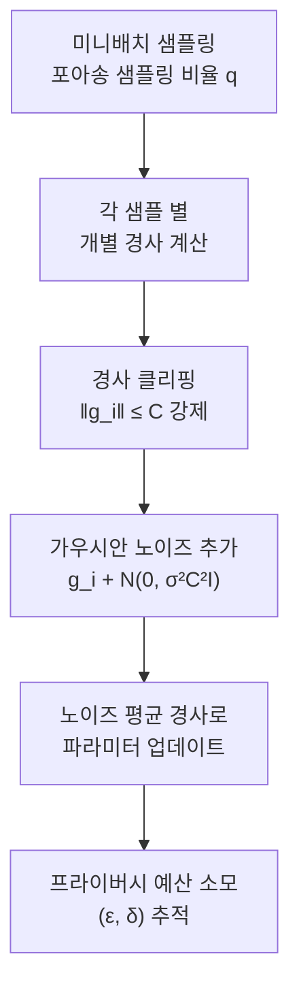
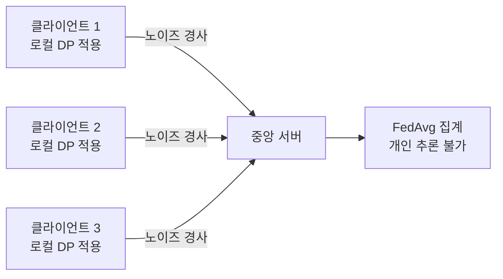

# 차등 프라이버시 (Differential Privacy)

## 개요

차등 프라이버시(Differential Privacy, DP)는 Dwork et al.(2006)이 제안한 프라이버시 보호의 수학적 프레임워크다. 데이터셋에서 특정 개인의 정보가 **포함되든 제외되든 분석 결과가 거의 달라지지 않도록** 노이즈를 추가하여 개인 정보를 보호한다.

머신러닝 맥락에서 DP는 모델이 훈련 데이터의 특정 개인 정보를 **기억(memorize)** 하거나 유출하지 못하게 막는 핵심 도구다.

## 수학적 정의

메커니즘 $\mathcal{M}$이 $(\varepsilon, \delta)$-차등 프라이버시를 만족한다는 것은, 하나의 데이터 포인트만 다른 임의의 두 데이터셋 $D$, $D'$에 대해:

$$\Pr[\mathcal{M}(D) \in S] \leq e^\varepsilon \cdot \Pr[\mathcal{M}(D') \in S] + \delta$$

이 모든 가능한 출력 집합 $S$에 대해 성립하는 것이다.

- $\varepsilon$ (엡실론): **프라이버시 예산(privacy budget)**. 작을수록 강한 보호. $\varepsilon = 0$이면 완전한 프라이버시
- $\delta$ (델타): 보장이 실패할 확률 상한. 보통 훈련 데이터 크기 $n$보다 훨씬 작게 설정 ($\delta \ll 1/n$)
- $\varepsilon = 0, \delta = 0$이면 **순수 차등 프라이버시(pure DP)**; $\delta > 0$ 허용 시 **근사 차등 프라이버시(approximate DP)**

## 핵심 메커니즘

### 가우시안 메커니즘 (Gaussian Mechanism)

수치형 출력 함수 $f$에 가우시안 노이즈를 추가:

$$\mathcal{M}(D) = f(D) + \mathcal{N}(0, \sigma^2)$$

$\sigma$는 함수의 **민감도(sensitivity)** $\Delta f = \max_{D, D'} \|f(D) - f(D')\|_2$ 와 $\varepsilon, \delta$에 의해 결정된다.

### 라플라스 메커니즘 (Laplace Mechanism)

순수 DP를 위해 라플라스 분포의 노이즈를 추가:

$$\mathcal{M}(D) = f(D) + \text{Lap}\left(\frac{\Delta f}{\varepsilon}\right)$$

## DP-SGD: 머신러닝 적용

Abadi et al.(2016)의 **DP-SGD(Differentially Private SGD)** 는 신경망 학습에 차등 프라이버시를 적용하는 표준 방법이다.

### DP-SGD의 3가지 핵심 변형

1. **경사 클리핑(Gradient Clipping)**: 각 샘플의 경사를 클리핑 임계값 $C$로 노름 제한 -> 민감도 상한 설정
2. **노이즈 주입(Noise Injection)**: 클리핑된 경사들의 합에 $\mathcal{N}(0, \sigma^2 C^2 I)$ 추가
3. **프라이버시 계산(Privacy Accounting)**: 모멘트 어카운턴트(Moments Accountant) 등으로 누적 $(\varepsilon, \delta)$ 추적

## 프라이버시 예산 구성 성질

DP의 강력한 특성은 **합성 정리(Composition Theorem)**: $k$번 $\varepsilon$-DP 메커니즘을 적용하면 전체 $k\varepsilon$-DP. 이는 학습 에폭 수가 프라이버시 비용에 직접 영향을 미침을 의미한다.

더 정밀한 추적을 위해 Rényi 차등 프라이버시(RDP), 제로-집중 차등 프라이버시(zCDP) 등이 활용된다.

## 프라이버시-유용성 트레이드오프

| $\varepsilon$ 값 | 프라이버시 강도 | 모델 성능 영향 |
|----------------|--------------|-------------|
| < 1 | 매우 강함 | 큰 정확도 하락 |
| 1 ~ 10 | 강함 | 중간 수준 하락 |
| 10 ~ 100 | 약함 | 작은 영향 |
| > 100 | 거의 없음 | 무시 가능 |

실제 프로덕션 시스템에서는 $\varepsilon = 1 \sim 10$ 범위가 실용적 균형점으로 자주 사용된다.

## LLM과 암기 문제

대규모 언어 모델([[memorization-in-llms]])은 훈련 데이터의 개인정보, 저작권 콘텐츠 등을 **축자적으로 기억**할 수 있다. DP-SGD 적용 시:

- 특정 개인 데이터에 대한 기억(memorization)을 이론적으로 제한
- 그러나 대규모 모델에서의 DP-SGD 적용은 아직 계산 비용과 성능 손실이 문제
- 최근 연구: DP 적용 파인튜닝, DP 프롬프트 등 실용적 대안 모색 중

## 연합 학습과의 연결

[[federated-learning]]에서 차등 프라이버시는 자연스러운 짝이다. 클라이언트가 로컬 경사를 서버로 전송할 때 DP 노이즈를 적용하면 중앙 서버도 개별 클라이언트 데이터를 추론하기 어려워진다. Google의 RAPPOR, Apple의 로컬 DP가 대표 사례다.

## 관련 문서

- [[memorization-in-llms]] - LLM의 훈련 데이터 암기 문제
- [[federated-learning]] - 분산 협력 학습과 DP의 결합
- [[overfitting-regularization]] - 일반화와 프라이버시의 연결
- [[information-theory]] - 상호 정보량으로 프라이버시 분석
