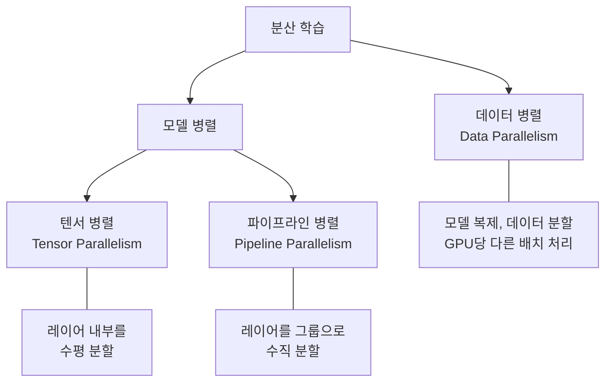

# Distributed Training Overview (분산 학습 개요)

## 정의

**분산 학습(Distributed Training)**은 단일 GPU로 처리할 수 없는 대규모 모델을 여러 GPU/노드에 분산하여 학습하는 기법의 총칭이다. 현대 LLM(수십~수천억 파라미터)은 단일 GPU 메모리(80GB A100 기준)에 담을 수 없으므로 분산 학습은 선택이 아닌 필수다.

분산 학습의 핵심 질문은 두 가지다: **무엇을 나눌 것인가**(데이터 vs 모델)와 **어떻게 동기화할 것인가**(통신 전략).

## 세 가지 병렬화 전략



### 1. 데이터 병렬(Data Parallelism)

가장 단순하고 널리 사용되는 전략이다. 모델 전체를 각 GPU에 복제하고, 학습 데이터를 GPU 수만큼 분할하여 각 GPU가 서로 다른 데이터 배치를 처리한다.

**작동 방식**:
1. 모델 가중치를 모든 GPU에 복제
2. 미니배치를 GPU 수로 분할
3. 각 GPU가 독립적으로 순전파/역전파 수행
4. 기울기를 **all-reduce** 연산으로 집계
5. 모든 GPU가 동일한 가중치 업데이트 적용

**동기화 방식**:
- **BSP(Bulk Synchronous Parallel)**: 모든 GPU가 기울기 계산을 마칠 때까지 대기. 정확하지만 가장 느린 GPU에 맞춰짐
- **ASP(Asynchronous Parallel)**: 대기 없이 각자 업데이트. 빠르지만 기울기가 뒤처질(stale) 위험

**한계**: 모델 전체가 하나의 GPU 메모리에 들어가야 한다. 175B 파라미터 모델은 FP16으로도 350GB가 필요하므로 단순 데이터 병렬로는 불가능하다.

### 2. 텐서 병렬(Tensor Parallelism)

하나의 레이어 내부 연산을 여러 GPU에 수평 분할한다. NVIDIA Megatron-LM이 대표적 구현이다.

**원리**: 행렬곱 `Y = XA`에서 가중치 행렬 A를 열(column) 또는 행(row) 기준으로 분할한다.

```
GPU 0: Y_0 = X * A_0   (A의 왼쪽 절반)
GPU 1: Y_1 = X * A_1   (A의 오른쪽 절반)
-> 결과를 합치면 Y = [Y_0, Y_1]
```

Transformer의 MLP와 Self-Attention 레이어에 자연스럽게 적용된다. Multi-Head Attention은 헤드별로 분할하면 통신 없이 병렬 연산이 가능하다.

**장점**: 레이어 내부에서 병렬화하므로 파이프라인 버블이 없다.
**단점**: 레이어 실행마다 GPU 간 통신이 필요하므로 노드 내부(NVLink) 연결이 빠른 환경에서만 효율적이다.

### 3. 파이프라인 병렬(Pipeline Parallelism)

모델의 레이어를 그룹으로 나누어 각 GPU에 배치한다. GPU 0이 레이어 1-10, GPU 1이 레이어 11-20을 담당하는 식이다.

**문제: 파이프라인 버블(Bubble)**
순차적 의존성 때문에 GPU가 유휴 상태로 대기하는 시간이 발생한다. GPU 1은 GPU 0의 출력을 기다려야 한다.

**해결책: 마이크로배치(Microbatch)**
미니배치를 작은 마이크로배치로 분할하여 파이프라인을 채운다:

- **GPipe**: 모든 마이크로배치의 순전파 완료 후 역전파 시작. `m >= 4d` (마이크로배치 수 >= 4 x 파이프라인 단계 수)일 때 버블 최소화
- **PipeDream(1F1B)**: 순전파와 역전파를 교대로 실행. 메모리 효율적이고 버블이 적다

## 메모리 최적화 기법

대형 모델 학습에서 GPU 메모리는 가중치, 기울기, 옵티마이저 상태, 활성값으로 소비된다. 각각을 줄이는 기법:

### ZeRO (Zero Redundancy Optimizer)

DeepSpeed의 ZeRO는 데이터 병렬에서 발생하는 메모리 중복을 제거한다:

| 단계 | 분할 대상 | 메모리 절감 |
|------|----------|-----------|
| ZeRO-1 | 옵티마이저 상태 | ~4배 |
| ZeRO-2 | + 기울기 | ~8배 |
| ZeRO-3 | + 파라미터 | ~N배 (GPU 수) |

PyTorch의 **FSDP(Fully Sharded Data Parallelism)**는 ZeRO-3과 동등한 개념의 네이티브 구현이다.

### 혼합 정밀도 학습(Mixed Precision Training)

FP32(32비트) 대신 FP16/BF16(16비트)으로 연산하여 메모리와 연산량을 절반으로 줄인다:

- 순전파/역전파는 FP16/BF16으로 수행
- 가중치의 마스터 복사본은 FP32로 유지 (수치 안정성)
- **손실 스케일링(Loss Scaling)**: 작은 기울기가 FP16 범위에서 사라지는 것을 방지

BF16은 FP16보다 동적 범위가 넓어 손실 스케일링 없이도 안정적이며, A100/H100에서 지원된다.

### 기울기 누적과 활성값 체크포인팅

**기울기 누적(Gradient Accumulation)**: 여러 마이크로배치의 기울기를 누적한 후 한 번에 가중치 업데이트. 실질적 배치 크기를 키우면서 GPU 메모리 사용을 줄인다.

**활성값 체크포인팅(Activation Checkpointing)**: 순전파 중 일부 레이어의 활성값만 저장하고, 역전파 시 나머지를 재계산한다. 메모리를 O(L)에서 O(sqrt(L))로 줄이지만 연산 시간이 ~33% 증가한다.

## 실전 조합: 3D 병렬화

현대 대규모 학습은 세 가지 병렬화를 조합하여 사용한다:

```
노드 내부 (NVLink, 고대역폭)
  -> 텐서 병렬: 8-way (GPU 8개)

노드 간 (InfiniBand)
  -> 파이프라인 병렬: 4-way (4개 노드 그룹)
  -> 데이터 병렬: 나머지 GPU에 복제
```

예시: 1024개 GPU로 학습할 때:
- TP = 8 (노드 내 8 GPU)
- PP = 4 (4개 노드를 파이프라인으로 연결)
- DP = 32 (32개 그룹이 서로 다른 데이터 처리)
- 총: 8 x 4 x 32 = 1024 GPU

## 주요 프레임워크

| 프레임워크 | 핵심 특징 |
|-----------|----------|
| PyTorch FSDP | PyTorch 네이티브, ZeRO-3 동등 |
| DeepSpeed | ZeRO 1/2/3, 풍부한 최적화 옵션 |
| Megatron-LM | NVIDIA 공식, TP/PP 특화 |
| JAX/XLA | 함수형 패러다임, TPU 최적화 |

## 다음에 읽을 페이지

- [[scaling-laws]] -- 얼마나 큰 모델을 얼마나 많은 데이터로 학습할지 결정하는 법칙
- [[quantization-model-compression]] -- 학습된 모델의 크기를 줄여 배포하는 기법
- [[transfer-learning]] -- 사전학습 패러다임: 분산 학습이 가능케 하는 것

## 출처

- Lilian Weng, "How to Train Really Large Models on Many GPUs" (2021) - https://lilianweng.github.io/posts/2021-09-25-train-large/
- Rajbhandari et al., "ZeRO: Memory Optimizations Toward Training Trillion Parameter Models" (2020) - https://arxiv.org/abs/1910.02054
- Narayanan et al., "Efficient Large-Scale Language Model Training on GPU Clusters Using Megatron-LM" (2021) - https://arxiv.org/abs/2104.04473
